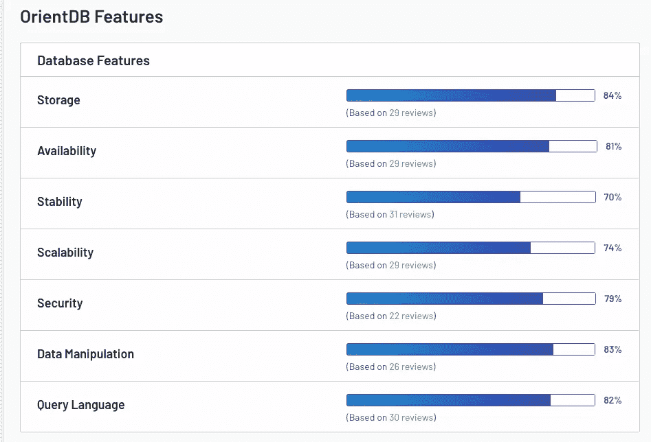
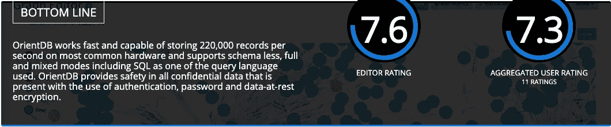
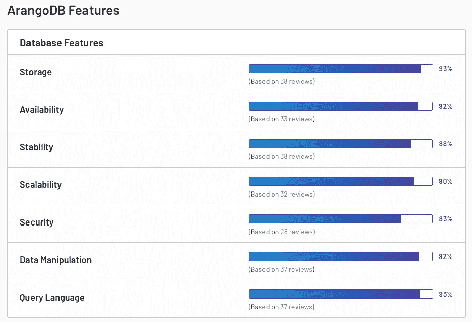
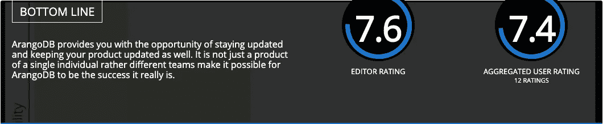

# 比较图形数据库 2

> 原文：<https://towardsdatascience.com/comparing-graph-databases-6b785e6e0818?source=collection_archive---------11----------------------->

第 2 部分:ArangoDB、OrientDB 和 AnzoGraph DB

很高兴看到人们对他们最喜欢的图形数据库提供商，或者至少是他们工作的图形数据库公司充满热情。既然有这么多可用的选项，请查看 db-engine 为您的图形数据库需求列出的 **33** 个不同选项。在这篇文章中，我将**简要地**强调一下:

*   OrientDB
*   ArangoDB
*   AnzoGraph 数据库

根据 db-engines.com 的[提供的榜单，这三家分别排名第三、第四和第二十六。为了新闻报道的可信度，我将谦虚地尽可能做到不偏不倚，报道公司网站上提供的信息以及最近的文章。](https://db-engines.com/en/)

请参见我以前的文章([第 1 部分](/comparing-graph-databases-5475bdb2e65f))快速比较关系数据库管理系统和图形数据库。

# **OrientDB —“为现代世界设计的数据库”**

网址:[https://orientdb.com/](https://orientdb.com/)

文件:[https://orientdb.org/docs/3.0.x/](https://orientdb.org/docs/3.0.x/)

OrientDB 最初于 2010 年[发布，支持许多编程语言，包括:。Net，C，C#，C++，Clojure，Java，JavaScript，JavaScript(Node.js)，PHP，Python，Ruby，Scala。OrientDB](https://db-engines.com/en/system/OrientDB) 是一个无模式的多模型数据库系统，支持图形、文档、键/值和对象模型。它支持无模式、全模式和混合模式。Gremlin 和 SQL 查询都支持图形遍历。OrientDB 是用 Java 实现的，所以可以在 Java JDK ≥ JDK6 的所有操作系统上运行。它是开源的，但是 OrientDB 也提供商业支持。

**根据他们的网站，** OrientDB 提供图形数据库系统的服务，而不需要[“部署多个系统来处理其他数据类型。”](https://orientdb.com/why-orientdb/)这种方法有助于提高“性能和安全性，同时支持可扩展性。”OrientDB 通过在设计上管理多模型系统来区别于 [**多**](https://db-engines.com/en/ranking/graph+dbms) 图形数据库系统。它不是简单地[“为额外的模型增加层，导致性能下降。”](https://orientdb.com/orientdb-vs-neo4j/)

[G2](https://www.g2.com/products/orientdb/reviews?utf8=%E2%9C%93&filters%5Bcomment_answer_values%5D=&order=most_recent) 上有 33 条用户评论，平均评分 4/5 星。大多数评论都非常积极，应该注意的是，上一次平均评论是从 2016 年 6 月开始的，所以看起来 OrientDB 正在修复漏洞和部署完全开发的功能。对评论的主要批评似乎是对更强大的文档的渴望。主要的优点包括价格合理，安装快捷，以及对用户友好。

[https://www.g2.com/products/orientdb/features](https://www.g2.com/products/orientdb/features)

[https://www.predictiveanalyticstoday.com/orientdb/](https://www.predictiveanalyticstoday.com/orientdb/)

# arango db——“一个引擎。一种查询语言。多个型号。”

网址:[https://www.arangodb.com/](https://www.arangodb.com/)

文件:[https://www.arangodb.com/documentation/](https://www.arangodb.com/documentation/)

ArangoDB 最初在 2011 年被称为 AvocadoDB，从它的标志可以看出，它是在 2012 年诞生的。ArangoDB 是开源的、多模型的(键/值、文档和图形)，用 C、C++和 JavaScript 实现。服务器操作系统包括:Linux、OS X、Raspbian、Solaris 和 Windows。它是无模式的，支持以下语言:C#、Clojure、Java、JavaScript (Node.js)、PHP、Python 和 Ruby。 [ArangoDB](https://en.wikipedia.org/wiki/ArangoDB) 以一个数据库核心和自己的统一查询语言 AQL (ArangoDB Query Language)运行，在很多方面与 SQL 相似。AQL 是声明性的，允许在单个查询中组合不同的数据访问模式。ArangoDB 是专门设计来允许键/值、文档和图形数据存储在一起，并使用一种通用语言进行查询的。

**根据他们的** [**网站**](https://www.arangodb.com/why-arangodb/)**ArangoDB 可以作为一个分布式&高度可扩展的数据库集群运行。它运行在 Kubernetes 上，包括持久原语&简单的集群设置。ArangoDB 本身集成了跨平台索引、文本搜索和信息检索排名引擎，并针对速度和内存进行了优化。还提供了完整的 GeoJSON 支持。**

**在 [G2](https://www.g2.com/products/arangodb/reviews?utf8=%E2%9C%93&filters%5Bcomment_answer_values%5D=&order=most_recent) 上有 41 条用户评论，平均 5/5 星。2017 年的单一平均评级表明缺乏 SQL 支持以及对必须适应 AQL 的不满。其他人认为 AQL“直观”，并将 ArangoDB 描述为“功能丰富”**

****

**[https://www.g2.com/products/arangodb/features](https://www.g2.com/products/arangodb/features)**

****

**[https://www.predictiveanalyticstoday.com/arangodb/](https://www.predictiveanalyticstoday.com/arangodb/)**

**为了抢先一步了解即将到来的 3.6 版本中的新功能，请查看 2019 年 10 月 10 日美国东部时间下午 1 点 ArangoDB 的网络研讨会。**

** [## 网上研讨会:ArangoDB 3.6 -未来充满特性- ArangoDB

### America/los Angeles arang odb 网上研讨会:ArangoDB 3.6 ⁠-随着最近发布的

www.arangodb.com](https://www.arangodb.com/arangodb-events/arangodb-3-6-the-future-is-full-of-features/) 

# **AnzoGraph —“在快速、可扩展的数据库上构建您的解决方案”**

网址:[www.anzograph.com](http://www.anzograph.com/)

文档:[https://docs . Cambridge semantics . com/anzograph/user doc/home . htm](https://docs.cambridgesemantics.com/anzograph/userdoc/home.htm)

这个商业图形数据库最初于 2018 年发布，使用 RDF(资源描述框架)进行操作。RDF 模型以主-谓-宾的形式将信息表示为三元组。RDF 存储可以被认为是图形 DBMS 的一个子类，但是 RDF 存储是有区别的，因为它们提供了超越一般图形 DBMs 的特定方法。大多数 RDF 商店，包括 AnzoGraph，都支持 SPARQL，这是一种类似 SQL 的查询语言，用于 [OLAP(在线分析处理)](https://en.wikipedia.org/wiki/Online_analytical_processing)风格的分析。AnzoGraph DB 的操作服务器是 Linux，它支持 C++和 Java。

**根据他们的网站介绍，** AnzoGraph DB 专为在线数据分析而打造，性能可线性扩展。这是一个大规模并行处理(MPP)原生图形数据库，专为大规模分析(万亿次以上)、速度和深度链接洞察而构建。它面向需要图形算法、图形视图、命名查询、聚合、内置数据科学功能、数据仓库式 BI 和报告功能的嵌入式分析。你可以尝试他们的真实世界测试，检查他们的[基准研究](https://info.cambridgesemantics.com/cambridge-semantics-shatters-previous-record-of-loading-and-querying-trillion-triples-by-100x)，并下载一个 [60 天免费试用](https://info.cambridgesemantics.com/anzograph/download)。

一些关于 AnzoGraph DB 的评论就在媒体上。查看这篇文章:[图形数据库。有什么大不了的？法维奥·巴斯克斯](/graph-databases-whats-the-big-deal-ec310b1bc0ed)。他指出，“随着机器学习和人工智能的发展，图 OLAP 数据库变得非常重要，因为许多机器学习算法本身就是图算法，在图 OLAP 数据库上运行比在 RDBMS 上运行更有效。”

乔治·阿纳迪奥蒂斯[写的文章](https://www.zdnet.com/meet-the-team/us/george-anadiotis/)中有另一个关于 [AnzoGraph](https://www.zdnet.com/article/back-to-the-future-does-graph-database-success-hang-on-query-language/) 的检查，这篇文章比较了 AnzoGraph 和 TigerGraph。

# **结论**

有许多绘制数据库的选择，似乎每个人都在试图找到自己的市场角落。哪个最好？这真的取决于你的需求。每个 Graph DB 都有其独特的优点、缺点和基准。随着这些系统的发展和壮大，它们的弱点将会改变，它们可能会变得更加全面和强大。花时间货比三家，自学所有可用的选项，因为有很多，而且数量还在不断增加。**