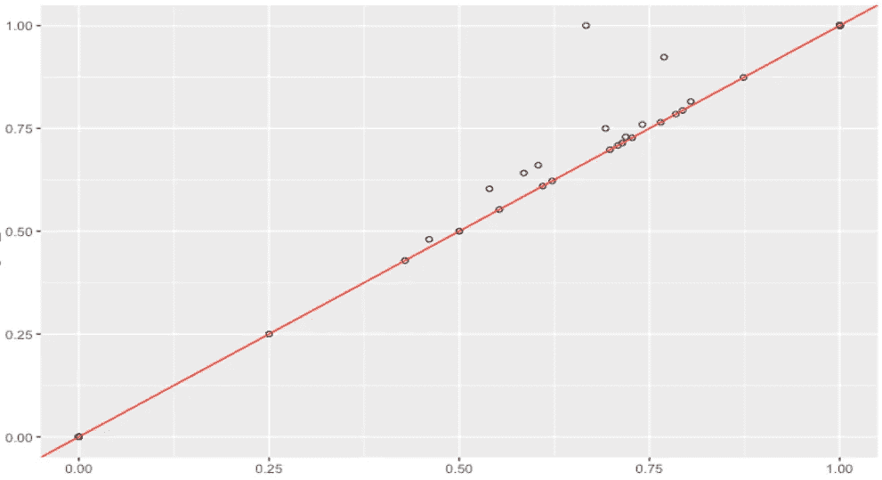
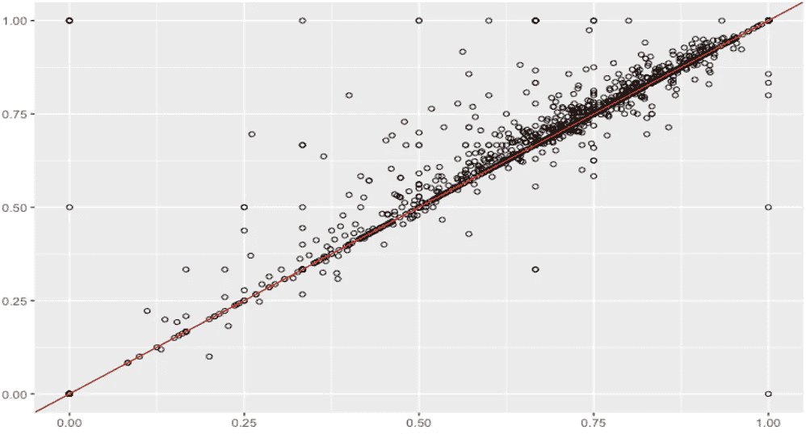
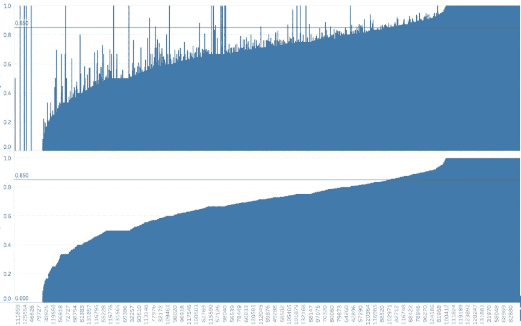
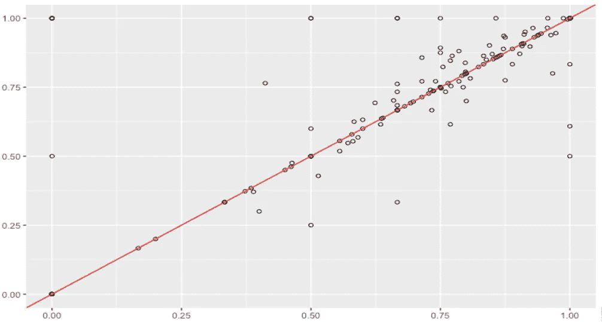
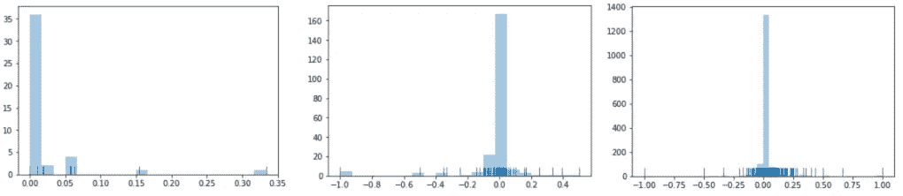

# 比较机器学习模型:统计与实际意义

> 原文：<https://towardsdatascience.com/comparing-machine-learning-models-statistical-vs-practical-significance-de345c38b42a?source=collection_archive---------4----------------------->

## 模型 A 还是模型 B 更准确？嗯…

在构建和调整 ML 模型方面已经做了很多工作，但是在所有这些艰苦的工作之后，一个自然的问题最终出现了——我们实际上如何比较我们已经构建的模型？如果我们面临模型 A 和 B 之间的选择，哪一个是赢家，为什么？是否可以将这些模型组合在一起，以实现最佳性能？

一种非常肤浅的方法是在测试集上比较整体准确性，比如说，模型 A 的准确性是 94%,模型 B 的准确性是 95%,然后盲目地断定 B 赢了这场比赛。事实上，除了调查整体准确性之外，还有更多的事实需要考虑。

在这篇博文中，我很乐意分享我最近在模型比较方面的发现。我喜欢用简单的语言来解释统计数据，所以这篇文章对于那些在统计方面不是很强，但想多学一点的人来说是一个很好的读物。

# 1.“理解”数据

如果可能的话，想出一些能马上告诉你实际发生了什么的情节确实是个好主意。在这一点上做任何绘图似乎都很奇怪，但是绘图可以给你提供一些数字所不能提供的洞察力。

在我的一个项目中，我的目标是在预测用户文档的税收时，比较相同测试集上 2 ML 模型的准确性，因此我认为按用户 id 聚合数据并计算每个模型正确预测税收的比例是一个好主意。

我拥有的数据集很大(超过 100K 个实例)，所以我按地区分解分析，并专注于较小的数据子集——每个子集的准确性可能不同。在处理大得离谱的数据集时，这通常是一个好主意，因为一次消化大量数据是不可能的，更不用说得出可靠的结论了(稍后将详细介绍*样本大小问题*)。**大数据集的一个巨大优势是，你不仅可以获得数量惊人的信息，还可以放大数据，探索特定像素子集上发生的事情。**



subset 1: model A vs. model B scores (picture is my own)



subset 2: model A vs. model B scores (picture is my own)



subset 2: model A is clearly doing better than B… look at all those spikes! (picture is my own)



subset 3: model A vs. model B scores (picture is my own)

在这一点上，我怀疑其中一个模型在一些子集上做得更好，而他们在其他数据子集上做的几乎相同。**这比仅仅比较整体准确度前进了一大步。**但是这种怀疑可以通过**假设检验**进一步调查。假设检验可以比人眼更好地发现差异-我们在测试集中的数据量有限，我们可能会想，如果我们在不同的测试集上比较模型，准确性会有什么变化。遗憾的是，并不总是有可能得出不同的测试集，因此了解一些统计数据可能有助于研究模型准确性的本质。

# 2.假设检验:让我们把它做好！

乍一看，这似乎是微不足道的，您可能以前见过这种情况:

1.  建立 H0 和 H1
2.  想出一个测试统计，并假设正态分布
3.  以某种方式计算 p 值
4.  如果 p < alpha = 0.05 reject H0, and ta-dam you’re all done!

In practice, hypothesis testing is a little more complicated and sensitive. Sadly, people use it without much caution and misinterpret the results. Let’s do it together step by step!

**步骤 1。**我们设置 H0:****零假设** =无*两个模型之间有统计学意义的*差异:****备选假设=** 两个模型之间有*有统计学意义的*差异——由你决定:模型 A！= B(双尾)或 A 型<或>B 型(单尾)****

******第二步。**我们提出了一个**检验统计量**，以便在观察到的数据中量化将无效假设与替代假设区分开来的行为。有许多选择，甚至最好的统计学家也可能对 X 数量的统计测试一无所知——这完全没问题！有太多的假设和事实需要考虑，所以一旦你知道你的数据，你就可以选择正确的。关键是要理解假设检验是如何工作的，实际的检验统计只是一个工具，很容易用软件来计算。****

****请注意，在应用任何统计测试之前，需要满足许多假设。对于每个测试，您可以查找所需的假设；然而，现实生活中的绝大多数数据并不完全符合所有的条件，所以可以放松一点。但是如果你的数据，比如严重偏离正态分布呢？****

****有两大类统计测试:**参数**和**非参数**测试，我强烈推荐在这里阅读更多关于它们的内容[。我长话短说:**两者的主要区别在于，参数检验需要对总体分布进行某些假设，而非参数检验则更稳健一些(*请不要参数！*)。**](https://keydifferences.com/difference-between-parametric-and-nonparametric-test.html)****

****在我的分析中，我最初想使用[成对样本 t 检验](https://www.statisticssolutions.com/manova-analysis-paired-sample-t-test/)，但是我的数据显然不是正态分布的，所以我选择了 [Wilcoxon 符号秩检验](https://www.statisticssolutions.com/how-to-conduct-the-wilcox-sign-test/)(成对样本 t 检验的非参数等价检验)。由你来决定在你的分析中使用哪种检验统计，但是总是**确保假设得到满足**。****

********

****My data wasn’t normally distributed :( (picture is my own)****

******第三步。**现在是 p 值。p 值的概念有点抽象，我打赌你们很多人以前都用过 p 值，但是让我们澄清一下 p 值实际上是什么:p 值只是一个衡量对 H0 不利的证据的数字:对 H0 不利的证据越强，p 值就越小。如果你的 p 值足够小，你就有足够的信用拒绝 H0。****

****幸运的是，在 R/Python 中可以很容易地找到 p 值，所以您不需要折磨自己并手动完成它，尽管我一直主要使用 Python，但我更喜欢在 R 中进行假设检验，因为有更多的选项可用。下面是一段代码。我们看到，在子集 2 上，我们确实获得了一个小的 p 值，但置信区间是无用的。****

```
**> wilcox.test(data1, data2, conf.int = TRUE, alternative="greater", paired=TRUE, conf.level = .95, exact = FALSE)V = 1061.5, p-value = 0.008576
alternative hypothesis: true location shift is less than 0
95 percent confidence interval:
-Inf -0.008297017
sample estimates:
(pseudo)median
-0.02717335**
```

******第四步。**非常简单:如果 p-value <预先指定了 alpha(传统上为 0.05)，您可以拒绝 H0 而支持 H1。否则，没有足够的证据来否定 H0，**这并不意味着 H0 是真实的！**事实上，它可能仍然是错误的，但根据数据，没有足够的证据来否定它。如果 alpha 为 0.05 = 5%，这意味着只有 5%的风险得出存在差异的结论，而实际上并不存在差异(又名**类型 1 错误**)。你可能会问自己:那么为什么我们不能追求 alpha = 1%而不是 5%？这是因为分析将更加保守，所以拒绝 H0 将更加困难(我们的目标是拒绝它)。****

****最常用的阿尔法是 5%，10%和 1%，但你可以选择任何你喜欢的阿尔法！这真的取决于你愿意冒多大的风险。****

****alpha 可以是 0%吗(即没有类型 1 错误的可能性)？不:)在现实中，你总有可能犯错误，所以选择 0%是没有意义的。给错误留些空间总是好的。****

****如果你想玩玩 p-hack(p-hack)游戏，你可以增加你的 alpha，拒绝 H0，但是你必须满足于较低的信心水平(随着 alpha 的增加，信心水平下降——你不能拥有一切:)。****

# ****3.事后分析:统计与实际意义****

****如果你得到一个小得可笑的 p 值，那当然意味着这两个模型的准确性之间有一个统计上显著的差异。之前，我确实得到了一个小的 p 值，所以从数学上来说，模型肯定不同，但是“显著”并不意味着*重要*。这种差异真的有什么意义吗？这种微小差异与业务问题相关吗？****

******统计显著性**是指样本中观察到的均值差异由于抽样误差而发生的可能性。给定一个足够大的样本，尽管看似无关紧要的人口差异，人们可能仍然会发现统计意义。另一方面，**实际意义**查看差异是否足够大，在实际意义上是否有价值。虽然统计意义是严格定义的，但实际意义更加直观和主观。****

****此时，你可能已经意识到 p 值并没有你想象的那么超级强大。还有更多要调查。考虑到**效果大小**也是很棒的。效应大小衡量差异的大小——如果存在统计上的显著差异，我们可能会对其*大小*感兴趣。**效应大小**强调差异的大小，而不是将其与样本大小混淆。****

```
**> abs(qnorm(p-value))/sqrt(n)0.14# the effect size is small**
```

****什么是小、中、大效果尺寸？传统的临界值分别是 0.1、0.3、0.5，但同样，这真的取决于你的业务问题。****

*****样本量有什么问题？如果你的样本太小，那么你的结果就不可靠，但这无关紧要。如果你的样本量太大怎么办？这看起来很棒——但是在这种情况下，即使是非常小的差异也可以通过假设检验检测出来。有如此多的数据，即使是微小的偏差也可能被认为是重大的。这就是效果大小变得有用的原因。*****

****还有更多的事情要做——我们可以尝试找到测试的功效和最佳样本量。但我们现在没事了。****

****假设检验如果做得好，在模型比较中会非常有用。建立 H0 & H1 公司、计算检验统计量和寻找 p 值是日常工作，但解释结果需要一些直觉、创造力和对业务问题的深入理解。请记住，如果测试是基于一个非常大的测试集，被发现具有**统计显著性**的关系可能没有太多**实际意义**。不要盲目相信那些神奇的 p 值:放大数据并进行事后分析总是一个好主意！:)****

****请随时通过[电子邮件](http://dinajankovic93@gmail.com)或 [LinkedIn](https://www.linkedin.com/in/dinajankovich/) 联系我，我随时准备好与您聊聊数据科学！****