# 用数据可视化比较漫威和 DC

> 原文：<https://towardsdatascience.com/comparing-marvel-and-dc-with-data-visualization-33b8f8486082?source=collection_archive---------24----------------------->

## 为漫画世界的比较设计可视化

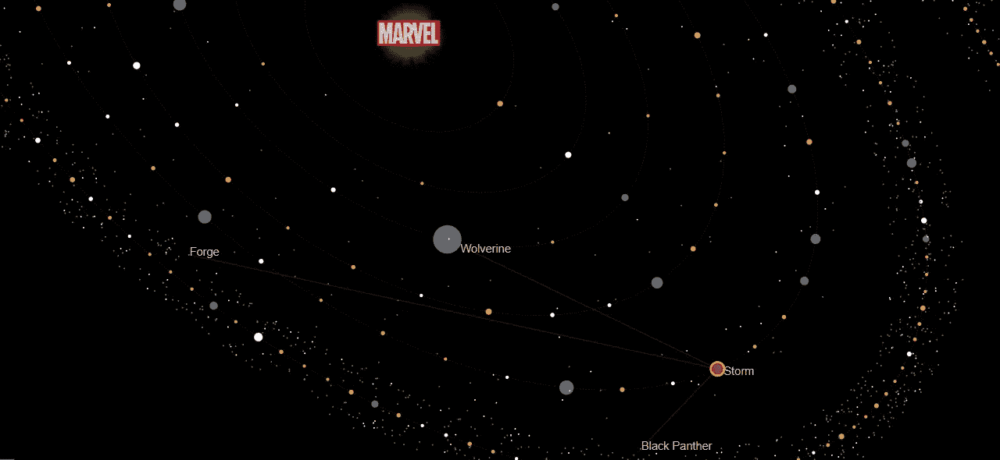

Marvel & DC Visualization — Storm’s partners

比较漫画宇宙有很多种方法。在这里，我解释了我是如何使用来自维基百科的数据创建了一个比较漫威大学和 DC 大学的可视化系统。

我的目标是定义一个简单的可视化，以清晰快捷的方式展示漫威和 DC 之间的差异。我为每个宇宙创造了一个隐喻，并在一个视图中将它们并排显示为星系。

你可以找到我是如何从维基百科提取数据的(简单！)以及之前在我的漫画数据系列其他帖子中的讨论:

1.  [用 SQL 和 Javascript 创建一个漫威数据库，简单的方法](/create-a-marvel-database-with-sql-and-javascript-the-easy-way-573ccdf44673)
2.  [形象化漫画人物的性别和超能力](https://medium.com/@heberleh/visualizing-comic-characters-genders-and-superpowers-ae7c2311cb89)
3.  [用数据可视化比较漫威和 DC](https://medium.com/@heberleh/comparing-marvel-and-dc-with-data-visualization-33b8f8486082)[this]

你可以在这里找到最终的可视化效果:

*   [https://heberleh.github.io/comics-universe/](https://heberleh.github.io/comics-universe/)

# 可视化设计

条形图和散点图等可视化技术非常常见，但有局限性。对于具有多种信息数据集，对不同可视化隐喻进行分组的个性化可视化是必要的。

当我设计漫画数据的可视化时，首先想到的是用太阳和行星来比较两个星系。

事实上，维基百科已经用虚构的宇宙这个术语来代表漫画。这里我把事情简化了，用了*星系*的概念。

除了*漫画*和*星系*之间的联系意义，人们习惯了一个星系图的结构。一个太阳在中心；一些代表轨道的椭圆；代表行星、恒星和其他天体的小圆圈和大圆圈。

我将我的问题重新定义为*比较漫威和 DC 的星系*，探索星系图可能存在的视觉差异。

下面，我展示了一些我的草稿，关于星系的结构和意义，它们的位置和形状，以及其他与编码相关的项目——反应组件，类属性，方法等等。

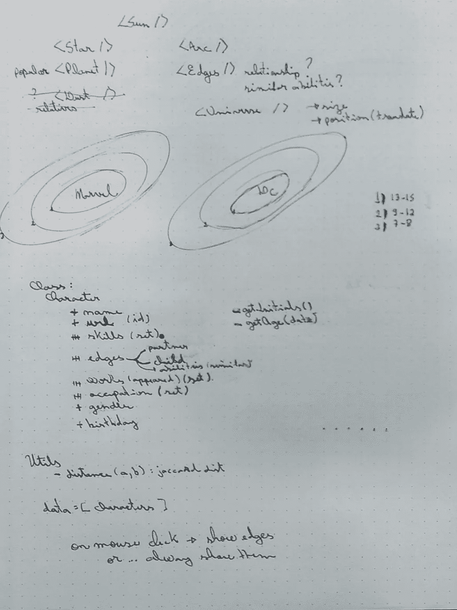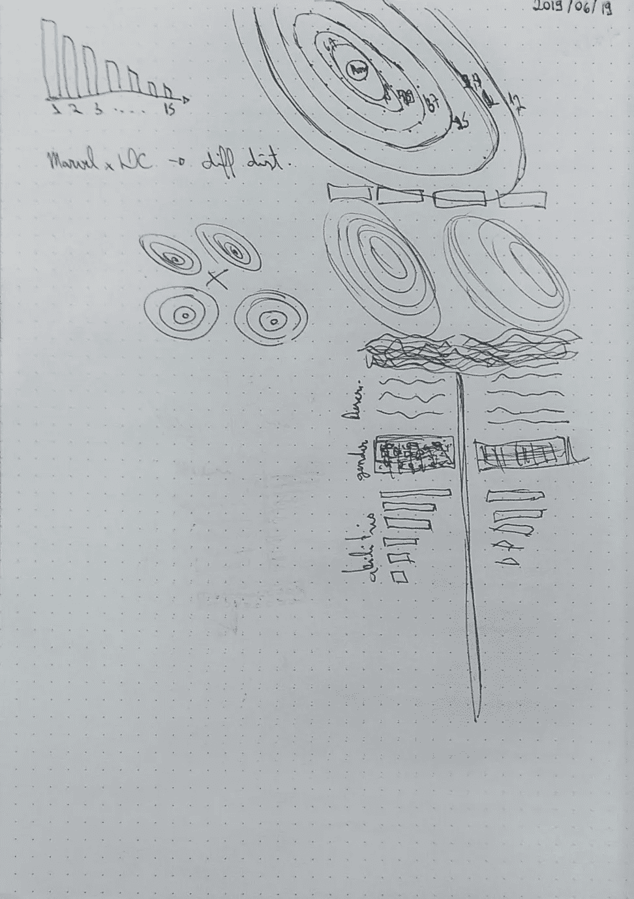

Designing the visualization metaphors and layout

每个虚构的宇宙都是一个有太阳的星系。太阳代表其品牌(漫威或 DC)，身体代表虚构的人物。太阳的能量很大，不是吗？有道理。

这组隐喻代表了人物的数量和重要性、他们的超能力和性别。我还介绍了一些关系，揭示了他们的**伴侣**和**子女**。

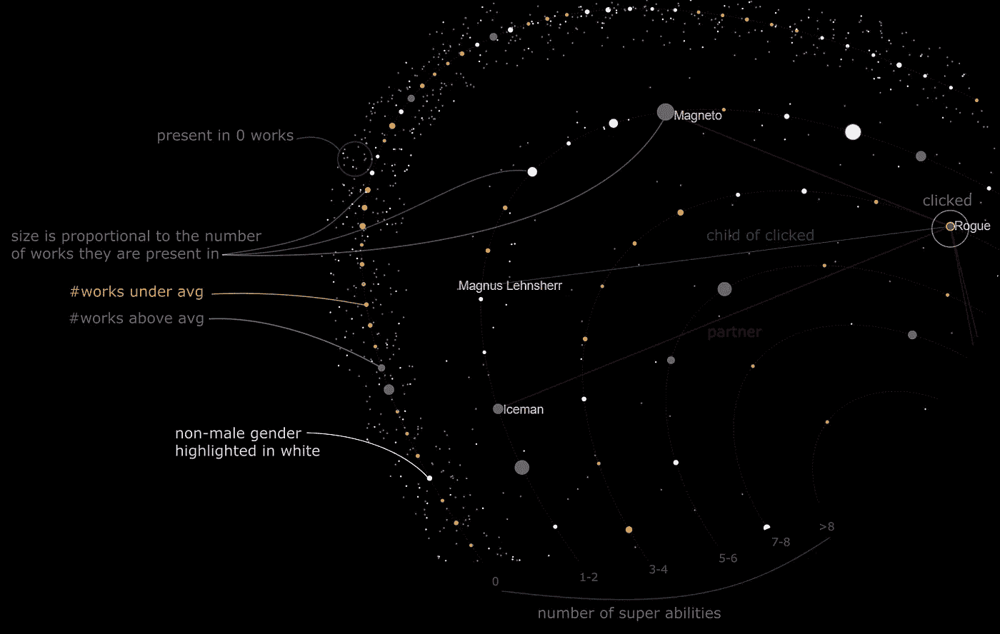

Explaining the meaning of sizes, colors, distance from the sun (orbit) and connections.

这些是指导可视化设计的属性:

*   **超能力**:超能力列表
*   **重要性**:角色出现在作品中的数量
*   **性别**
*   **名称**

## 超级大国

人物离太阳越近，拥有的超能力就越多。

每个轨道(椭圆)代表一系列超级大国。第一个代表超级大国，离太阳最远；第二个代表**1–2**超级大国，以此类推。

**蝙蝠侠**因为没有超能力，所以远离太阳。

邪恶先生离太阳很近，因为他有 7 项超能力。

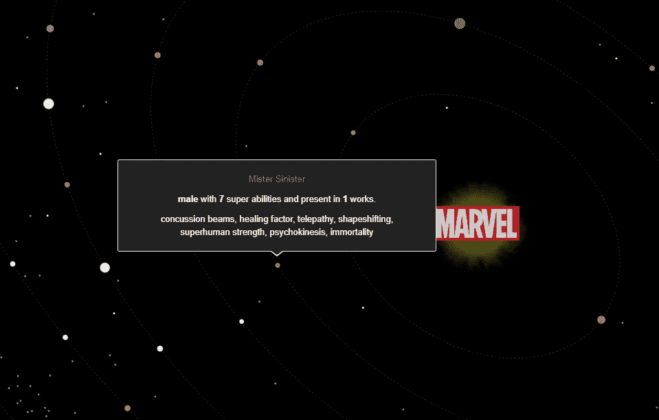

**Mister Sinister** is close to the sun because he has 7 superpowers.

用轨道比喻，我们可以看到漫威和 DC 在使用众多超能力方面的比较。

漫威似乎比 DC 更限制超能力的使用。

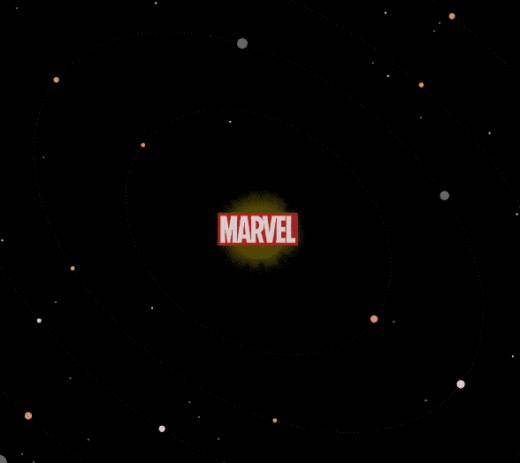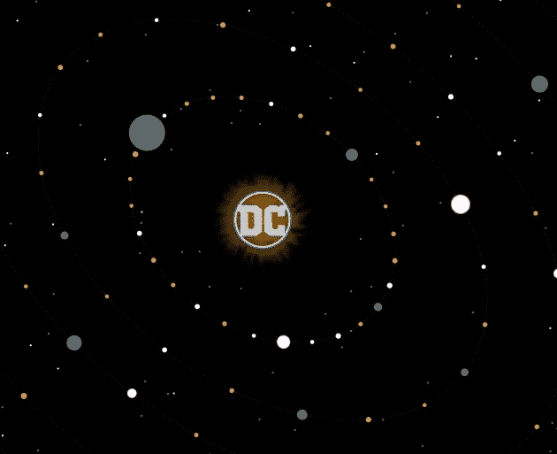

Marvel & DC comparison — DC has more characters with 7 superpowers or more than Marvel.

在这个比较中，注意 DC 在整个星系中有更多的角色。这可能导致太阳周围更高的密度。

## 字符重要性

圆圈越大，它们所在作品的数量或衍生作品的数量就越大(它将它们相加)。两者之和就是我定义的*重要性*。

如果一个角色的重要性等于零，那么他的身体就用一个紫色的*灰尘—* 圆圈表示，这个圆圈具有最小的有效半径。当它们的重要性等于或大于 1 时，它们的大小与重要性成正比。

金刚狼是漫威星系中最大的身体，因为他出现在 53 部作品中(包括衍生作品)。

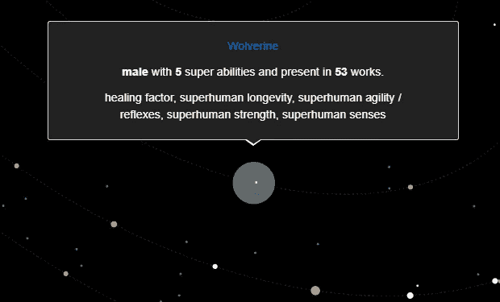

Wolverine has importance 53.

用大小来表示重要性，会弹出探索最多的字符。通过这样做，考虑到大型天体和尘埃的数量，很容易检查星系之间的比较。

> 漫威只关注金刚狼，而 DC 关注超人和蝙蝠侠。

还是关于重要性，我认为颜色也与它有关。当一个角色的作品比**平均值**多的时候，我用黄色给它上色；否则为灰色。紫色代表 0 作品(尘埃)。

## **性别**

我将性别分为两大类:男性和非男性，非男性代表女性、跨性别者和其他人，如 agender Phoenix Force。

> 除去性别不明确的角色，在 10 多部作品中，80%的漫威角色和 72%的 DC 角色都是男性。

当我们考虑出现在更少作品中的人物时，这些数字变得更加平衡:当考虑在维基百科上注册了至少一部作品的人物时，67%(漫威)和 67%(DC)；当考虑具有 0 个或更多注册作品的角色时，这两个数字分别为 61%(漫威)和 64% (DC)。

考虑到代表性和多样性这些天被更多的讨论，因为大多数非男性在星系中是小天体，我用白色突出显示了非男性。

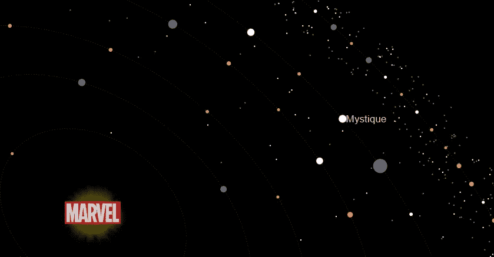

Mystique is highlighted in white because she is in the non-male category.

然而，我们几乎看不到白色的圆圈。这反映了漫画史上正在形成的性别差异。

一个虚构的宇宙会有这种差距有很多原因；其中包括漫画受众——以男性读者为重点的漫画可能会有更多的男性角色。

[Jacques Nyemb](https://medium.com/u/9a1c236e7b2?source=post_page-----33b8f8486082--------------------------------) 写了一篇关于这个话题的有趣的文章，以他作为漫画创作者的经验，关于观众和他的角色的种族和性别:[种族，性别和漫画…哦，我的天！](https://medium.com/@jnyemb/race-gender-and-comics-oh-my-d2328b901ab2)

> “用他们的视角讲故事，包容各种人。这启发人们看到的不仅仅是肤色或性别，而是人物的内涵。”雅克·奈姆布

## 伴侣和孩子

从维基数据中提取了两种类型的关系，分别用红色的边、伙伴和蓝色的孩子来表示。伴侣可以是配偶，也可以是非配偶。

我找不到任何特别的区别，比如一个网络比另一个网络有更多密集的集线器。你可以在下面的图片中看到:

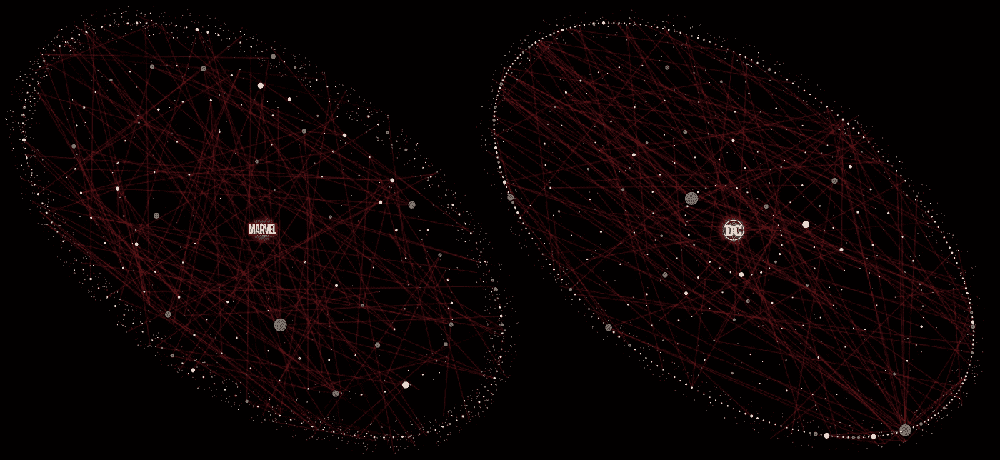

Partners-edges

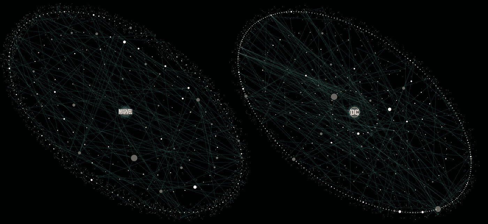

Children-edges

我没有表示边的方向(子-边)。它们被设计成当用户选择一个要分析的字符时突出显示，如下例所示。

在下图中，我显示了点击金刚狼和风暴的结果。这个网络让我们知道金刚狼有很多伴侣和 2 个孩子(在维基百科上注册)，而暴风有 3 个伴侣和 0 个孩子。

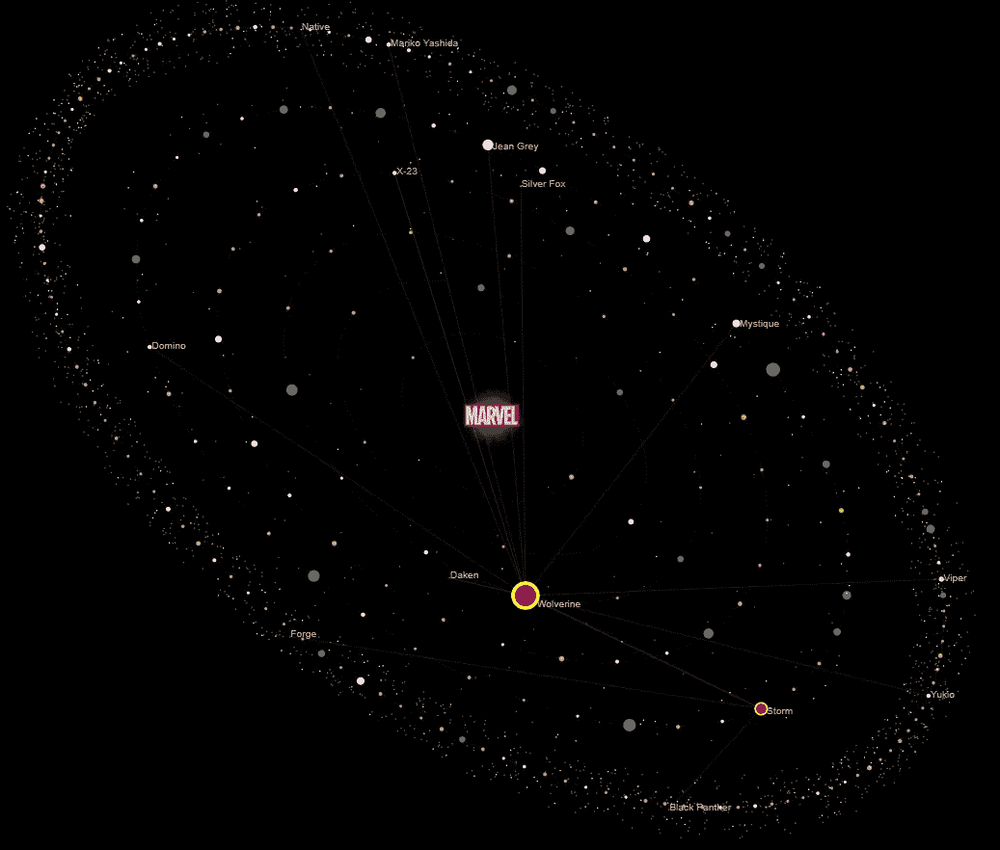

Storm and Wolverine’s connections

在 DC 星系中也发现了类似的模式。在下图中，我们看到神奇女侠有 3 个伴侣，没有孩子；超人有 3 个孩子，7 个伴侣。

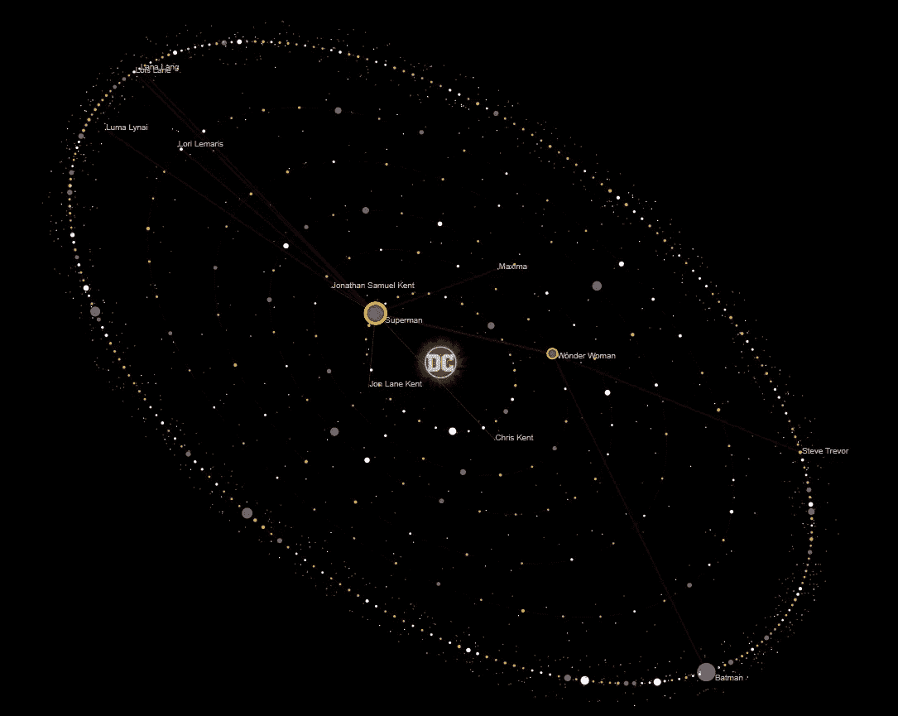

Wonder Woman and Superman’s connections

## 条形图

为了展示**超能力**和**职业**的一般用法，我创建了条形图，就像我在这里实现[一样。](https://medium.com/@heberleh/visualizing-comic-characters-genders-and-superpowers-ae7c2311cb89)

当您将鼠标放在一个栏上时，您可以看到这两个属性的分布，并可视化角色的名称和其他细节。

因为我想给出关于这些属性的附加信息，所以我添加了第三个信息来定义比较**性别**的条的颜色。

我使用每个职业/超级大国的非男性和男性的数量来强调男性比其他性别少的情况。常规条形图为灰色；突出显示的是橙色。

以下是漫威和 DC 最常用的超能力:

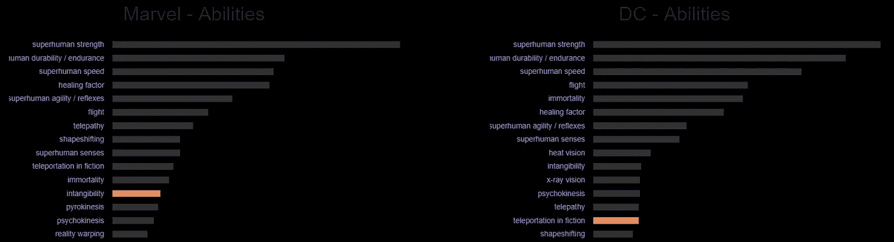

Superpowers Bar Chart

这些是漫威和 DC 最常用的职业:

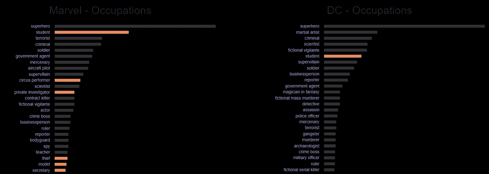

Occupations Bar Chart

# 履行

我使用 Javascript、React 和 D3 实现了所有的可视化。

完整的代码在我的 GitHub 库中:[https://github.com/heberleh/comics-universe](https://github.com/heberleh/comics-universe)

我在 2019 年 6 月从维基数据中提取了数据。

我做的完整漫画系列解释了从提取数据到可视化的所有步骤。你可以在这篇文章的开头找到这三篇文章。

**放置/投影**算法使用*椭圆方程*为半径为`a`和`b`的每个轨道的每个节点计算`x,y`。当它是灰尘(work=0)时，算法使用随机增量来计算不同的`x, y`。这使得尘埃在轨道上围绕着它的原点扩散，用*椭圆方程计算，*创造了一个有趣的效果。

# 在幕后

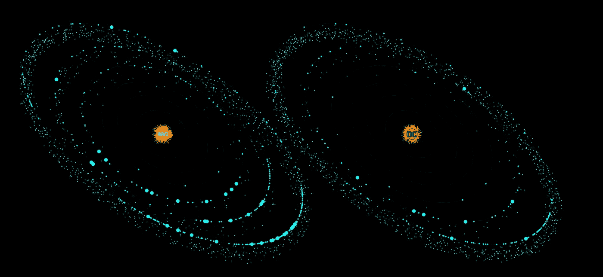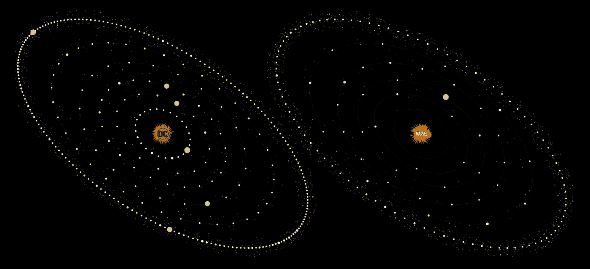

https://heberleh.github.io/comics-universe/漫威和 DC 可视化—

如果你是一个漫画专家，并且发现了数据中的任何空白，考虑通过在他们的系统中插入新的信息来为维基百科和维基数据做贡献。

请留下您对任何主题的评论或私人笔记。

谢谢你看我的文章！