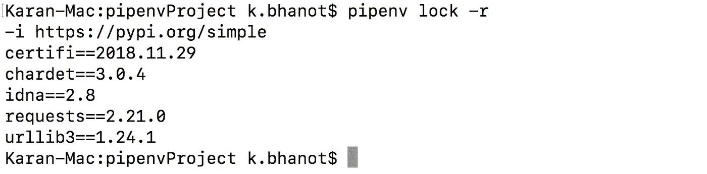

# 比较 Python 虚拟环境工具

> 原文：<https://towardsdatascience.com/comparing-python-virtual-environment-tools-9a6543643a44?source=collection_archive---------1----------------------->


Photo by [rawpixel](https://unsplash.com/@rawpixel?utm_source=medium&utm_medium=referral) on [Unsplash](https://unsplash.com?utm_source=medium&utm_medium=referral)

> 感谢[凯斯·史密斯](https://medium.com/u/fb29fa8f93c4?source=post_page-----9a6543643a44--------------------------------)、[亚历山大·莫尔](https://medium.com/u/a34700ebd09d?source=post_page-----9a6543643a44--------------------------------)、[维克多·基里洛夫](https://medium.com/u/a317127888ca?source=post_page-----9a6543643a44--------------------------------)和[阿兰·斯派特](https://medium.com/u/4505a3589b13?source=post_page-----9a6543643a44--------------------------------)推荐`pew`、`venv`和`pipenv`。

我很喜欢我们在 Medium 上的社区。我最近发表了一篇关于为 Python 项目使用[虚拟环境的文章。这篇文章很受欢迎，读者的反馈为我打开了一个新的视角。我以前不知道`pew`、`venv`和`pipenv`。他们的推荐帮助我了解了该领域的最新技术，并进一步提高了我的知识和经验。](/python-virtual-environments-made-easy-fe0c603fe601)

在他们的建议之后，我阅读了所有的建议。在这篇文章中，我将分享我学到的新的虚拟环境工具，以及它们之间的对比。

# Python 虚拟环境的各种工具


Photo by [Plush Design Studio](https://unsplash.com/@plushdesignstudio?utm_source=medium&utm_medium=referral) on [Unsplash](https://unsplash.com?utm_source=medium&utm_medium=referral)

我浏览了各种文档和文章，了解了它们如何带来不同的东西。我的发现描述如下:

## 1.虚拟

我在之前的文章中已经讨论过`virtualenv`了。你可以在这里查看[。该指南可在](/python-virtual-environments-made-easy-fe0c603fe601)这里获得。

**优点:** 通过`pip`很容易升级，可以轻松使用多个版本的 Python。它还支持 Python 2.7+。

**缺点:** 这里 Python 解释器二进制实际上是复制到一个新的位置，需要从那里读取。此外，如果您想使用它，您必须单独安装它，因为它不是 Python 附带的。

> *边注:如果打算用* `*virtualenv*` *，*[*rafabluszcz 扎瓦日基*](https://medium.com/u/1f9a4530caf?source=post_page-----9a6543643a44--------------------------------) *推荐使用*[*virtualenvwrapper*](https://virtualenvwrapper.readthedocs.io/en/latest/)*。一定要去看看。*

## 2.Python 环境包装器(pew)

`pew`作为一个包装器，一旦你开始使用它，你只需要记住这个命令，因为它可以用于我们需要的所有命令。完整的文档可以在这里找到。

优点:
它让虚拟环境的工作变得非常容易。使用一个简单的命令，您就可以创建一个新的环境，安装一个软件包列表并激活该环境。

**缺点:** 我注意到的主要问题是现在它的支持非常有限。代码上最后一次提交是 2018 年 3 月，差不多一年了。

## 3.venv

`venv`也可以用来设置和访问虚拟环境。从 Python 3.5 开始，它成为创建虚拟环境的推荐方法。你可以在这里找到它的文档。

**优点:** 它生成的配置文件是 Python 二进制直接理解的，不需要把二进制复制到新的位置。此外，Python 开发人员也支持它。

**缺点:** 不是针对 3.3 之前的 Python 版本。

## 4.pipenv

该工具将 Python 和虚拟环境的使用提升到了一个新的水平，因为它将包和环境管理支持结合到了一个工具中。这里的文件是[这里的](https://pipenv.readthedocs.io/en/latest/)。

**优点:** 我们可以简单的指定我们工作的环境。此外，它允许我们为我们的环境创建单独的部分，如生产和测试开发。

**缺点:** 必须通过`pip`单独下载。它增加了很多功能，但是如果他们觉得他们也需要额外的功能，应该采用它。

> 根据我的经验，所有不同的工具都能解决这个问题。它们中的每一个都可以帮助你轻松地创建一个虚拟环境，没有太多的麻烦。你可以简单地选择其中任何一个并学习它的工作原理。

我认为`pipenv`是处理虚拟环境的最佳工具之一，并且由于其增加的功能，它的势头越来越大。因此，我将讨论让您开始使用`pipenv`的基础知识。

# pipenv


Photo by [Farhan Azam](https://unsplash.com/@paan_azam13?utm_source=medium&utm_medium=referral) on [Unsplash](https://unsplash.com?utm_source=medium&utm_medium=referral)

要使用`brew`安装`pipenv`，使用以下命令。

```
brew install pipenv
```

## 创造环境

一旦`pipenv`安装完毕，我们就可以开始处理我们的环境了。转到您想要创建环境的任何文件夹。我来创造`pipenvProject`里面的环境。只要进入它，安装你喜欢的任何软件包。让我们安装`requests`。这将自动设置环境，创建`Pipfile`和`Pipfile.lock`。

```
cd pipenvProject
pipenv install requests
```


pipenv install requests

将在目录中创建两个文件。`Pipfile`其中包括包列表、Python 版本等信息。锁文件也被生成为`Pipfile.lock`。


Pipfile


Pipfile.lock

要激活这个环境，我们可以简单的说`pipenv shell`。我们现在在虚拟环境中。我们现在可以使用`python`命令进入 Python，并使用`import requests`检查我们是否有这个包。由于我们没有得到任何错误，这意味着软件包已经安装。


Inside environment

我们可以使用`exit`退出环境。当我们退出环境时，我们将不再能够访问`requests`包。


Outside environment

我们也可以直接在环境中运行命令，而不需要显式调用`shell`。为此，我们可以使用`run`命令。因此，如果您必须运行 Python，请使用以下命令:

```
pipenv run python
```

## 与非 pipenv 用户的兼容性

每当我们在 Python 中安装一组包时，我们通常在一个名为 requirements.txt 的文件中指定列表。

```
pip install -r requirements.txt
```

因此，当您开始使用`pipenv`时，有一种方法可以为该文件创建文本。简单地说，使用命令:

```
pipenv lock -r
```



Requirements file text

它将显示其他人可以使用的我们的`requirements.txt`文件的文本。

## 删除环境

使用`pipenv —-rm` 命令很容易删除一个环境。要再次创建它，使用命令`pipenv shell`。

但是，目录中的文件仍将保持原样。如果您希望完全删除它，请删除该目录。

```
cd ..
rm -r pipenvProject
```

# 结论

在本文中，我讨论了 Python 虚拟环境的新的高级工具，包括`pew`、`venv`和`pipenv`。我也列举了他们的优缺点。

**奖励:**

Error

如果您在创建虚拟环境时遇到了上述错误，那么有一个简单的解决方法。在主目录中用`touch`命令创建一个文件`.bash_profile`。然后，在编辑器中打开它(我用的是`vim`)。

```
touch ~/.bash_profile
vim .bash_profile
```

添加以下两行，保存并重启您的终端。问题会得到解决。

```
export LC_ALL=en_US.UTF-8
export LANG=en_US.UTF-8
```

请随意分享你的想法和想法。我很乐意收到你的来信。