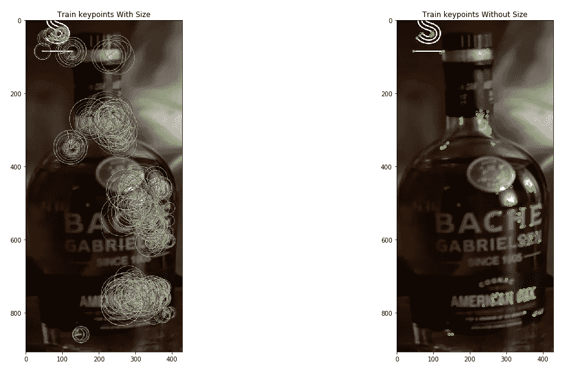
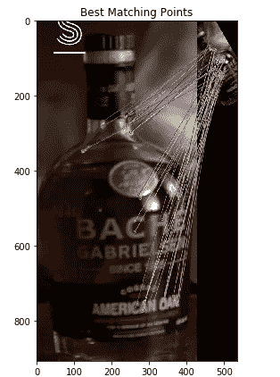
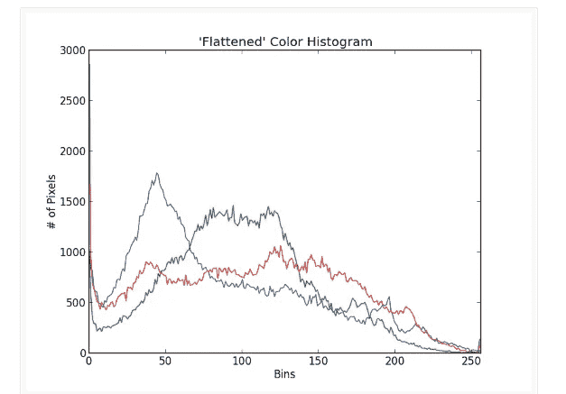
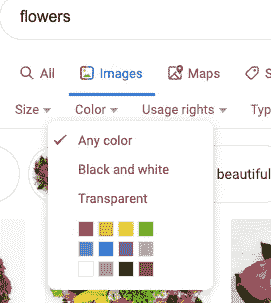
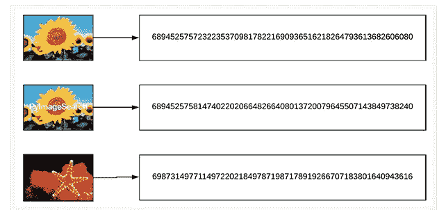
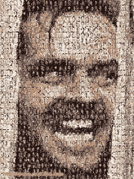

# 图像特征提取算法的比较

> 原文：<https://towardsdatascience.com/comparing-the-feature-extraction-algorithms-for-images-e27c3c662874?source=collection_archive---------9----------------------->

## 从颜色直方图到 VP 树

有许多算法专门用于图像的特征提取。它们中的许多工作原理类似于肺活量描记器或 Roomba。小机器人在房间里走来走去，撞到墙上，直到它有希望覆盖整个地板上的每一个斑点。类似地，一种算法将在一幅图像中穿行，从该图像中提取有趣的信息。这个过程称为特征检测。

# 球

特征检测的一个很好的例子可以用 ORB(面向快速和旋转简短)算法来看。它实际上是快速和简洁的结合。



ORB feature detection (Original photo provided by Limbik, features identified by me)

这些标记表示该图像的重要特征。这种算法甚至可以匹配已被扭曲(变灰、旋转和收缩)的同一图像的那些特征。



Matching features

ORB 本质上是找到图像的“角”。快速组件将特征识别为具有鲜明亮度对比的图像区域。如果超过 8 个周围像素比给定像素更亮或更暗，则该点被标记为特征。既然已经检测到了我们的特征，就要表达出来。BRIEF 通过将提取的点转换为二进制特征向量来实现这一点。这些是 128–526 个 0 和 1 的字符串。ORB 很有用。但是，在将 ORB 应用于完整的图像数据库，然后将这些特征存储到 CSV 中，然后使用 CSV 与给定的查询图像进行比较，以找到最相似的图像时，我遇到了麻烦。这个方法对任何 CBIR 来说都很棒，但是我很难正确实现。如果大家有什么指点，欢迎在下面随意评论！:)

文档:[https://docs . opencv . org/3.0-beta/doc/py _ tutorials/py _ feature 2d/py _ orb/py _ orb . html](https://docs.opencv.org/3.0-beta/doc/py_tutorials/py_feature2d/py_orb/py_orb.html)

当心！页面底部的代码实际上并不好。请务必使用:

```
orb = cv2.ORB**_create**()
```

它可能需要一些巧妙的调试才能正常工作。

# 颜色梯度直方图

该方法简单地测量图像的红色、绿色和蓝色值的比例，并找到具有相似颜色比例的图像。颜色梯度直方图可以主要通过宁滨值来调整。



Color Gradient Histogram

Adrian Rosebrock 有一个实现这种比较图像方法的很好的教程:[https://www . pyimagesearch . com/2014/01/22/clever-girl-a-guide-to-utilizing-color-histograms-for-computer-vision-and-image-search-engines/](https://www.pyimagesearch.com/2014/01/22/clever-girl-a-guide-to-utilizing-color-histograms-for-computer-vision-and-image-search-engines/)

这个方法很好，但不是很详细。如果你用蓝天查询和成像，它可以返回海洋图像，或者一个水池的图像。你可以把它想象成谷歌图片搜索中的颜色功能。



Google Image Search

# 有利位置树

如果您试图在数据库中查找重复的图像，VP-Tree 非常有用。该算法能够找到与查询图像相同的图像，或者近似相同的图像。同样，Adrian Rosebrock 在这方面有一个很好的教程:[https://www . pyimagesearch . com/2019/08/26/building-an-image-hashing-search-engine-with-VP-trees-and-opencv/](https://www.pyimagesearch.com/2019/08/26/building-an-image-hashing-search-engine-with-vp-trees-and-opencv/)

这种方法主要分析图像的内容，并将所有信息压缩成 32 位整数。理论上，具有相似构图的图像将被相似地排序，并且基于构图将是相邻的。这被称为散列，下面是一个例子。



Images assigned a number

正如你所看到的，这两幅向日葵的图像有着相同的 8 位数。白色的文字是造成差异的原因，但它们最有可能是邻居。因此，如果两个图像都在您的数据集中，则一个查询会导致另一个。这种算法非常适合返回相同或接近相同的图像。它不考虑图像中被旋转或模糊的对象。

# 卡兹

这个算法很有趣，因为它似乎不是一个首字母缩写词。KAZE 指的是日语中的“风”风通过“非线性力”流动，因此，该算法由图像域中的非线性扩散过程组成。

[https://www . doc . IC . AC . uk/~ ajd/Publications/alcantilla _ et al _ eccv 2012 . pdf](https://www.doc.ic.ac.uk/~ajd/Publications/alcantarilla_etal_eccv2012.pdf)

在我看来，这种类比有点牵强。看看下面的视频，感受一下 KAZE 使用的功能。

最后一个视频展示了 KAZE 模型的稳健性。KAZE 是在不同图像中识别同一物体的一个很好的模型。如果你有一个图像数据库，比如酒瓶，这将是一个很好的标签检测模型，并根据酒的标签找到匹配。

这是对许多不同形式的图像特征提取的快速概述。有许多选项可用，每一个都有不同的优势，可用于不同的目的。

如果你试图寻找重复的图像，使用 VP-trees。KAZE 和 ORB 非常擅长在不同的图像中检测相似的对象。颜色直方图非常适合制作由成千上万张图片组成的图片，或者至少可以找到具有相似颜色组成的图片。



Here’s content-based image retrieval!

使用这些算法中的一些，或者使用不同的算法，创建你自己的基于内容的图像检索系统！有这么多可以选择。我很想听听你的想法。