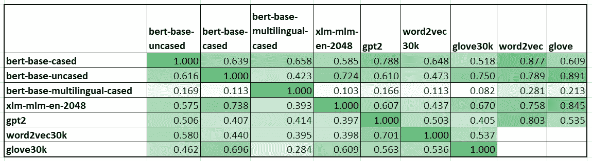

# 比较变压器标记器

> 原文：<https://towardsdatascience.com/comparing-transformer-tokenizers-686307856955?source=collection_archive---------17----------------------->

## 比较最先进的变形金刚的分词器词汇(伯特，GPT-2，罗伯塔，XLM)

如果有人使用 Word2vec 或 GloVe 之类的单词嵌入，那么适应 BERT 之类的新的上下文嵌入可能会很困难。在这个故事中，我们将研究其中的一个区别:*子词*标记。这个故事的灵感来自于[探索多语言 BERT 词汇](http://juditacs.github.io/2019/02/19/bert-tokenization-stats.html)的一个类似帖子。

对于这个实验，我们将使用 Huggingface transformer 库[1]。他们实施了多种最先进的架构。这个实验的代码[可以在 Google Colab](https://colab.research.google.com/drive/1cPxYzWFZ99e64WaWPCJumdZfkxDjGiEI) 上获得。

Image by [PDPics](https://pixabay.com/users/PDPics-44804/?utm_source=link-attribution&utm_medium=referral&utm_campaign=image&utm_content=390055) from [Pixabay](https://pixabay.com/?utm_source=link-attribution&utm_medium=referral&utm_campaign=image&utm_content=390055)

# 子词标记

子单词标记(或*单词片段*)可用于将单词分割成多个片段，从而减少涵盖每个单词的词汇量[2]。单词片段背后的思想和书面语言一样古老。*字符*是最知名的词块，英文单词可以用 26 个字符书写。

然而，寻找单词块的正确大小还没有被规范化。字符可以用 26 个左右的键来表示每个单词，而原始单词嵌入对每个单词使用不同的键(3M 键用于[这个 word2vec 字典](https://code.google.com/archive/p/word2vec/))【3】。小说《变形金刚》中的记号赋予者使用的词汇量介于两者之间。

Vocabulary size of the Transformers used in this experiment

## 伯特

BERT [4]使用单词片段[2]标记，其中非单词起始片段以`##`开始。不同的 BERT 模型有不同的词汇表。例如，无外壳的基本模型有 994 个令牌保留用于可能的微调(`[unused0]` 到`[unused993]`)。cased 模型只有 101 个未使用的标记，因为它需要更多的标记来覆盖大写字母和小写字母。多语言模型只有 100 个未使用的标记，然而，它的总词汇量是无案例的四倍。多语言模型存储更多的特殊字符，以涵盖 104 种语言的单词。

单词*标记化*用`bert-base-cased` :
`[‘token’, ‘##ization’]`标记化

## 罗伯塔 GPT2

Huggingface 的 GPT2 [5]和 RoBERTa [6]实现使用相同的词汇表，包含 50000 个单词。他们使用 BPE ( *字节对编码*【7】)字段和`\u0120`作为特殊的信令字符，然而，Huggingface 实现对用户隐藏了它。

**BPE** 是一种基于频率的字符拼接算法:它以两字节字符作为标记开始，并基于 n 元语法标记对的频率，包括额外的更长的标记。例如，如果字母`e`和`r`在语言中频繁出现，一个新的标记`er`将被添加到词汇表中。接下来，如果`h`和`er`经常在一起，`her`被添加到词汇表中。该算法继续下去，直到它达到所需的大小。

单词*标记化*用模型`gpt` :
`[‘token’, ‘ization’]`标记化

## XLM

与之前的词汇相比，XLM [8]在词尾使用了一个后缀:`</w>`表示这是一个单词的结尾。XLM 使用多种语言和模型共享的基于 BPE 的词汇表。

用模型`xlm-mlm-en-2048` :
`[‘to’, ‘ken’, ‘ization</w>’]`将单词标记化

# 词汇相似度

下面的实验通过计算不同词汇的交集来度量它们之间的相似性。唯一的预处理步骤是消除上一节提到的特殊字符。第 I 行第 j 列单元格的计算公式:`size(intersection(vocab(i),vocab(j)))/size(vocab(j))`。

为了正确分析该表，应该注意不同的模型具有不同的词汇量。`bert-base-cased` (28996wps)和`bert-base-multilingual-cased` (119547wps)的交集只能覆盖多语言词汇的四分之一，即使这两个词汇完全匹配。

Word2Vec [3]和 GloVe [9]是使用单词作为关键字的静态单词嵌入。对于其他信息，该表包括这些嵌入的 30000 个最常见的单词以及总词汇表。我们对 Word2Vec 使用 3M GoogleNews 模型，对[手套](https://nlp.stanford.edu/projects/glove/)使用[维基百科 2014](http://dumps.wikimedia.org/enwiki/20140102/) + [Gigaword 5](https://catalog.ldc.upenn.edu/LDC2011T07) 模型。

Comparison of the tokens in the different vocabularies

从这个表中，我们可以看到在 Word2Vec 模型中，`bert-base-cased`中 87%的所有标记都被表示为单词。此外，`bert-base-uncased`和`xlm-mlm-en-2048`与其他相比彼此相对相似，因为它们具有超过 70%的相似性。

# 标记化差异

不同的单词片段带来不同的标记化。以下是一些不同单词分词的例子:

The different tokenization of the words “Marion”, “baptist” and “nuggets”

下图显示了 Word2vec 最常见单词的无大小写修改中同等标记化单词的增加。正如我们所看到的，在前 1000 个单词中，有 763 个单词以同样的方式被标记，然而，这个数字在前 4000 个单词中只增加到 1986 个，如果我们看前 10000 个最常见的单词，则增加到 3055 个。

Words tokenized the same way in every model

# 摘要

在这个故事中，我们看到不同的 Transformer 模型使用不同的标记器和不同的子词标记。正因为如此，在令牌级对模型进行比较是困难的。全球标准化子词模型的可能性是一个公开的问题。即使对于英语来说，标记化的词汇也有很大差异。

# 参考

[1]t . Wolf，处女作，l .，Sanh，v .，Chaumond，j .，Delangue，c .，Moi，a .，… & Brew，J. (2019)。[拥抱脸的变形金刚:最先进的自然语言处理。](https://arxiv.org/abs/1910.03771) *ArXiv，abs* 。 *arXiv:1910.03771*

[2]吴，m .舒斯特，陈，z .乐，Q. V .，m .马切里，w .，… &克林纳，J. (2016)。[谷歌的神经机器翻译系统:弥合人类和机器翻译之间的鸿沟。](https://arxiv.org/abs/1609.08144)T11【arXiv 预印本 arXiv:1609.08144 。

[3]t .米科洛夫，陈，k .，科拉多，g .，&迪安，J. (2013 年)。[向量空间中单词表示的有效估计。](https://arxiv.org/abs/1301.3781)arXiv 预印本 arXiv:1301.3781 。

[4] Devlin，j .，Chang，M. W .，Lee，k .，& Toutanova，K. (2018 年)。 [Bert:用于语言理解的深度双向转换器的预训练。](https://arxiv.org/abs/1810.04805)arXiv 预印本 arXiv:1810.04805 。

[5]a .、吴 j .、蔡尔德 r .、栾 d .、阿莫代伊 d .、&苏茨基弗 I. (2019)。[语言模型是无人监督的多任务学习器。](https://www.techbooky.com/wp-content/uploads/2019/02/Better-Language-Models-and-Their-Implications.pdf) *OpenAI 博客*， *1* (8)。

[6]刘，y .，奥特，m .，戈亚尔，n .，杜，j .，乔希，m .，陈，d .，… &斯托扬诺夫，V. (2019)。Roberta: [一种稳健优化的 bert 预训练方法。](https://arxiv.org/abs/1907.11692) *arXiv 预印本 arXiv:1907.11692* 。

[7]森里奇(r .)、哈多(b .)、伯奇(a .)(2015 年)。[带子词单元的生僻字神经机器翻译](https://arxiv.org/abs/1508.07909)。 *arXiv 预印本 arXiv:1508.07909* 。

[8]康奈尔大学和兰普尔大学(2019 年)。[跨语言语言模型预训练。*神经信息处理系统的进展*(第 7057–7067 页)。](http://papers.nips.cc/paper/8928-cross-lingual-language-model-pretraining)

[9]j .潘宁顿、r .索彻和 c .曼宁(2014 年 10 月)。 [Glove:单词表示的全局向量。](https://www.aclweb.org/anthology/D14-1162)见*2014 年自然语言处理经验方法会议论文集*(第 1532-1543 页)。