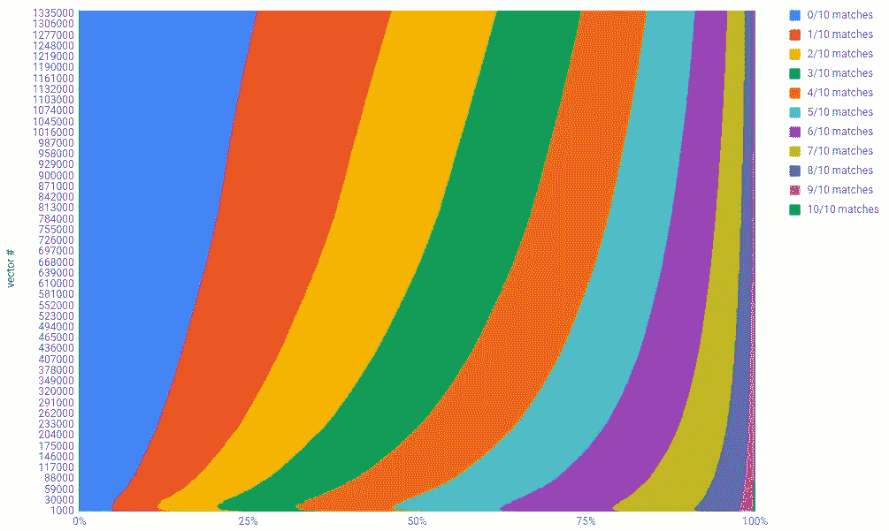
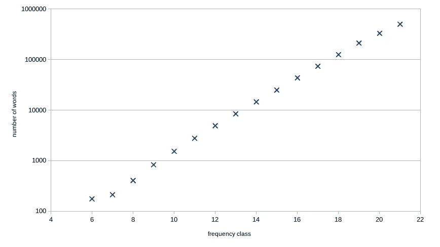
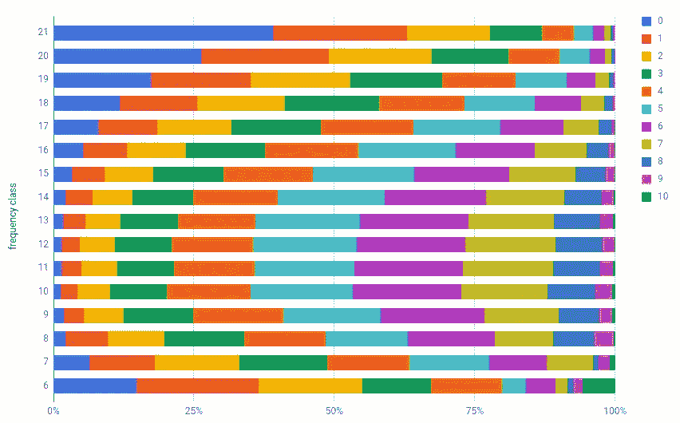
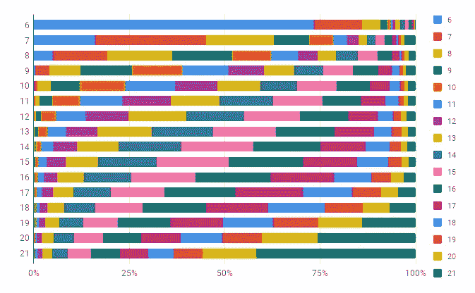
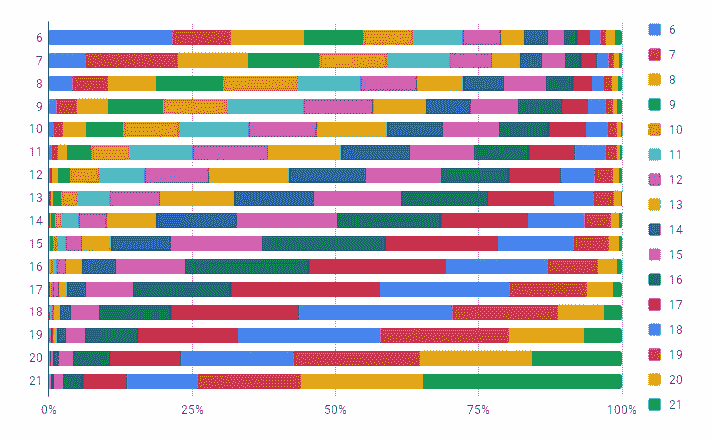
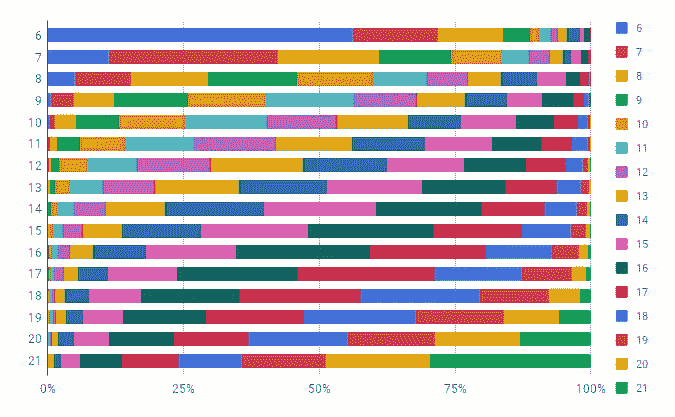
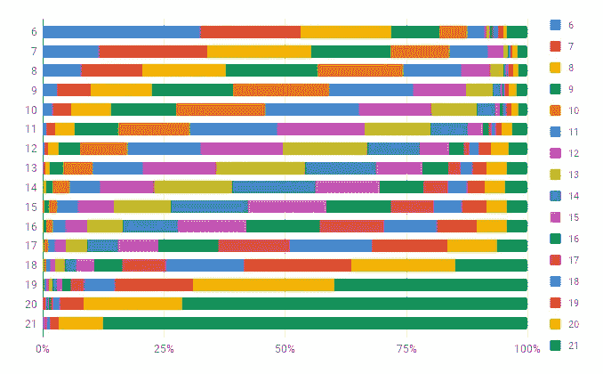
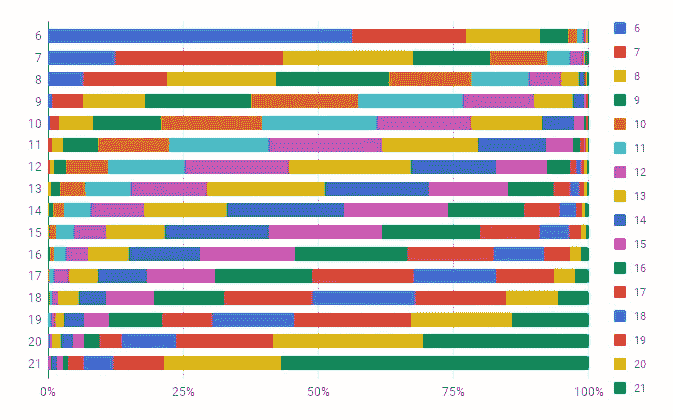
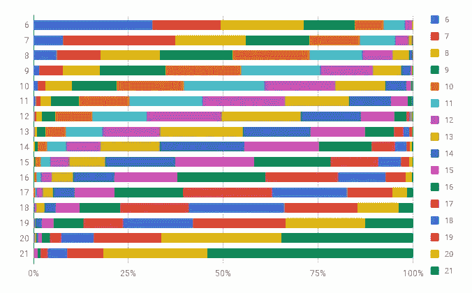

# 比较单词嵌入

> 原文：<https://towardsdatascience.com/comparing-word-embeddings-c2efd2455fe3?source=collection_archive---------13----------------------->

我们应用单词嵌入，因为它们已经被证明可以提高 NLP / ML / AI 任务的结果质量。一个有点天真的想法是，它们通过拓宽一个词、一个句子或一个文档与一个巨大的文本语料库中的平均上下文所铺设的狭窄路径来工作。通常，使用 [Word2Vec](https://citeseerx.ist.psu.edu/viewdoc/summary?doi=10.1.1.764.2227) 或 [GloVe](https://citeseerx.ist.psu.edu/viewdoc/summary?doi=10.1.1.645.8863) 的各种实现来生成单词嵌入。对于那些想要深入了解的人来说，这里有太多的[a](https://www.deeplearningweekly.com/blog/demystifying-word2vec/)rtI[c](https://nlp.stanford.edu/projects/glove/)[l](http://blog.aylien.com/overview-word-embeddings-history-word2vec-cbow-glove/)[e](/emnlp-what-is-glove-part-i-3b6ce6a7f970)[s](https://medium.com/@jayeshbahire/introduction-to-word-vectors-ea1d4e4b84bf)描述了它们内部运作和底层算法背后的数学原理。

下面让我们仔细看看 Word2Vec 中实现的通用单词包(CBOW)和跳过语法(SG)模型。我们已经[知道](/introduction-to-word-embedding-and-word2vec-652d0c2060fa)在训练 CBOW 时，我们试图从上下文预测单词，而在训练 SG 时，我们试图预测上下文单词。因此，CBOW 在处理大量训练数据和更频繁的单词时表现更好，而 SG 在处理少量训练数据时也表现良好，并且更好地表示不太频繁的单词。此外，SG 比 CBOW 花费更多的时间来训练。

> “因此，假设我们使用相同的设置在相同的语料库上训练 CBOW 和 SG，当我们查看单词嵌入级别而不是应用程序中的性能时，我们会期望什么样的比较结果？”
> 
> "也许 CBOW 会返回更频繁的单词，而 SG 会返回不太频繁的单词."
> 
> "最终的单词嵌入会有多大的不同呢？"
> 
> “不知道，让我们开始一个实验，并从中学习一些东西。”
> 
> —我内心的对话

所以我去从一个[镜像](http://ftp.acc.umu.se/mirror/wikimedia.org/dumps/dewiki/20190420/)获得了 2019 年 4 月的德语维基百科的转储，并应用了轻量级预处理(即，没有词汇化或其他繁重的 NLP 技术)来获得 2 GB 的纯文本，其中一些短语粘在一起。然后，我使用 gemsim 计算 CBOW 和 SG 模型，这两个模型有 324 个维度，窗口大小为 10，最小频率为 10，每个模型有 1.33M 个向量。

一种非常简单(但相当耗时)的比较方法是遍历其中一个模型的词汇表，并计算前 10 个相似单词中有多少匹配。结果以 1k 个词汇单词的步长绘制在下面，并且示出了两个发现:1)模型中的单词向量具有顺序，并且该顺序对一致率有影响。2)一般来说，最相似的单词在很大程度上取决于所选择的模型。

Walking through the agreements in vector order

语料库中的词频根据 Zipf 定律(幂定律)分布，使得非常少的非常常见的词构成了大量的原始词计数。然后是相当数量的中等频率的单词，最后是长尾巴的不常用单词。看上面的图片，单词向量顺序似乎主要是基于频率的。当逐字查看词汇并与源文本进行比较时，会发现它实际上是按单词在源语料库中的出现顺序排列的。因为单词的出现分布在整个语料库中，所以我们期望平均来说更频繁出现的单词比不太频繁出现的单词更早出现。我们还可以得出结论，源词的词频与符合率相关。

所以，让我们继续把词汇分成数量可观的几类，每一类都在一定的频率范围内。考虑到幂定律，可以通过将语料库中最常见的词的频率(这里为:“der”)与每个词的频率进行比较，取比率的对数(这里为:以 2 为底)并对结果进行舍入来构建频率类。在分布的顶部，数据非常稀疏，因此所有 200 个最频繁出现的单词被分配到类别“6”。下图中产生的 16 个频率类别在大小上相差甚远，但与最常用的单词相比，该单词在一个类别中的频率相差不到 2 的 1 次方。

number of words per frequency class

现在我们可以按频率等级重复最初的比较。此外，由于最初的计算耗时太长(2 天！)，我们可以从每个类别(1k)中为输入单词抽取足够大的样本。下面的结果表明，词频和模型一致性之间的相关性假设总体上是正确的。在分布的顶部(类别 6-8 ),有一些单词具有较小的一致性，并且不适合整体趋势。这些是我们可以放心地称之为停用词的词。在分布的中间(9-15 级)，有一个区域的协议一般是公平的，频率影响相当低。接近分布的尾部(16-21 级),符合率随着频率影响的增加而下降。

Agreement counts by relative word frequency

现在我们已经了解了 CBOW 和 SG 之间的协议以及词频的影响。接下来，我们可以通过与输入单词的频率类别进行比较来研究他们提出的最相似单词的频率类别的个体模型以及协议模型。我们再次使用采样，因为完整的计算需要很长时间。

CBOW: frequency class of result in dependency of frequency class of input

CBOW(上图)认为相似的词往往比 SG(下图)更频繁。在分布的顶部，对于 CBOW，建议的非常频繁的词的数量非常高，而对于 SG，建议的非常频繁的词的数量相当低。在分布的中间部分，CBOW 建议的单词比 SG 建议的单词更频繁一些。在分布的末尾，这种效应继续存在，但是 CBOW 也开始产生更多非常不常用的单词。当使用单词嵌入时，消除不太频繁的相似单词可能会产生有趣的效果。

SG: frequency class of result in dependency of frequency class of input

最后，我们再次达成了下面描述的协议模型。对于中低频率的单词，乍一看，它似乎结合了 CBOW 和 SG 模型的优点。然而，热情是有限的，因为我们还需要考虑根本没有达成一致的大量情况。

CBOW vs. SG: frequency class of result in dependency of frequency class of input

*更新*:我需要第二次尝试从同一个语料库中创建一个手套模型，因为我没有考虑手套的临时空间需求(大约是原始语料库的 9 倍)。

GloVe: frequency class of result in dependency of frequency class of input

总体观察是 GloVe，它比其他模型提出了更多不常见的相似词，这在尾部变得相当压倒性。

GloVe vs. CBOW: frequency class of result in dependency of frequency class of input

当比较手套和 CBOW 时，符合率略高于手套和 SG 之间的符合率(32.1%对 28.6%)，而 CBOW 和 SG 之间的符合率最高(40%)。通过与 CBOW 的比较，我们仍然得到稍微更频繁的单词，但是在分布的中间(也是最重要的部分),差异不是非常显著。

GloVe vs. SG: frequency class of result in dependency of frequency class of input

最后还有:

1.  CBOW、SG、GloVe 的 1000 字/频类样本对比用数字和图表的 Google sheet:[https://docs . Google . com/spreadsheets/d/1 ewmy _ npb 0-ui 5 czktw 7 bv 7 ICR 7c p 9 tjgmcwywaxwmky/edit？usp =共享](https://docs.google.com/spreadsheets/d/1EWmy_Npb0-Ui5cZkTw7bv7iCr7Cp9tJgMCwYwaxwMKY/edit?usp=sharing)
2.  一个 jupyter 笔记本:[https://github . com/al Hague/word _ embedding _ comparison/blob/master/Model % 20 comparison . ipynb](https://github.com/alhague/word_embedding_comparison/blob/master/Model%20comparison.ipynb)

希望以上发现能有用。合乎逻辑的下一步将是把它们应用到与单词嵌入相关的任务中……在后续的故事中。