# 深度神经网络激活函数的比较

> 原文：<https://towardsdatascience.com/comparison-of-activation-functions-for-deep-neural-networks-706ac4284c8a?source=collection_archive---------0----------------------->

## 阶跃函数、线性函数、Sigmoid 函数、双曲正切函数、Softmax 函数、ReLU 函数、Leaky ReLU 函数和 Swish 函数都有手把手的讲解！

🔥 ***激活函数在神经网络中起着关键作用，因此了解其优缺点以获得更好的性能至关重要。***

有必要从引入非线性激活函数开始，它是最著名的**s 形函数**的替代函数。重要的是要记住，在评估激活功能的最终性能时，许多不同的条件都很重要。在这一点上，有必要提请注意数学和导数过程的重要性。因此，如果你准备好了，让我们卷起袖子，动手干一场吧！🙌🏻

[Source](https://www.reactiongifs.us/im-ready-game-of-thrones/)

**什么是人工神经网络？让我们先记住这个:**基于通过生物的神经系统对学习结构进行建模/模仿的人工学习技术。该神经结构通过分级电流感测过程来实现。从感受器获取的电脉冲使我们能够学习、记忆和记住我们自出生以来所看到、听到、感受到和想到的一切。神经科学是一个非常深入和有趣的研究领域。

## 为什么我们需要激活功能？

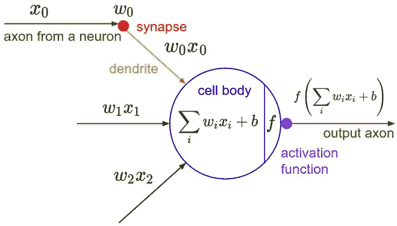

[CS231n: Convolutional Neural Networks for Visual Recognition](http://cs231n.stanford.edu/index.html)

我们需要激活函数将非线性真实世界的属性引入人工神经网络。基本上，在一个简单的神经网络中，x 被定义为输入，w 是权重，我们传递 f (x)是传递给网络输出的值。这将是另一层的最终输出或输入。

## 为什么不激活就不能把这个信号切换到输出？

如果不应用激活函数，输出信号变成简单的线性函数。线性函数只是单级多项式。**未激活的神经网络将充当学习能力有限的线性回归。**但是我们也希望我们的神经网络学习非线性状态。**因为我们会给你图像、视频、文本、声音等复杂的现实世界信息，让你学习到我们的神经网络。**多层深度神经网络可以从数据中学习有意义的特征。

## 那么为什么非线性函数需要？

多阶函数称为非线性函数。人工神经网络被设计为**通用函数** **近似器**并用于此目标。这意味着他们必须具备计算和学习任何函数的能力。由于非线性激活函数，可以实现更强的网络学习。**这篇文章已经和这个问题完全相关了**😇

为了计算与权重相关的误差值，应用人工神经网络的反向传播算法。有必要确定优化策略并最小化错误率。选择合适的优化算法也是一个单独的问题。

> [投入。乘以重量。加个偏向。激活！](https://twitter.com/sirajraval/status/930876397987549185)

# 激活功能

## 阶跃函数

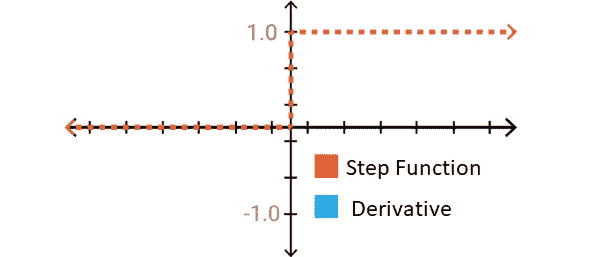

Step Function and Derivative

它是一个接受二进制值的函数，用作二进制分类器。因此，在输出层中通常是优选的。不建议在隐藏层使用，因为它不代表衍生学习值，未来也不会出现。然后，我们来想一个导函数，线性函数马上就想到了。

## 线性函数

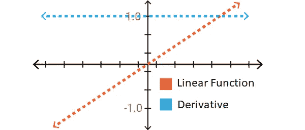

Linear Function and Derivative

它生成一系列激活值，这些值不是二进制值，就像阶跃函数一样。它当然允许你将几个神经元(神经细胞)连接在一起。但是这个功能有一个重大问题！修正了导数。为什么我们需要它的导数，它被固定的负面影响是什么？我们所说的；通过反向传播算法，我们完成了神经元的学习过程。这个算法由一个导数系统组成。当 A = c.x 由 x 导出，我们就到了 c，这就意味着与 x 没有关系，好吧，如果导数始终是一个常数值，我们能说学习过程正在进行吗？可惜没有！

还有一个问题！当在所有图层中使用线性函数时，在输入图层和输出图层之间会达到相同的线性结果。**线性函数的线性组合是另一个线性函数。**这意味着我们最开始所说的神经元可以干扰互连层！🙄

## Sigmoid 函数

假设自然界中的大多数问题都不是线性的，sigmoid 函数的组合也不是线性的。答对了。

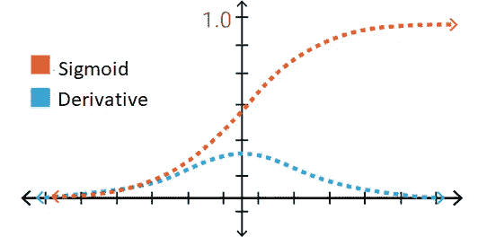

Sigmoid Function and Derivative

然后我们可以对这些层进行分类😃所以让我们考虑非二元函数。它也是可导的，因为它不同于阶跃函数。这意味着学习是可以发生的。如果我们检查图形 x 在-2 和+2 之间，y 值变化很快。x 中的小变化在 y 中会很大。这意味着它可以用作一个好的分类器。此函数的另一个优点是，当遇到线性函数中的(- infinite，+ infinite)时，它会产生(0，1)范围内的值。所以激活值没有消失，这是个好消息！🎈

> **sigmoid 函数是最常用的激活函数，但还有许多其他更有效的替代函数。**
> 
> **那么乙状结肠功能**有什么问题呢？

如果我们仔细观察函数两端的图形，y 值对 x 的变化反应很小，让我们想想这是什么问题！🤔这些区域的导数值非常小，收敛到 0。这被称为**消失梯度**并且学习是最小的。如果为 0，则没有任何学习！当缓慢学习发生时，使误差最小化的优化算法可以附加到局部最小值，并且不能从人工神经网络模型获得最大性能。所以让我们继续寻找另一种激活功能！🔎

## 双曲正切函数

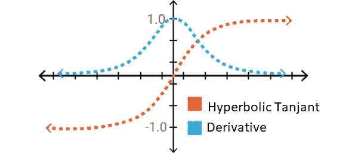

Hyperbolic Tangent and Derivative

它的结构非常类似于 Sigmoid 函数。但是，这一次函数被定义为(-1，+ 1)。相对于 sigmoid 函数的优势在于它的导数更陡，这意味着它可以获得更多的值。这意味着它的效率会更高，因为它的学习和评分范围更广。但是，函数两端的梯度问题仍然存在。虽然我们有一个非常普通的激活功能，但我们将继续寻找最好的一个！

## ReLU(校正线性单位)功能

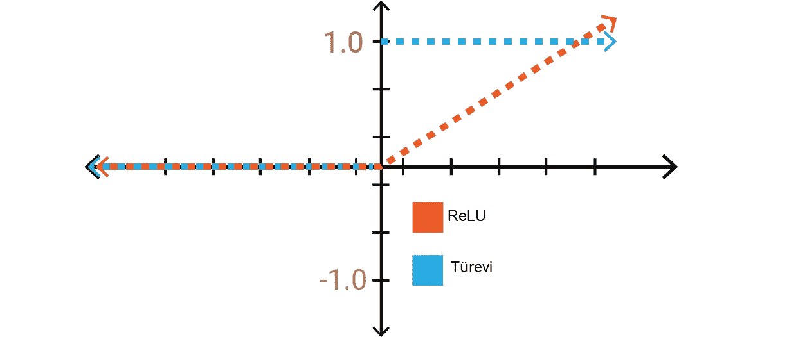

ReLU Function and Derivative

乍一看，它似乎与正轴上的线性函数具有相同的特征。但最重要的是，ReLU 本质上不是线性的。事实上，一个好的评估者。也有可能通过 ReLU 的组合与任何其他函数收敛。太好了！这意味着我们仍然可以(再次)在我们的人工神经网络中对层进行排序😄

**ReLU 估值在[0，+G0]，但是回报是什么，有什么好处？**让我们想象一个拥有太多神经元的大型神经网络。Sigmoid 和双曲线正切导致几乎所有的神经元都以相同的方式被激活。这意味着激活非常密集。网络中的一些神经元是活跃的，并且激活是不频繁的，所以我们想要有效的计算负载。我们用 ReLU 得到它。负轴上的值为 0 意味着网络将运行得更快。**计算负荷小于 sigmoid 和双曲线正切函数的事实导致了多层网络的更高优先性。**超级！😎但是即使是 ReLU 也不是很好，为什么？因为这个零值区域给了我们这个过程的速度！所以学习不是发生在那个区域。😕那你就需要找一个新的激活功能，有窍门的。

## 漏流函数

💧你能看到负平面上的漏洞吗？😲

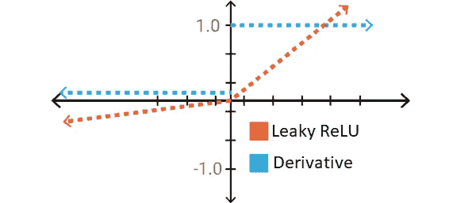

Leaky ReLU Function and Derivative

这个泄漏值被给定为 0.01。如果给定一个接近零的不同值，函数的名称随机地改变为 Leaky ReLU。(没有，没有新功能？！😱)泄漏 ReLU 的定义范围仍然是负无穷大。这是接近于 0，但 0 与非生活梯度的价值在 RELU 生活在负区域的学习提供的价值。多聪明啊。🤓

## Softmax 函数

它的结构非常类似于 Sigmoid 函数。与同一个 Sigmoid 一样，它在用作分类器时表现相当好。**最重要的区别是在深度学习模型的输出层优先，尤其是需要分类两个以上的时候。** I [t 允许通过产生 0-1 范围内的值来确定输入属于特定类的概率。](https://eli.thegreenplace.net/2016/the-softmax-function-and-its-derivative/)所以它执行概率解释。

## Swish(自门控)功能

Swish Function and Derivative

与 ReLU 最重要的区别是在负区域。**ReLU 里 Leaky 的值一样，有什么区别吗？**其他所有激活功能都很单调。请注意，即使输入增加，swish 函数的输出也可能下降。这是一个有趣的 swish 特有的特性。

**f(x)=2x*sigmoid(beta*x)**

如果我们认为 **beta=0** 是 Swish 的简单版本，是一个可学习的参数，那么 sigmoid 部分总是 1/2，f (x)是线性的。另一方面，如果β是一个非常大的值，sigmoid 就变成了一个接近两位数的函数(0 代表 x < 0，1 代表 x > 0)。因此 f (x)收敛于 ReLU 函数。**因此，选择标准的 Swish 函数为β= 1。**通过这种方式，提供了软插值(将变量值集与给定范围和期望精度内的函数相关联)。太棒了。已经找到了解决梯度消失问题的方法。

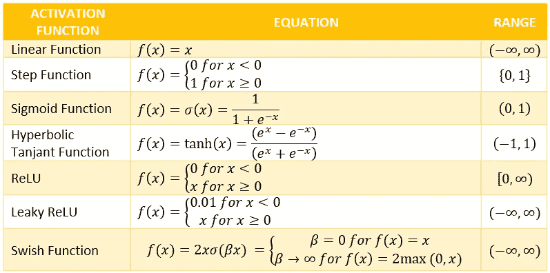

Mathematical Expressions of Activation Functions

> [**点击此处**](https://www.youtube.com/watch?v=GkB4vW16QHI) **查看梯度和偏导数可视化！**

# 应该优先选择哪种激活功能？

当然，我不会说你会用它或者那个。因为我已经列出了每个激活功能的独特优缺点。 **sigmoid** 函数可以用如果你说**双曲正切**或者模型因为激活函数范围广可以学的稍微慢一点。但是如果你的网络太深，计算量是主要问题，可以首选 **ReLU** 。你可以决定使用 **Leaky ReLU** 作为 ReLU 中渐变消失问题的解决方案。但是你做的计算比 ReLU 多。

> **所以激活函数是一个关键的优化问题，你需要根据所有这些信息和你的深度学习模型的要求来决定。**

[Source](https://giphy.com/gifs/cheezburger-meryl-streep-movies-and-tv-ZjAPnic8kycM0)

*   网络的简单和快速收敛可以是第一标准。
*   ReLU 在速度方面会有优势。你必须让渐变消失。它通常用于中间层，而不是输出。
*   漏 ReLU 可以是梯度消失问题的第一个解决方案。
*   对于深度学习模型，用 ReLU 开始实验是可取的。
*   Softmax 通常用于输出图层。

你可以找到无数的文章来评价他们的比较。我最好的建议是把手弄脏！所以，测试你自己，如果你准备好了…

## 激活函数的定义和绘制

首先，让我们看看激活函数的识别和绘制:

🌈 [**你可以在 Google Colab 里找到代码。**](https://colab.research.google.com/drive/1JGRVpj0-0uaDrUqBpjIw9LT9us48DC89)

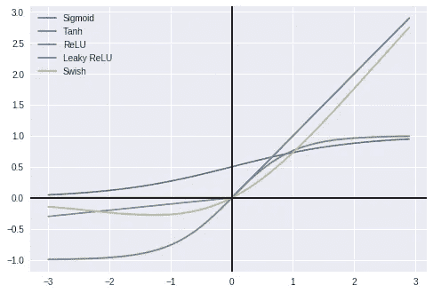

Demonstration of Activation Functions

# 激活功能的性能评估

> 让我们来看看卷积神经网络模型在经典 MNIST 数据集上的激活函数的比较，我们称之为最先进的

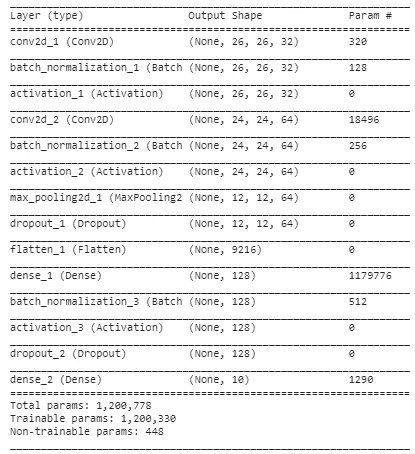

Summary of Deep Learning Model Used

当具有两个卷积层的模型应用于 Sigmoid、双曲线正切、ReLU、Leaky ReLU 和 Swish 函数时，您可以观察到一些函数是如何领先于其他函数的，以及一些函数是如何接近的。您可以测试不同的数据集。此外，其他的，epoch，batch-size，dropout 等参数的影响也可以考察。也许我下一篇文章的主题可以是其中之一！

> **给出了 20 个历元的样本验证、训练精度和损失值的结果。测试结果也如下表所示。**

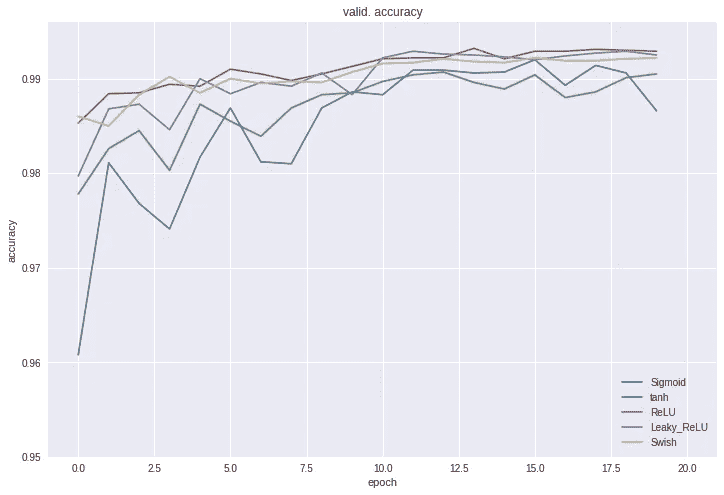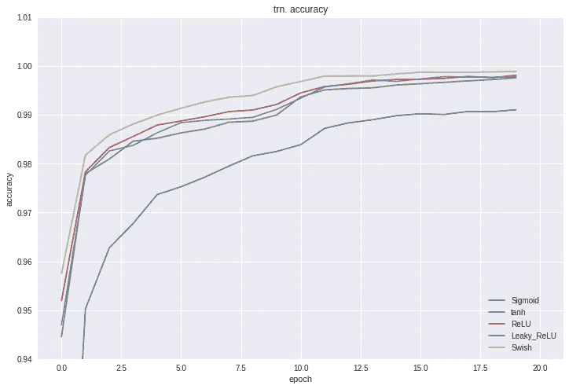

Comparison of Validation and Training for Different Activation Functions (TRAINING)

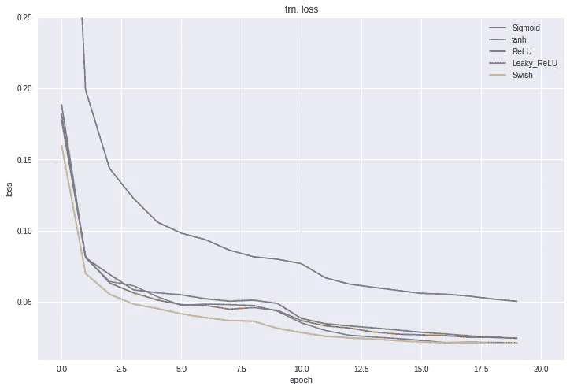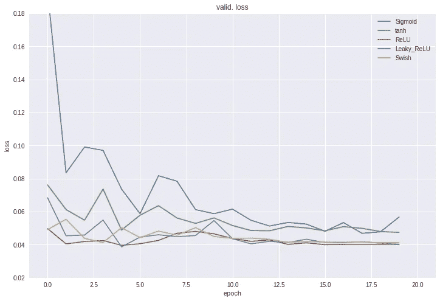

Comparison of Validation and Training for Different Activation Functions (LOSS)

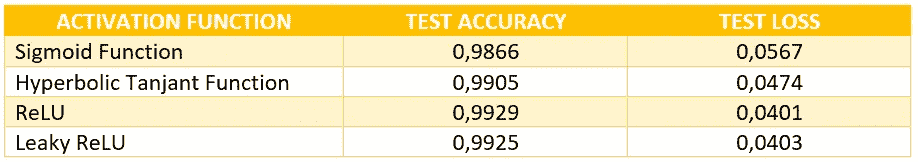

Comparison of Activation Functions for Deep Neural Networks by Merve Ayyüce Kızrak is licensed under a [Creative Commons Attribution-ShareAlike 4.0 International License](http://creativecommons.org/licenses/by-sa/4.0/).

🌈你可以在谷歌实验室找到代码👇🏻

 [## 激活函数比较 _ 源代码 Google Colab

colab.research.google.com](https://colab.research.google.com/drive/1fCVQ8JFiuyVWs6BoCIw0UqWPZPshU25h) 

[Source](https://giphy.com/gifs/party-excited-birthday-YTbZzCkRQCEJa/links)

## 🌈激活函数如何帮助创建非线性决策极限？[您可以在此处获得其他申请！](https://github.com/snnclsr/neural_nets_from_scratch/blob/master/why_need_activations.ipynb)

**所以，欢迎随时关注我关于** [**中**](https://medium.com/@ayyucekizrak)**[**推特**](https://twitter.com/ayyucekizrak) **，以及**[**LinkedIn**](https://www.linkedin.com/in/merve-ayyuce-kizrak/)**👽****

**如果你想用土耳其语阅读这篇文章，点击[这里](https://medium.com/deep-learning-turkiye/derin-%C3%B6%C4%9Frenme-i%C3%A7in-aktivasyon-fonksiyonlar%C4%B1n%C4%B1n-kar%C5%9F%C4%B1la%C5%9Ft%C4%B1r%C4%B1lmas%C4%B1-cee17fd1d9cd)！**

**❓ *如果有任何意见或问题，请不要犹豫让我知道。* ❗️**

## **🎉我之前的一些博文！干杯！**

** [## 胶囊网络:一种新的有吸引力的人工智能架构🚨

heartbeat.fritz.ai](https://heartbeat.fritz.ai/capsule-networks-a-new-and-attractive-ai-architecture-bd1198cc8ad4)  [## 什么是可解释的人工智能，是否需要？

### 可解释的人工智能-XAI 是一个近年来经常被争论的话题，也是一个…

interestingengineering.com](https://interestingengineering.com/what-is-explainable-artificial-intelligence-and-is-it-needed)  [## 人工智能与律师:人工智能和法律的未来

### “机器会思考吗？”让我们扩展一下艾伦·图灵在 50 年代提出的这个问题。无数的灾难场景，在…

interestingengineering.com](https://interestingengineering.com/ai-vs-lawyers-the-future-of-artificial-intelligence-and-law) 

## 参考

*   [深度学习的基础——激活函数以及何时使用它们？](https://www.analyticsvidhya.com/blog/2017/10/fundamentals-deep-learning-activation-functions-when-to-use-them/)
*   [理解神经网络中的激活功能](https://medium.com/the-theory-of-everything/understanding-activation-functions-in-neural-networks-9491262884e0)
*   [深度神经网络的非线性激活函数在 MNIST 分类任务上的比较](https://arxiv.org/pdf/1804.02763.pdf)
*   [SWISH:自门控激活功能](https://arxiv.org/pdf/1710.05941v1.pdf)
*   [开创性的激活功能](https://codeodysseys.com/posts/activation-functions/)
*   [soft max 函数及其导数](https://eli.thegreenplace.net/2016/the-softmax-function-and-its-derivative/)
*   [在 MNIST 数据集上使用 SWISH 激活函数的实验](https://medium.com/@jaiyamsharma/experiments-with-swish-activation-function-on-mnist-dataset-fc89a8c79ff7)**