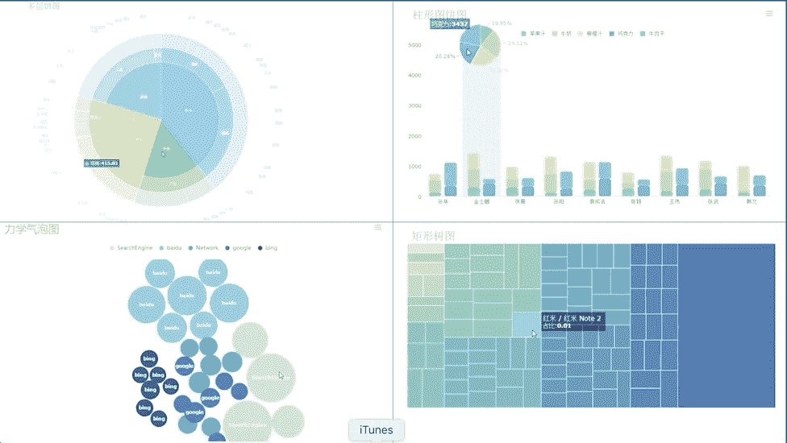

# 数据分析工具的比较:Excel、R、Python 和 BI 工具

> 原文：<https://towardsdatascience.com/comparison-of-data-analysis-tools-excel-r-python-and-bi-tools-6c4685a8ea6f?source=collection_archive---------6----------------------->

数据分析的时代已经到来。从国家、政府、企业到个人，大数据和数据分析已经成为大家耳熟能详的趋势。但你可能没有数据分析和编程的专业知识，或者你学了很多数据分析的理论，但还是实践不出来。这里我就比较一下最受数据分析师欢迎的四个工具， [Excel](https://products.office.com/en-us/excel) ， [R](https://www.r-project.org/) ， [Python](https://www.python.org/) ，BI，作为入门数据分析的基础。

# 1.擅长

## 1.1 使用场景

*   一般办公室要求下的数据处理工作。
*   中小型公司的数据管理和存储。
*   对学生或教师进行简单的统计分析(如方差分析、回归分析等。).
*   结合 Word 和 PowerPoint 创建数据分析报告。
*   数据分析师的辅助工具。
*   为一些商业杂志和报纸制作图表(数据可视化)。

## 1.2 优势

*   Excel 很容易上手。
*   学习资源非常丰富。
*   你可以用 Excel 做很多事情:建模、可视化、报告、动态图表等。
*   可以帮助你在进一步学习其他工具(比如 Python 和 R)之前，理解很多操作的意义。

## 1.3 缺点

*   要完全掌握 Excel，需要学习 VBA，所以难度还是很高的。
*   数据量大的时候会出现卡顿的情况。
*   在没有其他工具帮助的情况下，Excel 数据文件本身只能容纳 108 万行，并且不适合处理大规模数据集。
*   内置的统计分析过于简单，实用价值不大。
*   与 Python、R 和其他开源软件不同，正版 Excel 是收费的。

# 2.稀有

## 2.1 使用场景

[R](https://www.r-project.org/) 的功能几乎涵盖了任何需要数据的领域。就我们一般的数据分析或者学术数据分析工作来说，R 能做的事情主要包括以下几个方面。

*   数据清理和数据简化。
*   网页抓取。
*   数据可视化。
*   统计假设检验(t 检验、方差分析、卡方检验等。).
*   统计建模(线性回归、逻辑回归、树模型、神经网络等。).
*   数据分析报告输出(R 降价)。

## 2.2 R 好学吗？

在我看来，入门 [R](https://www.r-project.org/) 非常简单。10 天的集中学习，对于掌握基本的使用，基本的数据结构，数据的导入导出，简单的数据可视化已经足够了。有了这些基础，当你遇到实际问题时，你就可以找到你需要使用的 R 包。通过阅读 R 的帮助文件和网络上的信息，您可以相对快速地解决特定的问题。

# 3.计算机编程语言

## 3.1 使用场景

*   数据抓取。
*   数据清理。
*   数据建模。
*   基于业务场景和实际问题构建数据分析算法。
*   数据可视化。
*   数据挖掘和分析的高级领域，如机器学习和文本挖掘。

## 3.2 R 与 Python

[R](https://www.r-project.org/) 和 [Python](https://www.python.org/) 都是需要编程的数据分析工具。不同的是，R 专门用于数据分析领域，而科学计算和数据分析只是 Python 的一个应用分支。Python 还可以用来开发网页，开发游戏，开发系统后端，做一些运维工作。

目前的一个趋势是，Python 在数据分析领域正在赶超 R。在某些方面已经超越了 R，比如机器学习和文本挖掘。但 R 在统计学领域依然保持优势。Python 在数据分析方面的发展，在很多地方对 R 的一些特性进行了建模。所以，如果你还是新手，还没有开始学习，我建议你从 [Python](https://www.python.org/) 开始。

Python 和 R 都很好学。但是如果你同时学习两者，会非常混乱，因为它们在许多地方非常相似。所以建议不要同时学它们。等到你掌握了其中一个，再开始学习另一个。

## 3.3 选择 R 还是 Python？

如果因为时间有限只能选择其中一个学习，我推荐用 [Python](https://www.python.org/) 。但是我还是建议你两个都看一看。你可能在某些地方听说 Python 在工作中更常用，但解决问题才是最重要的。如果你能用 R 有效地解决问题，那么就用 R。事实上，Python 模仿了 R 的许多特性，比如 Pandas 库中的 DataFrames。正在开发的可视化软件包 ggplot 模仿了 r 中非常著名的 ggplot2。

# 4.双性恋的

数据分析有句话:文字不如表格，表格不如图表。数据可视化是数据分析的主要方向之一。Excel 的图表可以满足基本的图形要求，但这只是基础。高级可视化需要编程。除了学习 R、Python 等编程语言，还可以选择简单易用的 BI 工具。关于 BI 的介绍，可以看我的另一篇文章，[开始数据分析师的职业生涯，应该学习哪些数据分析工具？](/what-data-analysis-tools-should-i-learn-to-start-a-career-as-a-data-analyst-af650b54c9e9)

商业智能是为数据分析而生的，它的诞生起点非常高。目标是缩短从业务数据到业务决策的时间。这是关于如何使用数据来影响决策。

BI 的优势在于它更擅长交互和报告。它擅长解释历史和实时数据。可以极大的解放数据分析师的工作，促进整个公司的数据意识，提高导入数据的效率。市场上有很多 BI 产品。他们的原则是通过维度的链接和钻取来构建仪表板，从而获得可视化分析。相信大家对 [SAP BO](https://www.sap.com/products/bi-platform.html) 、[甲骨文](https://www.oracle.com/index.html)、 [Power BI](https://powerbi.microsoft.com/en-us/) 、 [Tableau](https://www.tableau.com/) 这样的 BI 工具已经非常熟悉了。但如果你是数据分析初学者，我建议你学习使用 [FineReport](http://www.finereport.com/en/?utm_source=medium&utm_medium=media&utm_campaign=blog&utm_term=04) 。这是一个零编码工具。无需任何学习编程语言的基础，你就可以轻松掌握这个软件。传统开源软件功能有限，无法满足个性化需求。没有服务保障。而且他们学习成本高，需要长期学习。像 FineReport 这样的工具提供了解决所有这些困难的解决方案。

它有三个主要功能。

## 数据集成

[FineReport](http://www.finereport.com/en/?utm_source=medium&utm_medium=media&utm_campaign=blog&utm_term=04) 提供多数据源关联、跨数据库和跨数据表访问以及多业务系统数据的简单应用。它还将相关的业务数据整合到一个报表中，使更多的数据应用于运营分析和业务控制。

## 数据收集和建模分析

报告设计器允许用户以灵活简单的方式设计所需的报告。数据决策系统实现了报表的统一访问和管理，实现了各种业务的数据分析和填报。

## 数据显示

可以通过 PC 或移动终端访问数据。为了提高报表数据的可读性和挖掘数据价值， [FineReport](http://www.finereport.com/en/?utm_source=medium&utm_medium=media&utm_campaign=blog&utm_term=04) 提供了多种图表分析、钻取分析、多维分析、自定义分析和实时分析等功能。

*Personalized charts of FineReport*

*Real-time dashboard of FineReport*

*Dynamic map of FineReport*

# 还有一点

正如乔布斯的演讲，惊喜彩蛋放在最后！

个人版 [FineReport](http://www.finereport.com/en/?utm_source=medium&utm_medium=media&utm_campaign=blog&utm_term=04) 完全免费。可以去官网[下载](http://www.finereport.com/en/download?utm_source=medium&utm_medium=media&utm_campaign=blog&utm_term=04)试试。

*原载于 2019 年 5 月 28 日*[*http://www.finereport.com*](http://www.finereport.com/en/data-analysis/comparison-of-data-analysis-tools-excel-r-python-and-bi.html)*。*