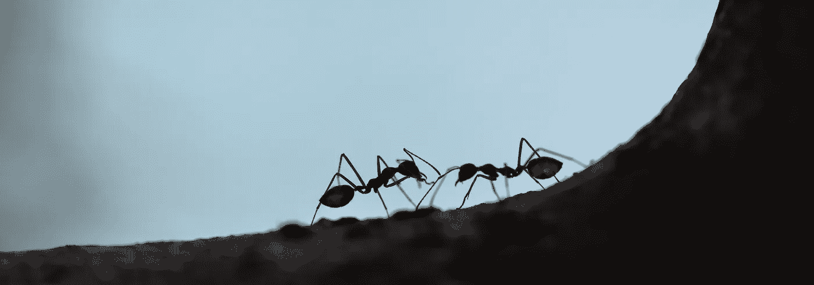
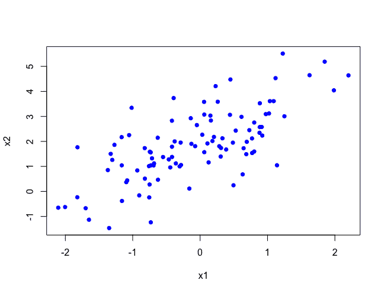
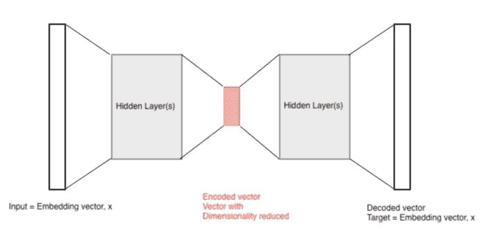

# 图像艺术风格嵌入的降维技术比较

> 原文：<https://towardsdatascience.com/comparison-of-dimensionality-reduction-techniques-for-image-art-style-embeddings-723912fd6250?source=collection_archive---------18----------------------->

## 这项任务是作为一个高清历史图片在线图书馆[的概念验证的一部分。](https://www.lookandlearn.com/)

在[之前的故事](/developing-art-style-embeddings-for-visual-similarity-comparison-of-artworks-7a9d4ade2045)中，我开发了一个模型，将图像的艺术风格编码成高维空间中的向量，其中向量之间的欧几里德距离表示图像在视觉上的相似程度。

对于使用这些嵌入的图像推荐系统，数据集中每个图像的向量需要存储在磁盘上，并且需要在某个点计算两个或多个向量之间的距离。每个向量中存在的维度越多，系统的存储和计算需求就越大，从而增加了成本和搜索时间。

由于这个原因，减少嵌入向量中的维数是有益的，同时最小化在这样做时丢失的信息。为了实现这一点，测试了许多技术，下面更详细地探讨了所使用的方法。然而，对于这些嵌入，更传统的方法优于基于神经网络的方法。由于这个原因，PCA 维数减少被向前使用，PCA 在被应用于剩余部分之前在嵌入的样本上被训练，以便减少训练 PCA 所花费的时间。

## 降维效率

从信息的角度来看，有效的维度缩减依赖于至少一些存在的维度是冗余的，这意味着它们可以被其他存在的维度的函数所替代。

例如，考虑一个 3D 向量 V = [X，Y，Z]。如果 Z 可以表示为 Y，X 的精确函数，那么它可以从向量中移除，而不会从系统中移除任何信息。即使 Z 是 X，Y 的不精确函数，例如 Z = X + Y + e，其中 e 是一个不可观测的变量，我们仍然可以删除 Z，代价是删除 e 提供的信息。随着 e 的方差增加，丢失的信息也会增加。总的来说，通过降维丢失的信息可以通过降低 V 的维数，然后恢复去除的维数，并比较原始向量和变换向量的方差来找到。丢失的方差是通过维度减少丢失的信息的度量。

我正在处理的嵌入向量具有使它们成为降维的良好候选的特征，包括两个部分:

1.  纹理之间的(展平的)协方差矩阵:该矩阵提供了两个纹理的每个组合之间的协方差。考虑三个纹理 I、j、k。如果纹理 I 和 j 相关，并且 j 和 k 相关，则我们期望 I 和 k 相关。这意味着 I 和 k 之间的协方差的维数包含一些冗余信息。便利矩阵包含数千个维度，其中许多是冗余的，可以在不牺牲大量信息的情况下删除。
2.  由每种颜色组成的图像所占比例的向量，每个维度代表一种颜色。一些颜色可能永远不会被使用，因此可以被移除，而其他颜色可能显示出足够高的相关性，因此是多余的。

## 主成分分析

PCA 是一种线性降维技术，利用变量之间的线性关系来表达它们在更少的维度中所包含的信息。如下例所示，两个维度被压缩为一个。

这种技术非常有效，将维度减少了 94%，同时保留了原始数据的 99.3%的方差。

## 神经网络自动编码器

还测试了各种基于神经网络的自动编码器。这些将嵌入向量作为输入和目标，并使用连续的层来将嵌入的大小减少到一个小的“编码”状态，然后以类似沙漏的方式恢复到其原始尺寸，如下所示。

与 PCA 非常相似，这种设置可以最小化输入向量和解码向量之间的误差，同时创建一个维数更少的中间编码向量。与 PCA 不同，该技术通过多层引入非线性，允许在较低维度表示中捕获嵌入向量的元素之间更复杂的关系。理想情况下，这将导致较少量的信息丢失，然而，这种技术导致比 PCA 更多的信息丢失和更长的计算时间。

通过对不同网络体系结构的进一步实验，可能会有更好的信息丢失，但 PCA 提供的准确性和快速计算时间使其成为测试技术中的明显选择。