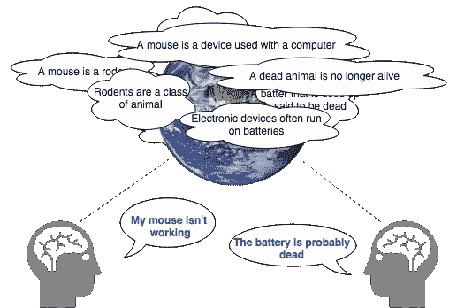

# 弥补 NLP 的理解不足

> 原文：<https://towardsdatascience.com/compensating-for-nlps-lack-of-understanding-3dce648d0634?source=collection_archive---------18----------------------->

## 没有 AGI 的更好的人工智能应用

Photo by [Patrick Tomasso](https://unsplash.com/photos/Oaqk7qqNh_c?utm_source=unsplash&utm_medium=referral&utm_content=creditCopyText) on [Unsplash](https://unsplash.com/collections/224180/lost-in-translation?utm_source=unsplash&utm_medium=referral&utm_content=creditCopyText)

“一幅画胜过千言万语”这句话对语言媒介有点不公平。这表明语言是一种低效的交流方式，而事实恰恰相反。当人类使用语言交流时，因为说话者和听者分享同一个世界的经验，所以有很多东西被遗漏了，这使得在日常生活中没有必要对这个共享的世界进行明确的陈述。例如，如果我对你说“花瓶是侧着的，沿着桌子滚动”，我不需要告诉你花瓶是由易碎的材料制成的(这是一个合理的假设)，或者桌子没有阻止花瓶滚动的边缘，或者因此花瓶可能会从桌子上滚下来，或者重力会使花瓶掉到地板上，地板很硬，因此会导致易碎的花瓶破碎。我说“花瓶侧着，沿着桌子滚动”就足以让你知道，除非有人干预，否则花瓶很可能会摔得粉碎。

Our shared world is left out of our utterances

我们在谈话中忽略的是我们可以合理假设我们的听众也拥有的所有知识。毫不夸张地说，整个世界都被忽略了，这就是自然语言处理(NLP)如此困难的原因，NLP 是一个让机器理解语言的领域。虽然一幅画可能胜过千言万语，但它们大多是没人愿意说出口的话。想象一张照片，一只狗在公园里追一个球。如果你在看这样一张图片，被要求描述你所看到的，你会提到草是绿的吗？这种信息在图像识别任务中是免费的，但在用于 NLP 任务的数据中却完全没有。

在我看来，这些事实使 NLP 成为人工智能中最有趣的领域。目前，机器对世界一无所知，因此也没有真正理解语言的能力。因此，尽管缺乏理解，最近 NLP 的所有令人难以置信的进步，如机器翻译能力的巨大飞跃，都发生了。这提出了两个有趣的问题:

1.  我们会让机器拥有足够的世界知识，像人类一样理解语言吗？
2.  在缺乏理解的情况下，NLP 的局限性是什么？

我们无法知道第一个问题的答案，尽管这是一个值得探索的有趣问题。向计算机灌输世界知识，即常识，是否等于创造所谓的人工一般智能(AGI)？或者有什么方法可以提供这样的知识，不像 AGI 那样，但足以完成自然语言理解的任务(NLU)？或许知识图谱是关键？或者完全是别的什么原因。DARPA 最近推出了[机器常识计划](https://www.darpa.mil/program/machine-common-sense)来解决这个问题。这也是艾伦人工智能研究所的主要关注点。虽然我同意这种研究对于掌握问题的范围以及如何衡量解决问题的进展非常重要，但我必须承认我对实际或有用的结果持怀疑态度。作为一个在工业界工作并希望使用 NLP 解决当前业务问题的人，我不禁发现第二个问题更有说服力。在缺乏真正理解的情况下，我们需要能够认识到 NLP 的局限性，因为这就是今天的实际情况。

纵观当前的 NLP 应用，机器翻译(MT)是被广泛使用的一种。谷歌翻译现在每天翻译超过 1000 亿个单词，所以它显然提供了有用的翻译。但它不会很快完全取代人类翻译(事实上，美国劳工统计局预测，从现在到 2026 年，笔译员和口译员的就业增长将远远高于平均水平)。在正式翻译中，目标语言文本的质量必须与输入的质量一样高，例如法律文件或文学作品，仍然需要人工翻译。MT 系统通常会犯某些类型的错误，如果没有 NLU，就无法可靠地防范这些错误。一个例子是*代词*(“他”、“她”、“它”、“他的”、“她的”、“他们”、“他们的”等)。认知科学家道格拉斯·霍夫斯塔德[去年写道](https://www.theatlantic.com/technology/archive/2018/01/the-shallowness-of-google-translate/551570/)他称谷歌翻译“肤浅”，指出它无法“理解”它所翻译的内容。霍夫施塔特的许多例子都涉及代词的误译。这些情况对机器翻译来说如此困难的原因是，要正确翻译一个代词，你必须知道它指的是什么。我们人类利用我们对世界的了解如此轻易地完成了这项任务，以至于我们几乎没有意识到自己在做这件事。但这恰恰是机器所缺乏的技能。

性别代词使这个问题特别清楚。在一些语言中，根本没有性别代词；在其他语言中，如法语，所有格代词的性别与名词一致，而不是像英语中那样与所有者一致:法语“sa maison”在英语中的正确翻译可能是“他的房子”或“她的房子”，这取决于我们谈论的是谁的房子。虽然一些简单的启发式方法在许多情况下可以有所帮助(例如，假设代词指的是最后提到的名词)，但几十年的人工智能研究已经揭示了基于规则的方法对自然语言的普遍不足。此外，性别代词可能是机器翻译应用中偏见最明显的地方。你可能已经看过土耳其语句子翻译成英语的例子，根据名词的不同，一个无性别的代词变成了有性别的:“他”代表医生，“她”代表护士，等等。即使给出了大量关于正确的性别代词应该是什么的提示，谷歌翻译今天仍然默认有偏见的猜测:

The fact that we’re talking about John’s sister is a big hint that “she” is the correct pronoun here, not “he”, unless we’re so biased that we assume all doctors must be men.

被视为人工智能问题，这个代词问题很难解决。到目前为止，进展主要是以建立方法来测量 it 进展的形式出现的(例如，参见 [GLUE 基准](https://gluebenchmark.com/)和 [Winograd 模式挑战](https://en.wikipedia.org/wiki/Winograd_Schema_Challenge))。但是看做一个软件应用问题，代词问题其实很好解决。在这种情况下，讨论中的软件应用程序是一个翻译应用程序，解决方案只是在 UI 中为用户提供一个翻译选择:“他是医生”或“她是医生”。对于人类用户来说，答案是显而易见的。那么为什么不让用户来决定呢？碰巧的是，这正是谷歌最近在他们的帖子[中宣布的改变，减少谷歌翻译](https://www.blog.google/products/translate/reducing-gender-bias-google-translate/)中的性别偏见。但是从上面的截图来看，很明显这个解决方案只实现了一部分。如果你只是输入一个像土耳其语“o bir doktor”这样的句子，你会得到两个特定性别的选项，但似乎如果你提供任何上下文，系统仍然相信自己，可以说，从上下文中猜出正确的代词。但是，由于上述原因，这恰恰是不能相信它会做对的事情。

这个例子中值得注意的一点是，当没有给定上下文时，多个答案都是正确的，如果系统进行猜测并选择其中一个，它可能只是显示其偏见，但它不会是错误的。但是当提供上下文时，实际上只有一个正确的答案，选择另一个答案不仅会(在某些情况下)显示出偏见，而且显然是错误的。因此，在我看来，对系统来说，猜测何时提供上下文实际上比猜测更重要，因为在这种情况下，可能会出现错误的翻译。然而，谷歌只选择在一个问题得到解决的地方实施修复，即延续性别陈规定型观念的问题。但是它没有解决误译的问题。

当然，对于较长的文本，提供单独的翻译变得不太可行，但在这些情况下，有问题的代词至少可以以某种方式标记出来，以便用户处理。在 API 调用的情况下，调用者可以指定如何处理它们。重要的一点是，这里需要的是直接的工程解决方案，而不是人工智能解决方案(因为目前还没有)。

深度学习(尤其是 NLP 的深度学习)历史上的核心人物 Yoshua Bengio 最近在 NLP 专家的一次调查中被问及该领域的当前方向和最大的未解决问题。作为回应，他谈到了“基础语言学习”和“常识理解”的必要性，并批评了当前试图在没有这些关键要素的情况下取得进展的纯数据驱动的方法。他甚至声称，试图训练真正理解语言的模型将是徒劳的，“如果我们不解决建立世界模型的更困难的问题，即理解我们的世界如何工作的模型，其中有人类和其他代理人。相反，我们需要咬紧牙关，争取用自然语言处理解决人工智能这个更大的奖项。”

虽然学术研究人员可能会开始瞄准这个更大的奖项，但我们这些在行业中寻求用 NLP 解决商业问题的人今天需要用我们已经掌握的技术来凑合，尽管它们可能有限。当涉及到文本分类、情感分析，当然还有机器翻译等任务时，基于神经网络的 NLP 方法已经被证明是一个巨大的进步。这些方法通过消耗大量的文本数据来学习单词和短语的有用的数字表示。参与训练这些系统的架构正变得越来越[复杂](https://ai.googleblog.com/2019/01/transformer-xl-unleashing-potential-of.html)，预训练的表示和模型正被广泛使用。这一切都很棒，但是这些模型和架构的复杂性无法克服它们固有的局限性:缺乏理解仍然存在，并且不可避免地会产生错误。设计使用这些技术的应用程序必须包括为他们将会犯的错误而设计，即使这意味着提供一个用户界面，这个界面是关于应用程序缺乏智能的。我敢打赌，用户会重视这种诚实，更不用说应用程序的实用性提高了。