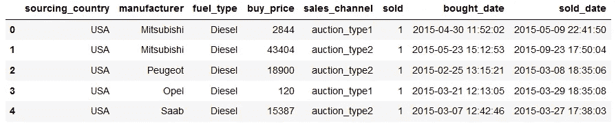
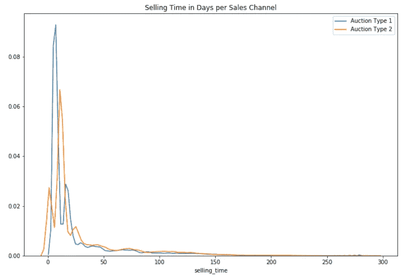
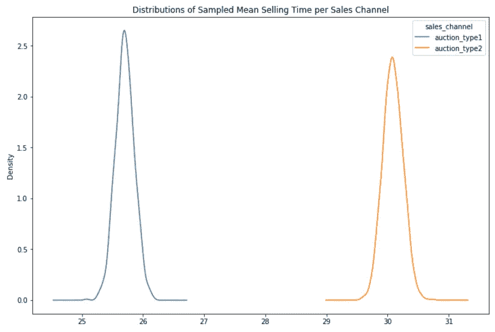
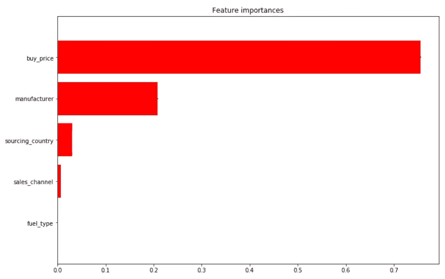
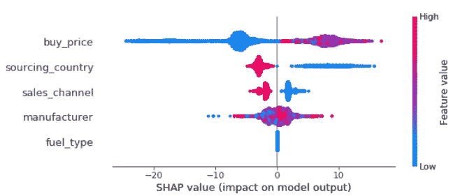
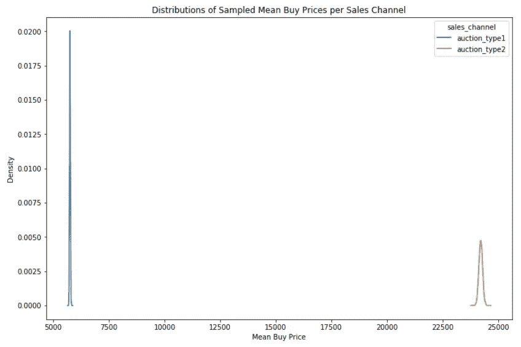

# 用机器学习和特征重要性来补充 A B 测试

> 原文：<https://towardsdatascience.com/complementing-a-b-testing-with-machine-learning-6c5c92baa162?source=collection_archive---------7----------------------->

## 特性重要性如何帮助我从 A B 测试中得出正确的结论


Photo by [Everton Vila](https://unsplash.com/@evertonvila?utm_source=medium&utm_medium=referral) on [Unsplash](https://unsplash.com?utm_source=medium&utm_medium=referral)

在这篇文章中，我想重点关注使用机器学习来补充其他数据科学任务，特别是 A/B 测试。这应该是一个实用的帖子，而不是理论上的讨论，我假设你至少对 **A/B 测试**和**随机森林**和**特征重要性**有些熟悉。

我最近遇到了一个有趣的挑战，要求我运行一个 A/B 测试，以测试一种拍卖类型是否比另一种拍卖类型卖得快。简单地运行 A/B 测试会得出这样的结论:一种拍卖类型确实比另一种类型卖得快，但事实证明，拍卖类型不是更快销售时间背后的主要驱动因素。这是一种拍卖类型的较低的相关价格。如果销售这些汽车的公司决定通过这种拍卖方式来销售，而不是首先关注定价，这可能会产生可怕的后果。

我发现这一点的方法是在数据集上运行随机森林，然后获取要素重要性，这有助于我发现这一点。事实上，我通常认为机器学习是探索性数据分析(EDA)以及 A/B 测试的一个很好的补充工具。

# 数据

我们先来快速看一下数据。对于 A/B 测试，感兴趣的是销售渠道，即两种不同的拍卖类型和销售时间，这是销售日期和购买日期之间的差异。



# 挑战

挑战在于运行 A/B 测试来判断拍卖类型 1 或 2 是否卖得更快——例如，如果我们可以得出一种类型比另一种类型卖得更快的结论，公司可以专注于通过一次拍卖卖出更多。

# A/B 测试

事实证明，两种拍卖类型的销售时间分布都不是“正态”或 t 分布。两者都有一条长长的尾巴。然而，由于有了**中心极限定理**，我们可以通过从这些分布中随机取样并每次取其平均销售时间，将这些分布转换成更正态的分布。例如，如果我们这样做 1000 次，那么我们从图 1(显示每种拍卖类型的销售时间)到图 2(显示每种拍卖类型的平均销售时间)。

```
# Do the samplingresults = [] # create an empty list into which I insert the sampled means
random_state = np.arange(0,1000) # random seeds for reproducibility# sample with replacement using 50% of the data; do this 1000 times
# and append the mean seeling time to the list ‘results’
for i in range(1000):
 sample = df.sample(frac=0.5, replace=True, 
 random_state=random_state[i]).groupby(by=’sales_channel’)[‘selling_time’].mean()
 results.append(sample)
results = pd.DataFrame(results)
```



Graph1 — Distribution of Selling Time in Days



Graph 2 — Average Selling Time in Days

图 1 中不太明显的情况在图 2 中变得非常明显:拍卖类型 1 的平均销售时间比拍卖类型 2 短得多。运行 A/B 测试证实了这一点，p 值为 0.00。在这里运行 A/B 测试似乎是多余的，因为分布甚至没有重叠。

如果我们现在得出结论，该公司应该只通过拍卖类型 1 销售，因为汽车销售更快，那么我们可能会犯一个错误。

如果除了销售时间之外，还有其他特性/特征使这两种拍卖类型截然不同呢？这个数据集只有很少的特征，所以我们可以绘制更多相似的分布，计算可能的相关性等等。一种更简单、更有效的方法是使用机器学习来帮助我们——当我们有更多功能时，这变得特别有用——如果不是必要的话。

# 对救援的重要性

大多数机器学习算法都有一种计算其特征重要性的方法，即每个特征在预测目标/依赖特征时发挥了多大的作用。这里的目标是销售时间。

我在数据集上运行了随机森林，并计算了特征重要性。我还使用了 CatBoost，一种梯度提升树方法，但得出了相同的结论。这就是我坚持使用随机森林的原因，因为这是一种更容易让你理解的算法。

```
# Set up the model and define its parameters — let’s keep it simple
rf = RandomForestRegressor(n_estimators=100, max_depth=5)# Fit the model
rf.fit(X_train, y_train)# Calculate the mean feature importance
importances = rf.feature_importances_# Calculate the standard deviation of the feature importance
std = np.std([tree.feature_importances_ for tree in rf.estimators_],
 axis=0)# Sort the features by their importance
indices = np.argsort(-importances)[::-1]# Plot the feature importances 
plt.figure(figsize=(12,8))
plt.title(“Feature importances”)
plt.barh(range(X.shape[1]), importances[indices], 
 color=”r”, yerr=std[indices], align=”center”)
plt.yticks(range(X.shape[1]),X.columns[indices], rotation=0)
plt.ylim([len(importances)-6, len(importances)])
plt.show()
```



Random Forest Feature Importance



SHAP Values

在左侧，您可以看到每个特性对预测销售时间的重要性，柱越长，特性越重要。购买价格是最重要的特征，而销售渠道(拍卖类型)几乎无关紧要。

然后我计算了另一种叫做 SHAP 的特征重要性。阅读图表的方法如下:每个点是数据集中的一行/一个观察值。负 SHAP 值意味着特征值降低了目标预测值(销售时间)。蓝色表示特征值低，红色表示特征值高。当查看买入价格时，我们看到所有负 SHAP 值都是蓝色的，即低买入价格导致低卖出时间的预测。但是请注意，也有一些蓝点具有正 SHAP 值。在这种情况下，低买价导致相反的预测，即较长的销售时间。当要素相互交互时，可能会发生这种情况。有趣的是，销售渠道(拍卖类型)被很好地划分为红色的拍卖类型 1 和蓝色的拍卖类型 2。

```
# Plot the overall Feature Importance using SHAP
shap.initjs()
explainer = shap.TreeExplainer(cat)
shap_values = explainer.shap_values(pool_val)
shap.summary_plot(shap_values, X_val)
```



Average selling price distributions per auction type

在我们结束之前，让我们简要地看一下拍卖类型的购买价格。我们已经从特性的重要性中怀疑过这一点。两种拍卖类型的价格分布非常不同。拍卖类型 1 (ca。$6k)的价格比拍卖类型 2(大约 24k 美元)。

# 结论

简单地进行 A/B 测试，看一种拍卖类型是否比另一种卖得快，可能会导致错误的结论。运行随机森林或任何其他机器学习算法，然后计算特征重要性，可以让您更好地了解哪些特征会影响您感兴趣的目标。我发现使用机器学习来补充 A/B 测试有助于我做出更好的决策。希望对你也有帮助。