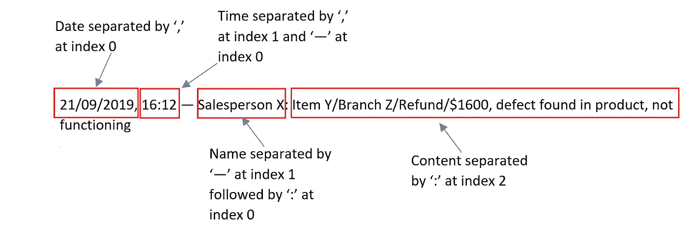
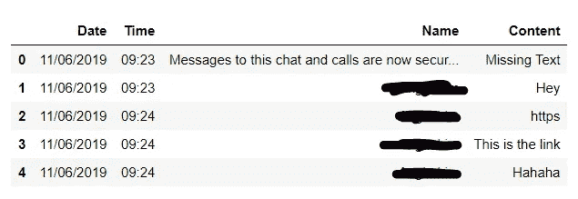

# 使用 Python 处理 Whatsapp 数据的完整初学者指南

> 原文：<https://towardsdatascience.com/complete-beginners-guide-to-processing-whatsapp-data-with-python-781c156b5f0b?source=collection_archive---------4----------------------->

## 利用基本的 Python 方法而不是 Regex 来处理文本数据


Photo by [Rachit Tank](https://unsplash.com/@rachitank?utm_source=medium&utm_medium=referral) on [Unsplash](https://unsplash.com?utm_source=medium&utm_medium=referral)

# 自由文本金矿

从给你爱的人发短信、发送迷因和专业用途，Whatsapp 一直以每月 15 亿活跃用户统治着全球的 messenger 市场。当涉及到复杂的 NLP 建模时，自由文本就是黑金。

面向企业的 NLP 提供了增强的用户体验，包括拼写检查、反馈分析甚至虚拟助手。

[](https://www.wonderflow.co/blog/natural-language-processing-examples) [## 12 个自然语言处理的例子:如何使用自然语言处理

### 有了 NLP，自动完成并不是企业升级网站搜索的唯一方式。Klevu 是一个智能搜索提供商…

www.wonderflow.co](https://www.wonderflow.co/blog/natural-language-processing-examples) 

在某些情况下，小企业可能会创建 Whatsapp 聊天组，在成员之间传递信息，作为建立系统记录数据的低成本替代方案。基于规则的聊天系统在聊天开始时就商定如何传播信息。考虑下面的例子:

```
21/09/2019, 14:04 — Salesperson A: Item B/Branch C/Sold/$1900
21/09/2019, 16:12 — Salesperson X: Item Y/Branch Z/Refund/$1600, defect found in product, not functioning
```

我们可以立即识别出与来自不同销售人员销售订单相关的模式，这些模式由常见的运算符分隔，如“/”和“，”。有了这样一个简单的系统(但容易出现人为拼写错误)，我们可以使用 Whatsapp 分析不同产品和不同地区的销售模式。

# 方法学

网上有很多很好的资源可以把 Whatsapp 的数据转换成熊猫的数据框架。大多数(如果不是全部的话)使用 Python 的 Regex 库作为相当复杂的解决方案，将文本文件分割成数据帧的列。

然而，我在这里的目标是针对初学字符串操作的 Python 用户。对于学习 Python 的初学者来说，我们更熟悉不是来自外部库的基本 Python 方法。在这篇文章中，我们将使用许多基本方法来处理 Whatsapp 数据到 pandas 数据框架中。

以下是我们将要讨论的内容:

1.  2 个库(用于 dataframe 和 datetime 的 pandas，用于检测 datetime 对象)
2.  很多。split()方法
3.  列出理解
4.  错误处理

## 步骤 1:获取数据

如果直接从手机导出信息不太方便，您可以尝试以下方法:

[](http://geeknizer.com/read-extract-whatsapp-messages-android-iphone-blackberry/) [## 在安卓、iPhone、黑莓手机上阅读、提取 WhatsApp 信息备份

### 毫无疑问，WhatsApp 是移动设备上排名第一的信息服务，在 Android、iOS、黑莓等平台上都有应用

geeknizer.com](http://geeknizer.com/read-extract-whatsapp-messages-android-iphone-blackberry/) 

不然最简单的提取 Whatsapp 的方法。txt 文件可以通过以下方法完成:

1.  打开你的 Whatsapp 应用
2.  选择您感兴趣的聊天
3.  点击“…”>选择“更多”>选择“不带媒体的导出聊天”并将其发送到您的个人电子邮件

完成后，您的文本文件应该如下所示:

```
21/09/2019, 23:03 — Friend: my boss dont like filter
21/09/2019, 23:03 — Friend: he likes everything on a page
21/09/2019, 23:03 — Me: so basically you need to turn your data into ugly first then come out pivot table
21/09/2019, 23:03 — Me: haha
21/09/2019, 23:04 — Me: pivot table all in 1 page what
21/09/2019, 23:05 — Me: but ya i hate this kinda excel work sia
21/09/2019, 23:05 — Me: haha
21/09/2019, 23:05 — Friend: as in
21/09/2019, 23:05 — Me: hope to transition to data scientist asap
```

## 步骤 2:将数据导入 Python IDE

我们要做的第一件事是确保我们知道你的文本文件的位置。一旦我们知道了它的目的地，我们就可以将我们的工作目录设置为文件的位置:

```
import os
os.chdir('C:/Users/Some_Directory/...')
```

一旦解决了这个问题，我们就要定义一个函数，用下面的方法将文本文件读入 Python 变量:

上面的函数将我们的文本文件转换成一个字符串列表，允许我们使用。split()方法。但是现在，你需要做一些清洁工作。

## 步骤 3:处理多行消息

有时，由于多行文本，您提取的数据可能不是完美的格式。考虑下面的情况，使用上面已经转换为列表的同一个销售人员示例:

```
21/09/2019, 14:04 — Salesperson A: Item B/Branch C/Sold/$1900**'Some random text formed by new line from Salesperson A'**21/09/2019, 16:12 — Salesperson X: Item Y/Branch Z/Refund/$1600, defect found in product, not functioning
```

我们可以观察到**‘某个随机文本’**并不具有 Whatsapp 文本的每一行都应该具有的相同的通常格式。要处理这样的元素，我们先来看看 Whatsapp 短信的模式。



忽略日期之后的所有内容，显然不需要的元素中没有日期对象。所以我们通过检查它们是否包含第一个'，'之前的日期来开始删除它们。我们通过利用**基本错误处理技术**来做到这一点。

正如你所看到的，我们已经删除了大约 100 个元素，这些元素可能会对以后的特征提取造成阻碍。除非我们和朋友分享带标题的链接，否则不使用多行文本是我们大多数休闲短信文化的一部分。

## 步骤 4:特征提取

现在，您将使用基本的 Python 技能从列表中提取要素，稍后您将把这些要素解析到数据帧中。首先，我们需要重新审视 Whatsapp 数据中的字符串模式。

我们想要提取的第一个特征是日期。请记住，日期字符串正好出现在第一个'，'之前的**。所以我们使用。索引 0 处的 split(“，”)方法。我们可以用 Python 的 list comprehension 漂亮地写出这个。**

请注意，我来自 R 背景，我非常习惯在 for 循环中使用“I”。不使用 range()函数编写上述代码的另一种方法如下:

```
date = [text.split(‘,’)[0] for text in chat]
```

相比之下，这是使用 Regex 方法检查字符串模式是否为 date 所需要的。

Credits: [Samir Sheriff](/build-your-own-whatsapp-chat-analyzer-9590acca9014)


All that just to identify the date feature?! (Photo by [Ben White](https://unsplash.com/@benwhitephotography?utm_source=medium&utm_medium=referral) on [Unsplash](https://unsplash.com?utm_source=medium&utm_medium=referral))

这样一来，我们可以在提取发送者的时间和姓名时使用相同的逻辑。请注意以下模式:

1.  时间字符串出现在第一个'，'之后，第一个'-'之前
2.  名称字符串出现在索引 0 处的第一个'-' **之后，紧接着是第二个':'之后的**

最后，我们要提取消息的内容。这有点棘手，因为某些行不包含任何消息。相反，它们是系统生成的消息，如下所示:

```
21/09/2019, 11:03 — **Salesperson A created the group "Dummy Chat"** 21/09/2019, 11:03 — **Salesperson A added Salesperson B** 21/09/2019, 14:04 — Salesperson A: Item B/Branch C/Sold/$1900
21/09/2019, 16:12 — Salesperson X: Item Y/Branch Z/Refund/$1600, defect found in product, not functioning
```

请注意，在时间字符串中出现的第一个“:”后面没有附加的“:”。要正确看待这个问题，请考虑以下几点。拆分(':')方法:

```
chat.split(":")#['21/09/2019, 14','04 — Salesperson A',' **Item B/Branch C/Sold/$1900**']
```

索引 2 处的元素是我们感兴趣的。但是，由于系统生成的消息不包含第二个“:”，在索引 2 处提取信息将会产生错误。因此，我们将继续我们的第二个错误处理技术。

您可以选择稍后删除带有“缺失文本”的元素。

## 最后一步:将所有内容连接成一个数据帧

现在我们有了 4 个特性列表，我们终于可以用一行代码创建一个熊猫数据框架了！



瞧啊。您的数据框已准备好进行后期分析！请注意出现在“名称”列中的系统生成的消息。您可以使用以下代码有条件地删除系统生成的消息中的行:

```
df = df[df[‘Content’] != ‘Missing Text’]
```

# 最后的想法

有许多方法可以利用处理过的 Whatsapp 文本数据来进行分析。从 [**把自己重新塑造成一个机器人**](/recreating-myself-from-whatsapp-chats-6dadfaff0d2b) ，用 [**NLP 进行情感分析**](/how-to-use-nlp-to-analyze-whatsapp-messages-1adf0e85907c) 到只是简单的 [**分析**](/build-your-own-whatsapp-chat-analyzer-9590acca9014) 。利用 Whatsapp 数据对于任何复杂的 NLP 项目来说都是很好的实践。

基本的字符串操作足以将文本文件转换成如上所示的熊猫数据帧。如果你是 Python 的新手(像我一样)，最好习惯于基础知识，而不是尝试新技术，这些新技术在开始时可能会有点让人不知所措。然而，Python 的 regex 库仍然是文本挖掘和数据验证的中级到高级应用的重要工具。

这里有一篇很棒的文章，解释了 Python 中 Regex 库的概念及其在数据分析和数据科学中的潜在用途:

[](/the-ultimate-guide-to-using-the-python-regex-module-69aad9e9ba56) [## 使用 Python 正则表达式模块的最终指南

### 原始模式查找器

towardsdatascience.com](/the-ultimate-guide-to-using-the-python-regex-module-69aad9e9ba56) 

编码快乐！