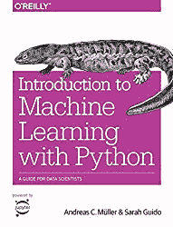

# 成为数据科学家的完整指南

> 原文：<https://towardsdatascience.com/complete-guide-to-become-a-data-scientist-1e08bc54688d?source=collection_archive---------12----------------------->

## 数据科学课程、数据科学书籍、数据科学资料

过去几年，我每天都在使用数据科学和机器学习工具。我经常收到的问题是[一个人应该读什么](/data-science-books-you-should-read-in-2020-358f70e1d9b2)以及最开始完成哪些课程。所以我决定列出我所知道的一切，这在一开始就很有价值。我计划定期更新这篇文章，以跟上新材料——在下面评论，让我知道我错过了什么。谢谢大家！

Become a Data Scientist by yourself — a complete guide

我们可以将学习数据科学的来源分为 3 组:

*   数据科学课程
*   数据科学在线材料
*   [数据科学书籍](/data-science-books-you-should-read-in-2020-358f70e1d9b2)

我将在新的一章中逐一介绍。

首先，我应该提到，我假设你已经了解 Python 的基础知识——能够导入不同的数据格式并在 Jupyter 笔记本中清理它们。其次，你应该知道统计学和线性代数的基础知识。

如果你不知道这些，我推荐你从

*   [CodeCademy](https://www.codecademy.com/learn/learn-python) 免费学习 Python。
*   对于在线和免费的统计资料来源，请查看 [Think Stats](https://greenteapress.com/wp/think-stats-2e/) 以获得更长时间的治疗。参见[这篇文章](https://blog.floydhub.com/statistics-for-data-science/)中关于统计学的简短介绍。如果你需要线性代数——查看[这篇文章](/linear-algebra-for-deep-learning-f21d7e7d7f23)获得矩阵世界的快速指南。

然而，如果你刚刚开始，你可能会想在这些基础知识上花更多的时间，最好的办法是在你当地的大学上课(作为一个免费的读者/听众),或者跟随一所知名大学的课程。例如，点击这里查看麻省理工学院关于线性代数的讲座。

# **数据科学课程**

如果你想完成机器学习和数据科学的课程，你可能听说过的第一个课程是吴恩达的课程:

*   吴恩达在 Coursera 上发表的《机器学习》——它涵盖了机器学习的基本概念，更理论化(涉及的编码更少)，是一个很好的知识来源。然而，如果你真的刚刚开始，你应该检查其他来源。

因此，以下是您在开始数据科学探索时应该学习的更多基础课程的列表:

*   [哈佛数据科学课程](http://cs109.github.io/2015/pages/videos.html)——带你了解基础知识:熊猫、刮削、回归到机器学习。
*   [密歇根大学用 Python](https://www.coursera.org/learn/python-data-analysis?specialization=data-science-python) 介绍数据科学。评价很高，基本介绍。它在 Coursera 上，所以如果你不需要证书，它是免费的。
*   深度学习(Deep Learning)——尽管这远非入门课程，但这是另一门来自吴恩达的课程，你至少应该听说过。
*   [IBM 数据科学](https://www.coursera.org/professional-certificates/ibm-data-science)——Coursera 上目前最受欢迎的数据科学课程之一。它由 IBM 提供，提供了从零开始进入数据科学的完整入口。如果你想获得一个完成课程的证书，那就更好了。
*   [Dataquest](http://www.dataquest.com) —成为数据科学家的另一个完整来源——尤其是如果你[通过这条途径](https://www.dataquest.io/path/data-scientist/)。我自己从未服用过，但听到了一些非常好的意见。
*   [Datacamp](https://www.datacamp.com/?tap_a=5644-dce66f&tap_s=933150-d0e3e1&utm_medium=affiliate&utm_source=przemekchojecki) —是一个通过编码学习数据科学的独特平台。互动练习将指导您浏览材料。
*   [数据科学工作](https://datasciencerush.thinkific.com/courses/data-science-job) —我的课程侧重于启动你的数据科学职业生涯，并找到你的第一份数据科学工作。它有越来越多的学生和实时材料——我定期给课程添加新的视频。

# 数据科学书籍

我总是试着大量阅读，下面我列出了一些我最喜欢的书。更完整的列表见本文。

[从头开始的数据科学:Python 的基本原理](https://www.amazon.com/gp/product/149190142X/ref=as_li_tl?ie=UTF8&camp=1789&creative=9325&creativeASIN=149190142X&linkCode=as2&tag=petacrunch0a-20&linkId=123b16ec4de6bd7fb4d172e8f6453b53) —这可能是我读过的第一本关于数据科学的书。它实际上是从基础开始的，不需要任何 Python 知识。非常适合绝对初学者！

[Python 数据科学手册:处理数据的基本工具](https://www.amazon.com/gp/product/1491912057/ref=as_li_tl?ie=UTF8&camp=1789&creative=9325&creativeASIN=1491912057&linkCode=as2&tag=petacrunch0a-20&linkId=6c30691948e13178350b50c2ebced05f)——这是一本更高级的书，将引导你了解不同的数据科学技术。

[Python 机器学习简介:数据科学家指南](https://www.amazon.com/gp/product/1449369413/ref=as_li_tl?ie=UTF8&camp=1789&creative=9325&creativeASIN=1449369413&linkCode=as2&tag=petacrunch0a-20&linkId=612200f328c75e0afc74b6b89d5de593) —另一本介绍性书籍，这次更侧重于机器学习。

Data Science Job

最后，如果你想了解成为一名数据科学家意味着什么，那么看看我的书[数据科学工作:如何成为一名数据科学家](https://amzn.to/3aQVTjs)，它将指导你完成这个过程。

# 数据科学材料

因此，如果你读过我的其他文章，你可能知道我是 GitHub 的超级粉丝。像几乎所有人一样。学习数据科学的一个非常好的来源是浏览 GitHub 的无数开源存储库。

这里列出了一些最受欢迎的。

*   [趋势库](https://github.com/topics/data-science)。这是发现新事物的一般方法。
*   [约翰·霍普斯金大学数据科学专业](https://github.com/mGalarnyk/datasciencecoursera)。
*   斯坦福[张量流教程](https://github.com/chiphuyen/stanford-tensorflow-tutorials)
*   [数据科学备忘单](https://github.com/abhat222/Data-Science--Cheat-Sheet)
*   [数据科学自学](https://github.com/ossu/data-science)知识库

暂时就这样吧！

如果你想让我介绍数据科学和机器学习的其他伟大资源，请告诉我。

如果您想了解更多关于成为数据科学家的信息，请参阅以下文本:

*   [成为数据科学家的 5 种方法](/5-ways-to-become-a-data-scientist-8590811b0dc3?source=your_stories_page---------------------------)
*   [给数据科学家的最佳建议](https://medium.com/@pchojecki/best-tips-for-data-scientists-a52d7cace027?source=your_stories_page---------------------------)
*   [如何从数据科学开始](https://medium.com/@pchojecki/how-to-start-with-data-science-93d3ca32d7e5?source=your_stories_page---------------------------)
*   [数据科学家常犯的 3 个错误](https://medium.com/@pchojecki/3-common-mistakes-data-scientists-make-d3b3f5d1d4?source=your_stories_page---------------------------)

 [## 加入我的数据科学时事通讯

### 让我们保持联系，继续学习数据科学。](https://creative-producer-9423.ck.page/c3b56f080d)