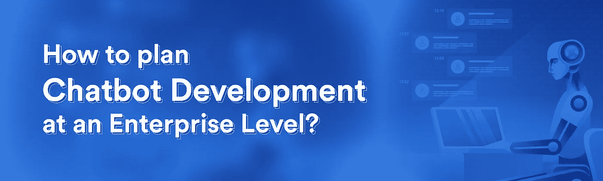
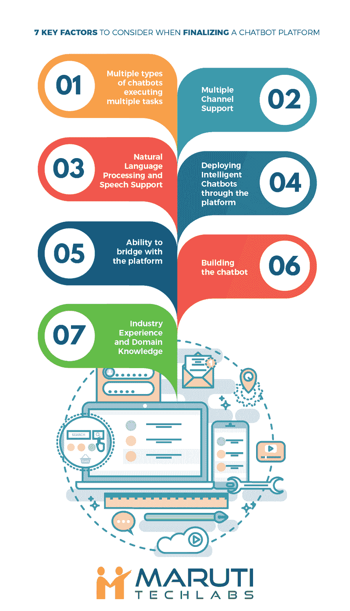
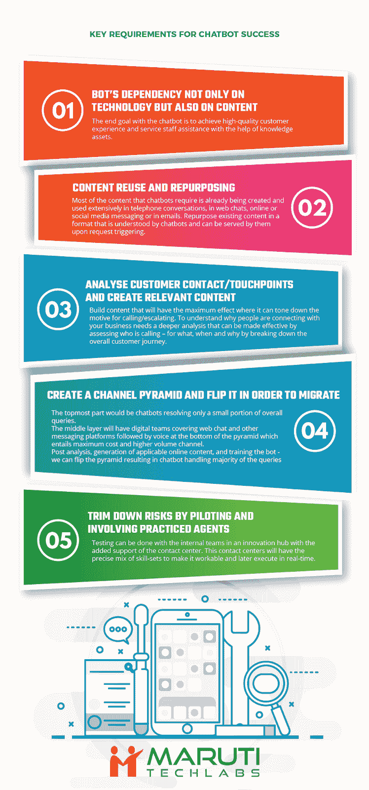
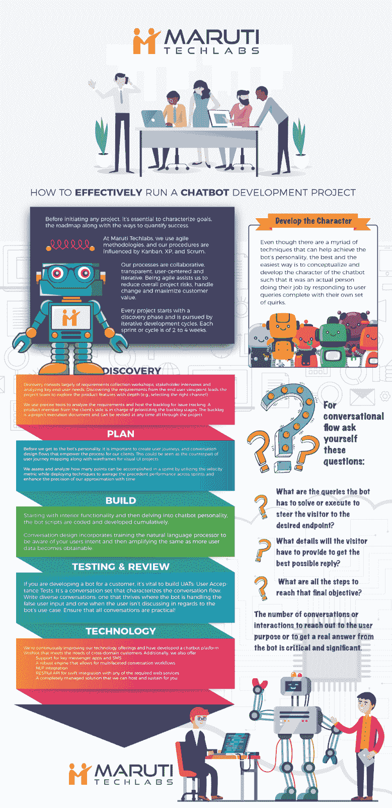

# 企业聊天机器人开发完全指南

> 原文：<https://towardsdatascience.com/complete-guide-to-enterprise-chatbot-development-c377aa5e4ddc?source=collection_archive---------18----------------------->

客户服务是新的营销方式。当今的顾客对信息了如指掌。企业总是在寻找机会，以确保他们建立了一个防水的客户支持流程，并有适当的系统。如今，主要品牌和企业都在寻求 bot 开发计划，以便以更高的效率和成本效益接触客户。

谈到扩大客户支持，荷兰皇家航空公司每周处理超过 16，000 次互动，在 6 个月内，[蓝色机器人向 500，000 多名客户发送了近 200 万条信息](http://www.convinceandconvert.com/digital-marketing/6-critical-chatbot-statistics-for-2018/)。

报告显示，接近[的 37%的美国人更喜欢在紧急情况下使用聊天机器人获得快速回答](http://www.convinceandconvert.com/digital-marketing/6-critical-chatbot-statistics-for-2018/)。除此之外，高达 64%的美国人认为机器人 24 小时可用是最好的功能。

关于商业盈利能力的其他统计数据显示，47%的消费者将通过聊天机器人进行购买，千禧一代(26 至 36 岁)准备在通过机器人进行的商业交易中花费 481.15 英镑。

到目前为止，采用聊天机器人的企业都是通过在孤岛中创建和使用聊天机器人来实现的。虽然这种方法可能适用于需要自动化少量任务的企业，但它并不完全符合企业的高端需求——跨功能大杂烩的可伸缩性、敏捷性和成本效益。

**现代企业应该如何发展聊天机器人？**

对于企业来说，聊天机器人应该随时可用，可以通过各种渠道访问，并与内部业务系统集成，客户关系管理(CRM)和供应链管理(SCM)系统是重中之重。

当提出 bot 发展战略时，企业有几种选择。对于需要自动化工作流以及内部和外部生态系统的集成和自然语言处理应用程序的企业来说，单一任务机器人不是一个可行的选择。

聊天机器人框架帮助程序员构建个人聊天机器人的结构。然而，这些框架仅仅是一组工具和服务的集合。这些框架适用于一组固定的用例，并可用于组装和部署单任务机器人，最终，该机器人缺乏端到端的开发和持续管理能力。

如果用例很小，框架往往是有用的，但是，对于整体需求和范围要求更高的企业来说，这就是聊天机器人平台的用武之地。

当谈到[聊天机器人架构](https://www.marutitech.com/chatbots-work-guide-chatbot-architecture/)时，企业在谈到他们的聊天机器人开发平台时应该确定以下要求

**执行多项任务的多种聊天机器人**

该功能对于企业来说是必不可少的，因为它允许企业同时跟踪和简化多个功能。理想情况下，企业应该能够部署执行单一任务的聊天机器人，同时创建和部署多用途聊天机器人，与多个系统通信，并在每个系统中完成各种任务。

聊天机器人开发平台应提供预构建和随时部署的机器人，以解决某些用例(例如，线索生成、客户支持等)。)以及定制它们以满足您的业务需求的能力，以便处理与不同客户交互和您的业务产品相关的多个不同工作流和流程(例如，还回答客户的查询并在 FAQ、文档或网站中回答的线索生成机器人)。

**多通道支持**

企业应该寻找聊天机器人开发平台，可以将机器人部署到网站、移动应用程序或其选择的渠道，并为每个渠道定制用户界面，无论是短信、电子邮件还是社交媒体。此外，机器人应该有能力与 Slack、Telegram、Skype 等公司工具进行交互。

**自然语言处理和语音支持**

当谈到聊天机器人的可伸缩性时，训练聊天机器人是另一个重要的考虑因素。您的聊天机器人开发平台是否包含[自然语言处理(NLP)](https://www.marutitech.com/how-is-natural-language-processing-applied-in-business/) 培训？机器人可以使用文本和/或语音保持准确的交互和对话吗？提供 NLP 和语音支持的聊天机器人平台在理解用户意图并在评估后回复相关内容时往往会提供最佳结果。

**通过平台部署智能聊天机器人**

该平台应该拥有[智能聊天机器人](https://www.marutitech.com/make-intelligent-chatbot/)，能够理解、回忆并不断学习从每次客户互动中收集的数据和信息。这还包括需要在交互过程中维护客户请求的上下文，并使用机器学习来进一步开发和完善其自然语言处理能力。

**与平台桥接的能力**

该平台是否有能力在用户、机器人和跨功能系统之间共享消息？这将包括共享存储在用户、机器人和系统之间的消息，以及成功和失败消息的分类。这为 chatbot 开发平台以及随后的 bot 的功能提供了全面而清晰的描述。

**打造聊天机器人**

该平台应该有一个直观的、基于网络的工具，用于根据聊天机器人的用例、任务和部署渠道来设计、构建和定制聊天机器人。它还应该可以选择重新开始从零开始开发机器人的过程，或者在整个开发周期中测试聊天机器人构建的同时重用已开发的组件。

**行业经验和领域知识**

确定并接洽拥有丰富行业经验和领域知识的合适技术和平台提供商。

企业需要考虑并真正确定什么样的聊天机器人开发平台或相关框架将增强和促进速度、可伸缩性和灵活性，以支持他们的客户和员工。

**聊天机器人开发成功的关键要求**

**聊天机器人不仅依赖技术，还依赖内容**

聊天机器人的最终目标是实现高质量的客户体验和服务人员协助。聊天机器人最引人注目的元素显然是技术。然而，内容对它的成功也起着重要的作用。创建知识资产是一项值得关注的投资，但在人工智能(AI)等高端技术组件的阴影下，内容创建和管理的重要作用往往被掩盖了。

**内容再利用和再利用**

聊天机器人需要的大多数内容已经被客户服务团队创建并广泛使用，无论是在电话交谈、网络聊天、在线或社交媒体消息还是电子邮件中。改变现有内容的用途是聊天机器人可以理解的格式，并且可以在请求触发时由聊天机器人提供服务。

目标应该是一次生成内容，然后重用。要做到这一点，需要管理内容的人(可以是你的服务团队)和数字营销部门之间的紧密联系。

**分析客户联系/接触点，创建相关内容**

起点是构建能产生最大效果的内容——内容能降低打电话的动机，通话量也更高。要了解人们为什么会与您的企业建立联系，需要进行更深入的分析，这种分析可以通过评估谁在打电话(打电话的目的、时间和原因)、细分整个客户旅程、跨渠道的联系测试以及客户调查、在线和离线对话以及电子邮件内容等研究活动来实现。

**创建一个渠道金字塔并翻转它以便迁移**

创建渠道金字塔时，最顶端的部分是聊天机器人。一开始，这些只会解决整体查询的一小部分，作为一个初步步骤或在线 IVR，并引导客户到更适合管理互动的数字团队。

数字团队将覆盖网络聊天和消息平台作为中心层，帮助迁移到数字对话，与金字塔绝对底部的语音相比，数字对话的成本更低，后者需要最大的成本和更高的容量渠道。

使用所有执行的分析和适用在线内容的生成，我们可以使用聊天机器人处理越来越复杂的查询来翻转金字塔，最终目标是他们将很快管理大多数案例。

**通过引导和让有经验的代理参与来降低风险**

聊天机器人不是容易开发的技术工具，因此剥夺体验的风险是一个人必须考虑的因素。一些形式的人工智能可以通过内部团队进行测试，而不是直接接触客户或潜在客户。谨慎的做法是将这些试验放在一个有联络中心支持的创新中心。这个联络中心将有精确的技能组合，使其可行，并在以后实时尝试。

**如何用聊天机器人开发公司制作聊天机器人？**

在开始任何项目之前，描述目标、路线图以及量化成功的方法是至关重要的。

在马鲁蒂科技实验室，作为一家[聊天机器人开发公司](https://www.marutitech.com/bot-development/)，我们使用敏捷方法，我们的程序受到看板、XP 和 Scrum 的影响。我们为不同的项目和客户定制我们的流程。

我们的流程是协作的、透明的、以用户为中心的和迭代的。敏捷有助于我们降低整体项目风险，处理变更并最大化客户价值。

**聊天机器人的开发过程是如何进行的？**

每个项目都从发现阶段开始，并通过迭代开发周期进行。

每次冲刺或周期为 2 到 4 周。

*   **发现**

发现阶段在聊天机器人开发项目开始时进行。它主要由需求收集研讨会、利益相关者访谈和关键最终用户需求分析组成。backlog 是这个阶段的主要输出，公认的需求被写成“用户故事”。识别他们正在寻找的用例及类型(基于顺序 bot 或 NLP)有助于列出聊天机器人要执行的各种意图和动作。从最终用户的角度发现需求会引导项目团队深入探索产品特性。

例如，选择精确的消息平台(Facebook Messenger、Slack 或您的网站)是发现阶段的关键点。最终，偏好应该根据你的目标受众而定，你需要在他们所在的地方满足他们。

我们使用精确的工具来分析需求，并为问题跟踪管理待办事项。来自客户方的产品成员负责对待办事项阶段进行优先级排序。backlog 是一个项目执行文档，可以在整个项目中随时修改。

*   **计划**

在我们了解机器人的个性之前，重要的是创建用户旅程，以及为我们的客户授权的对话设计流程。这可以看作是可视化 UI 项目中用户旅程映射和线框的对应部分。

对于对话流，问自己以下问题:

*   机器人必须解决或执行哪些查询才能将访问者引导到所需的端点？
*   *访问者需要提供哪些细节才能得到最好的回复？*
*   *达到最终目标的所有步骤是什么？*

为了达到和满足用户的目的所需的对话或交互的数量是至关重要的。尽管有无数种技术可以帮助实现机器人的个性，但最好也是最简单的方法是概念化和开发人工智能聊天机器人的角色，这样它就是一个真实的人，通过响应用户的查询来完成自己的工作，并有自己的一套怪癖。

回到 sprint，在每次 sprint 开始时，我们都会进行一次“Sprint Planning”会议。整个团队都参加了 Sprint 计划会议，在这个会议上，我们讨论了待办事项中最重要的优先事项，详细陈述了它们，计划了任务并对它们进行了评估。每个用户故事都有一个被认为是完整的批准标准。

我们通过利用速度指标来评估和分析在一次冲刺中可以完成多少个点，同时部署技术来平均所有冲刺的先例性能，并提高我们对时间的近似精度。

*   **打造**

我们打算构建并交付一个可供实际用户使用的工作产品。这个想法是，然后迭代这个产品，积累更多的功能，直到我们开始满足我们在初始阶段设定的目标。

从内部功能开始，然后深入到聊天机器人的个性，机器人脚本是累积编码和开发的。

对话设计包括训练自然语言处理器了解你的用户意图，然后随着更多的用户数据变得可获得而放大这些意图。

*   **测试和审查**

如果你正在为客户开发一个机器人，建立 UATs 是至关重要的:用户验收测试。这是一个描述对话流特征的对话集。编写多样化的对话:一种是在机器人处理错误的用户输入时，另一种是在用户不讨论机器人的用例时。保证所有的对话都是实用的！

在每次冲刺的最后，我们都会进行一次演示。我们遍历所有创建的用户故事，并尝试显示其实现过程。来自客户团队的产品负责人根据确定的标准审查并决定是否允许实现。

如果用户故事被 100%接受，那么它的状态就是完成。

*   **技术**

我们正在不断改进我们的技术产品，并开发了一个满足跨领域客户需求的聊天机器人平台。此外，我们还提供:

*   *支持关键信使应用程序和短信。*
*   *一个强大的引擎，支持多方面的对话工作流。*
*   *NLP 集成。*
*   *RESTful API，可与任何所需的 web 服务快速集成。*
*   *我们可以为您托管和维护的完全托管的解决方案。*

**结论**

[聊天机器人](https://wotnot.io/)与其他应用程序并不完全不同；您有多个支持应用程序的集成，涉及所有不同的动态。鉴于聊天机器人需要与最终用户快速互动，因此需要明确不同集成所提供的信息是对对话至关重要，还是可以推迟到以后。通过 API 集成的一致性不仅有助于敏捷性，还有助于创建完美的对话。

如今的客户比以往任何时候都更加坚持，期望值更高，容忍度更低。不要让您的客户或最终用户通过冗长的表格或流程来获得他们想要的东西，而是以一个问题开始他们的旅程——“今天我能为您做些什么？”。

[合适的聊天机器人平台或聊天机器人解决方案](https://www.wotnot.io)可以帮助您满足这些期望，但是，每个企业都没有时间或资源来提出适合其核心业务的解决方案——在短短几周时间内完成培训和部署。

在马鲁蒂科技实验室，我们帮助商业和企业在众多行业部署可扩展的聊天机器人解决方案，包括金融科技、保险、房地产、消费品、电子商务和酒店等。[立即联系](https://www.marutitech.com/contact-us/)我们，部署符合您业务特定需求的机器人，同时匹配您品牌的声音和风格。