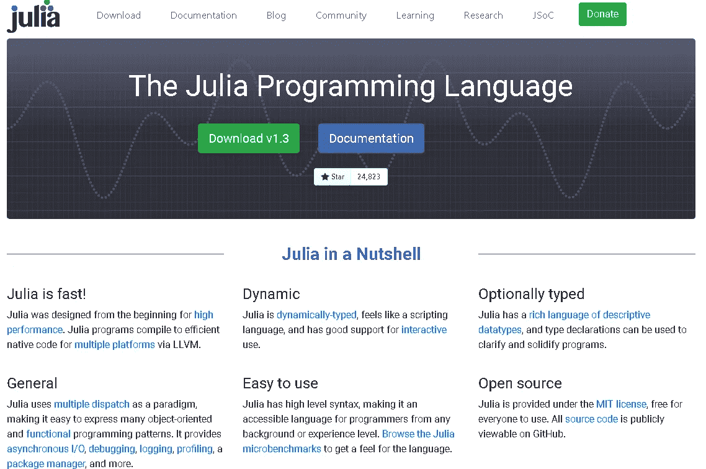
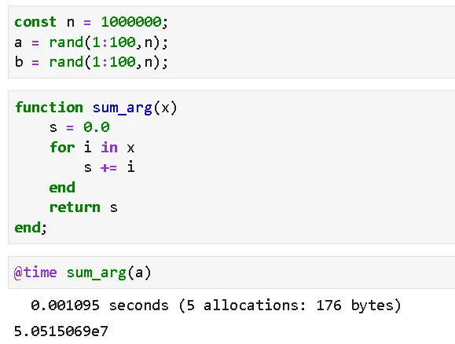
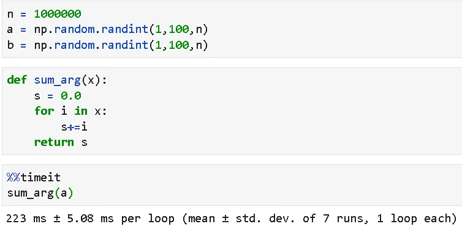
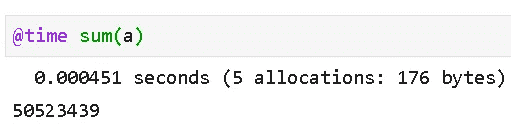
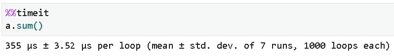
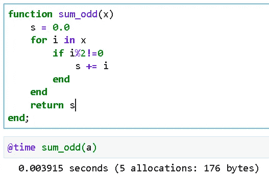
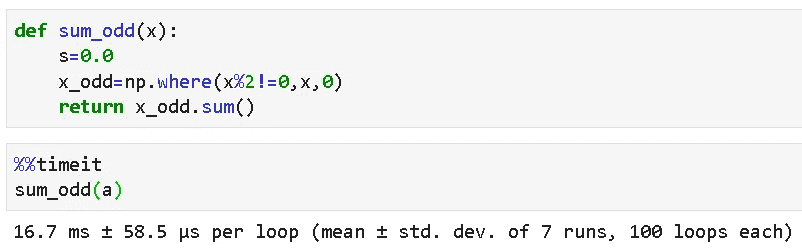
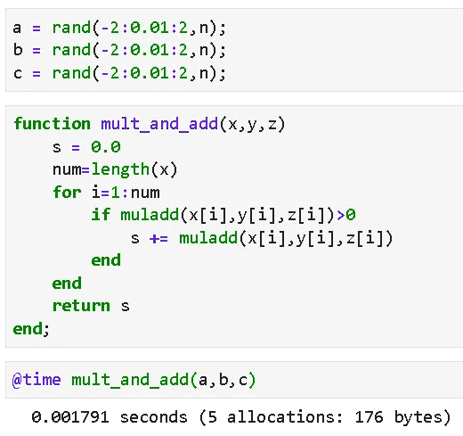
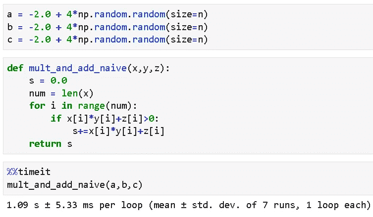
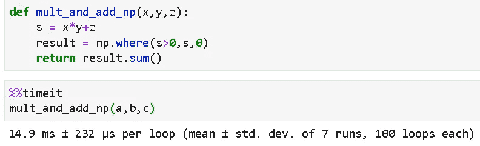

# 以极快的速度运行复杂逻辑:试试 Julia 的数据科学

> 原文：<https://towardsdatascience.com/complex-logic-at-breakneck-speed-try-julia-for-data-science-bcd4dfa23541?source=collection_archive---------8----------------------->

## 我们展示了 Julia 与同等 Python 代码的性能对比基准，以说明为什么 Julia 非常适合数据科学和机器学习。

注意:我正在用 Julia fundamentals 和数据科学示例构建 Github repo。 [**查看这里**](https://github.com/tirthajyoti/Julia-data-science) 。

# 介绍

*“像 Python 一样走路，像 C 一样运行”* —这是对 Julia 的评价，Julia 是一种现代编程语言，**专注于科学计算**，，拥有越来越多的追随者和开发者。

Julia 是一种通用编程语言，是专门为科学计算而设计的。它是一种 [**灵活的**](https://docs.julialang.org/en/v1/manual/types/) [**动态类型化的**](https://android.jlelse.eu/magic-lies-here-statically-typed-vs-dynamically-typed-languages-d151c7f95e2b) 语言，其**性能堪比传统的静态类型化语言**。

Julia 试图为原型开发提供一个足够高效的单一环境，并为工业级应用程序提供一个高效的环境。它是一种多范例语言，包含了功能性和面向对象的编程组件，尽管大多数用户喜欢它的功能性编程方面。

这种编程语言的诞生可以追溯到 2009 年。首席开发人员 Alan Edelman、Jeff Bezanson、Stefan Karpinski 和 Viral Shah 开始致力于创建一种可用于更好更快数值计算的语言。开发者能够在 2012 年 2 月发布商业版本。

# 为什么对数据科学来说很牛逼？

Julia 是数据科学和机器学习工作的绝佳选择，出于同样的原因，它也是快速数值计算的绝佳选择。优点包括，

*   **平滑的学习曲线**，广泛的底层功能。特别是，如果你已经熟悉了更流行的数据科学语言，比如 Python 和 R，那么接 Julia 就像在公园散步一样简单。
*   **性能**:本来 Julia 是编译型语言，Python 和 R 是解释型。这意味着 Julia 代码作为直接可执行代码在处理器上执行。
*   **GPU 支持**:直接关系到性能。GPU 支持由`TensorFlow.jl`和`MXNet.jl`等一些包透明控制。
*   **分布式和并行计算支持** : Julia 使用许多拓扑透明地支持并行和分布式计算。此外，它还支持协同程序，如 Go 编程语言中的协同程序，这是在多核架构上并行工作的辅助函数。对线程和同步的广泛支持主要是为了最大限度地提高性能和降低竞争条件的风险。
*   **丰富的数据科学和可视化库** : Julia 社区认为它是数据科学家和统计学家的必备语言。因此，专注于数据科学和分析的高性能库一直在发展中。
*   **团队合作(与其他语言/框架)** : Julia 在数据科学和机器学习方面与其他已建立的语言和框架合作得非常非常好。使用`PyCall`或`RCall`可以在 Julia 脚本中使用原生 Python 或 R 代码。`Plots`包可以和各种后端一起工作，包括`Matplotlib`和`Plotly`。像`Scikit-learn`或`TensorFlow`这样的流行机器学习库已经有了 Julia 等价物或包装器。

> Julia 是数据科学和机器学习工作的绝佳选择，出于同样的原因，它也是快速数值计算的绝佳选择。

# Python 脚本的一些基准测试

关于这个问题有很多争议:“**Julia 比 Python 快吗？**

就像生活中几乎任何事情一样，答案是: ***看情况。***

官方的 Julia 语言门户有一些关于它的数据，尽管基准测试是针对除 Python 之外的各种语言进行的。

 [## 朱莉娅语言

### 这些微基准测试虽然不全面，但确实测试了一系列常见代码模式的编译器性能，例如…

julialang.org](https://julialang.org/benchmarks/) 

事实上，这个问题几乎总是假设人们在谈论 Julia 和某种优化/矢量化 Python 代码(如 Numpy 函数所使用的)之间的比较。否则，由于编译代码的执行，原生 Julia 几乎总是比 Python 快，而[原生 Python 比 Numpy 类型的执行慢得多](/why-you-should-forget-for-loop-for-data-science-code-and-embrace-vectorization-696632622d5f)。

Numpy 真的很快。它是一个具有超级优化函数的库(其中许多是预编译的)，致力于为 Python 用户(对数据科学家和 ML 工程师特别有用)提供接近 C 语言的速度。简单的 Numpy 函数，如 sum 或标准差[可以接近或超过等效的 Julia 实现(特别是对于大输入数组大小的](https://github.com/kbarbary/website/blob/master/posts/julia-vs-numpy-arrays.rst))。

然而，为了充分利用 Numpy 函数，您必须考虑代码的矢量化。并且在程序中始终以向量化代码的形式编写复杂的逻辑一点也不容易。

因此，与 Julia 的速度比较应该在对数组应用某种复杂逻辑进行某种处理的情况下进行。

在本文中，我们将展示几个这样的例子来说明这一点。

> 然而，为了充分利用 Numpy 函数，您必须考虑代码的矢量化

## Julia for-loop 漂亮地打败了 Python for-loop

让我们计算一百万个随机整数的总和来验证这一点。

下面是朱莉娅的代码。该功能需要 1 毫秒多一点的时间。

Python 代码在下面。我们保留了代码的相同函数性质(Julia 是一种函数式语言),以保持比较的公平和易于验证。for 循环花费**超过 200 毫秒**！

## 但是 Julia 数组和 Numpy 数组相比如何呢？

在上面的代码中，我们创建了一个数组变量。这是 Julia 中对数据科学最有用的数据结构，因为它可以直接用于统计计算或线性代数运算，开箱即用。

不需要单独的图书馆什么的。Julia 数组比 Python 列表快一个数量级。

但是，Numpy 数组速度很快，让我们对相同的求和操作进行基准测试。

下面的 Julia 代码使用了数组上的`sum()`函数。它需要 451 微秒(比 for-loop 方法快，但时间只有一半)。

这是 Numpy 执行，

哇！353 usec 超过了 Julia 的速度，比原始 Python for-loop 代码快了近 628 倍。

那么，判决结果是有利于 Numpy 数组吗？

没那么快。如果我们只想对数组中的奇数求和呢？

> 不需要单独的库。Julia 数组比 Python 列表快一个数量级。

## 逻辑来了

对于 Julia 来说，代码更改相当简单。我们将只使用 for 循环，检查数组中的一个元素是否能被 2 整除，如果不能(奇数)，则将它添加到运行总和中。太迂腐了！

因此，这在**接近 4 毫秒**内运行。当然比盲求和(使用 for 循环)慢，但不会太多(for 循环的普通求和也是 1.1 毫秒)。

现在，我们肯定无法用 Python for-loop 来竞争这个速度！我们知道结果会怎样，不是吗？因此，我们必须使用 Numpy 矢量化代码。

但是在 Numpy 数组的情况下，我们如何检查奇数，然后对它们求和呢？幸运的是，我们有`np.where()`方法。

下面是 Python 代码。没那么简单(除非你知道如何正确使用`np.where(`)，不是吗？

但是看速度。即使是使用 Numpy 方法的单行矢量化代码，平均也要花费 **16.7 毫秒**。

Julia 代码更简单，运行速度更快！

## 另一个稍微复杂的操作

假设我们有三个数组(比如 ***W*** 、 ***X*** 和 ***B*** )，它们的随机浮点数范围为-2 到 2，我们想计算一个特殊的量:这两个数组的乘积，加上第三个数组，即*。***X***+***B***但是只有当元素间的线性组合超过零 ***时，数量才会被加到最终的总和上。****

*这个逻辑你看着眼熟吗？它是任何密集连接的神经网络(甚至是单个感知器)的变体，其中权重、特征和偏置向量的线性组合必须超过某个阈值才能传播到下一层。*

*这是朱莉娅密码。还是那句话，简单又甜蜜。用了~ **1.8 毫秒**。注意，它使用了一个叫做`muladd()`的特殊函数，将两个数字相乘，然后加到第三个数字上。*

**

*我们使用类似的代码(使用 for-loop)尝试了 Python，结果很糟糕，正如所料！平均花了**一秒多**的时间。*

**

*我们再次尝试发挥创造力，使用 Numpy 向量化代码，结果比 for-loop 情况好得多，但比 Julia 情况差~ **14.9 毫秒**。*

**

## *那么，它看起来怎么样？*

*在这一点上，趋势变得清晰了。对于数字运算，在一些数学运算发生之前需要检查复杂的逻辑，Julia 轻而易举地击败了 Python(甚至 Numpy ),因为**我们可以在 Julia 中用最简单的代码编写逻辑，然后忘记它**。由于[实时(JIT)编译器](https://agilescientific.com/blog/2014/9/4/julia-in-a-nutshell.html)和内部与类型相关的优化(Julia 有一个[极其精细的类型系统](https://en.wikibooks.org/wiki/Introducing_Julia/Types)来使程序快速运行，为每个变量提供正确的数据类型，并相应地优化代码和内存)，它仍将以极快的速度运行。*

*使用原生 Python 数据结构和 for-loop 编写相同的代码非常慢。即使使用 Numpy 矢量化代码，随着复杂性的增加，速度也比 Julia 慢。*

*Numpy 非常适合数组自带的简单方法，比如`sum()`或`mean()`或`std()`，但是使用逻辑并不总是简单明了的，它会大大降低操作速度。*

***在 Julia 中，努力向量化你的代码**并不令人头痛。即使是一个看起来很愚蠢的代码，使用普通的 for 循环和元素间的逻辑检查，运行速度也惊人的快！*

> *对于数字运算，在一些数学运算发生之前需要检查复杂的逻辑，Julia 轻而易举地击败了 Python(甚至 Numpy ),因为我们可以在 Julia 中用最简单的代码编写逻辑，然后忘记它。*

# *摘要*

*在本文中，我们展示了 Julia 和 Python 之间数值计算的一些比较基准——包括原生 Python 代码和优化的 Numpy 函数。*

*虽然在简单函数的情况下，Numpy 在速度上与 Julia 不相上下，但在计算问题中引入复杂逻辑时，Julia 的得分更高。Julia 代码本质上很容易编写，不需要努力考虑向量化函数。*

*随着数据科学和机器学习支持系统的不断发展，Julia 是未来几天最令人兴奋的新语言之一。这是一种工具，初露头角的数据科学家应该把它加入他们的技能清单。*

*我正在用 Julia fundamentals 和数据科学示例构建 Github repo。 [**查看这里**](https://github.com/tirthajyoti/Julia-data-science) 。*

# *附加阅读*

1.  *[https://docs . Julia lang . org/en/v1/manual/performance-tips/# man-performance-tips-1](https://docs.julialang.org/en/v1/manual/performance-tips/#man-performance-tips-1)*
2.  *[https://agile scientific . com/blog/2014/9/4/Julia-in-a-null . html](https://agilescientific.com/blog/2014/9/4/julia-in-a-nutshell.html)*
3.  *【https://en.wikibooks.org/wiki/Introducing_Julia/Types *
4.  *https://dev.to/epogrebnyak/julialang-and-surprises 用一种新的编程语言学习什么*

*如果您有任何问题或想法要分享，请通过[**tirthajyoti【AT】Gmail . com**](mailto:tirthajyoti@gmail.com)联系作者。此外，您可以查看作者的 [**GitHub**](https://github.com/tirthajyoti?tab=repositories) **知识库**中的代码、思想和机器学习和数据科学方面的资源。如果你像我一样，对人工智能/机器学习/数据科学充满热情，请随时[在 LinkedIn](https://www.linkedin.com/in/tirthajyoti-sarkar-2127aa7/) 上添加我，或者[在 Twitter](https://twitter.com/tirthajyotiS) 上关注我。*

* [## Tirthajyoti Sarkar - Sr .首席工程师-半导体、人工智能、机器学习- ON…

### 通过写作使数据科学/ML 概念易于理解:https://medium.com/@tirthajyoti 开源和有趣…

www.linkedin.com](https://www.linkedin.com/in/tirthajyoti-sarkar-2127aa7/)*