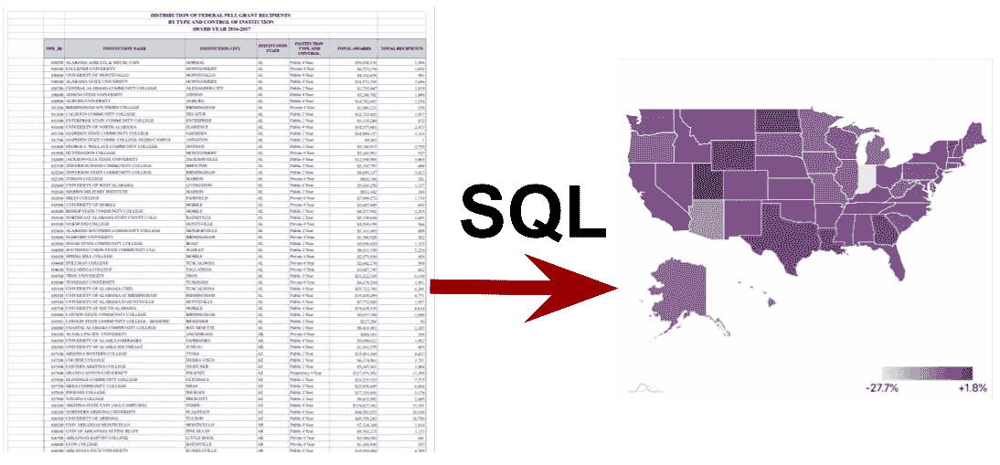
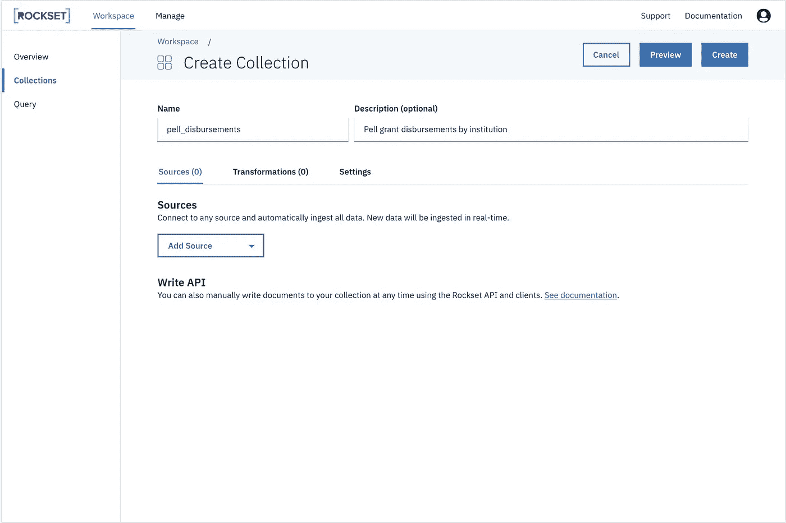
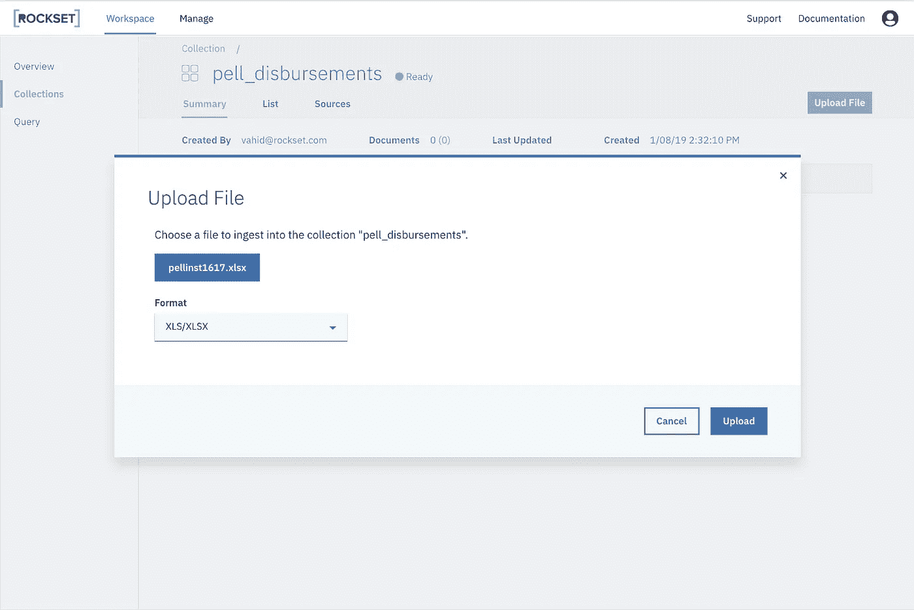
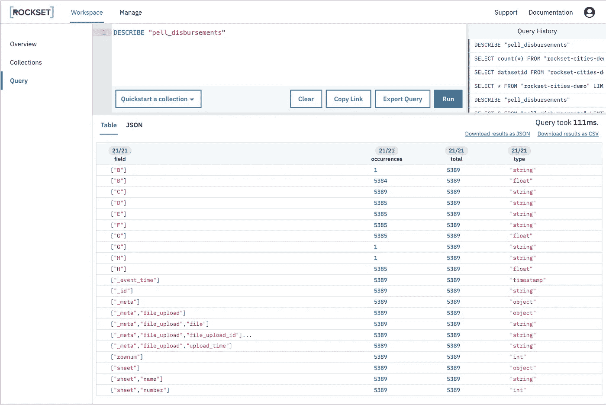
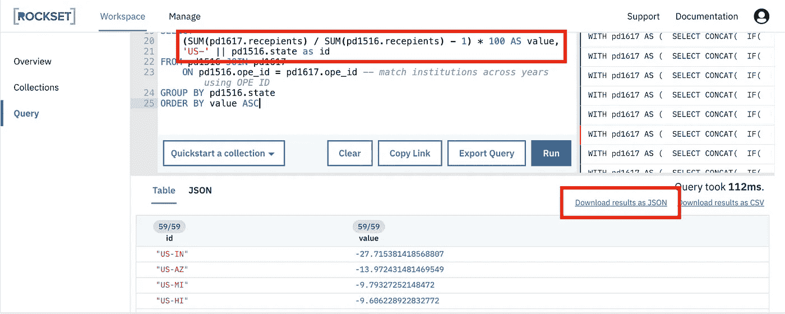
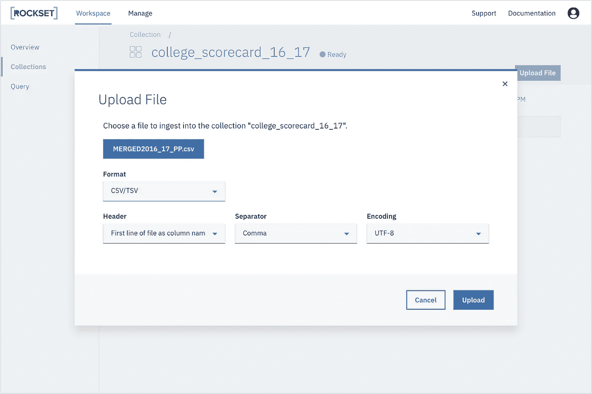

# Excel 电子表格上的复杂 SQL

> 原文：<https://towardsdatascience.com/complex-sql-on-excel-spreadsheets-274bc93ade89?source=collection_archive---------5----------------------->

## 研究联邦佩尔助学金数据的趋势

Spreadsheets to answers, using SQL.

2016 年，印第安纳州的佩尔助学金减少了 2 亿美元。为什么？答案就在教育部的电子表格数据中。我们可以用 SQL 提取出来。

世界上的大量数据同样被锁在电子表格中。像 Excel 这样的工具被广泛使用，并且非常适合查看数据。然而，随着现代数据变得越来越大，越来越相互关联，执行复杂的分析可能会变得很困难——难以理解的长公式，与数据框架的争论，甚至清理崇高文本中的 CSV(我曾经遇到过…)。

一定有更好的办法。在本帖中，我们将展示如何使用一个比 Excel 更古老的工具来应对这一挑战:SQL。

# 这些问题

美国大学的可负担性(或不可负担性)是今日新闻中的[热点话题。学生经济资助的最大来源之一是](https://www.bloomberg.com/news/articles/2019-01-16/high-student-debt-is-driving-low-millennial-homeownership-rates)[联邦佩尔助学金计划](https://www2.ed.gov/programs/fpg/index.html)，所以我们寻找量化该计划影响的数据。

假设我们想回答以下问题:

*   2016-2017 年，纽约哪个机构的学生获得的佩尔奖金最多？
*   对于每个州，从 2015-2016 年到 2016-2017 年，获得佩尔奖的学生人数的百分比变化是多少？
*   一个机构的平均资助规模与它是全男性还是全女性有什么关系？

快速搜索显示，按机构列出的佩尔助学金发放数据可以在教育部网站上公开获得。XLSX 文件(Excel 电子表格)。这将是我们调查的起点。

# 加载数据

让我们将支出数据转移到 [Rockset](https://rockset.com/) 中，这是一个可以解析和运行半结构化数据 SQL 查询的服务，包括我们案例中的 Excel 文件。在 Rockset 控制台中，我们创建一个新的空集合，并将其命名为`pell_disbursements`。

接下来，我们从 DoE 下载 Excel 文件，并将其直接上传到 Rockset 控制台。

Rockset 将对文件内容进行索引，以便随时可以查询。

# 寻找数据点

让我们从了解数据的形状开始。我们使用`DESCRIBE`命令列出集合中的可用字段:

We will run all our queries in the browser in the Rockset console.

我们看到 Rockset 已经解析了电子表格中从 B 到 H 的列，以及有用的元数据，包括:

*   `rownum` -原始电子表格中的行
*   `_meta.file_upload.file` -原始文件的名称

Rockset 中的每个文档都对应于电子表格中的一行，所以让我们查询前几行来辨别每一列的含义:

我们看到第五行中的每一列都有标题，原始数据从第六行开始。使用一个`WITH`子句，让我们构造一个名为`pd`的子查询，它只返回我们关心的数据:

这很令人兴奋——我们可以使用 SQL 的全部功能来梳理这些数据！让我们编写一个查询来找到我们第一个问题的答案，纽约获奖最多的机构:

我们看到，排名第一的机构是曼哈顿区社区学院，该学院获得佩尔奖学金约 7600 万美元，明显高于排名第二的机构。

# 计算聚合统计数据

让我们引入 2015-2016 年的数据。我们下载那一年的数据并上传。XLSX 文件放入同一个`pell_disbursements`收藏中。

我们使用与上面相同的步骤，这次按文件名过滤，为 2015-2016 年的数据构造另一个子查询。注意，第二个文件的格式略有不同(行偏移量、列标题和 OPE ID 列中的数据类型)，因此我们必须适当地调整我们的查询。

接下来，我们可以将每个机构两年的数据进行匹配，以计算 Pell 接受者人数的逐年变化。我们按照州和从少到多的顺序进行汇总:

我们可以看到，除了三个州之外，所有其他州接受佩尔助学金的人数实际上都减少了(尽管其中的两个州，华盛顿特区和马绍尔群岛，从技术上讲不是州)。正如 CollegeBoard 在图[中指出的，这是一个更大趋势的一部分。到目前为止，印第安纳州是个例外，接收人数下降了 27.7%。

让我们在地图上看看这个数据。我们可以使用来自 amCharts 的](https://trends.collegeboard.org/student-aid/figures-tables/undergraduate-enrollment-and-percentage-receiving-pell-grants-over-time)[这个](https://www.amcharts.com/demos/us-heat-map)现成的美国热图演示。为了匹配 amCharts 期望的数据格式，我们重命名列，然后将结果导出为 JSON:

接下来，我们将 JSON 直接粘贴到演示代码中，并立即生成一个交互式热图！

Run this pen to see the heat map.

我们直观地观察了犹他州附近和南部腹地的一些州，它们保留了佩尔学生人数，并再次看到印第安纳州确实是佩尔学生流失的异常值。

当年印第安纳发生了什么？为什么会有如此巨大的变化？让我们开始吃吧。我们列出了印第安纳州各机构报告的接受佩尔助学金的学生人数的变化:

这就是症结所在！ITT 技术学院贡献了近 40，000 名学生，快速搜索就会发现其背景故事。2016 年 8 月，在一系列欺诈和误导学生的指控后，教育部[禁止 ITT 理工大学](https://www.ibj.com/articles/60122-update-feds-ban-itt-educational-from-enrolling-students-on-federal-aid)用联邦资助招收新生。次月，ITT 理工大学[宣布破产](https://www.nytimes.com/2016/09/18/business/itt-educational-services-files-for-bankruptcy-after-aid-crackdown.html)。

# 使用附加数据增强

让我们扩大调查范围，把一个机构其他方面的数据也包括进来。具体来说，我们可能会想，资助规模与一个机构是否被归类为全男性/全女性之间是否有任何关联。

教育部管理的[大学记分卡](https://collegescorecard.ed.gov/data/)是一个可以帮助我们的极好的数据集。我们下载 2016–2017 年的数据作为 CSV 文件，并上传到新的 Rockset 集合:

为了与佩尔助学金数据相一致，我们使用机构的 OPE IDs(美国教育部指定的中学后教育鉴定办公室)。我们注意到大学记分卡有两个 OPE ID 列，一个用于 6 位 ID，一个用于 8 位 ID:

与此同时，佩尔·格兰特的数据有点混乱。原始 Excel 文件将 ID 存储为数字(因此去掉了其前导 0 ),并为每个 ID 附加两个额外的数字:

我们可以在 Rockset 查询中解决所有这些问题。我们使用 SQL 函数来处理 ID，然后使用一个 JOIN 来比较机构名称并检查它们是否一致。

看起来不错！使用连接，我们不需要任何预先的数据准备来组合数据集-我们可以自由地探索，而不需要预先定义我们可以使用的数据的边界。

大学记分卡记录了每个机构的各种属性，点击[查看](https://collegescorecard.ed.gov/data/documentation/)。在我们的调查中，我们计算了全男性/全女性机构相对于其他机构的平均资助规模:

我们就此打住，但你可以想象无尽的角度去探索:

*   佩尔拨款偏向于任何特定的研究领域吗？
*   是更难被大学录取，还是一旦入学就更难获得佩尔助学金？
*   教职员工的工资与学校从佩尔助学金中获得的收入有什么关系？

如果您想用这些数据运行自己的查询，那就尽情发挥吧！只要联系 hello@rockset.com 就能获得访问权限。(完全披露:我在 Rockset 工作。)

# 摘要

SQL 通常用于查询传统数据库中的数据，但在这里我们看到了它如何也可以用于该上下文之外的数据。SQL 的灵活性和复杂性允许动态地处理数据，以任意方式聚合数据，并与其他地方的数据有效地结合。随着我们找到查询半结构化数据的新方法，我认为 SQL 有潜力将世界上越来越多的数据用于积极的用途。

## 使用的数据:

*   2016-2017 年联邦佩尔资助项目资金按机构分布 [(Excel 电子表格)](https://www2.ed.gov/finaid/prof/resources/data/pell-institution.html)
*   2015-2016 年联邦佩尔资助项目资金按机构分布情况( [Excel 电子表格](https://www2.ed.gov/finaid/prof/resources/data/pell-institution.html)
*   2016–2017 年高校记分卡数据( [CSV 文件](https://collegescorecard.ed.gov/data/))

## 使用的服务:

*   [Rockset](https://rockset.com/) —摄取和查询。XLSX 文件
*   [amCharts](https://www.amcharts.com/) —在美国热图上可视化查询结果
*   [GitHub Gist](https://gist.github.com/) 和[code pen](https://codepen.io/)——分享本帖代码