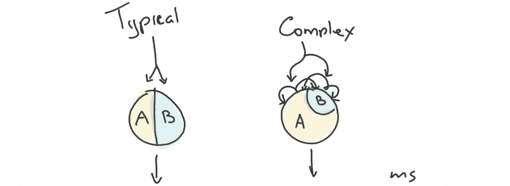
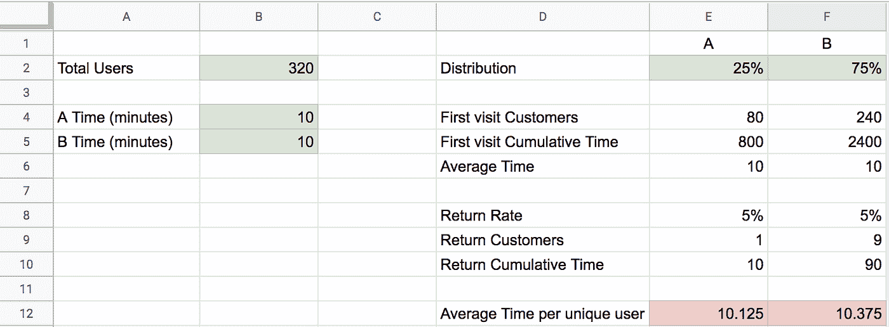

# 对回头客进行 A/B 测试的复杂性

> 原文：<https://towardsdatascience.com/complexities-of-a-b-testing-with-returning-customers-a041dc1e8c98?source=collection_archive---------34----------------------->

## 直觉会导致错误

## A/B 测试简介

A/B 测试，也称为分割测试，有很多好处。它可以让你

*   证实你的假设。
*   发现客户的偏好行为。
*   衡量新功能的有效性。

A/B 测试的[前提非常简单——将用户流量分成两组，称为桶，并为一个桶提供与另一个不同的体验。观察铲斗的流量，了解各组的行为有何不同。](https://en.wikipedia.org/wiki/A/B_testing)

## A/A 测试简介

在进行实验之前，确认测试引擎的正确性是至关重要的。这可以通过执行通常所说的 A/A 测试来实现。这是一个测试，两个桶接受相同的经验。A/A 测试可以揭示，[和其他东西](https://www.quora.com/What-is-an-A-A-test):

*   有缺陷的基础设施。
*   流量分流不当。
*   分流流量中的偏差。

我将使用这种 A/A 方法来揭示非标准分割测试场景中的隐藏故障。

# 随机回头客

有时候在复杂的情况下，人们的*行为*和人们的*行为*并不一定相关。例如，让我们考虑一家银行。我们正在努力改进柜员登记软件，以提高柜员的结账速度。复杂性来自于这样一个事实，即结账时间在很大程度上是由顾客而不仅仅是雇员来控制的。更糟糕的是，结账时的一个错误可能会产生一个回头客，这会占用额外的时间。此外，一些回头客可能会去不同的窗口；让我们将这些情况视为损坏的数据，并在分析过程中跳过。我们希望在发布变更时小心谨慎，所以我们不会向 50%的收银机发布新软件，而是只向 25%的收银机发布。

> 目标:提高柜员的结账速度。

在这篇文章中，我想研究一下当以下三种情况同时存在时会发生什么:

*   铲斗分配不是 50/50。
*   一定比例的顾客会返回(**糟糕的场景**)。
*   回头客会被随机分配一个新的铲斗。

这两种情况的结合会隐藏计算误差；然而，在这里，我将证明这三者的结合需要对简单的数学进行改变。

# 模拟 A/A 测试

我可以在一个简单的电子表格中模拟这个场景。如前所述，我将从一个测试开始，其中两个时段 A 和 B 具有相同的值(每个客户的时间和退货率)。这将帮助我验证驱动这一点的数学“引擎”。

让我们从访问银行的 320 名客户开始。让我们将平均结账时间定义为总时间除以顾客总数。存储桶分配将设置为 25% / 75%。因为我在模拟 A/A 测试，所以两个时段的时间是相同的；让我们选择 10 分钟的值。同样，客户的退货率也是一样的，所以我们选择 5%。

[*https://docs.google.com/spreadsheets/d/1jr_zOeDPXJUG4BPFQ0UCfCBdC6zi2B4RITLc3IhS8Ew*](https://docs.google.com/spreadsheets/d/1jr_zOeDPXJUG4BPFQ0UCfCBdC6zi2B4RITLc3IhS8Ew)

请记住，回头客不计入总数，因为他们是同一批人。查看上面的计算，您可以看到总时间除以总客户数:

> 铲斗 A: 810 / 80 = 10.125
> 
> 铲斗 B: 2490 / 240 = 10.375

即使在模拟的 A/A 环境中，尽管客户价值都相同，但我们最终得到的平均值却不同。如果时段分配为 50/50，如果没有退货客户，或者如果客户始终保持在同一个时段，则隐藏此差异。

# 误差分析

让我们首先讨论一下天真的直觉告诉我们什么。所有客户的模拟时间平均为 10 分钟。如果没有回头客，那么值 10 将是唯一可接受的值。随着一定比例的客户返回，我们认识到这个值应该更高，所以让我们来计算多少。如果 100%的顾客都回来过一次，那么平均 20 分钟就够了。50%的回报率应该产生 15 分钟，因此只有 5%的回报率，我们应该观察 10.5 分钟的平均值。

我们两个时段的值都低于预期的 10.5，所以我们要么低估了总平均时间，要么高估了独立客户。对于时段 A，我们可以确定总时间是 800 + 10，并且我们可以确定唯一客户的总数是 80。然而 810/80 并没有给我们必要的 10.5。我们不能再次计算回头客，即使我们计算了也无济于事:810/81 = 10 仍然是错误的。

解决这种现象的一个方法是要求顾客像以前一样通过同样的登记。这对于数学目的来说已经足够了，尽管实际上并不总是可能的。另一个解决办法是禁止他们返回——同样不切实际。最后，我们可以要求存储桶分布为 50/50；这将通过对两个桶给出相同的答案来隐藏问题，但是答案仍然是不正确的(10.25)。

让我们来分解一下我们在桶 A 中得到错误答案的公式:

> (800 + 10) / 80 = (800 / 80) + (10 / 80) = 10.125

这揭示了一些令人困惑的信息。对于回访，我们用总时间(10 分钟)除以总访客数(80 个客户)，这是不对的。80 个客户中只有 5%会回来，这样我们就有了 4 个客户。在这 4 个中，只有 25%会被分配到存储桶 A，这样我们又得到 1。

> (800 + 10) + (10 / (80 * 0.05 * 0.25)) = 11

然而，这就是错误发生的地方，不管它看起来多么正确。我们必须停下来问问——有多少顾客回来了有什么关系？

回头客给我们的总时间增加了额外的时间。但是，它们对我们平均值的贡献应该只受最大可能影响的控制，对于桶 A 是 25%。换句话说，在划分退货客户的总时间时，不应考虑退货率。

> (800 / 80) + (10 / (80 * 0.25)) = 10.5

对于桶 B:

> (2400 / 240) + (90 / (240 * 0.75)) = 10.5

最后将公式概括为**每斗**:

其中 n 是访问次数，Tn 是所有客户访问 n 的总时间，C 是原始客户数，P 是桶的分布百分比。

我认为这里更重要的教训是 A/A 测试有多有价值，甚至只是一个测试的模拟。如果你处理随机返回的客户，并且你正在考虑 A/B 测试你的系统——确保检查你的数学和[调试你的代码](https://link.medium.com/5wo7w6E2e6)！