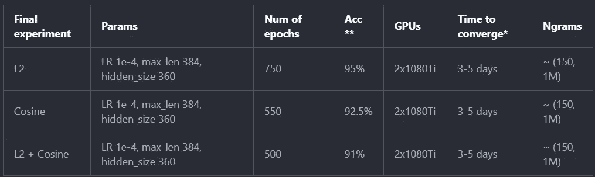

# 在一组真实任务上比较复杂语言的复杂 NLP 模型

> 原文：<https://towardsdatascience.com/complexity-generalization-computational-cost-in-nlp-modeling-of-morphologically-rich-languages-7fa2c0b45909?source=collection_archive---------15----------------------->

**Deep FastText. You can also use this trick with transformers**

## 预先训练基于变压器的模型有意义吗？你能比 BPE 做得更好吗？哪种架构更适合哪种任务？

这将是那些文章中的一篇，在那里我们不发表“即插即用”的代码，但是我们没完没了地漫谈我们尝试了什么和失败了什么(或者也许没有？)最重要的是**这如何适应更广泛的形象**。

在过去的 3-6 个月中，我们为一种形态丰富的语言— **俄语**尝试了各种基本 NLP 任务模型(如分类、序列间建模、机器理解)。这有点酷，因为我们可以继承大量的现代文献和现代 NLP 方法的代码库(RNNs、LSTMs、embeddings、PyTorch、FastText、LASER 等等)。

**但是通常会有三种痛苦:**

*   俄语比英语复杂得多，而且**词法丰富**；
*   公共基准/数据集/语料库非常稀缺；
*   俄语中的 NLP 研究几乎是不存在的(这主要意味着由真实的人应用基准)。阿法克，俄英 NMT 最先进的由[中国](https://arxiv.org/abs/1801.03615)人举办；

**以上是我们目前的结论:**

*   **简单任务** —尽管 transformers 对大量 NLP 任务进行了广泛宣传的改进(我认为在一个具有 5-10k 行和几个类的学术数据集上的 10 个类分类是一个“简单任务”)，但考虑到**计算成本和增加的复杂性和推理时间**，我们**未能获得在这种“简单任务”上使用 Transformers 的真正好处**。适当的 RNN / [CNN](http://arxiv.org/abs/1803.01271) 基于模型的注意力很快被数据的偏差所限制——而不是任务的复杂性；
*   有一种情况，在对话意图 30 类分类任务中,“基线”模型给出 51%的顶级准确度，而变压器给出大约 **57%** 。但是经过进一步的调查和清理——在我们从数据中去除偏差并将类别数量减少到大约 15-20 个之后，这种提升消失了，即 **transformer 更适合有偏差的数据**。
*   同样值得注意的是——在我们的设置中，生成性预训练(BERT)的表现**实际上比仅用 FastText n 元语法向量初始化嵌入包层更差**(考虑到所需的时间、精力和计算资源——显而易见，您不应该自己对这种模型进行预训练)。
*   顺便说一句，我认为这些“简单”的任务主要包括:分类、标记、意图分类、搜索分类、词性、NER(当然前提是你有一个合适的数据集)。
*   我想你应该把 NMT 放在这里，但这本身就是一件事，我们甚至没有解决。在一个半困难的(如果一个胖 LSTM 收敛了几天，这是什么，对不对？)[任务](https://spark-in.me/post/cft-spelling-2018)纠正独联体国家人名中的错别字(不要小瞧它，看帖子，没那么容易)——我们只是**没有足够的耐心等到变形金刚会收敛**。我估计他们收敛得更慢。我们在那里没有任何形式的预培训，因为领域是非常不同的；
*   **真正困难的任务**。在这里，对于俄语，我只能找出所谓的 [SberSQUAD](http://docs.deeppavlov.ai/en/master/components/squad.html#sdsj-task-b) 。请注意，在队伍本身，变形金刚现在有最好的 EM(精确匹配)，超过人类的表现，分数浮动在`90% EM`左右。根据 [DeepPavlov](http://docs.deeppavlov.ai/en/master/components/squad.html#sdsj-task-b) ，为这个特定任务定制的最先进的模型给出了大约 60%的 EM(当然我们不知道——它是 train 还是 val，以及验证是否被正确处理)。但是这里变得有趣了:
*   一个基线背面的信封模型建成后有一天可以达到大约`15% EM`；
*   我可以用嵌入包(由 FastText 初始化)安装一个高达`37-40% EM`的变压器，学习率很高`1e-3`(单个 1080 Ti 训练 45 小时)；
*   当我们添加了生成性预训练时，模型**开始以数倍于**的速度收敛，但无论我们如何尝试——我们都无法击败`30% EM`——模型最终只是过度拟合——所以用我们的嵌入包方法进行预训练是可行的，但最终只是简单的快速文本初始化更好；
*   推理基准——仅在 CPU 推理上对适当大小的转换器(300-400 个隐藏大小，12 个注意头)进行基准测试——根据经验，与 LSTMs w/o 速度优化(仅填充)相比，在相同数据上的推理时间大约是 10 倍。

自然对这些半信半疑。是的，很可能所有这些都意味着以下事情之一:

*   我们在代码中犯了一些错误——尽管我们花了时间彻底检查了所有的东西；
*   因为我们通常使用 1m 的 150 维嵌入(以适应内存)和隐藏大小为 400 的转换器，可能大小很重要；
*   最有可能的是，相当于 99 天* 1080 天的预培训也很重要；
*   也可能是由于不平衡的模型(1m 的 ngrams，浅的 transformer)和我们的嵌入包中缺乏注意层——我们的模型在预训练中基本上是瓶颈和/或过度拟合的；

# NLP 模型的最新趋势

你可能不知道有两大类“复杂的”语言——**粘合性语言和融合性语言**，英语本身主要是分析性语言(在英语中，大多数意义是通过助词(助词、介词等)来表达的)。

我不是语言学专家，但是俄语有很多粘合和融合的特点。我们有词形变化、词形变化、词素以及很多混合这些东西的方法！

所以，在一个非常基本的层面上，俄语中的每个单词都可以这样拆分:

**Subword units in Russian**

是的，尤其是在动词中——对于流行词根，存在着带有几乎所有流行前缀的动词，它们……惊奇——惊奇有着非常不同的含义。如果你懂德语，你会立刻明白我的意思。

当然，除了构词法，我们还有词形变化和变位:

**Inflection in Russian**

# 现代自然语言处理中的词表示

当最初的 Word2Vec 论文问世时，Word [vectors](http://arxiv.org/abs/1607.04606) 彻底改变了 NLP 领域。但实际上，只有当 [FastText](http://arxiv.org/abs/1804.10959) 及其令人敬畏的实现被引入后，它们才变得可用于具有词法的语言。

如果你不熟悉 word 2 vec——它基本上只是从原始文本中学习 N(通常是 300)维单词向量，即从所讨论的单词周围的单词中学习。FastText 进一步发展了这一思想，学习子词向量而不是词向量，一个词只是其子词的加权平均值。如果你对这方面的技术更感兴趣——现在你甚至不需要定制工程来实现一个基本的 w2v 模型——在现代深度学习框架中嵌入层可以很容易地[完成](/implementing-word2vec-in-pytorch-skip-gram-model-e6bae040d2fb?gi=af2766789cd5)。

但所有这一切在理论上都是美好的。事实上，与`cat`最接近的词是… `dog`。`Coffee`与`cup`有关，因为咖啡是一种经常用杯子喝的饮料，但`coffee`与`cup`不同，因为咖啡是一种饮料，而杯子是一种容器。因为这些向量没有捕捉到意义。他们捕捉上下文。当然，你可以使用类似于 [one](https://research.fb.com/publications/auto-encoding-dictionary-definitions-into-consistent-word-embeddings/) 的方法，你可以训练类似于自动编码器或 GAN 的东西将字典中的单词定义编码成向量。但是对于大多数情况来说，这似乎有点高。

同样在 FastText 做任何事情之前**实用的**和**可部署的**对于像俄语这样的语言来说是痛苦的，因为:

*   对于一个简单的任务，你可能有一个词汇表`50-100k`；
*   对于一个真正的生产任务——你的词汇量很可能会在一个`1m-10m`范围内；
*   全俄罗斯互联网包含~ `100m`独特词汇；

我没有做任何英语基准测试，但我猜想同样的数字会低 5-10 倍，尽管如此，这并没有使某些任务变得容易处理。这个特殊的词汇问题在主流 NLP 文献中通过使用所谓的字节对编码( [BPE](http://arxiv.org/abs/1508.07909) )得到了某种程度的缓解，它本质上学习如何有效地将单词分成组块。

从理论上讲，BPE 应该能够很好地处理粘合语言，因为语素不会改变。唯一的问题是俄语也有很多融合的特征。这是有道理的，与 NMT BPE 将不会很好地工作，但更多的脚踏实地的任务？

我尝试在各种任务上测试 BPE(我通常尝试几种词汇大小，如 30k / 100k / 500k)，与 char-level 方法和 embedding bag 方法相比，我最好的结果是准确性略有下降，如 1-3pp。我在社区里四处打听——出乎意料的是，我并不是唯一一个观察到 BPE 教不适合俄罗斯人的人。当然，在这种情况下，也许还应该平衡模型权重，但在我的情况下，只有两个标准:(1)模型在运行时应该快速(2)模型在训练时应该快速收敛。有了现代的 GPU 和 RAM，拥有 50k 和 250k 的词汇量没有什么区别，当然，除非你在做 NMT 或语言建模。

同样令人困惑的是——除了 FastText 之外，我很少看到主流论文试图构建单词嵌入解决方案，以某种方式考虑丰富的形态学。这篇俄中 NMT 论文是一个[的例外](http://arxiv.org/abs/1801.03615)——但是他们只分别预测结局。

# 注意，变形金刚，生殖预训练

所有这些都是非常重要的概念。

但我不会费心复制粘贴相同的文本和插图，而只会将您重定向到我所知道的解释这些概念的最佳页面:

*   变形金刚是如何工作的— [注解的](http://nlp.seas.harvard.edu/2018/04/03/attention.html)变形金刚和[图解的](http://jalammar.github.io/illustrated-transformer/)变形金刚；
*   注意力[如何工作](https://lilianweng.github.io/lil-log/2018/06/24/attention-attention.html)以及不同类型的注意力；
*   序列到序列模型如何工作——带[注释的](https://bastings.github.io/annotated_encoder_decoder/)编码器解码器；
*   你[不需要](https://bair.berkeley.edu/blog/2018/08/06/recurrent/)RNNs；

本质上现在要解决应用的 NLP 任务，你有以下选项可供选择:

*   **嵌入层**用来表示单词或字符是必须有的；
*   **词汇**:字符级/固定/基于 BPE 的方法/嵌入包/基于快速文本的方法；
*   **嵌入初始化** : Word2Vec 或 Glove/fast text/以上混合；
*   **模型本身:**
*   (1) [TCN / RNN](https://t.me/snakers4/2253) +简单自我[关注](https://t.me/snakers4/2239)；
*   (2)基于编码器-解码器的序列到序列模型；
*   (3)变压器；

只要选择正确的组合，你就可以开始了！我们的任务主要是了解变形金刚(3)如何适应这个生态系统——BPE 与否，如何初始化嵌入，如何解决基准任务等

# 我们对单词表示问题的解决方案

**Our approach to word representations for Russian in a nutshell**

所以，现在你看到使用一种形态丰富的语言是一件苦差事。我说的工作是指生产你确信**能很好地推广到不太为人知的情况的模型**。

但是我们不能把现有的两个最好的仪器结合起来吗？FastText +深度学习模型？事实证明我们可以做到，例如在 PyTorch 中使用嵌入包[层](https://pytorch.org/docs/stable/nn.html#embeddingbag)就可以很容易地做到这一点。你可以用注意力和单词/语法/字符的混合来构建一个小模型——但是它很可能比低级别的 C++实现要慢。

这种方法对 TCNs/RNNs/CNN 这样的简单模型非常有效，提供了泛化能力，完全消除了 OOV 情况，不再需要 UNK 令牌或任何类似的笨拙解决方案！

但是我们能把它推广到一个在大型文本语料库上预先训练的 transformer 模型吗？

这种方法只有 3 个基本问题:

*   将[注意力](https://discuss.pytorch.org/t/attention-on-nn-embeddingbag/10521)添加到嵌入包层是一个不太可能解决的问题；
*   为了保证通用性，您至少需要大约`500k-1000k`ngrams；
*   您面临着技术问题——语言建模标签不再可用于 LM 任务(您必须使用模型的嵌入作为基础事实)+在 PyTorch 中使用标准的 DataParallel 包装器变得很慢，因为嵌入层很大，为了实现真正的并行性，您可能必须使用 DistributedDataParallel
*   您可以在一个 GPU 上嵌入包，然后将得到的包张量分成正确的形状，但当您有多个 GPU 设置时，这变得更加困难，因为每个令牌都变成了填充序列，而不是令牌；

***Typical vocabulary coverage (% of ngrams covered in a word) in case your ngram set is properly chosen. With 1m 2–6 grams you can cover even 100m dictionaries.***

# 变形金刚/伯特/ GPT 更适合你吗？

TLDR——除非你能使用一个预先训练好的——那么很可能不会，除非这是唯一强大到足以处理你的任务的架构。

# Seq2seq 基准

请参考此[帖](https://spark-in.me/post/cft-spelling-2018)。
TLDR——在复杂的序列基准测试中，基于变压器的模型似乎收敛得更慢。

***Shall we wait one more week?***

# 创成式预培训速度提高了 10-100 倍？

我们不会发布我们全部的预训练代码(更重要的是——由于显而易见的原因，数据采集、预处理和我们的数据集)，但是您可以将这些类[放入一个 huggingface 模型中，以便:](https://github.com/huggingface/pytorch-pretrained-BERT/blob/master/pytorch_pretrained_bert/modeling.py)

*   从预先训练的 BPE 向量开始；
*   从老版本的嵌入包开始(哪个效果更好，lol)；
*   从填充版嵌入包开始(方便使用多 GPU 包装器)；

简而言之，他们所说的预先训练一个转换器需要 50-100，000 美元的计算资源似乎完全不可行。我们能让像我们这样的普通人快一点吗？

(*来自未来的我:* ***是啊，不用预训练，只要用 FastText 初始化的嵌入包训练就行！*** )

按照纯粹的美国/硅谷精英主义的方式，像 BERT 这样的论文不会做任何穷人的消融测试，比如如果你用 FastText 初始化你的模型，收敛会发生什么？

但是不管怎样，怎样才能加快收敛速度呢？假设 1080Ti 的预培训需要 400 天，让我们从这里开始:

*   从预先训练的向量/ n-grams 开始— **也许快 10 倍？**；
*   不使用一个大的 softmax 层(即使它链接到你的嵌入层)，而是使用余弦损失或受此启发的东西。对了这些家伙**也是从 fast text**——**x2 开始更快？**；
*   更轻的型号— **x4 更快？**；
*   使用适合俄语的嵌入包层；

总而言之，通过所有这些“优化”，似乎可以在一周左右的时间内**预训练/调整一个变压器，这是真实的，唯一的问题是实际的预训练模型似乎并没有真正击败一个刚刚用 FastText 初始化的模型。**

# 训练前实验

`*`我们为每个模型使用了 2 个 GPU 设置，但最终我们发现，由于较大的嵌入包大小，较新版本的嵌入包大约慢 25 %+;
`**`分类任务来自伯特论文；

**我们测试的其他“失败”方法:**

*   所有从零开始训练的模型收敛得慢得多，并且很快达到稳定状态；
*   用 FastText 初始化的所有基于 BPE 的模型收敛得慢得多，并且在 65%的顺序任务准确度附近很快稳定下来；
*   FastText +嵌入冻结—负 5pp 顺序任务准确率；

***L2 embedding loss***

**Cosine embedding loss**

# 实际尝试预先训练好的模型

这是整个练习中最令人失望的部分。

正如简介中提到的——任何种类的转换器(从头开始，预先训练，来自 FastText)对我们复杂领域的“简单”分类任务都没有帮助(但 FastText 是最好的)。

**在一个具有挑战性的 SberSQUAD 任务上，我们得到了以下结果:**

*   一个 FastText 初始化模型用高 lr 的`1e-3`训练到大约`37%-40% EM`。用 LR 衰变可能可以获得更多。值得注意的是，模型频繁偏离，似乎在每次重启时都“跳跃”;
*   当我们尝试使用`1e-3`的高 lr 预训练模型时，它的训练速度比 FastText 快得多，但是**过度训练**；
*   如果我们在`5e-4`左右开始使用较低的 lr，那么预训练的模型也比快速文本快得多**，但是在`30% EM`左右过度拟合；**

我想如果我们投入 x10 的资源来实际调整超参数，那么我们将获得更高的结果。但是你看——生成性预训练不是银弹。尤其是对于非生成性任务。

在任何正常的任务中——传统的 rnn/CNN/TCN——把变压器炸得落花流水。

**Top performance of FastText initialized transformer**

**Some comparisons**

**Low learning rate, pre-train vs. fast-text**

# 嵌入包代码

就用我们的[代号](https://gist.github.com/snakers4/f2188adf217baabad2ff6733d48cfaef)，把它[贴在这里](https://github.com/huggingface/pytorch-pretrained-BERT/blob/master/pytorch_pretrained_bert/modeling.py)加水。不，我们不傻，我们使用版本控制。

# 改进或如何使我们的想法成为主流

来自 OpenAI、Google 和 FAIR 的人们，如果你正在阅读这篇文章，你可以做以下事情:

*   解决包埋袋层内的注意力问题；
*   添加更多的计算来训练具有更大嵌入包的更大的变换器；
*   如果有的话，在其他形态学丰富语言的基准上测试这样的生成性预训练；
*   投入时间和精力在适当的分词技术上，分别传递不同种类的分词对应的包；

# 参考

**流行工具**

*   时间卷积[网络](http://arxiv.org/abs/1803.01271)；
*   流行 BPE [实现](https://github.com/google/sentencepiece)；
*   将[字典定义](https://research.fb.com/publications/auto-encoding-dictionary-definitions-into-consistent-word-embeddings/)自动编码成一致的单词嵌入；
*   PyTorch BERT by [拥抱脸](https://github.com/huggingface/pytorch-pretrained-BERT)；
*   通过神经后缀[预测](https://arxiv.org/abs/1801.03615)改进英语到俄语的翻译；
*   伯特[预训](https://nlp.stanford.edu/seminar/details/jdevlin.pdf)；

**俄语语料库/数据集/基准:**

*   俄罗斯队和情绪分析[数据集](https://t.me/snakers4/2213)；
*   为大型[网络语料库](https://t.me/snakers4/2131)挖掘俄语；
*   我的帖子解析[维基百科](https://spark-in.me/post/parsing-wikipedia-in-four-commands-for-nlp)，解析[普通抓取](https://spark-in.me/post/parsing-common-crawl-in-four-simple-commands)；
*   已准备和删除重复的普通爬网[文本](https://t.me/snakers4/2147)；
*   使用普通爬行训练[句子编码器](https://t.me/snakers4/2230)的缺点；
*   DeepPavlov 俄罗斯[小队](http://docs.deeppavlov.ai/en/master/components/squad.html#sdsj-task-b)；
*   FastText [在俄语最大语料库上预训练](https://t.me/snakers4/2175)；

**嵌入基线的简单句:**

*   [http://nlp.town/blog/sentence-similarity/index.html](http://nlp.town/blog/sentence-similarity/index.html)；
*   [https://openreview.net/pdf?id=SyK00v5xx](https://openreview.net/pdf?id=SyK00v5xx)；

**单词嵌入解释:**

*   [http://www.offconvex.org/2015/12/12/word-embeddings-1/](http://www.offconvex.org/2015/12/12/word-embeddings-1/)；
*   [http://www.offconvex.org/2016/02/14/word-embeddings-2/](http://www.offconvex.org/2016/02/14/word-embeddings-2/)；

**原话嵌入论文:**

*   单词和短语的分布式表示及其组合性；
*   [FastText](http://arxiv.org/abs/1804.10959) 用子词信息丰富词向量

**展示最新的自然语言处理模型和方法:**

*   [注意](https://lilianweng.github.io/lil-log/2018/06/24/attention-attention.html)；
*   [图示为](http://jalammar.github.io/illustrated-transformer/)变压器；
*   [注明](http://nlp.seas.harvard.edu/2018/04/03/attention.html)变压器；
*   [注释](https://bastings.github.io/annotated_encoder_decoder/)编码器解码器；
*   平原[自我关注](https://t.me/snakers4/2239)在 PyTorch
*   关于 [TCNs](https://t.me/snakers4/2253) 和[自我关注](https://t.me/snakers4/223)的几点说明；
*   训练 NMT 模型[快几倍](http://arxiv.org/abs/1812.04616)没有一个大的 softmax 层？；

**其他链接**

*   俄语单词[部分](http://inrussian.russkiepravila.ru/russian-word-parts/)；
*   CFT 2018 [比赛](https://spark-in.me/post/cft-spelling-2018)；

*原载于 2019 年 3 月 1 日*[*spark-in . me*](https://spark-in.me/post/bert-pretrain-ru)*。*