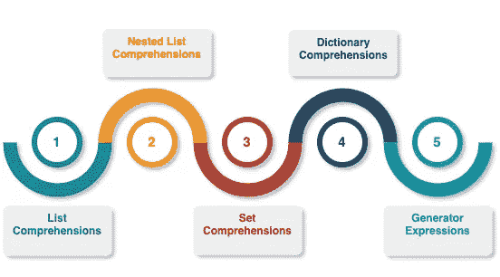
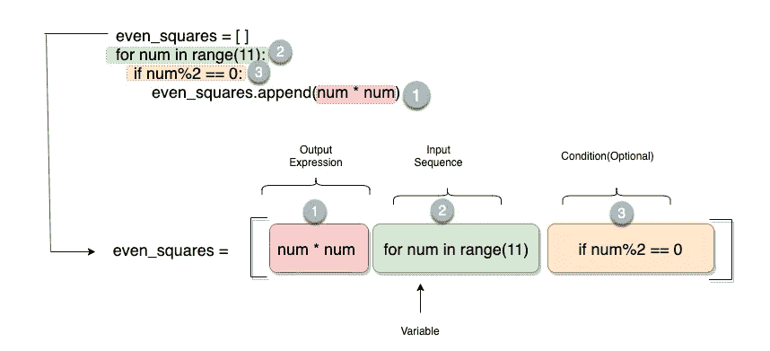
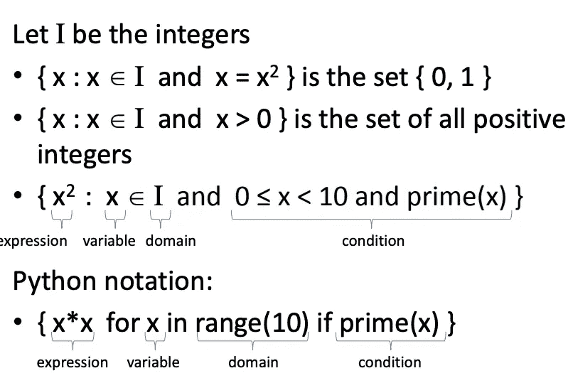

# 理解 Python 中的“理解”

> 原文：<https://towardsdatascience.com/comprehending-the-concept-of-comprehensions-in-python-c9dafce5111?source=collection_archive---------4----------------------->

## 理解和实现 python 中的列表、字典、集合和生成器。


Image by [Gerd Altmann](https://pixabay.com/users/geralt-9301/?utm_source=link-attribution&utm_medium=referral&utm_campaign=image&utm_content=2470549) from [Pixabay](https://pixabay.com/?utm_source=link-attribution&utm_medium=referral&utm_campaign=image&utm_content=2470549)

> “好的代码是它自己最好的文档”——史蒂夫·麦康奈尔

在我的[上一篇文章](/elements-of-functional-programming-in-python-1b295ea5bbe0)中，我解释了 Python 中 Lambda、Map、Filter 和 Reduce 函数的概念，它们基于函数式编程范式。我还提到了列表理解的概念，它被认为是 lambda 函数的替代品。整篇文章详细地涵盖了理解的本质及其各种形式。

# Python 中的理解

理解是允许从其他序列构建序列的结构。Python 2.0 向我们介绍了列表理解的概念，而 Python 3.0 通过包含字典和集合理解更进一步。



Types of Comprehensions in Python

为什么理解力如此强大？我们将通过一个例子来理解这一点。我们都知道 Python 提供了多种表示列表的方式。例如:

*   人们可以明确地把整个事情写成:

```
squares = [0, 1, 4, 9,16,25]
```

*   或者，编写一个 for 循环来创建一个列表:

```
squares = []
for num in range(6):
    squares.append(num*num)
```

*   创建列表的另一种方法是使用单行代码。

```
squares = [num*num for num in range(6)]
```

上面这个一行程序叫做**列表理解**，是创建列表的一种便捷方式。它消除了对循环的依赖，使代码紧凑。下一节将进一步深入 Python 3 中提供的列表和其他类型的概念。

# 列表理解[ ]

[列表理解](https://docs.python.org/3/tutorial/datastructures.html#list-comprehensions)是一种用 Python 以简洁的方式定义和创建列表的方法。在大多数情况下，列表理解让我们在一行代码中创建列表，而不用担心初始化列表或设置循环。

列表理解由以下部分组成:


Various parts of a List Comprehension

比方说，我们需要找到前五个偶数的平方。如前一节所述，有两种方法可以做到这一点:显式 for 循环或列表理解。让我们两个都试试。

*   **使用 For 循环**

```
even_squares = []
>>> for num in range(11):
...    if num%2 == 0:
...        even_squares.append(num * num)>>> even_squares
[0, 4, 16, 36, 64, 100]
```

*   **使用列表理解**

```
even_squares = [num * num for num in range(11) if num%2 == 0]
even_squares
[0, 4, 16, 36, 64, 100]
```

如果我们仔细观察，可以发现仅仅通过重新排列 For 循环就可以创建列表理解。



> 列表理解是 Python 实现数学中使用的集合符号的方式。



[similarily to sets in Maths](https://courses.cs.washington.edu/courses/cse140/14wi/lectures/22-list-comprehensions.pdf)

让我们试着看看更多借助列表理解创建列表的例子。

## 创造毕达哥拉斯三胞胎

一个毕达哥拉斯三元组由三个正整数 a，b，c 组成，这样
a + b = c .我们通常把这样的三元组写成(a，b，c)，比如(3，4，5)。

```
[(a,b,c) for a in range(1,30) for b in range(1,30) for c in range(1,30)if a**2 + b**2 == c**2][(3, 4, 5), (4, 3, 5), (5, 12, 13), (6, 8, 10), (7, 24, 25), (8, 6, 10), (8, 15, 17), (9, 12, 15), (10, 24, 26), (12, 5, 13), (12, 9, 15), (12, 16, 20), (15, 8, 17), (15, 20, 25),(16, 12, 20), (20, 15, 25),(20, 21, 29), (21, 20, 29), (24, 7, 25), (24, 10, 26)]
```

## 用字符串列出理解

*   将字符串中的小写字母转换成大写字母。

```
colors = ["pink", "white", "blue", "black", purple"]
[color.upper() for color in colors]
['RED', 'GREEN', 'BLUE', 'PURPLE']
```

*   交换给定列表中的名字和姓氏。

```
**presidents_usa** = ["George Washington", "John Adams","Thomas Jefferson","James Madison","James Monroe","John Adams","Andrew Jackson"]**split_names** = [name.split(" ") for name in presidents_usa]
**swapped_list** = [split_name[1] + " " + split_name[0] for split_name in split_names]**swapped_list**['Washington George', 'Adams John', 'Jefferson Thomas', 'Madison James', 'Monroe James', 'Adams John', 'Jackson Andrew']
```

## 用元组列出理解

如果表达式包含一个元组(如`(x, y)`)，必须用括号括起来。

```
# Convert height from cms to feet using List Comprehension : 1 cm = 0.0328 feet**height_in_cms** = [('Tom',183),('Daisy',171),('Margaret',179),('Michael',190),('Nick',165)]**height_in_feet** = [(height[0],round(height[1]*0.0328,1)) for height in height_in_cms]**height_in_feet**[('Tom', 6.0), ('Daisy', 5.6), ('Margaret', 5.9), ('Michael', 6.2), ('Nick', 5.4)]
```

# 嵌套列表理解[[ ]]

列表理解也可以嵌套来创建复杂的列表。例如，我们可以只使用列表理解来创建一个矩阵。

*   创建 3X3 矩阵

```
matrix = [[j * j+i for j in range(3)] for i in range(3)]
matrix[[0, 1, 4], [1, 2, 5], [2, 3, 6]]
```

# 集合理解{ }

集合理解类似于列表理解，但是返回集合而不是列表。语法略有不同，因为我们使用花括号而不是方括号来创建集合。

考虑以下由人名组成的列表:

```
names = [ 'Arnold', 'BILL', 'alice', 'arnold', 'MARY', 'J', 'BIll' ,'maRy']
```

名单上有很多重复的名字，而且有些名字只有一个字母。我们想要的是一个由长度超过一个字母并且只有首字母大写的名字组成的列表。为了完成这样的任务，我们求助于集合理解。

```
{name.capitalize() for name in names if len(name) > 1}{'Alice', 'Arnold', 'Bill', 'Mary'}
```

# 字典理解{ }

当输入是字典或`key: value`对的形式时，使用字典理解。例如，考虑一个字典，其中的键表示字符，值表示这些字符在语料库中出现的次数。

```
char_dict = {'A' : 4,'z': 2, 'D' : 8, 'a': 5, 'Z' : 10 }
```

字典`char_dict`由大写字母和小写字母混合组成。我们要计算字母出现的总次数，而不考虑它们的大小写。让我们用字典的理解来实现这一点:

```
{ k.lower() : char_dict.get(k.lower(), 0) + char_dict.get(k.upper(), 0) for k in char_dict.keys()}{'a': 9, 'z': 12, 'd': 8}
```

# 生成器表达式( )

列表理解之于列表，正如生成器表达式之于[生成器](https://www.programiz.com/python-programming/generator)。发生器函数从给定序列中一次输出一个值**而不是一次给出所有值**。这里有一篇[不错的文章](https://www.dataquest.io/blog/python-generators-tutorial/)，它解释了 Python 中生成器的本质。

[](https://www.dataquest.io/blog/python-generators-tutorial/) [## Python 生成器— Dataquest

### Python 生成器是强大但被误解的工具。他们经常被认为是太难的概念…

www.dataquest.io](https://www.dataquest.io/blog/python-generators-tutorial/) 

生成器表达式的语法和工作方式与列表理解非常相似，只是它们使用圆括号而不是方括号。假设我们要计算前十个自然数的平方和。

```
# Sum of first ten natural numbers using List Comprehensionssum(**[**num**2 for num in range(11)**]**)
385
```

如果我们使用任何其他的 iterable，而不一定是 list，结果会是一样的。

```
sum(**{**num**2 for num in range(11)**}**)
385
```

现在，如果我们使用一个生成器表达式来计算前十个自然数的平方，它会是这样的:

```
squares = (num**2 for num in range(11))
squaressquares
<generator object <genexpr> at 0x1159536d8>
```

与列表理解不同，生成器表达式不返回列表，而是返回生成器对象。为了得到结果，我们可以使用上面的表达式和`sum`函数。

```
sum(n ****** 2 **for** n **in** numbers)
385
```

看看我们如何去掉上面表达式中多余的括号，使代码更加高效。

# 最后，不要过度使用理解

列表理解是减少代码长度的有效方法。它们还使代码更具可读性。但是有些情况下，没有它们我们也能过得很舒服。

当你的程序逻辑太长时，使用理解是不明智的。使用理解的主要思想是缩短代码。然而，当我们开始将太多的代码打包到一条语句中时，我们往往会损害代码的可读性。在这种情况下，for 循环是一个更好的主意。

# 参考资料和进一步阅读

*   [列表理解概述](https://realpython.com/lessons/list-comprehensions-overview/)
*   [https://trey hunner . com/2015/12/python-list-comprehensions-now-in-color/](https://treyhunner.com/2015/12/python-list-comprehensions-now-in-color/)