# 神经网络中级主题

> 原文：<https://towardsdatascience.com/comprehensive-introduction-to-neural-network-architecture-c08c6d8e5d98?source=collection_archive---------3----------------------->

## 神经架构、激活函数、损失函数、输出单元的详细概述。

> “人工智能是新的电力。” ***—吴恩达***

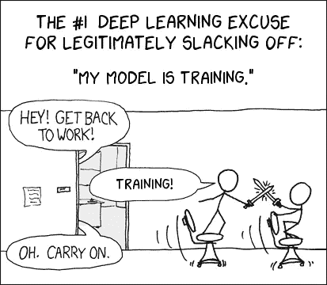

本文是一系列文章中的第二篇，旨在揭开神经网络背后的理论以及如何设计和实现它们来解决实际问题。在本文中，我将详细介绍神经网络的设计和优化方面。

本文中的主题是:

*   **神经网络的解剖**
*   **激活功能**
*   **损失函数**
*   **输出单元**
*   **架构**

这些教程主要基于哈佛和斯坦福大学计算机科学和数据科学系的课堂笔记和例子。

如果您不熟悉神经网络的基本理论概念，我建议您先阅读本教程的第一部分，这些概念可以在下面找到:

 [## 神经网络简介

### 神经网络的详细概述，有大量的例子和简单的图像。

towardsdatascience.com](/simple-introduction-to-neural-networks-ac1d7c3d7a2c) 

# **神经网络的解剖**

人工神经网络是机器学习中使用的主要工具之一。正如它们名字中的“神经”部分所暗示的，它们是受大脑启发的系统，旨在复制我们人类的学习方式。神经网络包括输入层和输出层，以及(在大多数情况下)一个隐藏层，隐藏层由将输入转换为输出层可以使用的内容的单元组成。它们是寻找模式的优秀工具，这些模式对于人类程序员来说太复杂或太多，无法提取并教会机器识别。

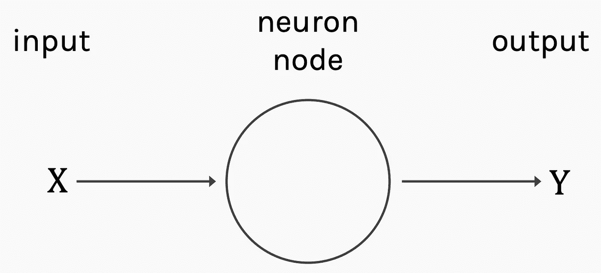

虽然香草神经网络(也称为“感知器”)[自 20 世纪 40 年代以来就已经存在](https://www.digitaltrends.com/cool-tech/history-of-ai-milestones/)，但只是在最近几十年，它们才成为人工智能的主要部分。这是由于一种名为**反向传播**的技术的出现(我们在之前的教程中讨论过)，这种技术允许网络在结果与创造者希望的不匹配的情况下调整其神经元权重——例如，像一个旨在识别狗的网络，它错误地识别了一只猫。

到目前为止，我们已经讨论了这样一个事实，即神经网络利用仿射变换来将在网络中的特定节点处收敛的输入特征连接在一起。然后，该级联输入通过激活函数，该函数评估信号响应，并确定在给定当前输入的情况下是否应该激活神经元。

我们将在后面讨论激活函数的选择，因为这是获得功能网络的一个重要因素。到目前为止，我们只讨论了 sigmoid 作为激活函数，但还有其他几种选择，这仍然是机器学习文献中的一个活跃的研究领域。

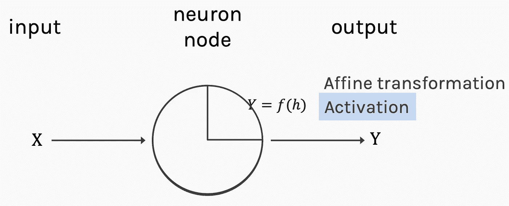

我们还讨论了如何将这种思想扩展到多层和多特征网络，以便通过增加网络的自由度(权重和偏差)以及网络可用于进行预测的可用特征的数量来提高网络的解释能力。

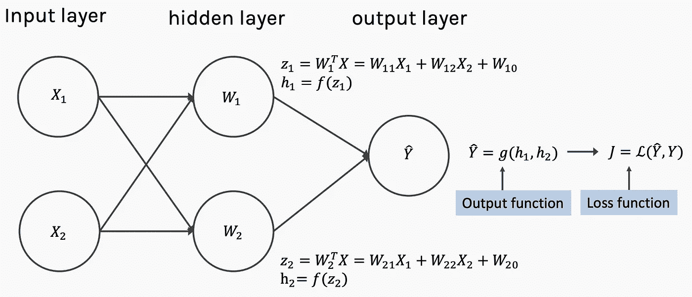

A neural network with one hidden layer and two features (the simplest possible multi-layer multi-feature network).

最后，我们讨论了网络参数(权重和偏差)可以通过评估网络的误差来更新。这是使用通过网络的反向传播来完成的，以便获得每个参数相对于损失函数的导数，然后可以使用梯度下降来以知情的方式更新这些参数，使得网络的预测能力有可能提高。

总的来说，评估误差和更新参数的过程被称为训练网络。这只有在基础事实已知的情况下才能实现，因此需要训练集来生成功能网络。然后，可以通过对看不见的数据进行测试来评估网络的性能，这通常称为测试集。

神经网络具有大量的自由度，因此，它们需要大量的数据进行训练，以便能够进行充分的预测，特别是当数据的维度很高时(例如，在图像中，每个像素都被视为一个网络特征)。

一个通用的多层多特征网络如下所示:

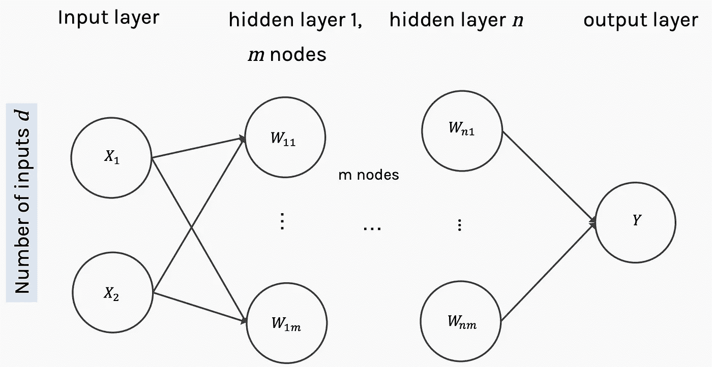

Generalized multilayer perceptron with n hidden layers, m nodes, and d input features.

我们有 *m* 个节点，其中 *m* 是指网络中一层的宽度。请注意，要素的数量和网络图层的宽度之间没有关系。

我们也有 *n* 隐藏层，它描述了网络的深度。一般来说，任何具有一个以上隐藏层的东西都可以被描述为深度学习。有时，网络可能有数百个隐藏层，这在一些用于图像分析的先进卷积架构中很常见。

输入数量 *d* 由可用数据预先指定。对于图像，这将是图像展平为一维数组后图像中的像素数量，对于正常的熊猫数据框， *d* 将等于特征列的数量。

一般来说，不要求网络的隐藏层具有相同的宽度(节点数)；隐藏层中的节点数量可能会有所不同。根据所需的输出，输出层也可以是任意尺寸。如果您尝试将图像分为十类，输出图层将由十个节点组成，每个节点对应于一个相关的输出类，这是流行的 MNIST 手写数字数据库的情况。

在神经网络之前，基于规则的系统已经逐渐演变成更现代的机器学习，由此可以学习越来越多的抽象特征。这意味着更复杂的选择标准现在是可能的。

为了理解这个想法，假设您正试图根据水果的长度和宽度对水果进行分类。如果你有两个非常不同的水果要比较，比如一个苹果和一个香蕉，这可能很容易区分。然而，这个规则系统在某些情况下会因为选择了过于简单的特性而失效。

神经网络在网络的每个阶段提供数据的抽象表示，其被设计来检测网络的特定特征。当考虑用于研究图像的卷积神经网络时，当我们查看更接近深度网络输出的隐藏层时，隐藏层具有高度可解释的表示，例如人脸、服装等。然而，当我们观察网络的第一层时，它们检测的是非常基本的特征，例如拐角、曲线等等。

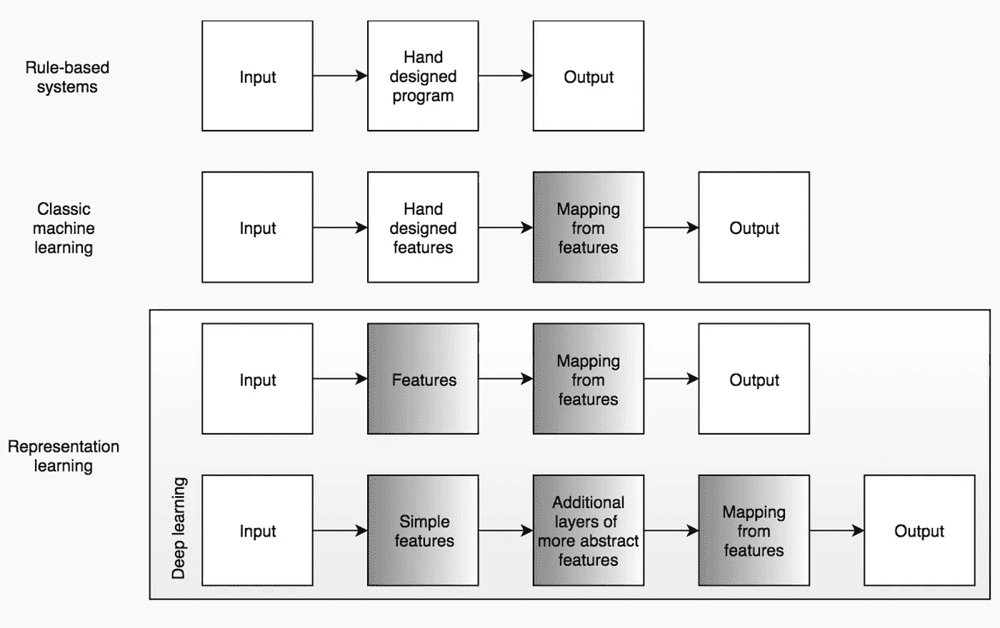

这些抽象表示很快变得过于复杂而难以理解，直到今天，神经网络产生高度复杂抽象的工作方式仍然被视为有点神奇，是深度学习社区的研究主题。

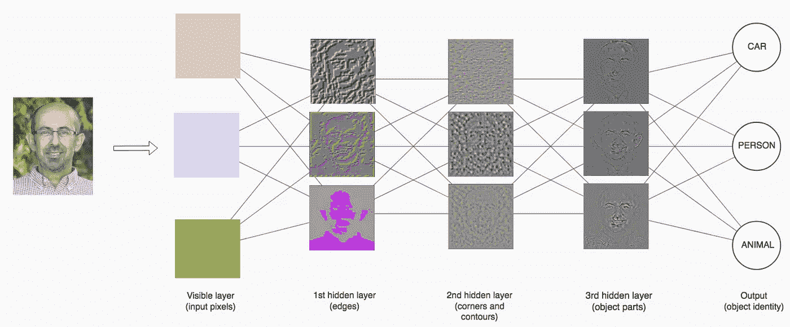

An example of a neural network with multiple hidden layers classifying an image of a human face.

An example of a neural network with multiple hidden layers classifying written digits from the MNIST dataset.

我们将在后面讨论隐藏层和宽度的选择。接下来，我们将进一步详细讨论激活函数。

# **激活功能**

激活函数是神经网络的一个非常重要的部分。激活功能类似于生物神经元中电势的建立，一旦达到某个激活电势，生物神经元就开始放电。这种激活电位在人工神经网络中使用概率来模拟。根据所选择的激活函数，网络点火的特性可能有很大的不同。

激活功能应该做两件事:

*   确保非线性
*   确保隐藏单元的梯度保持较大

激活函数的一般形式如下所示:

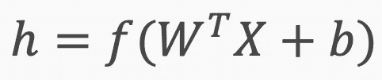

f(.) represents the activation function acting on the weights and biases, producing h, the neural output.

为什么我们需要非线性？从技术上讲，我们不需要非线性，但使用非线性函数有好处。

如果我们不应用激活函数，输出信号将只是一个线性函数*。*线性函数只是一次多项式**。**现在，线性方程很容易求解，但它们的复杂性有限，并且从数据中学习复杂函数映射的能力较弱。没有任何激活函数的神经网络将仅仅是线性回归模型**，**，其受限于它能够近似的函数集。我们希望我们的神经网络不仅仅学习和计算一个线性函数，而是比这更复杂的东西。

这又回到了我们在上一篇文章中讨论的**通用逼近定理**的概念——神经网络是广义非线性函数逼近器。使用非线性激活，我们能够生成从输入到输出的非线性映射。

激活函数的另一个重要特征是它应该是可微的。这是必要的，以便在网络中执行反向传播，计算相对于权重的误差(损失)梯度，然后使用梯度下降来更新权重。使用线性激活函数会产生易于微分的函数，该函数可以使用凸优化来优化，但是具有有限的模型容量。

为什么我们要确保通过隐藏单元的梯度很大？

如果我们有小梯度和几个隐藏层，这些梯度将在反向传播过程中成倍增加。计算机处理数字的精度是有限制的，因此，如果我们将许多非常小的数字相乘，梯度值将很快消失。这通常被称为**消失梯度问题**，是生成深度神经网络时的一个重要挑战。

激活功能的一些最常见的选择是:

*   **乙状结肠**
*   **ReLU(整流线性单元)**
*   **泄漏的 ReLU**
*   **广义 ReLU**
*   **最大输出**
*   软加软件
*   **谭**
*   **唰**

这些激活功能总结如下:

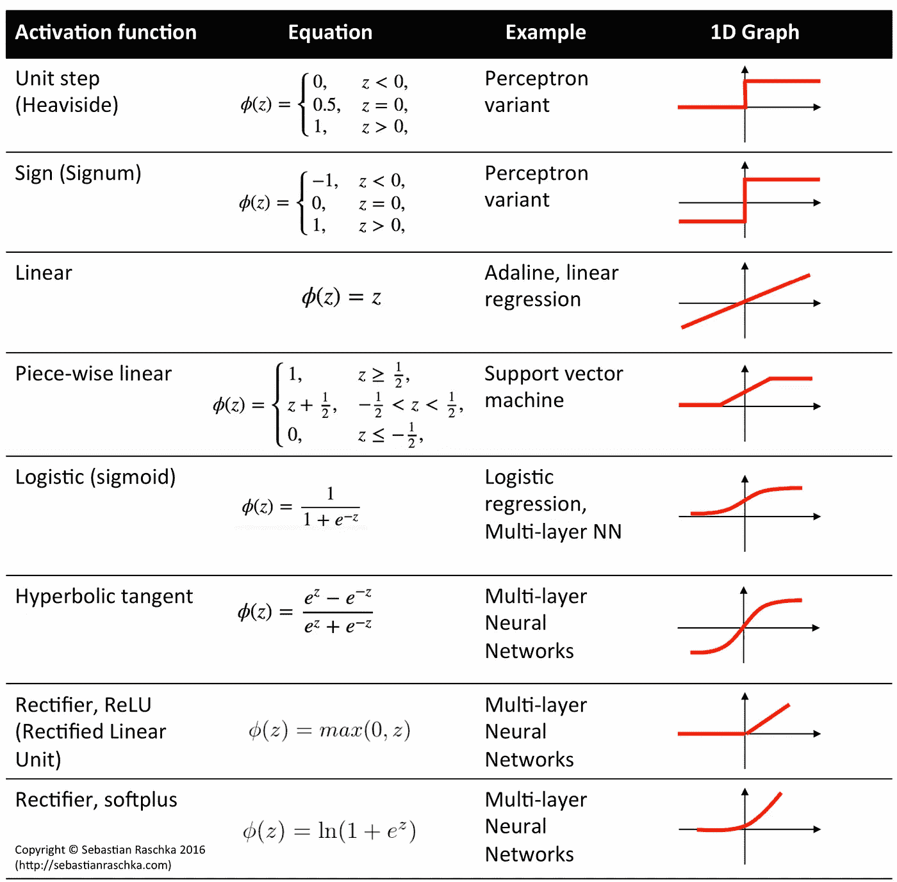

Summary of activation functions for neural networks.

**乙状结肠**

在上一篇文章中，我们只关注了 sigmoid 函数。

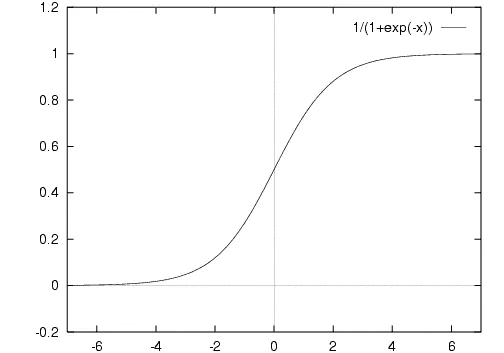

实际上，由于以下原因，该函数不是用作激活函数的特别好的函数:

*   Sigmoids 遭受消失梯度问题。
*   Sigmoids 不是零居中的；梯度更新在不同的方向上走得太远，使得优化更加困难。
*   Sigmoids 饱和并消除梯度。
*   乙状结肠收敛缓慢。

Sigmoids 仍然用作二进制分类的输出函数，但通常不在隐藏层中使用。sigmoid 的多维版本称为 softmax 函数，用于多类分类。

**Tanh**

sigmoid 函数的零中心问题可以通过使用双曲正切函数来解决。因此，在隐藏层中，双曲正切函数总是优先于 sigmoid 函数。然而，双曲正切仍然受到困扰 sigmoid 函数的其他问题的困扰，例如消失梯度问题。

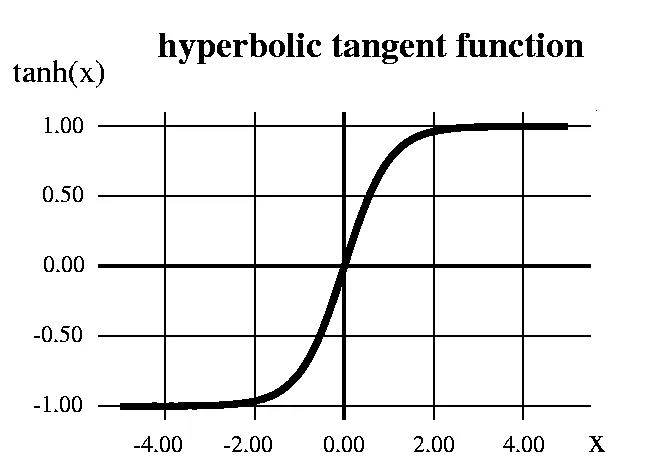

**ReLU 和 Softplus**

整流线性单元是最简单的激活功能之一。如果函数的输入小于零，则输出返回零，如果输入为正，则输出等于输入。ReLU 是最简单的非线性激活函数，在大多数应用中表现良好，这是我在处理新的神经网络问题时的默认激活函数。

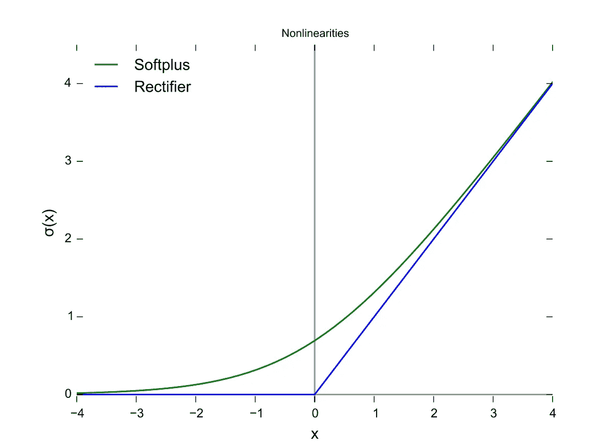

[Source](https://en.wikipedia.org/wiki/Rectifier_(neural_networks))

正如你所看到的，softplus 是 ReLU 的一个微小变化，在零点的过渡稍微平滑一些，这有利于激活函数没有不连续性。

ReLU 避免并纠正了消失梯度问题。现在几乎所有的深度学习模型都使用 ReLU。但是，ReLU 只应在神经网络的隐藏层中使用，而不应用于输出层-对于二元分类，输出层应为 sigmoid 对于多类分类，输出层应为 softmax 对于回归问题，输出层应为 linear。

**漏 ReLU 和广义 ReLU**

ReLU 的一个问题是，一些梯度在训练期间可能不稳定，可能会死亡。它会导致权重更新导致网络在任何数据点都不会激活。这些通常被称为死亡神经元。

为了解决死亡神经元的问题，引入了包含小斜率的泄漏 ReLU。这个斜率的目的是保持更新活跃，并防止死亡神经元的产生。

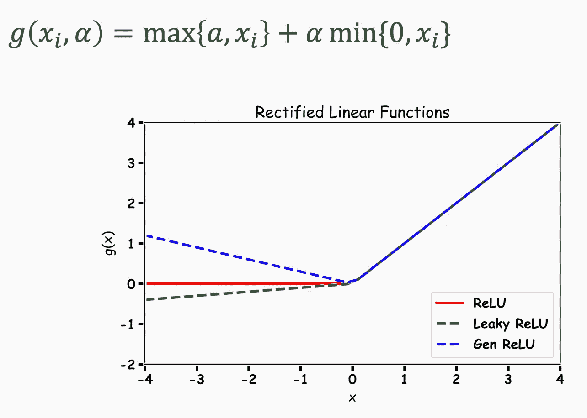

泄漏和广义整流线性单元是基本 ReLU 函数的微小变化。泄漏的 ReLU 在零点仍然有不连续性，但是函数在零点以下不再平坦，它仅仅有一个减小的梯度。泄漏 ReLU 和广义 ReLU 之间的差异仅取决于α的选定值。因此，漏 ReLU 是广义 ReLU 的子集。

**Maxout**

Maxout 就是 *k* 线性函数的最大值——它直接学习激活函数。这是一种混合方法，由 ReLU 和泄漏 ReLU 单元的线性组合组成。

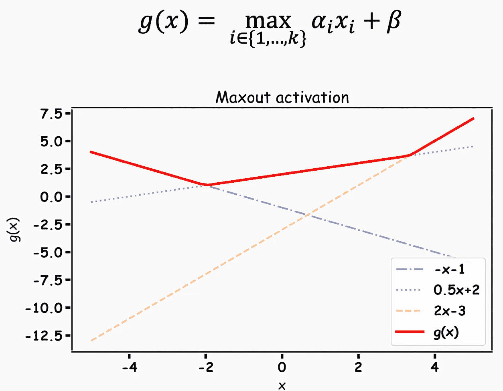

**Swish:自门控激活功能**

目前，最成功和最广泛使用的激活函数是 ReLU。然而，在一些具有挑战性的数据集上，swish 往往比 ReLU 更好地依赖于更深层次的模型。Swish 是谷歌在 2017 年开发的。

Swish 本质上是 sigmoid 函数乘以 *x:*

***f(x)= x∑(x)***

引起消失梯度问题的 ReLU 的主要问题之一是，对于输入 *x* ***的一半值，其导数为零。*** 这是有问题的，因为它会导致神经网络中很大比例的死亡神经元(高达 40%)。另一方面，Swish 是一个平滑的非单调函数，不会遇到零导数的问题。

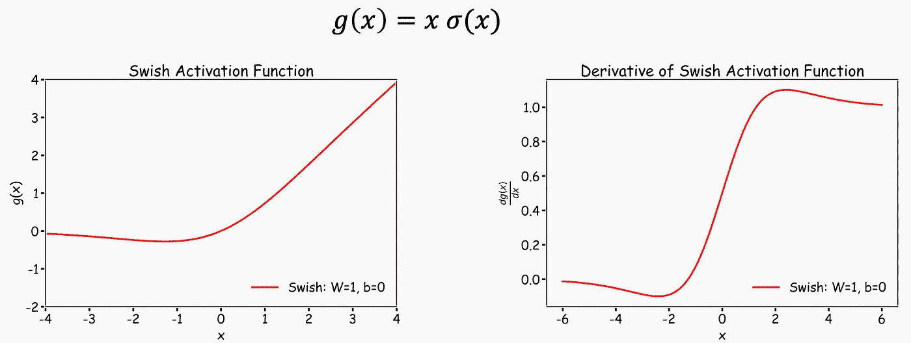

Swish 仍然被视为对神经网络的一种有点神奇的改进，但结果表明，它为深度网络提供了明显的改进。要了解更多这方面的内容，我建议查看 arxiv 上的原始文章:

 [## 搜索激活功能

### 深度网络中激活函数的选择对训练动态和任务效率有重要影响

arxiv.org](https://arxiv.org/abs/1710.05941) 

在下一节中，我们将更详细地讨论损失函数。

# **损失函数**

损失函数(也称为成本函数)是神经网络的一个重要方面。我们已经讨论过使用优化过程来训练神经网络，该优化过程需要损失函数来计算模型误差。

有许多函数可以用来估计神经网络中一组权重的误差。然而，我们更喜欢一个函数，其中候选解的空间映射到一个平滑(但高维)的景观上，优化算法可以通过迭代更新模型权重来合理地导航该景观。

一般来说，最大似然法为训练神经网络和机器学习模型时选择损失函数提供了框架。因此，要使用的损失函数取决于输出数据分布，并与输出单元紧密耦合(下一节讨论)。

交叉熵和均方误差是训练神经网络模型时使用的两种主要类型的损失函数。

然而，采用最大似然法有几个原因，但主要是因为它产生的结果。更具体地，在输出层中使用 sigmoid 或 softmax 激活函数的用于分类的神经网络使用交叉熵损失函数比使用均方误差学习得更快且更稳健。

> 交叉熵损失的使用极大地提高了具有 sigmoid 和 softmax 输出的模型的性能，这些模型之前在使用均方误差损失时会出现饱和和学习缓慢的问题
> 
> —第 226 页，[深度学习](https://amzn.to/2NJW3gE)，2016。

训练数据和模型分布之间的交叉熵(即负对数似然)采用以下形式:

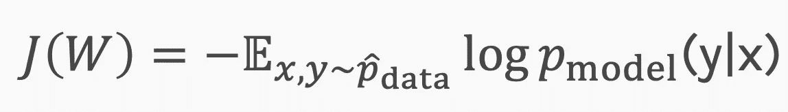

下面是一个结合均方误差损失的 sigmoid 输出示例。

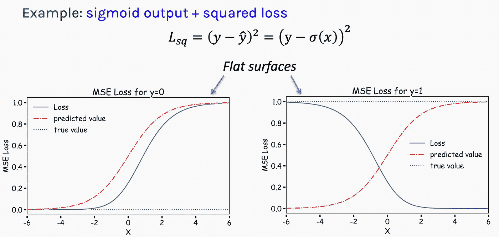

将上面的例子与下面使用 sigmoid 输出和交叉熵损失的例子进行对比。

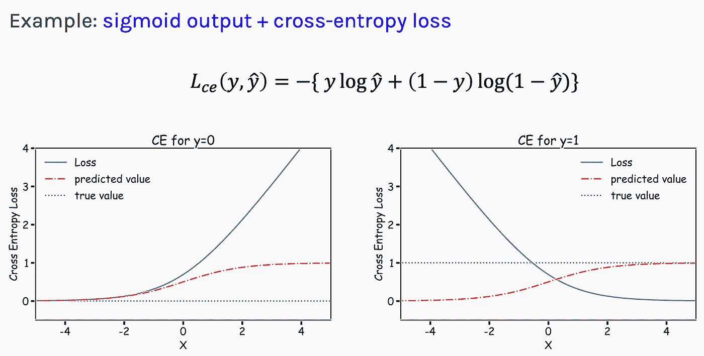

在下一节中，我们将处理输出单位，并更明确地讨论损失函数和输出单位之间的关系。

# **输出单位**

我们已经在激活函数一节中详细讨论了输出单元，但是最好把它说清楚，因为这是很重要的一点。忘记使用正确的输出函数并花费数小时对性能不佳的网络进行故障排除是相对容易的。

对于二元分类问题，例如确定医院病人是否患有癌症 *(y=1)* 或没有癌症 *(y=0)* ，sigmoid 函数用作输出。

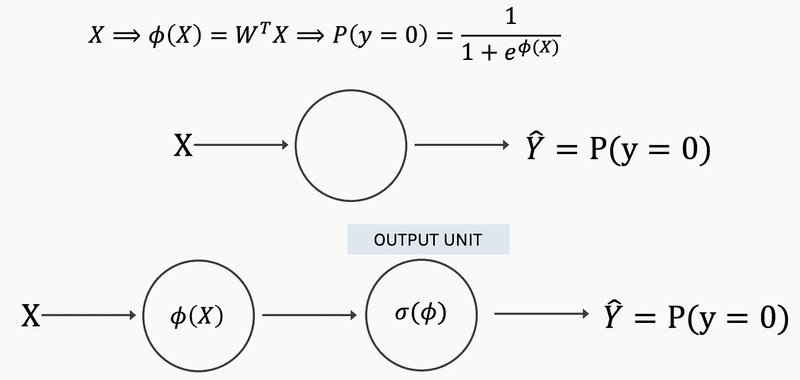

Sigmoid output function used for binary classification.

用于多类分类，例如我们试图将图像过滤为狗、猫和人类类别的数据集。这使用了 sigmoid 函数的多维推广，称为 softmax 函数。

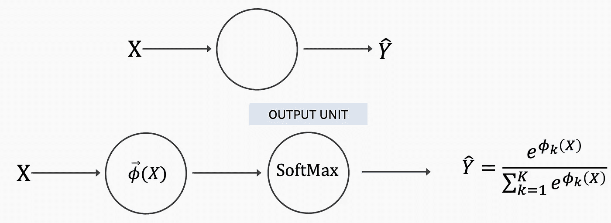

Softmax function for multiclass classification output units.

在每种情况下，还应该使用与输出类型兼容的特定损失函数。例如，对二进制数据使用 MSE 没有什么意义，因此对于二进制数据，我们使用二进制交叉熵损失函数。当进入更复杂的深度学习问题时，生活变得更加复杂，例如生成对抗网络(GANs)或自动编码器，如果你对学习这些类型的深度神经架构感兴趣，我建议看看我关于这些主题的文章。

下表总结了数据类型、分布、输出图层和成本函数。

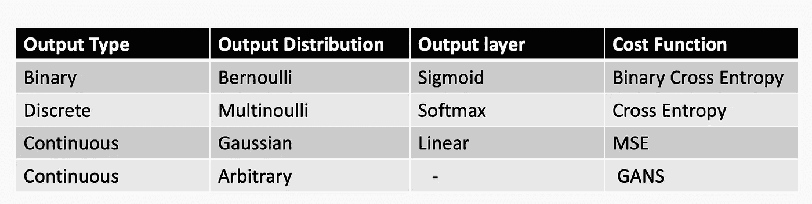

在最后一节中，我们将讨论架构如何影响网络逼近函数的能力，并了解开发高性能神经架构的一些经验法则。

# 体系结构

在本节中，我们将研究如何使用神经网络对函数 *y=x sin(x)* 进行建模，以便了解不同的架构如何影响我们对所需函数进行建模的能力。我们将假设我们的神经网络正在使用 ReLU 激活函数。

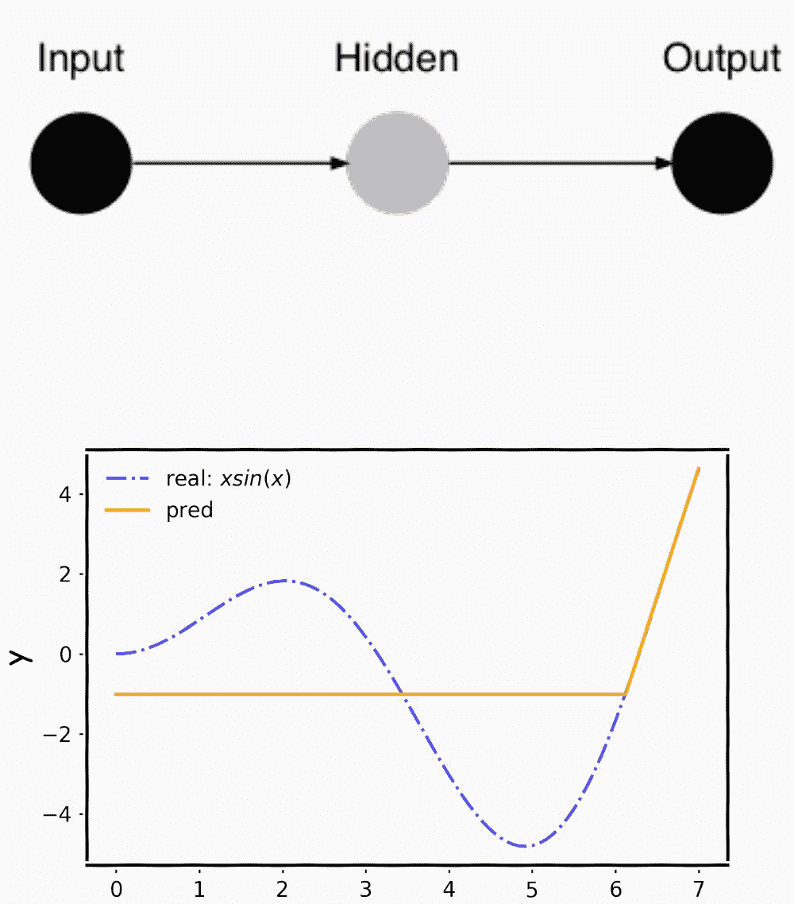

只有一个隐藏层的神经网络只给了我们一个自由度。因此，我们最终得到了一个非常差的函数近似值——注意，这只是一个 ReLU 函数。

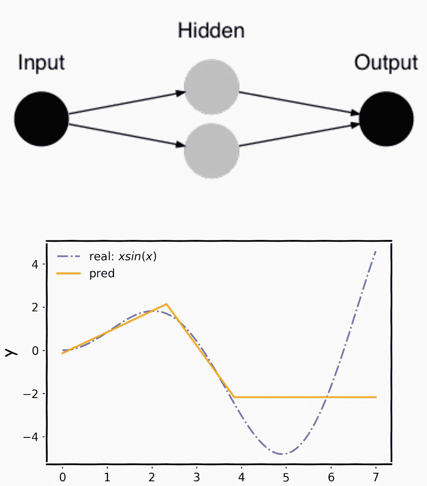

在隐藏层中添加第二个节点给了我们另一个自由度，所以现在我们有两个自由度。与以前相比，我们的近似值现在有了显著的提高，但仍然相对较差。现在我们将尝试添加另一个节点，看看会发生什么。

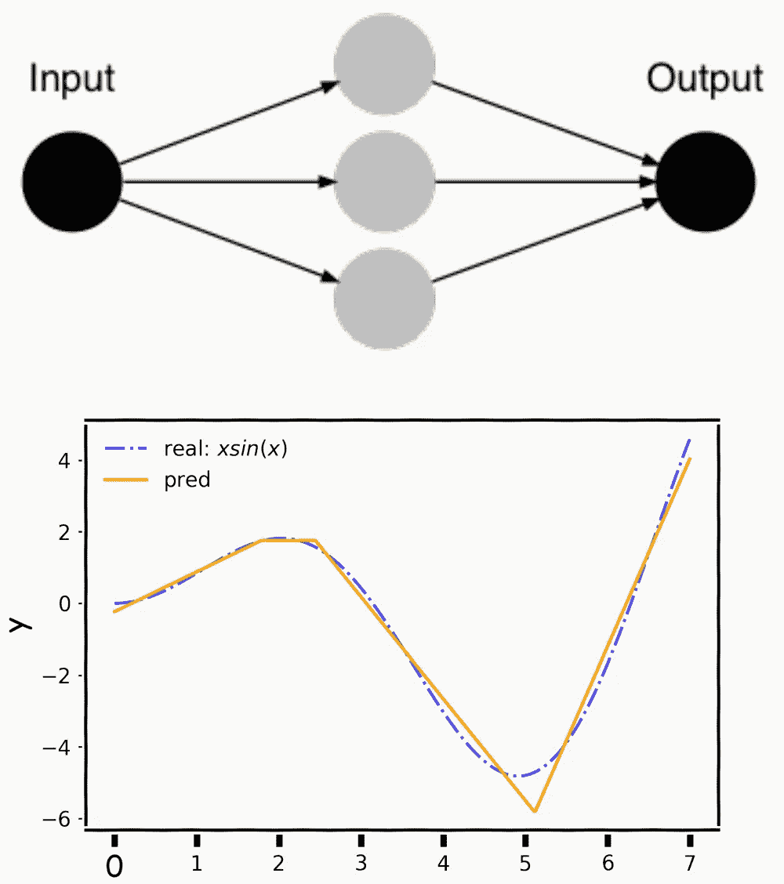

有了第三个隐藏节点，我们增加了另一个自由度，现在我们的近似开始让人想起所需的函数。如果我们添加更多的节点会发生什么？

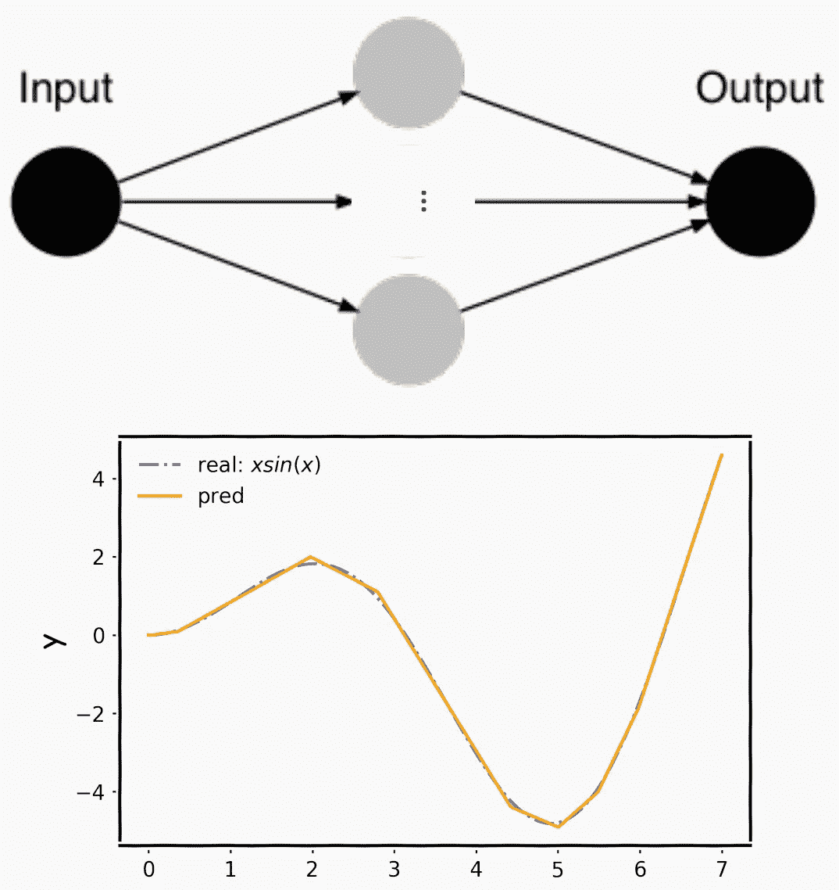

我们的神经网络现在可以很好地逼近这个函数，只需要一个隐藏层。如果我们使用多个隐藏层，我们会看到什么不同？

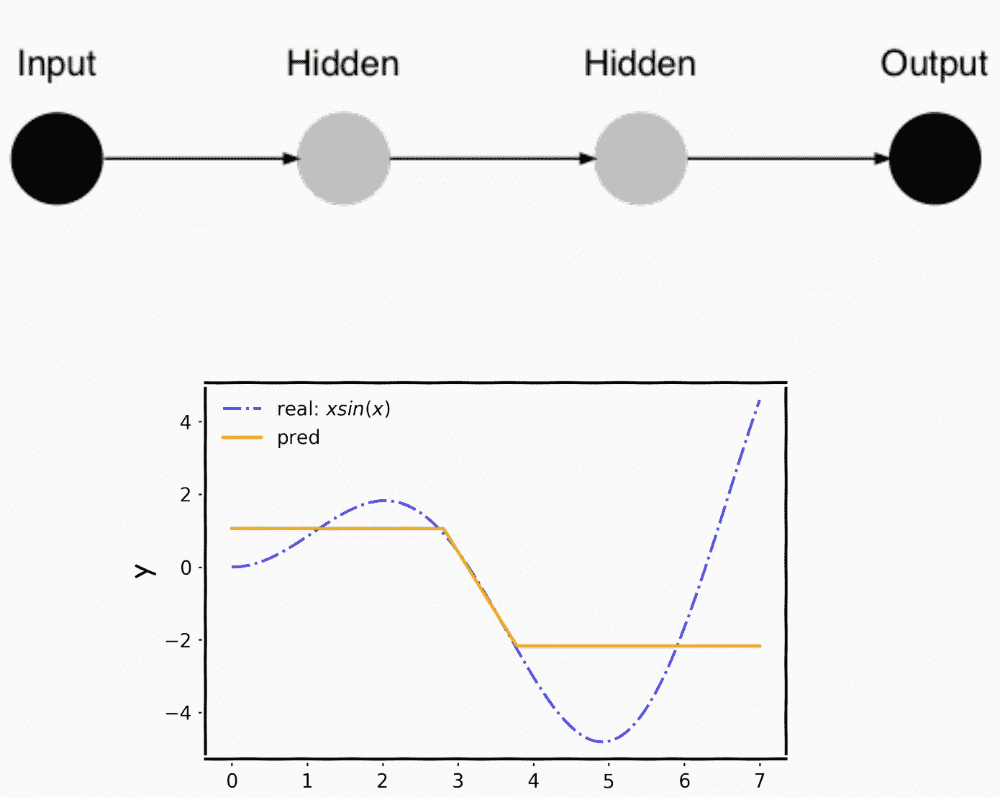

这个结果看起来类似于我们在一个隐藏层中有两个节点的情况。但是，请注意，结果并不完全相同。如果我们在两个隐藏层中添加更多的节点会发生什么？

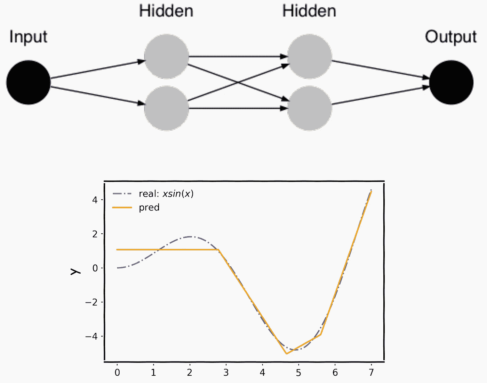

我们看到自由度的数量又增加了，正如我们所预料的那样。但是，请注意，自由度的数量比单个隐藏层少。我们将看到这一趋势在更大的网络中继续。

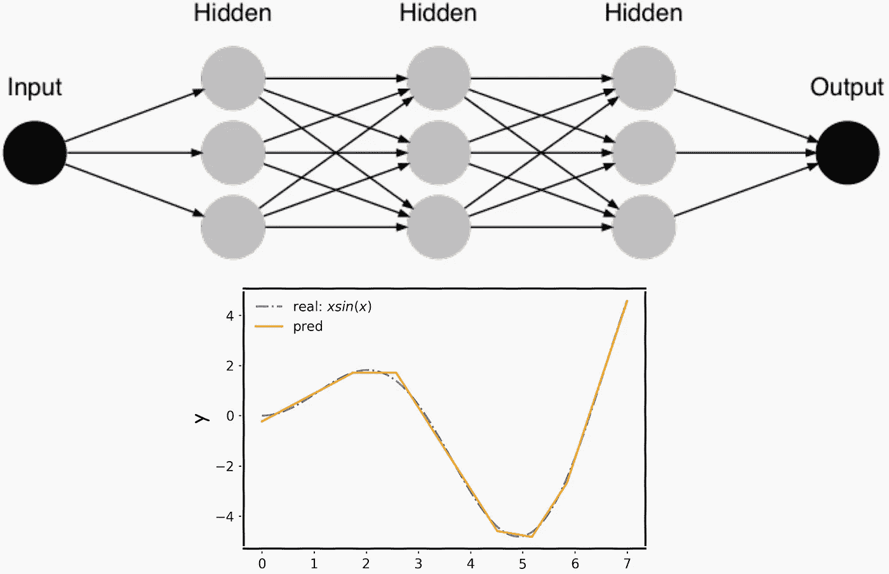

我们的神经网络有 3 个隐藏层，每层有 3 个节点，这很好地逼近了我们的函数。

为神经网络选择架构不是一件容易的事情。我们希望选择一个足够大的网络架构来近似感兴趣的功能，但又不能大到需要花费过多时间来训练。大型网络的另一个问题是，它们需要大量的数据来训练——你不能在一百个数据样本上训练一个神经网络，并期望它在一个看不见的数据集上获得 99%的准确性。

一般来说，使用多个隐藏层以及隐藏层中的多个节点是一种很好的做法，因为这样似乎可以获得最佳性能。

Ian Goodfellow(生成对抗网络的创始人)已经表明，增加神经网络的层数往往会提高整体测试集的准确性。

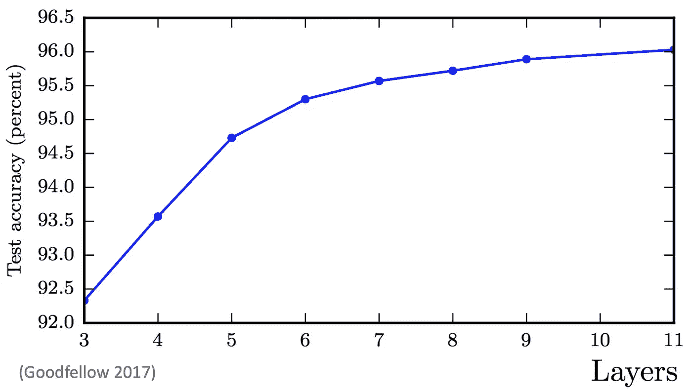

同一篇论文还表明，大型浅网络往往更容易过度拟合——这是使用深度神经网络而不是浅神经网络的一个刺激因素。

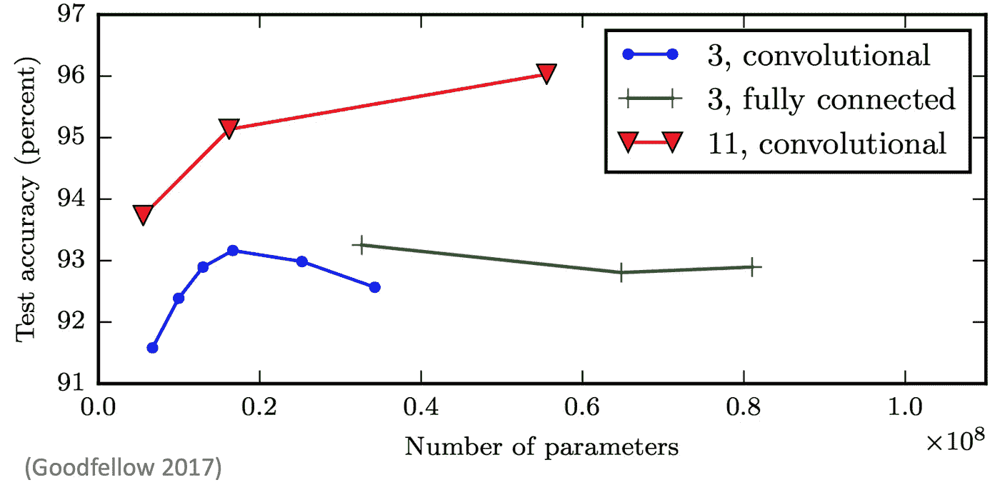

选择隐藏层和节点将在接下来的教程中进行更详细的评估。

# 最终意见

我希望您现在对神经网络是如何构建的有了更深入的了解，并且现在更好地理解不同的激活函数、损失函数、输出单元以及神经架构对网络性能的影响。

未来的文章将着眼于涉及深度神经网络优化的代码示例，以及一些更高级的主题，如选择适当的优化器、使用 dropout 防止过度拟合、随机重启和网络集成。

关注神经网络优化的第三篇文章现已发布:

 [## 神经网络优化

### 涵盖优化器，动量，自适应学习率，批量标准化，等等。

medium.com](https://medium.com/@matthew_stewart/neural-network-optimization-7ca72d4db3e0) 

## 时事通讯

关于新博客文章和额外内容的更新，请注册我的时事通讯。

 [## 时事通讯订阅

### 丰富您的学术之旅，加入一个由科学家，研究人员和行业专业人士组成的社区，以获得…

mailchi.mp](https://mailchi.mp/6304809e49e7/matthew-stewart) 

# 进一步阅读

深度学习课程:

*   吴恩达的机器学习课程有一个很好的神经网络介绍部分。
*   杰弗里·辛顿的课程:[用于机器学习的 Coursera 神经网络(2012 年秋季)](https://www.coursera.org/course/neuralnets)
*   [迈克尔·尼尔森的免费书籍*神经网络和深度学习*](http://neuralnetworksanddeeplearning.com/)
*   约舒阿·本吉奥、伊恩·古德菲勒和亚伦·库维尔写了一本关于深度学习的书
*   [雨果·拉罗歇尔在舍布鲁克大学的课程(视频+幻灯片)](http://info.usherbrooke.ca/hlarochelle/neural_networks/content.html)
*   [斯坦福大学关于无监督特征学习和深度学习的教程(吴恩达等人)](http://ufldl.stanford.edu/wiki/index.php/Main_Page)
*   [牛津大学 2014-2015 年 ML 课程](https://www.cs.ox.ac.uk/people/nando.defreitas/machinelearning/)
*   [英伟达深度学习课程(2015 年夏季)](https://developer.nvidia.com/deep-learning-courses)
*   [谷歌在 Udacity 上的深度学习课程(2016 年 1 月)](https://www.udacity.com/course/deep-learning--ud730)

面向 NLP:

*   [斯坦福 CS224d:自然语言处理的深度学习(2015 年春季)作者 Richard Socher](http://cs224d.stanford.edu/syllabus.html)
*   [NAACL HLT 2013 上的教程:自然语言处理的深度学习(无魔法)(视频+幻灯片)](http://nlp.stanford.edu/courses/NAACL2013/)

以视觉为导向:

*   [用于视觉识别的 CS231n 卷积神经网络](http://cs231n.github.io/)作者 Andrej Karpathy(之前的版本，更短更不完善:[黑客的神经网络指南](http://karpathy.github.io/neuralnets/))。

重要的神经网络文章:

*   [神经网络中的深度学习:概述](https://www.sciencedirect.com/science/article/pii/S0893608014002135)
*   [利用神经网络的持续终身学习:综述——开放存取](https://www.sciencedirect.com/science/article/pii/S0893608019300231)
*   [储层物理计算的最新进展:综述—开放存取](https://www.sciencedirect.com/science/article/pii/S0893608019300784)
*   [脉冲神经网络中的深度学习](https://www.sciencedirect.com/science/article/pii/S0893608018303332)
*   [集成神经网络(ENN):一种无梯度随机方法——开放存取](https://www.sciencedirect.com/science/article/pii/S0893608018303319)
*   [多层前馈网络是通用逼近器](https://www.sciencedirect.com/science/article/pii/0893608089900208)
*   [深度网络与 ReLU 激活函数和线性样条型方法的比较——开放访问](https://www.sciencedirect.com/science/article/pii/S0893608018303277)
*   [脉冲神经元网络:第三代神经网络模型](https://www.sciencedirect.com/science/article/pii/S0893608097000117)
*   [多层前馈网络的逼近能力](https://www.sciencedirect.com/science/article/pii/089360809190009T)
*   [关于梯度下降学习算法中的动量项](https://www.sciencedirect.com/science/article/pii/S0893608098001166)