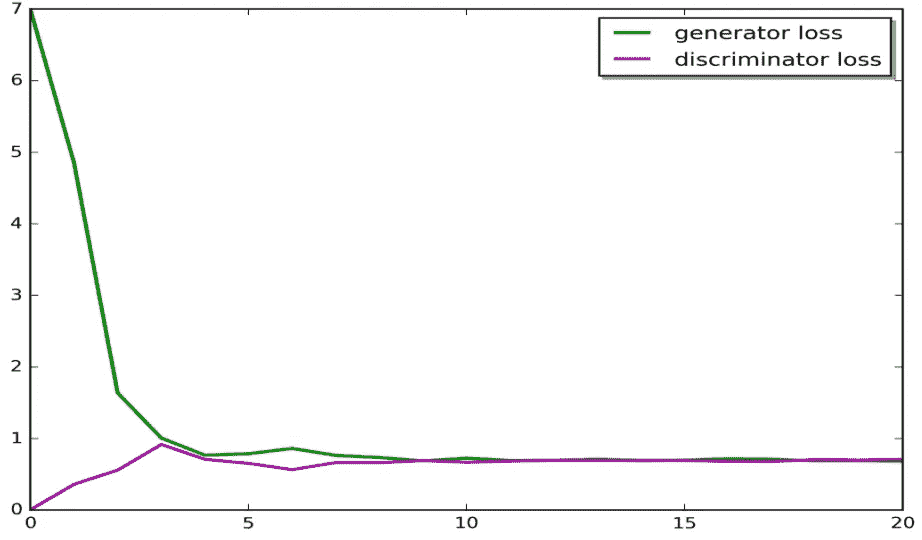
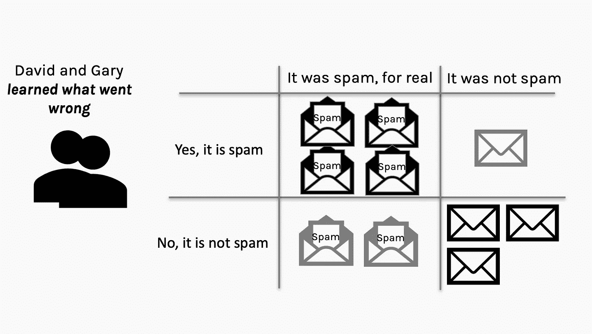

# 图灵学习和 GANs 简介

> 原文：<https://towardsdatascience.com/comprehensive-introduction-to-turing-learning-and-gans-part-1-81f6d02e644d?source=collection_archive---------3----------------------->

## 想把马变成斑马？制作 DIY 动漫人物或名人？生成敌对网络是你新的最好的朋友。

生成对抗网络是过去 10 年机器学习中最有趣的想法——**扬·勒村，脸书人工智能研究中心主任**

第 2 部分已发布，可在此处找到:

 [## GANs 中的高级主题

### 想把马变成斑马？制作 DIY 动漫人物或名人？生成敌对网络是…

towardsdatascience.com](/comprehensive-introduction-to-turing-learning-and-gans-part-2-fd8e4a70775) 

第 3 部分已发布，可在此处找到:

 [## GANs 与自动编码器:深度生成模型的比较

### 想把马变成斑马？制作 DIY 动漫人物或名人？生成敌对网络是…

medium.com](https://medium.com/@matthew_stewart/gans-vs-autoencoders-comparison-of-deep-generative-models-985cf15936ea) 

这个由三部分组成的教程是我的深度生成模型系列的继续。这个关于图灵学习和 GANs 的话题是对之前关于变分自动编码器话题的自然延伸(在这里可以找到)。我们将看到 GANs 在很大程度上优于变分自动编码器，但是众所周知很难使用。

Taxonomy of deep generative models. This article’s focus is on GANs.

在本教程中，我们将探讨以下主题:

*   图灵学习和 GANs 的动机
*   甘斯的基础
*   网络培训
*   网络建设
*   GAN 挑战
*   GAN 经验法则(GANHACKs)

本教程的第 1 部分将不会有编码(否则本教程将会非常长)，第 2 部分将作为当前教程的延续，将深入到 GANs 的更高级的方面，使用一个简单的编码实现来生成名人脸。教程的第三部分将是一个应用 VAEs，GANs 和 VAE-GANs 生成名人脸和动画图像的编码教程。第二部分和第三部分将在下周出版。

GANs 是一个快速发展的话题，本教程涵盖了截至 2019 年 4 月 GANs 的最新进展。如果你在这个日期之后阅读，那么要小心，这个领域可能已经有了发展，经验法则也有了改变。

我的目标是让这篇文章成为最全面、最容易理解的关于 GANs 的教程，如果你有任何改进这篇文章的建议，请告诉我。

所有相关代码现在都可以在我的 GitHub 存储库中找到:

 [## 龙熊先生/甘-教程

### GitHub 是超过 5000 万开发人员的家园，他们一起工作来托管和审查代码、管理项目和构建…

github.com](https://github.com/mrdragonbear/GAN-Tutorial) 

让我们开始吧！

Horse/zebra image translation using a pre-trained DC-GAN.

# 图灵学习和 GANs 的动机

希望你正在读这篇文章，因为你对 GANs 及其工作方式一无所知(或者相对来说知之甚少)。在这一部分，我希望让你对 GANs 的潜力感到兴奋，以及它们如何被用来解决现实世界的问题，以及产生假名人、动漫人物等的乐趣。

在以前的文章中，我们关注于使用自动编码器生成数据。然而，这种方法产生的图像分辨率不是很高。在本文中，我们将研究一种完全不同的方法来生成类似于训练数据的数据。

这项技术让我们能够生成远远超出 VAE 所能提供的数据类型。GAN 基于一个聪明的想法，其中两个不同的网络相互竞争，目标是让一个网络创建不同于训练数据的新样本，但仍然足够接近，以至于另一个网络无法区分哪些是合成的，哪些属于原始训练集。

像以前一样，我们想要构建我们的生成模型，我们想要训练它从**开始**生成这样的光曲线。在这种情况下，生成模型可以是一个大型神经网络，它输出光曲线:来自模型的**样本。**

如果你不熟悉生成模型或变型自动编码器的概念，你可能首先想阅读我以前的文章，[自动编码器综合介绍](/generating-images-with-autoencoders-77fd3a8dd368)。

为了让你了解 GANs 现在在学术界有多重要，请看下图，该图显示了该领域每月发表的论文数量的增长。

# 甘斯的基础

很有可能你之前听说过生成对抗网络，但可能没听说过图灵学习。本质上，图灵学习是 GAN 基础过程的一般化。

“图灵”一词来自与图灵测试的相似之处，在图灵测试中，计算机试图欺骗系统，让它认为自己是人类。正如我们将看到的，这类似于 GAN 中发生器的目标，它试图欺骗它的“对手”，即鉴别器。对 GANs 进行一般化的需求源于这样一个事实，即图灵学习可以用任何形式的生成器或鉴别器来执行，而不一定是神经网络。

使用神经网络在图灵学习中很常见的主要原因是神经网络是一个通用函数逼近器。也就是说，我们能够使用神经网络(假设它具有足够的容量，即大量的节点)来“学习”输入和输出之间的非线性映射。这给了神经网络比大多数方法更多的自由，因为它们保证收敛于任何非线性函数(给定无限的网络容量和无限的训练数据——参见[通用逼近定理](https://en.wikipedia.org/wiki/Universal_approximation_theorem)了解更多信息)。

对于生成器或鉴别器的形式没有真正的限制，它们甚至不需要具有相同的形式。然而，使用除神经网络之外的任何东西都可能增加模型的偏差。例如，可以对生成器和鉴别器都使用支持向量机；类似地，支持向量机用于生成器，神经网络用于鉴别器。

本教程的很大一部分(主要在第 2 部分)将着眼于生成类似于下面的动画图像，使用 VAE，然后是 GAN，然后是 VAE-GAN(稍后将详细介绍)。

Anime images from our ‘GANIME’ training set.

现在，我们将更具体地研究 GAN 的结构。正如我们已经讨论过的，生成器的工作是制造看起来像训练集的假图像(至少在图像分析的情况下)。鉴别者看着这张假图像，试图鉴别它是真是假。发生器和鉴频器的损耗函数高度依赖于鉴频器的工作表现。

经过充分的训练后，生成器将变得更好，图像将开始看起来更逼真。

示意性地，我们可以将生成器和鉴别器表示为黑盒模型，这是某种形式的函数的抽象。这个函数可以(像机器学习中一样)用我们的无所不包的函数近似器，神经网络来近似。

生成器的输入是 noize *z，*，生成的样本将是我们的生成器函数的输出， *G(z)* 。然后，将生成的图像任意添加到鉴别器的输入数据中，鉴别器随后执行二元分类(即伪造或非伪造)，并根据图像实际上是否是伪造的来分配分数。

发生器和鉴频器的损耗函数起初看起来有点吓人，但实际上非常简单。 *G(z)* 是我们的生成器的输出，即伪图像， *D(G(z))* 是鉴别器对我们的伪数据的预测， *m* 是样本数。我们使用对数，因为它作为损失函数在数值上更稳定，并且我们取损失函数相对于参数的梯度，以便我们可以应用随机梯度下降。

如果这听起来像胡言乱语，那么不用担心，本教程的很大一部分将解释生成器和鉴别器的更新和改进。

## 博弈论

甘斯的整个想法是基于博弈论。对于那些不知道的人，博弈论分析游戏是为了想出如何获胜的理想策略。它已经变得与人工学习相对交织在一起，并且是计算机能够在几乎所有现存的棋盘游戏中击败世界冠军的原因。最近令人印象深刻的可能是围棋，人工智能 AlphaGo 能够击败世界冠军[柯洁](https://en.wikipedia.org/wiki/Ke_Jie)。

有些游戏，资源是无界的。例如，在一场扑克比赛中，彩池理论上可以无限制地变得越来越大。对于许多游戏来说，资源是有限的，这意味着一个玩家只能以牺牲另一个玩家的利益为代价来获胜；这就是所谓的零和游戏。

**零和游戏:**玩家争夺固定且有限的资源池。玩家争夺资源，声称他们和每个玩家的资源总数可以改变，但资源总数保持不变。

在零和游戏中，每个玩家都可以尝试设置一些东西，使得另一个玩家的最佳策略尽可能不占优势。这被称为**最小最大**或**最小最大**技术。

我们训练 GAN 的目标是产生两个尽可能好的网络。换句话说，我们最终没有“赢家”

相反，鉴于另一个网络有能力挫败它，两个网络都达到了它们的峰值能力。博弈论专家称这种状态为纳什均衡，每个网络相对于其他网络都处于最佳状态。这个想法如下图所示。

Loss function vs. number of epochs for discriminator and generator networks — flat line is Nash equilibrium.

为了查看在潜在表示中的纳什均衡方面发生了什么，下面我们绘制了生成器和鉴别器，以及它们的分布，作为时期的函数。我们看到分布逐渐收敛。

## 垃圾邮件过滤器示例

垃圾邮件过滤是思考生成性敌对网络如何工作的一个好方法。这类似于我描述的变分自动编码器，但不完全相同。

假设你有一个叫 Gary 的营销人员，他正试图通过 David 的垃圾邮件过滤器接收垃圾邮件。大卫被允许在垃圾邮件过滤器确认后将邮件分类为垃圾邮件。Gary 希望通过尽可能多的垃圾邮件，而 David 希望通过的垃圾邮件越少越好。理想情况下，我们最终会从这样的场景中达到纳什均衡(虽然我确信大多数人不希望垃圾邮件！).

在收到一堆电子邮件后，David 可以检查垃圾邮件过滤器的表现，并通过告诉垃圾邮件过滤器何时出现误报或漏报来“惩罚”它。

假设 Gary 也知道他的哪些垃圾邮件通过了(也许他也将它们发送给自己以验证成功)，那么 David 和 Gary 都可以以混淆矩阵的形式看到他们在各自的任务中做得有多好(如下)。

在这之后，他们都可以学习哪里出了问题，然后从他们的错误中学习。Gary 将尝试一种不同的方法，这种方法利用了他以前的成功经验，David 将发现垃圾邮件过滤器的问题所在，并尝试改进过滤机制。

我们可以不断重复这个过程，直到我们获得某种形式的纳什均衡(或者两个人中的一个找到了获胜的最佳方式，并“抛弃”了这个方法，从而导致模态崩溃——稍后将详细介绍)。

我们可以考虑混淆矩阵，并以此为基础来改进我们的生成器和鉴别器。例如，如果该电子邮件实际上是垃圾邮件，并且被归类为假邮件，则生成器做得很差，必须做得更好。在这个意义上，鉴别器不需要做任何事情，它已经完成了它的工作。

在假阴性的情况下(电子邮件不是垃圾邮件，但它被归类为垃圾邮件)，它是被愚弄的鉴别器。在这种情况下，鉴别器必须做得更好，而生成器已经正确地完成了它的工作，不需要改进。

在误报的情况下(当它实际上是垃圾邮件时被分类为真实邮件)，再次是鉴别器出了问题。然后必须更新鉴别器，而生成器不做任何事情。

对于真正的否定(该电子邮件不是垃圾邮件，也没有被归类为垃圾邮件)，生成器和鉴别器都不需要更新，因为任何不正确的事情都不需要更新。

## 发生器和鉴别器

鉴别器很简单。它将一个样本作为输入，其输出是一个单一值，该值报告了网络对输入来自训练集而不是假的的信心。鉴别器是什么没有太多限制。

生成器接受一串随机数作为输入。如果我们构建确定性的生成器，那么相同的输入将总是产生相同的输出。在这个意义上，我们可以把输入值看作潜在变量。但是这里的潜在变量不是通过分析输入数据发现的，就像 VAE 一样。随机噪声不是“随机”的，而是在“潜在”空间中表示(在我们的例子中是电子邮件)。

这一过程被称为“学习循环”,完成三项工作:

**【1】**鉴别器学习识别表征真实样本的特征。

**【2】**鉴别器学习识别暴露假样本的特征。

**【3】**生成器学习如何避免包含鉴别器已经学会发现的特征。

最终的网络看起来会像下面这样。简单总结一下这是如何工作的，从一些先验分布中抽取一个随机样本，将其输入到生成器中以生成一些假图像。这个假图像与真实数据一起被馈送到鉴别器网络，该网络然后决定哪些数据来自真实数据集，哪些数据来自先前分布产生的假数据。

现在，我们将转到网络培训，更定量、更明确地了解培训的执行情况。

# 网络培训

就我们的网络而言，我们需要训练两个网络。这变得很有趣，因为两个网络具有相同的总价值函数，但损失函数略有不同。鉴别器试图最大化总价值函数，而生成器试图最小化鉴别器的价值函数。

培训方法包括以下内容:

*   采样小批量的训练图像 *x* ，以及生成器代码 *z.*
*   使用反向传播更新 *G* 和 *D* (可选:一个玩家每走一步，另一个玩家就走 *k* 步，典型的比例是 4:1 的 *D* : *G*

**假阴性(I: Real/D: Fake):** 在这种情况下，我们将 Real 馈送给鉴别器。生成器根本不参与这一步。这里的误差函数只涉及鉴别器，如果它犯了一个错误，误差驱动反向传播步骤通过鉴别器，更新它的权重，以便它能更好地识别实数。

**真负(I:假/D:假):**我们从进入生成器的随机数开始。发电机的输出是假的。如果这个假的被正确地识别为假的，error 函数得到一个大的值，这意味着生成器被捕获了。反向传播通过鉴别器(被冻结)到达发生器。然后更新生成器，这样它可以更好地学习如何欺骗鉴别器。

**假阳性(I:Fake/D:Real):** 这里我们生成一个假的，如果它把它归类为真的，就惩罚鉴别器。

为了以一种不太抽象的形式来说明这种训练，我们将通过另一个比垃圾邮件过滤稍微复杂一些的例子来说明。

我们有生成的(假的)分布，它是由我们的生成模型产生的，我们有一个已知的真实分布。两者之间存在相关的 KL 散度，因为它们不是相同的分布，这意味着我们的损失函数非零。

然后，鉴别器会看到来自生成分布和真实分布的输入。如果鉴别器判定数据来自发生器，这将生成一个损失函数值，该值将传播回发生器并用于更新权重。**重要的是，两个网络中只有一个同时被训练。**

生成器现在已经改进，数据看起来更像真实的分布。

然而，数据仍然不够好，不足以欺骗鉴别器，因此再次更新生成器权重。

生成的分布又一次被更新了，现在鉴别器被忽悠了，它认为生成的数据来自真实的分布。是时候更新鉴别器了！

损失函数用于通过反向传播来更新鉴别器权重。

这个过程(理论上)一直持续到生成的分布与真实分布无法区分，网络达到纳什均衡。

一旦我们的网络建立并训练完毕，我们就可以使用生成器来生成与训练图像没有区别的图像，例如以下在标准 MNIST 数据集上使用的 DC-甘的示例。

DC-GAN on MNIST

GANs 的一个非常有趣的应用是添加或删除不同的属性，如下图所示，在不改变其他属性的情况下，微笑被“添加”到图像中。这也可以在视频编辑中完成，在未来，甚至可能对视频进行后期编辑，以类似的方式删除或添加不同的演员。类似的事情已经在 DeepFakes 的世界中发生了(尽管这种应用在本质上可以被认为是恶意的)。

Source: [https://arxiv.org/pdf/1511.06434v2.pdf](https://arxiv.org/pdf/1511.06434v2.pdf)

这也可以通过其他特质来实现，比如太阳镜。

Source: [https://arxiv.org/pdf/1511.06434v2.pdf](https://arxiv.org/pdf/1511.06434v2.pdf)

上述想法实质上就是本文开始时如何获得马到斑马的过渡图像。

为了让您了解这一领域在过去几年中的改善程度，请从下图中查看 GANs 在 2014 年至 2017 年间的演变。

此外，为了让你知道 GAN 上有多少种“味道”,有很多。虽然我将在第 2 部分更详细地描述 Wasserstein GAN (WGAN ),但我们在本教程结束时生产的 GAN 将是 DCGAN。我还将概述 GANs 如何用于生成时间序列，而不仅仅是图像。

# **网络建设**

要构建的两种主要网络类型是全连接(FC)gan 或深度卷积 gan(DC-gan)。具体使用哪一种取决于提交给网络的培训数据。如果您使用单个数据点，FC 网络更合适；如果您使用映像，DC-GAN 更合适。这两种网络的不同架构如下所示。

Fully connected GAN

Deep Convolutional GAN (DC-GAN) — Alex Radford et al. 2016

使用 GANs 时要考虑的一些经验法则是:

*   最大池不好！用卷积步幅替换所有最大池。
*   使用转置卷积进行上采样。
*   使用批处理规范化。

我们将在下一节关于 GANHACKs 的内容中对此进行更多讨论。

# GAN 经验法则(GANHACKs)

**【1】归一化输入** —归一化-1 和 1 之间的图像，并确保使用 tanh 作为发生器输出的最后一层。

**【2】使用球形 Z** —不要从均匀分布中取样。当进行插值时，通过一个大圆进行插值，而不是从 A 点到 b 点的直线。我建议查看汤姆·怀特的采样生成网络参考代码【https://github.com/dribnet/plat，其中有更多关于这方面的详细信息。

**【3】批量归一化** —为真实图像和虚假图像构建不同的小批量，即每个小批量只需要包含所有真实图像或所有生成的图像。然而，当批量标准化不可行时，另一种方法是使用实例标准化(对于每个样本，减去平均值并除以标准偏差)。

**【4】避免稀疏渐变:** **ReLU，MaxPool —** 如果你有稀疏渐变，GAN 游戏的稳定性会受到(很大)影响。一般来说，泄漏 ReLU 是好的(在发生器和鉴别器中)。

*   **对于下采样，使用:**平均池，Conv2d + stride
*   **对于上采样，使用:** PixelShuffle，ConvTranspose2d + stride

如果你不熟悉 PixelShuffle，你可以在这里阅读一整篇文章:[https://arxiv.org/abs/1609.05158](https://arxiv.org/abs/1609.05158)。

**【5】使用软噪声标签** —标签平滑，即如果你有两个目标标签:Real=1 和 Fake=0，那么对于每个进来的样本，如果是 Real，那么用 0.7 到 1.2 之间的随机数替换标签，如果是 Fake 样本，用 0.0 和 0.3 替换(例如)。这是萨利曼斯等人的建议。艾尔。2016.一种替代方法是让标签对鉴别器产生噪声:在训练鉴别器时偶尔翻转标签。

更多提示见**GANHACKs**(【https://github.com/soumith/ganhacks】T2)。

# **甘挑战**

GANs 有很多问题，但我将在这一节中讨论其中的主要问题，并在第 2 部分中进一步讨论。

**【1】灵敏度** —在实践中使用 gan 的最大挑战是它们对结构和参数的敏感性。如果鉴别器或发生器比另一个好得太快，**另一个将永远无法赶上**。找到正确的组合可能非常具有挑战性。当我们构建新的 GAN 或 DC-GAN 时，通常建议遵循我们上面讨论的经验法则。

**【2】收敛** —没有证据表明 GAN 会收敛。当我们找到正确的参数时，GANs 在大多数时候表现得很好，但除此之外没有任何保证。网络变得越复杂，收敛变得越挑剔，超参数选择变得越困难。

**【3】大样本** —尝试训练 GAN 发生器产生大图像，如 1000x1000 像素，可能会有问题。问题是，对于大图像，鉴别器很容易从真实图像中分辨出生成的假货。许多像素会导致误差梯度，从而导致发生器的输出向几乎随机的方向移动，而不是更接近匹配输入。在大图像上训练 GANs 的最佳程序是:

*   首先调整图像的大小:512x512，128x128，64x64，…，4x4。
*   然后构建一个小的生成器和鉴别器，每个都只有几层卷积。
*   用 4x 4 的图像进行训练，直到它做得很好。
*   给最终的网络增加几个卷积层，现在用 8 乘 8 的图像训练它们。
*   同样，当结果良好时，在每个网络的末端添加更多的卷积层，并在 16 乘 16 的图像上训练它们。

这个过程比我们从一开始只用全尺寸图像训练花费的时间要少得多(并且更有可能收敛)。

**【4】计算** —计算能力、内存、处理大数的时间已经很高了。运行网络直到生成逼真的图像可能需要数小时或数天的训练，即使使用高性能 GPU 也是如此(这就是为什么我们的最终图像与一些论文中的图像相比是不合标准的)。对于更复杂的网络、更大的训练集和更大的图像，这种情况会进一步加剧。

**【5】模式崩溃** —这可能是我们在 GANs 中遇到的最令人沮丧的问题(除了 10 小时的训练时间)。比方说，我想使用 GAN 来生成像 NVIDIA 下面这样的人脸(如下所示)。

Generated images from NVIDIA GAN.

然而，当训练我们的网络时，生成器不知何故找到了一个图像来欺骗鉴别器。

然后，生成器每次都能独立于输入噪声产生图像。鉴别器会一直说是真的，所以生成器已经完成了目标，停止学习。然而，问题是**生成器制作的每个样本都是相同的**。

这个反复产生一个成功输出的问题被称为**模态崩溃**。

当系统产生相同的少量输出或它们的微小变化时，这种情况更为常见。这被称为部分模态折叠。

解决方案是:

*   用一个附加项来扩展鉴频器的损失函数，以测量产生的输出的多样性。
*   如果输出都相同或几乎相同，鉴别器可以将较大的误差分配给结果。
*   发电机将多样化，因为该动作将减少误差

# 最终意见

这是一篇很长的文章，但我希望你现在对这些网络如何工作有一个很好的直觉。作为对在本文中走到这一步的奖励，这里有一条来自原始 GAN 的创作者 Ian Goodfellow 的推文，向你展示了一个有趣的情况，当 GAN 在猫图像上训练时可能会失败，其中一些是模因！

如果您渴望了解更多内容，可以继续学习本教程的第 2 部分:

 [## GANs 中的高级主题

### 想把马变成斑马？制作 DIY 动漫人物或名人？生成敌对网络是…

towardsdatascience.com](/comprehensive-introduction-to-turing-learning-and-gans-part-2-fd8e4a70775) 

教程的第 3 部分也可以在这里找到:

 [## GANs 与自动编码器:深度生成模型的比较

### 想把马变成斑马？制作 DIY 动漫人物或名人？生成敌对网络是…

medium.com](https://medium.com/@matthew_stewart/gans-vs-autoencoders-comparison-of-deep-generative-models-985cf15936ea) 

下面是一些进一步的阅读材料，包括代码、互动练习和一些在 GANs 领域的开创性论文。如果您想了解更多信息、资源等，请随时联系我。

## 时事通讯

关于新博客文章和额外内容的更新，请注册我的时事通讯。

 [## 时事通讯订阅

### 丰富您的学术之旅，加入一个由科学家，研究人员和行业专业人士组成的社区，以获得…

mailchi.mp](https://mailchi.mp/6304809e49e7/matthew-stewart) 

# 进一步阅读

**在 COLAB 中运行 BigGAN:**

*   [https://colab . research . Google . com/github/tensor flow/hub/blob/master/examples/colab/biggan _ generation _ with _ TF _ hub . ipynb](https://colab.research.google.com/github/tensorflow/hub/blob/master/examples/colab/biggan_generation_with_tf_hub.ipynb)

**更多代码帮助+示例:**

*   [https://www . jessicayung . com/explaining-tensor flow-code-for-a-卷积神经网络/](https://www.jessicayung.com/explaining-tensorflow-code-for-a-convolutional-neural-network/)
*   [https://lilian Weng . github . io/lil-log/2017/08/20/from-GAN-to-wgan . html](https://lilianweng.github.io/lil-log/2017/08/20/from-GAN-to-WGAN.html)
*   [https://py torch . org/tutorials/初学者/dcgan_faces_tutorial.html](https://pytorch.org/tutorials/beginner/dcgan_faces_tutorial.html)
*   【https://github.com/tensorlayer/srgan 
*   [https://junyanz.github.io/CycleGAN/](https://junyanz.github.io/CycleGAN/)https://affinelayer.com/pixsrv/
*   [https://tcwang0509.github.io/pix2pixHD/](https://tcwang0509.github.io/pix2pixHD/)

**有影响力的论文:**

*   https://arxiv.org/pdf/1511.06434v2.pdf
*   瓦瑟斯坦甘(WGAN)[https://arxiv.org/pdf/1701.07875.pdf](https://arxiv.org/pdf/1701.07875.pdf)
*   条件生成对抗网(CGAN)[https://arxiv.org/pdf/1411.1784v1.pdf](https://arxiv.org/pdf/1411.1784v1.pdf)
*   使用拉普拉斯金字塔对抗网络的深度生成图像模型[https://arxiv.org/pdf/1506.05751.pdf](https://arxiv.org/pdf/1506.05751.pdf)
*   使用生成式对抗网络的照片级单幅图像超分辨率[https://arxiv.org/pdf/1609.04802.pdf](https://arxiv.org/pdf/1609.04802.pdf)
*   使用循环一致对抗网络的不成对图像到图像翻译[https://arxiv.org/pdf/1703.10593.pdf](https://arxiv.org/pdf/1703.10593.pdf)
*   InfoGAN:通过信息最大化生成对抗网络的可解释表示学习[https://arxiv.org/pdf/1606.03657](https://arxiv.org/pdf/1606.03657)
*   https://arxiv.org/pdf/1704.00028.pdf
*   对 Wasserstein GANs (WGAN-GP)的改进培训[https://arxiv.org/pdf/1701.07875.pdf](https://arxiv.org/pdf/1701.07875.pdf)
*   基于能量的生成对抗网络(EBGAN)[https://arxiv.org/pdf/1609.03126.pdf](https://arxiv.org/pdf/1609.03126.pdf)
*   使用学习的相似性度量(VAE-甘)对像素之外的内容进行自动编码【https://arxiv.org/pdf/1512.09300.pdf 
*   对抗性特征学习(https://arxiv.org/pdf/1605.09782v6.pdf 甘比)
*   堆叠生成敌对网络(SGAN)[https://arxiv.org/pdf/1612.04357.pdf](https://arxiv.org/pdf/1612.04357.pdf)
*   StackGAN++使用堆叠式生成对抗网络进行现实图像合成[https://arxiv.org/pdf/1710.10916.pdf](https://arxiv.org/pdf/1710.10916.pdf)
*   通过对抗训练(SimGAN)从模拟和无监督图像中学习[https://arxiv.org/pdf/1612.07828v1.pdf](https://arxiv.org/pdf/1612.07828v1.pdf)