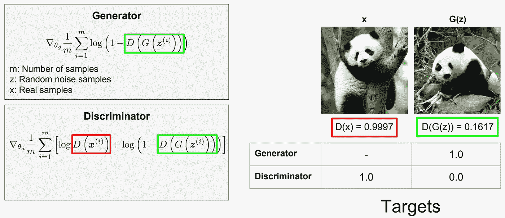
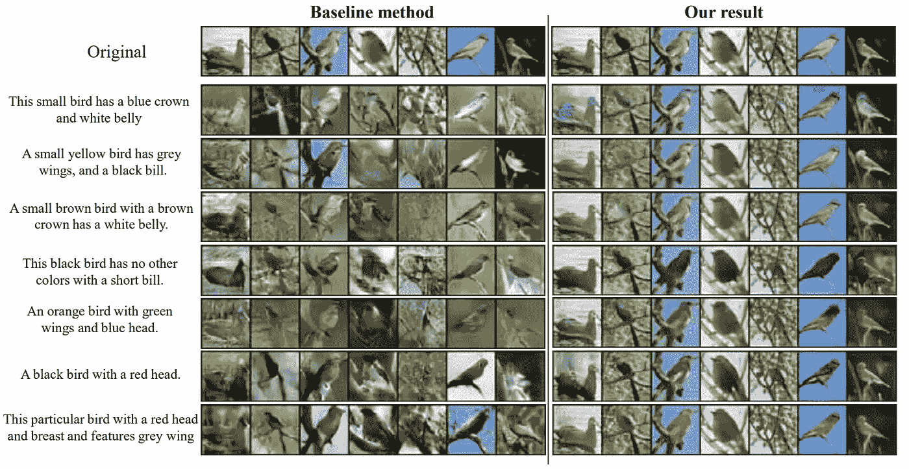
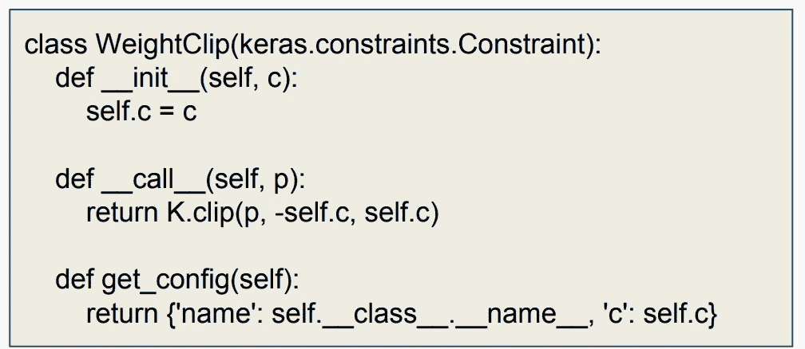

# GANs 中的高级主题

> 原文：<https://towardsdatascience.com/comprehensive-introduction-to-turing-learning-and-gans-part-2-fd8e4a70775?source=collection_archive---------4----------------------->

想把马变成斑马？制作 DIY 动漫人物或名人？生成敌对网络是你新的最好的朋友。

生成对抗网络是过去 10 年机器学习中最有趣的想法——**扬·勒村，脸书人工智能研究中心主任**

本教程的第 1 部分可以在这里找到:

[](/comprehensive-introduction-to-turing-learning-and-gans-part-1-81f6d02e644d) [## 图灵学习和 GANs 简介

### 想把马变成斑马？制作 DIY 动漫人物或名人？生成敌对网络是…

towardsdatascience.co](/comprehensive-introduction-to-turing-learning-and-gans-part-1-81f6d02e644d) 

这是 3 部分教程的第二部分，专门介绍如何使用生成式对抗网络创建深度生成模型。这是对之前关于变型自动编码器的自然延伸(在这里可以找到)。我们将看到 GANs 在很大程度上优于变分自动编码器，但是众所周知很难使用。


Taxonomy of deep generative models. This article’s focus is on GANs.

在本教程中，我们将探讨以下主题:

*   gan 的简短回顾
*   GAN 应用
*   甘斯的问题
*   其他类型的 gan
*   建立形象甘
*   编码教程

本文的大部分将是关于编码 GANs 以及对一些更高级的 GANs 实现的广泛介绍。

所有相关代码现在都可以在我的 GitHub 存储库中找到:

[](https://github.com/mrdragonbear/GAN-Tutorial) [## 龙熊先生/甘-教程

### GitHub 是超过 5000 万开发人员的家园，他们一起工作来托管和审查代码、管理项目和构建…

github.com](https://github.com/mrdragonbear/GAN-Tutorial) 

# gan 的简短回顾

对于那些已经读过第一部分的人来说，你可以跳过这一部分，因为我将会用我之前用熊猫做的例子来重复 gan 是如何机械地工作的。

最近(在过去 5 年左右)引入了生成对抗网络作为训练生成模型的新方法，即创建能够生成数据的模型。它们由两个“对立”模型组成:一个生成模型 *G* 捕捉数据分布，一个判别模型 *D* 估计样本来自训练数据而不是 *G* 的概率。 *G* 和 *D* 都可以是非线性映射函数，例如多层感知器

在生成敌对网络(GAN)中，我们有两个神经网络，它们在零和游戏中相互对抗，其中第一个网络(生成器)的任务是愚弄第二个网络(鉴别器)。生成器创建“假的”数据片段，在这种情况下，是熊猫的图像，试图欺骗鉴别器将图像分类为真的熊猫。我们可以迭代地改进这两个网络，以产生逼真的图像，并执行一些其他非常酷的应用程序，其中一些我们将在本教程的后面讨论。


最初，图像可能相当明显是伪造的，但随着网络变得更好，区分真实和伪造的图像变得更加困难，即使对人类来说也是如此！


这两个网络可以被认为是代表应用于噪声或真实数据的任意复杂函数的黑盒。发生器的输入是一些随机噪声，产生假图像，鉴别器的输入是假样本和来自真实数据集的样本。然后，鉴别器对所提供的图像 *z、*是真实图像 *D(z)=1* 还是伪图像 *D(z)=0 做出二元判定。*


为了训练这两个网络，我们必须有一个损失函数，每个网络的损失函数取决于第二个网络。为了训练网络，我们执行反向传播，同时冻结另一个网络的神经元权重。


如果您在理解正在发生的事情上有困难，我建议您回去阅读第 1 部分，以便更好地了解这个训练过程是如何工作的。



重要的是要注意，一般来说，鉴别器和生成器网络可以是任何形式的映射函数，例如支持向量机。GANs 的这种概括有时被称为图灵学习。然而，实际上，神经网络是最常见的，因为它们是任意非线性函数的广义函数逼近器。

在进入更高级的主题之前，我现在将讨论 GANs 的一些最酷的应用程序，以及旨在生成名人脸和动漫角色的 GANs 代码演练。

# **氮化镓应用**

在这一节中，我将简要介绍我在数据科学研究过程中发现的一些最有趣的 GANs 应用。最常见的话题是:

*   **(条件)合成** —这包括字体生成、文本 2 图像以及 3D 对象生成。
*   **数据增强** —旨在减少对标记数据的需求(GAN 仅用作增强另一个模型的训练过程的工具)。
*   **风格转移和操纵—** 人脸老化、绘画、姿态估计和操纵、修补和混合。
*   **信号超分辨率—** 人为提高图像的分辨率。

## 条件合成

条件合成在我看来相当不可思议。可以说条件合成最吸引人的应用是 Image2Text 和 Text2Image，它能够将一幅图片翻译成文字(整张图片说了一千个字的大话..)，或者反之亦然。

这种技术的应用意义深远，如果不仅仅是对医学图像进行分析以描述图像的特征，从而消除医生对图像的主观分析(这实际上是我目前正在尝试用乳房 x 线照片研究自己的一个附带项目的一部分)。

另一方面也是如此(假设我们给我们的网络一些它能理解的单词)，图像可以完全由单词生成。以下是用于执行文本到图像条件合成的多条件 GAN (MC-GAN)的示例:



Implementation of MC-GAN for translating words into images. Source: [https://arxiv.org/pdf/1902.06068.pdf](https://arxiv.org/pdf/1902.06068.pdf)

## 数据扩充

这一个是相当自明的。gan 学习数据生成分布，就像我们在研究 VAEs 时所做的那样。因此，我们能够从我们的生成器中采样并产生额外的样本，我们可以使用这些样本来扩充我们的训练集。因此，GANs 提供了一种额外的方法来执行数据增强(除了旋转和扭曲图像之外)。

## **风格转移和操作**

风格转移是不言自明的。它包括将一幅图像的“风格”转移到另一幅图像上。这非常类似于神经风格转移，我将在以后的文章中讨论。


Example of style transfer using a GAN.

这对于背景风景来说非常有效，类似于图像过滤，除了我们可以操作实际图像的各个方面(比较上面图像中的输入和输出的云)。

甘在动物或水果等其他物体上表现如何？


看起来很好！如果我对甘斯一无所知，我可能会认为，马的形象，事实上，是一匹斑马后的风格转移。

我们还可以改变场景来操纵季节，这对于视频游戏和虚拟现实模拟器来说是一种潜在的有用操纵。


我们也可以使用 GANs 来改变景深。


我们也可以相对容易地操纵图画，把它们变成真实的物体(然而，这可能需要比我目前所拥有的更多的绘画技能)。


自动驾驶汽车以类似于下图的视图查看世界，这允许以更具对比性的方式查看对象(通常称为语义地图)。


我们甚至可以做风格转换来渲染图像，就像侠盗猎车手的环境一样(对于任何粉丝来说)。

我们也可以用同样的方式把白天变成黑夜。

这是足够的风格转移和图像处理。这有许多很好的应用，但我们已经看到了该技术的一些恶意使用，人们冒充政治人物，创建虚假的电话交谈，电子邮件等。

这实际上是一个这样的问题，美国军方正在开发一个新的法医学领域，以研究视频和媒体的类似例子，以确定它们是否是由 GANs 生成的(哦，我的天，我们生活在一个什么样的世界..).

## 图像超分辨率

图像超分辨率是指从低分辨率图像恢复高分辨率图像的过程，是计算机视觉和图像处理中一类重要的图像处理技术。

一般来说，这个问题非常具有挑战性，并且本质上是不适定的，因为总是有多个 HR 图像对应于单个 LR 图像。


各种深度学习方法已经被应用于处理 SR 任务，从早期的基于卷积神经网络(CNN)的方法(例如，SRCNN)到最近的使用 GAN 的有前途的 SR 方法(例如，SRGAN)。一般来说，使用深度学习技术的 SR 算法家族在以下主要方面彼此不同:不同类型的网络架构、不同类型的损失函数、不同类型的学习原理和策略等。


这样做的过程实际上相当复杂，所以我不会在本文中涉及太多的细节(尽管如果读者感兴趣，我将在以后讨论这个问题)。

有关 GANs 风格转变的全面概述，请参见[此处](https://arxiv.org/pdf/1902.06068.pdf)。

# **甘斯的问题**

在上一篇文章中，我们讨论了 GANs 的一些最基本的问题，主要是所需的大量计算能力、在大图像上训练的难度、灵敏度以及模式崩溃。

我想重申这些问题，因为训练一个甘是非常困难和耗时的。GAN 还有很多其他问题，以至于在学术界(至少在哈佛)，有一个流传的笑话，如果你想培养一个 GAN，你会选择一个不知情且天真的研究生来为你做这件事(我一直是这样一个笑话的受害者)。

## 振动

当发生器和鉴别器共同寻找平衡时，可能发生振荡，但是模型更新是独立的。没有收敛的理论保证，事实上，结果可能会振荡。


对此的解决方案是广泛的超参数搜索，这有时可能需要人工干预。我不建议对已经运行了 10 个小时的东西进行大范围的超参数搜索。

## **消失渐变**

鉴别器可能变得太强而不能为发生器提供信号。我这么说是什么意思？如果发生器变得太好太快(很少反过来发生)，发生器可以学会持续愚弄鉴别器，并且不再需要学习任何东西。


A GAN exhibiting the vanishing gradient problem.

解决方案不是预先训练鉴别器，或者降低它的学习速率。还可以改变每次迭代中生成器/鉴别器的更新次数(正如我在第 1 部分中所推荐的)。

很容易看出 GAN 何时已经收敛，因为两个网络的稳定将出现在中间地带的某个地方(即其中一个网络不占优势)。


The minimax expression for Nash equilibrium in a GAN.

## 模态崩溃

发生器可以折叠，以便总是产生相同的样本。当生成器被限制在小的子空间并因此开始生成低分集的样本时，这可能发生。


Five of the above generated images look identical, and several others seem to occur in pairs.

对此的解决方案是通过小批量鉴别(将整批提交给鉴别者进行审查)或通过特征匹配(即，为低多样性增加一个生成器惩罚)或使用多个 gan 来鼓励多样性。

## **评估指标**

这是我在上一篇文章中没有提到的。gan 仍然在非常定性的基础上进行评估——本质上，这个图像看起来好吗？定义适当的、有点客观的指标是一个惊人的挑战。一台“好”的发电机看起来怎么样？


对于这一点没有确定的解决方案，它仍然是一个活跃的研究领域，并且是非常特定的领域。强分类模型通常用于判断生成样本的质量。两个常用的分数是**初始分数**，和 **TSTR 分数**(合成训练，真实测试)。

Jonathan Hui 有一篇相当全面的文章，解释了用于评估 GAN 性能的最常用指标，您可以在此处找到:

[](https://medium.com/@jonathan_hui/gan-how-to-measure-gan-performance-64b988c47732) [## GAN——如何测量 GAN 性能？

### 在 GANs 中，生成器和鉴别器的目标函数通常衡量它们做得有多好…

medium.com](https://medium.com/@jonathan_hui/gan-how-to-measure-gan-performance-64b988c47732) 

在下一节中，我将概述学术领域中出现的一些最重要的 gan 类型。

# **其他类型的 GANs**

出现了许多其他类型的 GAN 来处理特定领域的问题以及不同类型的数据(例如，时间序列、图像或普通 csv 样式的数据)。

我将在本节讨论的 GAN 类型有:

*   瓦瑟斯坦·甘
*   CycleGAN
*   有条件的 GAN(之前已简要讨论过)

## 瓦瑟斯坦·甘

在我看来，这是甘最重要的类型，所以要注意！

使用标准 GAN 公式，我们已经观察到训练极不稳定。鉴别器通常提高得太快，生成器无法跟上，这就是为什么我们需要调节学习速率或在两个网络中的一个上执行多个历元。为了得到一个像样的输出，我们需要仔细的平衡，即使这样，模式崩溃是相当频繁的。

**信息来源:** Arjovsky，m .，Chintala，s .和 Bottou，l .，2017。瓦瑟斯坦·甘。arXiv 预印本 arXiv:1701.07875。

一般来说，生成模型寻求最小化真实分布和学习分布之间的距离(距离就是一切！).Wasserstein(也称为 EM，运土机)距离，在非正式的术语中，指的是当分布被解释为在一个区域内堆积一定数量的泥土的两种不同方式时*d .*wasser stein 距离是将一堆变成另一堆的最小成本；其中成本假定为移动的灰尘量乘以移动的距离。

不幸的是，在这种情况下精确的计算是很难的。然而，我们可以使用 CNN 来近似 Wasserstein 距离。这里，我们重用了鉴别器，它的输出现在是无界的。我们定义对应于 Wasserstein 损失的定制损失函数:


这里的想法是什么？我们可以对一种类型做尽可能大的预测，对其他类型做尽可能小的预测。

瓦瑟斯坦论文的作者声称:

*   训练期间稳定性更高，不需要仔细平衡发生器和鉴别器。
*   有意义的损失度量，与样品质量密切相关。
*   模态崩溃很少见。

**在 Keras 实现 Wasserstein GAN 的技巧。**

*   保持鉴频器输出无界，即应用线性激活。
*   使用较小的权重进行初始化，以避免从一开始就遇到剪裁问题。
*   记得运行足够的鉴别器更新。这在 WGAN 设置中至关重要。
*   您可以使用 Wasserstein 代理丢失实现。
*   通过实现您自己的 Keras 约束来裁剪鉴别器权重。



这是一个复杂的主题，实现 Wasserstein GAN 不是一项简单的任务。如果你有兴趣在个人项目中追求其中之一，我推荐你阅读我之前提到的原始论文。

## CycleGAN

还记得我们看到的第一张马与斑马互换的照片吗？那是一辆自行车。CycleGANs 将样式转移到图像。这本质上与执行神经类型转移的想法相同，我将在以后的文章中介绍。

举个例子，想象一下拿一个著名的，比如金门大桥的图片，然后从另一个图像中提取风格，这个图像可能是一幅名画，然后按照所说的名画的风格重新绘制大桥的图片。

作为我的神经转移学习文章的引子，这里有一个我以前做过的例子。


Combining the style of the famed “Great Wave off Kanagawa” with the Chicago skyline.

将 GAN 应用于这些类型的问题相对简单，它本质上是图像重建。我们使用第一网络***【G】***将图像 ***x*** 转换为 ***y*** 。我们用另一个深度网络 ***F*** 逆过程重建图像。然后，我们用一个均方误差 MSE 来指导 ***G*** 和 ***F*** 的训练。


这里的不同之处在于，我们实际上并不关心重建图像，我们试图混合两种图像的风格。在 GAN 实现中，鉴别器 ***D*** 被添加到现有设计中，以指导发生器网络更好地执行。 ***D*** 作为训练样本和生成图像之间的评论家。通过这种批评，我们使用反向传播来修改生成器，以产生解决由鉴别器识别的缺点的图像。在这个问题中，我们引入一个鉴别器 ***D*** 来确定 ***Y*** 是否像梵高的画。


CycleGANs 将图片从一个域传输到另一个域。在真实图像和梵高画作之间转换画面。我们建立了三个网络。

*   生成器 ***G*** 将真实图像转换为梵高风格的图片。
*   生成器 ***F*** 将梵高风格的图片转换为真实图像。
*   一个鉴别器 ***D*** 用来鉴别真实的或生成的梵高画。

对于相反的方向，我们只需反转数据流，并建立一个额外的鉴别器来识别真实图像。

下面显示了一个创建斑马/马图像的实现示例。


## 条件 GAN

与 VAEs 一样，GANs 可以简单地进行调整，以生成特定模式的数据。在[这里](https://arxiv.org/pdf/1411.1784.pdf)可以找到关于有条件的 GANs 的很好的参考文件。


如果生成器和鉴别器都以一些额外信息 *c* 为条件，我们可以将 GAN 的生成模型扩展为条件模型。这个 *c* 可以是任何种类的辅助信息，例如类别标签或来自其他模态的数据。我们可以通过将 *c* 作为附加输入层馈入鉴频器和发生器来执行调理。

在生成器中，先前的输入噪声 *p(z)* 和 *c* 被组合在联合隐藏表示中，并且对抗训练框架允许在如何组成该隐藏表示方面有相当大的灵活性。在鉴别器中， *x* 和 *c* 作为输入提供给鉴别功能。

## GANs 故障排除

对于那些喜欢总结的人来说，这只是我们到目前为止讨论过的所有故障排除方法的一个简要概述。

**【1】车型。**确保模型定义正确。您可以通过训练一个普通的图像分类任务来单独调试鉴别器。

**【2】数据。**将输入正常化为[-1，1]。在这种情况下，确保使用 tanh 作为治疗仪的最终激活。

**【3】噪音。**尝试从正态分布(非均匀)中采样噪声矢量。

**【4】正常化。**在可能的情况下使用 BatchNorm，并以单独的小批量发送真假样品。

**[5]激活。**用 LeakyRelu 代替 Relu。

**【6】平滑。**应用标签平滑以避免在更新鉴别器时过度自信，即将真实图像的目标设置为小于 1。

**【7】诊断学。**持续监控梯度的大小。

**【8】消失渐变。**如果鉴别器变得太强(鉴别器损耗= 0)，尝试降低其学习率或更频繁地更新发生器。

现在让我们进入有趣的部分，实际上建立一个 GAN。

# **甘建立形象**

正如我们已经讨论了几次，训练一个甘可以令人沮丧和时间密集。我们将在 Keras 中完成一个简单的例子。这些结果只是在概念验证的层面上，以增进理解。在代码示例中，如果您不仔细调整参数，您将不会超出图像生成的这个级别(见下文)太多:


网络获取一个**图像*【H，W，C】***并输出一个*【M】*的**向量，或者是类分数(分类)或者是量化照片真实感的单个分数。可以是任何图像分类网络，例如 ResNet 或 DenseNet。我们使用简约的定制建筑。**


取一个**噪声*【N】***的矢量，输出一个*【H，W，C】*的**图像。网络必须执行合成。同样，我们使用非常简约的定制架构。**


在 Keras 中正确定义模型非常重要，这样各个模型的权重就可以在正确的时间固定下来。

[1]定义鉴别器模型，并编译它。

[2]定义生成器模型，无需编译。

[3]定义由这两个部分组成的整体模型，在编译之前将鉴别器设置为不可训练:


In the simplest form, this is all that you need to do to train a GAN.

训练循环必须手动执行:

[1]从训练集中选择 R 个真实图像。

[2]通过对大小为 *N* 的随机向量进行采样来生成 *F* 假图像，并使用生成器从它们预测图像。

[3]使用 train_on_batch 训练鉴别器:分别调用该批次的 *R* 实像和 *F* 假像，地面真值分别为 1 和 0。

[4]对大小为 *N* 的新随机向量进行采样。

[5]使用目标为 1 的 train_on_batch 在新向量上训练完整模型。这将更新生成器。

## **编码实现**

现在，我们将在著名的 CelebA 数据集上使用 Keras 以代码格式完成上述极简实现。如果您对代码的构造方式感到困惑，您可能需要参考上面的过程，尽管我会尽最大努力向您介绍这一点。

完整的代码实现可以在我相应的 GitHub 库中免费获得。

请注意，在这段代码中，我没有以任何方式对此进行优化，并且我忽略了一些经验法则。我将在第 3 部分中对此进行更多的讨论，这将涉及到对 GAN 代码的更深入的讨论。

**进口**

首先，我们导入必要的包。

```
**import** **keras**
**from** **keras.layers** **import** *
**from** **keras.datasets** **import** cifar10
**import** **glob**, **cv2**, **os**
**import** **numpy** **as** **np**
**import** **matplotlib.pyplot** **as** **plt**
%matplotlib inline
**from** **IPython.display** **import** clear_output
```

**全局参数**

(在我看来)最好是在开始时指定这些参数，以避免以后的混乱，因为这些网络可能会变得相当混乱和复杂。

```
SPATIAL_DIM = 64 *# Spatial dimensions of the images.*
LATENT_DIM = 100 *# Dimensionality of the noise vector.*
BATCH_SIZE = 32 *# Batchsize to use for training.*
DISC_UPDATES = 1  *# Number of discriminator updates per training iteration.*
GEN_UPDATES = 1 *# Nmber of generator updates per training iteration.*

FILTER_SIZE = 5 *# Filter size to be applied throughout all convolutional layers.*
NUM_LOAD = 10000 *# Number of images to load from CelebA. Fit also according to the available memory on your machine.*
NET_CAPACITY = 16 *# General factor to globally change the number of convolutional filters.*

PROGRESS_INTERVAL = 80 *# Number of iterations after which current samples will be plotted.*
ROOT_DIR = 'visualization' *# Directory where generated samples should be saved to.*

**if** **not** os.path.isdir(ROOT_DIR):
    os.mkdir(ROOT_DIR)
```

**准备数据**

我们现在做一些图像预处理，以使图像正常化，并绘制一幅图像，以确保我们的实现工作正常。

```
**def** plot_image(x):
    plt.imshow(x * 0.5 + 0.5)X = []
*# Reference to CelebA dataset here. I recommend downloading from the Harvard 2019 ComputeFest GitHub page (there is also some good coding tutorials here)*faces = glob.glob('../Harvard/ComputeFest 2019/celeba/img_align_celeba/*.jpg')

**for** i, f **in** enumerate(faces):
    img = cv2.imread(f)
    img = cv2.resize(img, (SPATIAL_DIM, SPATIAL_DIM))
    img = np.flip(img, axis=2)
    img = img.astype(np.float32) / 127.5 - 1.0
    X.append(img)
    **if** i >= NUM_LOAD - 1:
        **break**
X = np.array(X)
plot_image(X[4])
X.shape, X.min(), X.max()
```

**定义架构**

Keras 格式的架构相当简单。最好以块的形式编写代码，使事情尽可能简单。

首先，我们添加编码器模块部分。注意这里我们使用了“相同的”填充，这样输入和输出的维度是相同的，还有批处理规范化和泄漏 ReLU。Stride 通常是可选的，leaky ReLU 参数的大小也是可选的。我放在这里的值没有优化，但确实给了我一个合理的结果。

```
**def** add_encoder_block(x, filters, filter_size):
    x = Conv2D(filters, filter_size, padding='same')(x)
    x = BatchNormalization()(x)
    x = Conv2D(filters, filter_size, padding='same', strides=2)(x)
    x = BatchNormalization()(x)
    x = LeakyReLU(0.3)(x)
    **return** x
```

接下来是鉴别器本身——注意我们如何回收编码器块段，并逐渐增加滤波器大小，以解决我们之前讨论的针对(大)图像进行训练的问题(对所有图像都这样做的最佳实践)。

```
**def** build_discriminator(start_filters, spatial_dim, filter_size):
    inp = Input(shape=(spatial_dim, spatial_dim, 3))

    *# Encoding blocks downsample the image.*
    x = add_encoder_block(inp, start_filters, filter_size)
    x = add_encoder_block(x, start_filters * 2, filter_size)
    x = add_encoder_block(x, start_filters * 4, filter_size)
    x = add_encoder_block(x, start_filters * 8, filter_size)

    x = GlobalAveragePooling2D()(x)
    x = Dense(1, activation='sigmoid')(x)
    **return** keras.Model(inputs=inp, outputs=x)
```

现在是解码器模块段。这次我们执行的是卷积层的相反操作，即反卷积。请注意，为了便于实现，步长和填充是相同的，我们再次使用了批处理规范化和泄漏 ReLU。

```
**def** add_decoder_block(x, filters, filter_size):
    x = Deconvolution2D(filters, filter_size, strides=2, padding='same')(x)
    x = BatchNormalization()(x)
    x = LeakyReLU(0.3)(x)
    **return** x
```

现在构建生成器，注意这次我们使用解码器模块并逐渐减小滤波器大小。

```
**def** build_generator(start_filters, filter_size, latent_dim):
    inp = Input(shape=(latent_dim,))

    *# Projection.*
    x = Dense(4 * 4 * (start_filters * 8), input_dim=latent_dim)(inp)
    x = BatchNormalization()(x)
    x = Reshape(target_shape=(4, 4, start_filters * 8))(x)

    *# Decoding blocks upsample the image.*
    x = add_decoder_block(x, start_filters * 4, filter_size)
    x = add_decoder_block(x, start_filters * 2, filter_size)
    x = add_decoder_block(x, start_filters, filter_size)
    x = add_decoder_block(x, start_filters, filter_size)    

    x = Conv2D(3, kernel_size=5, padding='same', activation='tanh')(x)
    **return** keras.Model(inputs=inp, outputs=x)
```

**训练**

现在我们已经建立了网络架构，我们可以概述培训过程，这可能是人们容易混淆的地方。我想这大概是因为更多的函数中有函数中的函数吧。

```
**def** construct_models(verbose=**False**):
    *# 1\. Build discriminator.*
    discriminator = build_discriminator(NET_CAPACITY, SPATIAL_DIM, FILTER_SIZE)
    discriminator.compile(loss='binary_crossentropy', optimizer=keras.optimizers.Adam(lr=0.0002), metrics=['mae'])

    *# 2\. Build generator.*
    generator = build_generator(NET_CAPACITY, FILTER_SIZE, LATENT_DIM)

    *# 3\. Build full GAN setup by stacking generator and discriminator.*
    gan = keras.Sequential()
    gan.add(generator)
    gan.add(discriminator)
    discriminator.trainable = **False** *# Fix the discriminator part in the full setup.*
    gan.compile(loss='binary_crossentropy', optimizer=keras.optimizers.Adam(lr=0.0002), metrics=['mae'])

    **if** verbose: *# Print model summaries for debugging purposes.*
        generator.summary()
        discriminator.summary()
        gan.summary()
    **return** generator, discriminator, gan
```

本质上，我们上面所做的是设计一个基于我们的全局参数创建 GAN 模型的函数。注意，我们编译的是鉴别器，而不是生成器，但是我们最终会将 GAN 作为一个整体来编译。

**另外，请注意，我们已经将鉴别器设置为不可训练，这是人们在构造 GANs 时经常忘记的事情！**

这一点如此重要的原因是，你不能同时训练两个网络，这就像试图校准多个变量变化的东西，你会得到零星的结果。在训练任何单个网络时，您需要为模型的其余部分进行固定设置。

现在完整的模型已经建立，我们可以开始训练了。

```
**def** run_training(start_it=0, num_epochs=1000):# Save configuration file with global parameters config_name = 'gan_cap' + str(NET_CAPACITY) + '_batch' + str(BATCH_SIZE) + '_filt' + str(FILTER_SIZE) + '_disc' + str(DISC_UPDATES) + '_gen' + str(GEN_UPDATES)
    folder = os.path.join(ROOT_DIR, config_name) 

    **if** **not** os.path.isdir(folder):
        os.mkdir(folder)# Initiate loop variables avg_loss_discriminator = []
    avg_loss_generator = []
    total_it = start_it # Start of training loop
    **for** epoch **in** range(num_epochs):
        loss_discriminator = []
        loss_generator = []
        **for** it **in** range(200): 

            *# Update discriminator.*
            **for** i **in** range(DISC_UPDATES): 
                *# Fetch real examples (you could sample unique entries, too).*
                imgs_real = X[np.random.randint(0, X.shape[0], size=BATCH_SIZE)]

                *# Generate fake examples.*
                noise = np.random.randn(BATCH_SIZE, LATENT_DIM)
                imgs_fake = generator.predict(noise)

                d_loss_real = discriminator.train_on_batch(imgs_real, np.ones([BATCH_SIZE]))[1]
                d_loss_fake = discriminator.train_on_batch(imgs_fake, np.zeros([BATCH_SIZE]))[1]

            *# Progress visualizations.*
            **if** total_it % PROGRESS_INTERVAL == 0:
                plt.figure(figsize=(5,2))
                *# We sample separate images.*
                num_vis = min(BATCH_SIZE, 8)
                imgs_real = X[np.random.randint(0, X.shape[0], size=num_vis)]
                noise = np.random.randn(num_vis, LATENT_DIM)
                imgs_fake = generator.predict(noise)
                **for** obj_plot **in** [imgs_fake, imgs_real]:
                    plt.figure(figsize=(num_vis * 3, 3))
                    **for** b **in** range(num_vis):
                        disc_score = float(discriminator.predict(np.expand_dims(obj_plot[b], axis=0))[0])
                        plt.subplot(1, num_vis, b + 1)
                        plt.title(str(round(disc_score, 3)))
                        plot_image(obj_plot[b]) 
                    **if** obj_plot **is** imgs_fake:
                        plt.savefig(os.path.join(folder, str(total_it).zfill(10) + '.jpg'), format='jpg', bbox_inches='tight')
                    plt.show()  

            *# Update generator.*
            loss = 0
            y = np.ones([BATCH_SIZE, 1]) 
            **for** j **in** range(GEN_UPDATES):
                noise = np.random.randn(BATCH_SIZE, LATENT_DIM)
                loss += gan.train_on_batch(noise, y)[1]

            loss_discriminator.append((d_loss_real + d_loss_fake) / 2.)        
            loss_generator.append(loss / GEN_UPDATES)
            total_it += 1

        *# Progress visualization.*
        clear_output(**True**)
        print('Epoch', epoch)
        avg_loss_discriminator.append(np.mean(loss_discriminator))
        avg_loss_generator.append(np.mean(loss_generator))
        plt.plot(range(len(avg_loss_discriminator)), avg_loss_discriminator)
        plt.plot(range(len(avg_loss_generator)), avg_loss_generator)
        plt.legend(['discriminator loss', 'generator loss'])
        plt.show()
```

上面的代码对你来说可能看起来很混乱。上面的代码中有几项内容有助于管理 GAN 的运行。例如，第一部分设置一个配置文件并保存它，这样您就能够在将来引用它，并确切地知道您的网络的架构和超参数是什么。

还有进度可视化步骤，它实时打印笔记本电脑的输出，以便您可以访问 GAN 的当前性能。

如果忽略配置文件并进行可视化，代码相对简单。首先，我们更新鉴别器，然后我们更新生成器，然后我们在这两个场景之间迭代。

现在，由于我们对函数的巧妙使用，我们可以用两行代码运行这个模型。

```
generator, discriminator, gan = construct_models(verbose=**True**)
run_training()
```

剩下唯一要做的就是等待(可能几个小时或几天)，然后测试网络的输出。

**训练好的甘的样本**

现在，在等待网络完成训练之后，我们能够从网络中获取大量样本。

```
NUM_SAMPLES = 7
plt.figure(figsize=(NUM_SAMPLES * 3, 3))

**for** i **in** range(NUM_SAMPLES):
    noise = np.random.randn(1, LATENT_DIM) 
    pred_raw = generator.predict(noise)[0]
    pred = pred_raw * 0.5 + 0.5
    plt.subplot(1, NUM_SAMPLES, i + 1)
    plt.imshow(pred)
plt.show()
```


Samples from trained GAN

瞧啊。这是我们第一次实现基本的 GAN。这可能是构建全功能 GAN 的最简单方式。

# **最终评论**

在本教程中，我介绍了一些更高级的 GAN 主题、它们的架构和它们当前的应用，还介绍了一个简单 GAN 的编码实现。在本教程的最后部分，我们将比较 VAEs，GAN 的性能，以及为了生成动画图像而实现的 VAE-GAN。

感谢您的阅读！如果您想继续学习本教程的第 3 部分，可以在下面找到:

[](https://medium.com/@matthew_stewart/gans-vs-autoencoders-comparison-of-deep-generative-models-985cf15936ea) [## GANs 与自动编码器:深度生成模型的比较

### 想把马变成斑马？制作 DIY 动漫人物或名人？生成敌对网络是…

medium.com](https://medium.com/@matthew_stewart/gans-vs-autoencoders-comparison-of-deep-generative-models-985cf15936ea) 

## 时事通讯

关于新博客文章和额外内容的更新，请注册我的时事通讯。

[](https://mailchi.mp/6304809e49e7/matthew-stewart) [## 时事通讯订阅

### 丰富您的学术之旅，加入一个由科学家，研究人员和行业专业人士组成的社区，以获得…

mailchi.mp](https://mailchi.mp/6304809e49e7/matthew-stewart) 

# 进一步阅读

**在 COLAB 中运行 BigGAN:**

*   [https://colab . research . Google . com/github/tensor flow/hub/blob/master/examples/colab/biggan _ generation _ with _ TF _ hub . ipynb](https://colab.research.google.com/github/tensorflow/hub/blob/master/examples/colab/biggan_generation_with_tf_hub.ipynb)

**更多代码帮助+示例:**

*   [https://www . jessicayung . com/explaining-tensor flow-code-for-a-卷积神经网络/](https://www.jessicayung.com/explaining-tensorflow-code-for-a-convolutional-neural-network/)
*   [https://lilian Weng . github . io/lil-log/2017/08/20/from-GAN-to-wgan . html](https://lilianweng.github.io/lil-log/2017/08/20/from-GAN-to-WGAN.html)
*   [https://py torch . org/tutorials/初学者/dcgan_faces_tutorial.html](https://pytorch.org/tutorials/beginner/dcgan_faces_tutorial.html)
*   [https://github.com/tensorlayer/srgan](https://github.com/tensorlayer/srgan)
*   [https://junyanz.github.io/CycleGAN/](https://junyanz.github.io/CycleGAN/)https://affinelayer.com/pixsrv/
*   [https://tcwang0509.github.io/pix2pixHD/](https://tcwang0509.github.io/pix2pixHD/)

**有影响力的论文:**

*   DCGAN[https://arxiv.org/pdf/1511.06434v2.pdf](https://arxiv.org/pdf/1511.06434v2.pdf)
*   瓦瑟斯坦甘[https://arxiv.org/pdf/1701.07875.pdf](https://arxiv.org/pdf/1701.07875.pdf)
*   条件生成对抗网(CGAN)[https://arxiv.org/pdf/1411.1784v1.pdf](https://arxiv.org/pdf/1411.1784v1.pdf)
*   使用对抗网络的拉普拉斯金字塔(LAPGAN)的深度生成图像模型[https://arxiv.org/pdf/1506.05751.pdf](https://arxiv.org/pdf/1506.05751.pdf)
*   使用生成式对抗网络(SRGAN)的照片级单幅图像超分辨率[https://arxiv.org/pdf/1609.04802.pdf](https://arxiv.org/pdf/1609.04802.pdf)
*   使用循环一致对抗网络的不成对图像到图像翻译(Cycle gan)[https://arxiv.org/pdf/1703.10593.pdf](https://arxiv.org/pdf/1703.10593.pdf)
*   InfoGAN:通过信息最大化生成对抗网络的可解释表示学习【https://arxiv.org/pdf/1606.03657 
*   https://arxiv.org/pdf/1704.00028.pdf 的 DCGAN
*   瓦瑟斯坦·甘斯(WGAN-GP)的强化训练[https://arxiv.org/pdf/1701.07875.pdf](https://arxiv.org/pdf/1701.07875.pdf)
*   基于能量的生成对抗网络(EBGAN)[https://arxiv.org/pdf/1609.03126.pdf](https://arxiv.org/pdf/1609.03126.pdf)
*   使用学习的相似性度量(VAE-甘)对像素之外的内容进行自动编码[https://arxiv.org/pdf/1512.09300.pdf](https://arxiv.org/pdf/1512.09300.pdf)
*   对抗性特征学习(https://arxiv.org/pdf/1605.09782v6.pdf[甘比](https://arxiv.org/pdf/1605.09782v6.pdf)
*   堆叠生成敌对网络(SGAN)[https://arxiv.org/pdf/1612.04357.pdf](https://arxiv.org/pdf/1612.04357.pdf)
*   StackGAN++使用堆叠式生成对抗网络进行现实图像合成[https://arxiv.org/pdf/1710.10916.pdf](https://arxiv.org/pdf/1710.10916.pdf)
*   通过对抗训练(SimGAN)从模拟和无监督图像中学习[https://arxiv.org/pdf/1612.07828v1.pdf](https://arxiv.org/pdf/1612.07828v1.pdf)