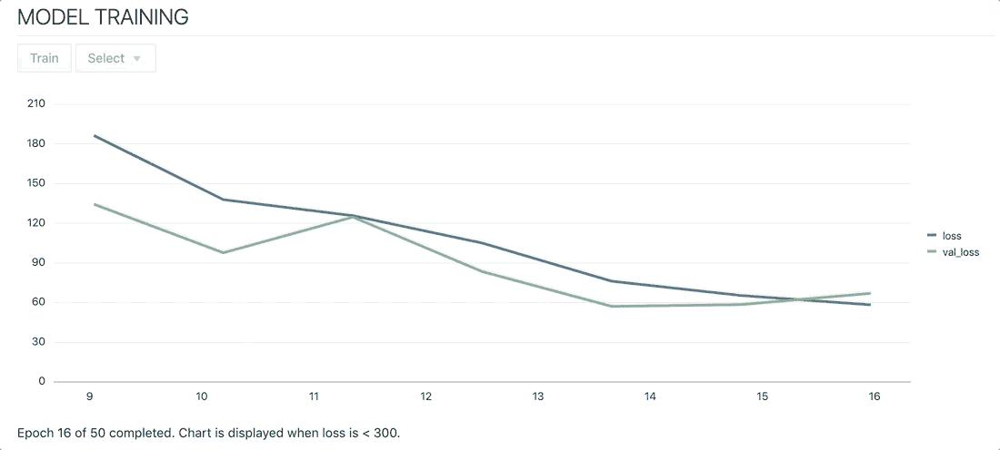
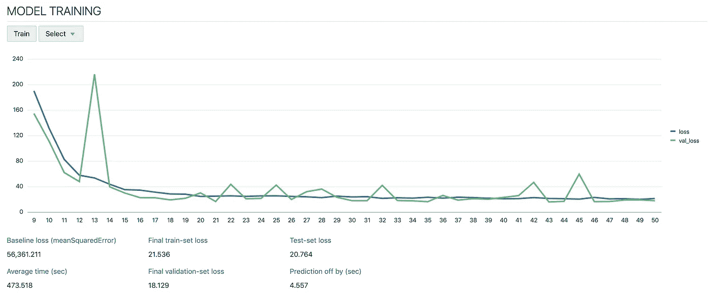
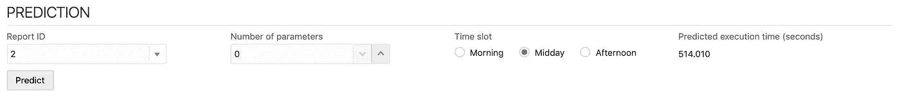
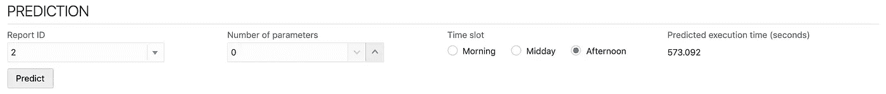
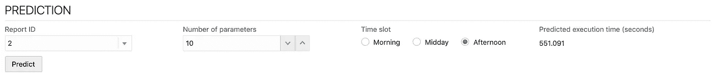
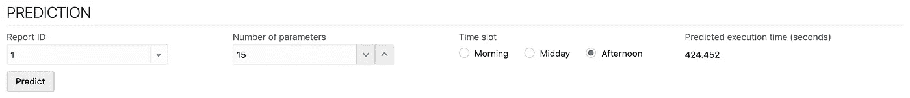
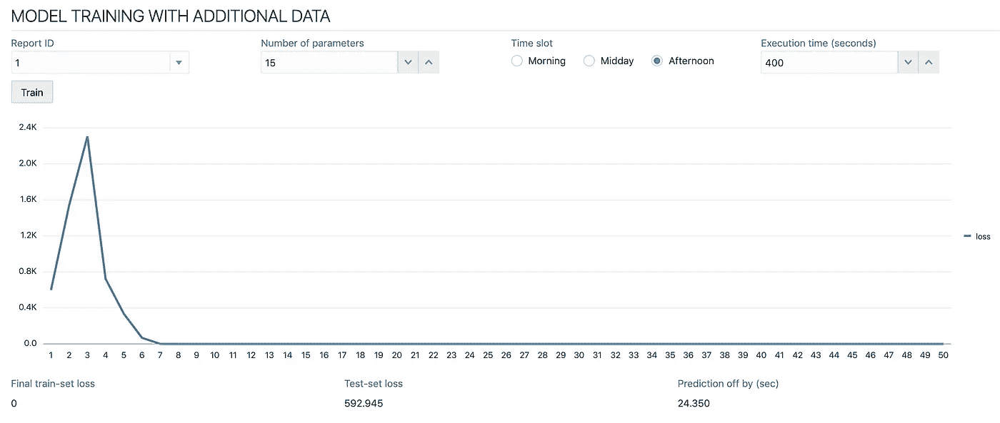
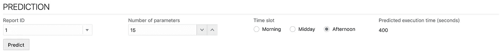
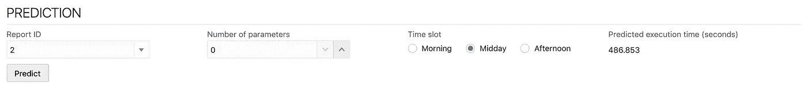
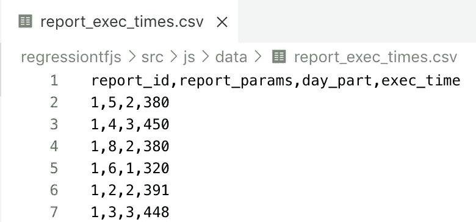

# 全面的 TensorFlow.js 示例

> 原文：<https://towardsdatascience.com/comprehensive-tensorflow-js-example-96367625fab7?source=collection_archive---------15----------------------->

## 这篇文章解释了如何在浏览器中使用 TensorFlow.js 运行机器学习。它涵盖了用于模型训练、迁移学习和预测功能的 TensorFlow.js API。有一个现场演示应用程序。它有助于预测业务报告执行等待时间。


Source: Pixabay

我已经实现了一个应用程序，其中包括 TensorFlow.js API 的使用。首先，我将向您介绍应用程序的功能，然后将深入实施细节。这个应用程序实现了一个业务报表执行时间预测用例(这次是用 JavaScript 实现的)，在我之前的帖子中解释过——用 Keras 和 TensorFlow 实现[报表时间执行预测。](/report-time-execution-prediction-with-keras-and-tensorflow-8c9d9a889237)

对于模型训练，我使用 50 个历元(数据以 10 个为一批进行处理)，学习率设置为 0.001。神经网络基于两个处理层和一个输出层。模型训练过程在浏览器中运行:



Model training process

应用程序已在此处部署并可用:

*   https://regressiontfjs-node.herokuapp.com/

模型被训练来预测业务报告执行的预期等待时间。实现是基于这本优秀的书— [深度学习与 JavaScript](https://www.manning.com/books/deep-learning-with-javascript) 和多元回归示例— [Boston Housing](https://github.com/tensorflow/tfjs-examples/tree/master/boston-housing) 中的解释和材料完成的。

**功能**

第一次打开应用程序时，需要对模型进行训练。模型定型后，将保存到本地 indexeddb。浏览器重新打开后，该模型将仍然可以从 indexeddb 中获得，您可以选择它来重用或训练新模型(以前保存的模型将被替换)。

训练过程完成后，它将打印一组显示模型质量的变量:

*   基线丢失:这是根据训练数据计算的平均平方误差。平方根值:237 秒。这意味着如果我们总是假设预测的平均值，误差范围将是 237 秒。
*   平均时间:为训练数据计算的平均时间
*   最终车组损失:训练期间计算的损失
*   最终验证-设定损失:通过验证在训练期间计算的损失
*   测试集损失:针对测试数据为训练模型计算的损失
*   预测偏差(秒):测试集损失的平方根值。这说明模型错误。模型训练得很好，只有 4.5 秒的错误，比基线丢失好得多



Model training

对以下数据运行预测功能—结果 514 秒:



Predict

将时间段更改为下午-预测时间将增加到 573 秒。这意味着模型根据训练数据进行了正确的训练，报告在下午运行的时间更长:



Predict

增加参数的数量。参数越多，需要处理的数据越少，报告运行速度应该越快。该模型通过返回更快时间的预测来证实这一点:



Predict

让我们更改报告 ID 和参数数量。观察预测时间:



Predict

现在我们将进行迁移学习——用新的目标重新训练模型(在这个例子中，为了简单起见，我只使用一行数据，但我建议用多行数据重新训练模型)。以下数据未包含在训练集中，这是一个新目标。呼叫训练法——它应该运行得非常快。测试集的损失可能会比基于原始训练的损失更严重(对本练习来说没问题)，因为我们使用的是以前的测试集数据，而这些数据与新目标没有直接关系。新目标— 400 秒，对于报告 ID = 1(假设特定用户的时间不同于培训中的时间，并且该用户可以更新模型)。再培训(当我们在现有模型之上进行培训时——迁移学习)结果:



Transfer learning

重新训练模型后，对与之前相同的数字运行预测，您将看到预测结果将被调整并等于我们用于重新训练的目标:



Predict

现在，将报告 ID 更改为我们最初使用的 ID，将报告参数的数量以及时隙更改为原始值。您将会看到，现在我们预测的时间更短，这是由于最近的模型再培训，其中更短的时间被设定为一个目标:



Predict

尝试更改参数并查看结果。

**实施**

应用程序结构非常简单。所有逻辑都在 appController.js 中实现，UI 在 index.html 中实现。Web app 是用 Oracle JavaScript 库— [Oracle JET](https://www.oracle.com/webfolder/technetwork/jet/index.html) 实现的。要在本地运行应用程序，请遵循以下两个步骤:

*   使用 NPM 安装 Oracle JET:NPM install-g @ Oracle/ojet-CLI
*   进入应用程序并运行:ojet restore
*   运行应用程序:ojet serve

appController.js 中定义了一个监听器。当应用程序加载时，这个监听器被调用，它负责加载数据，将其转换为张量并计算基线。

数据通过助手模块 data.js 加载。我使用 [Papaparse](https://www.npmjs.com/package/papaparse) 库解析 CSV。原始数据集基于四列:



Data

我注意到模型不能直接从这些数据中得到很好的训练。报表 ID 和 daypart 列需要数据转换。这些列是分类的，并通过创建尽可能多的新列进行转换，因为存在唯一的分类值:

```
var features = results['data'].map(report => ({
 report_params: parseFloat(report.report_params),
 report_1: parseFloat(report.report_id) === 1 ? 1 : 0,
 report_2: parseFloat(report.report_id) === 2 ? 1 : 0,
 report_3: parseFloat(report.report_id) === 3 ? 1 : 0,
 report_4: parseFloat(report.report_id) === 4 ? 1 : 0,
 report_5: parseFloat(report.report_id) === 5 ? 1 : 0,
 day_morning: parseFloat(report.day_part) === 1 ? 1 : 0,
 day_midday: parseFloat(report.day_part) === 2 ? 1 : 0,
 day_afternoon: parseFloat(report.day_part) === 3 ? 1 : 0,
}));
```

这种数据转换有助于运行更精确的训练。我使用 1200 行数据进行训练，300 行数据进行测试。在将数据分成训练数据集和测试数据集之前，请确保对数据进行洗牌。我正在为这个任务使用 helper 函数，取自波士顿住房示例应用程序。

使用 TensorFlow.js 函数 tensor2d 将数据数组转换为张量:

```
tensors.rawTrainFeatures = tf.tensor2d(dataHelper.trainFeatures);
tensors.trainTarget = tf.tensor2d(dataHelper.trainTarget);
tensors.rawTestFeatures = tf.tensor2d(dataHelper.testFeatures);
tensors.testTarget = tf.tensor2d(dataHelper.testTarget);
```

TensorFlow.js 模型由两个处理层和一个输出层构成，用于返回预测值:

```
const model = tf.sequential();
model.add(tf.layers.dense({
 inputShape: [dataHelper.trainFeatures[0].length],
 units: 25,
 activation: 'sigmoid',
 kernelInitializer: 'leCunNormal'
}));
model.add(tf.layers.dense({
 units: 25,
 activation: 'sigmoid',
 kernelInitializer: 'leCunNormal'
}));
model.add(tf.layers.dense({ units: 1 }));
```

一旦构建了模型，编译它并运行 *fit* 函数来训练模型。我建议使用验证分割选项，这样在培训期间可以验证培训的质量:

```
model.compile({ optimizer: tf.train.sgd(LEARNING_RATE), loss: 'meanSquaredError' });await model.fit(tensors.trainFeatures, tensors.trainTarget, {
 batchSize: BATCH_SIZE,
 epochs: NUM_EPOCHS,
 shuffle: true,
 validationSplit: 0.2,
 callbacks: {
  onEpochEnd: async (epoch, logs) => {
```

函数 *fit* 提供 *onEpochEnd* 回调，我们可以记录训练进度并将数据推送到 UI。

训练完成后，通过对照测试数据运行模型来评估模型。从返回的数字中取平方根，这将是基于当前模型训练的以秒为单位的容许误差(如果结果不容许，尝试通过改变神经网络层的结构来重新训练模型，尝试调整训练参数):

```
result = model.evaluate(tensors.testFeatures, tensors.testTarget, { batchSize: BATCH_SIZE });
testLoss = result.dataSync()[0];
```

最后保存模型。有多个保存模型的选项，你甚至可以把它推送到服务器。在本例中，我将模型保存在浏览器的本地 indexeddb 中:

```
await model.save('indexeddb://report-exec-time-model');
```

模型训练好之后，我们就可以运行*预测*功能了。我正在从 indexeddb 中的保存状态加载回模型，构造输入张量并执行 TensorFlow.js predict:

```
model = await tf.loadLayersModel('indexeddb://report-exec-time-model');input = [{
 report_id: parseFloat(self.reportIdP()),
 report_params: self.reportParamsP(),
 day_part: parseFloat(self.reportExecSlotP())
}];convertInputToTensor(input);res = model.predict(tensors.inputFeatures);
score = res.dataSync()[0];
```

最后一步—转移学习，使用额外数据对现有模型进行重新训练(在这种情况下，数据形状是相同的，我们针对新目标进行训练)。为了使重新训练更有效，我们必须冻结原始模型的部分层。这样，先前训练的模型权重将不会受到影响，并且模型训练将运行得更快。通常，您应该使用多个新元素来运行培训，在这种情况下，为了简单起见，我使用一个新条目来运行培训。

通过将*可训练*属性设置为*假*可以冻结模型层:

```
model = await tf.loadLayersModel('indexeddb://report-exec-time-model');model.layers[0].trainable = false;model.compile({
 loss: 'meanSquaredError',
 optimizer: tf.train.sgd(LEARNING_RATE)
});model.summary();input = [{
 report_id: parseFloat(self.reportId()),
 report_params: self.reportParams(),
 day_part: parseFloat(self.reportExecSlot()),
 exec_time: self.reportExecTime()
}];convertInputToTensor(input, 'Y');
```

在现有模型的基础上使用新数据运行拟合函数:

```
await model.fit(tensors.inputFeatures, tensors.inputTarget, {
 batchSize: BATCH_SIZE,
 epochs: NUM_EPOCHS,
 shuffle: true,
 callbacks: {
  onEpochEnd: async (epoch, logs) => {
```

资源:

*   关于 [GitHub](https://github.com/abaranovskis-redsamurai/automation-repo/tree/master/regressiontfjs) 回购的代码
*   直播 app—[https://regressiontfjs-node.herokuapp.com/](https://regressiontfjs-node.herokuapp.com/)