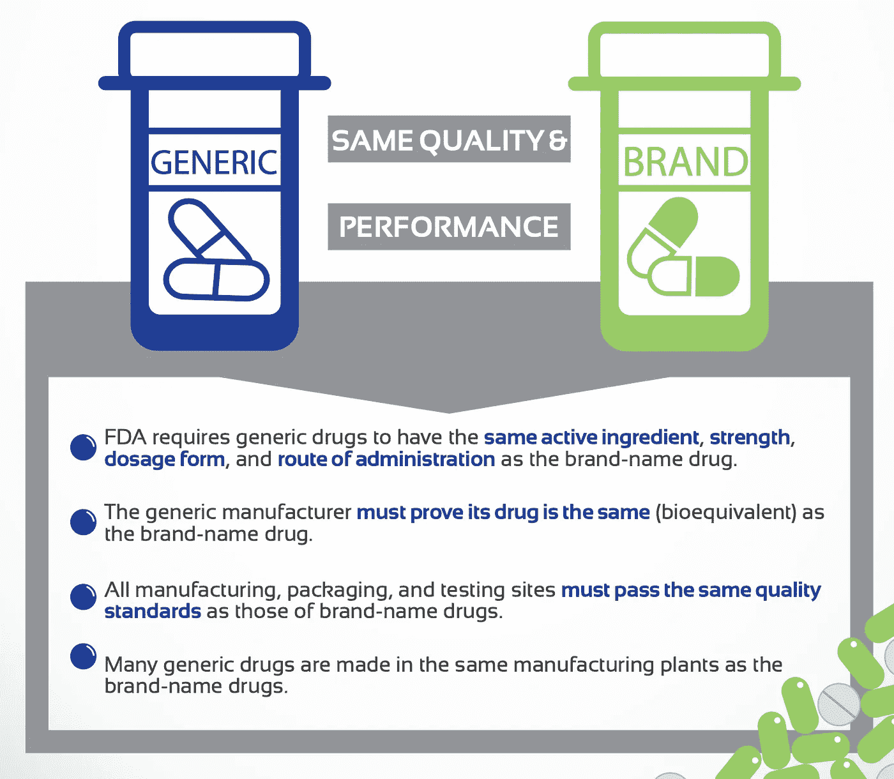
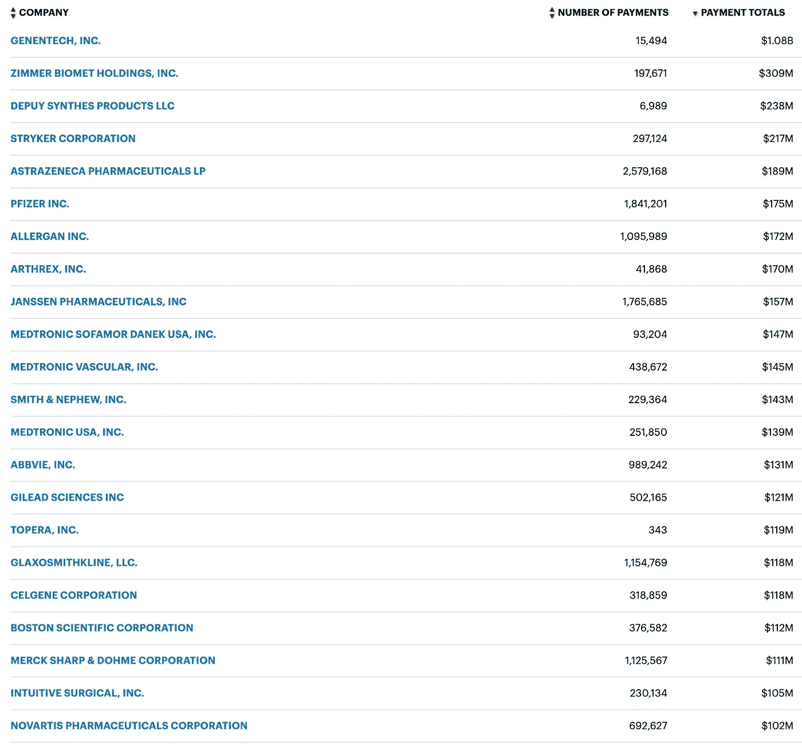
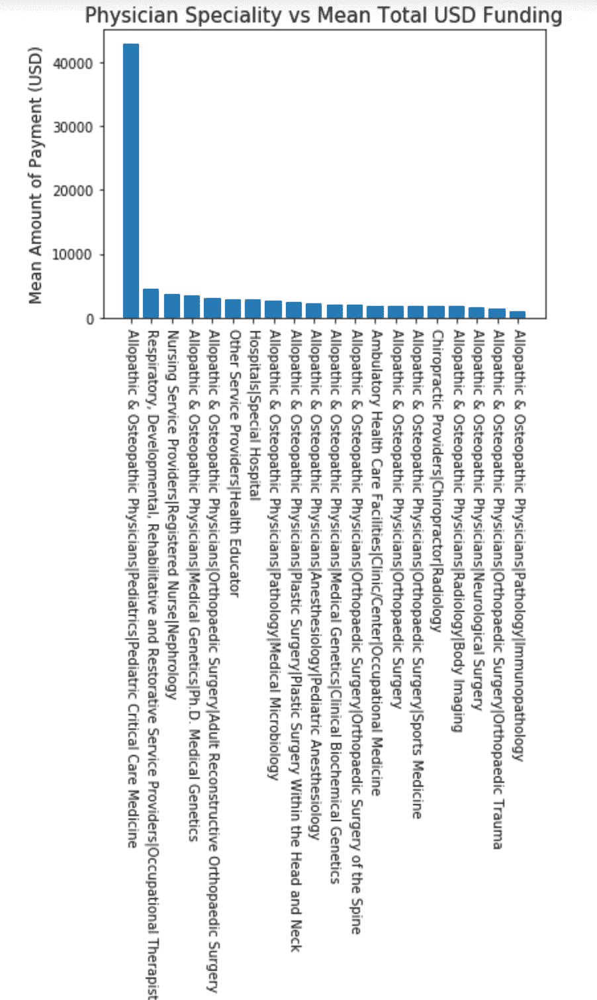
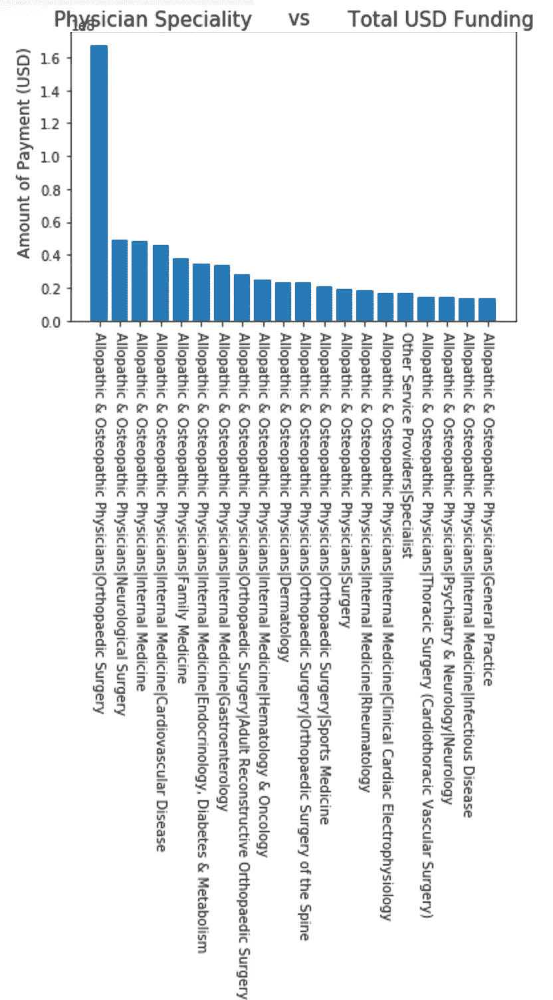
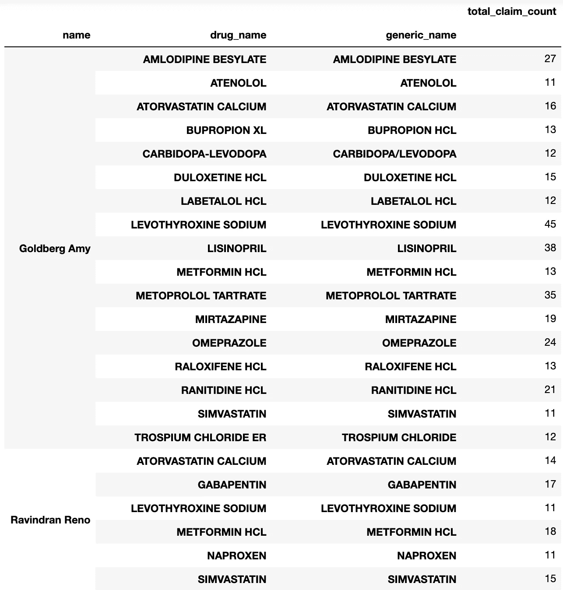
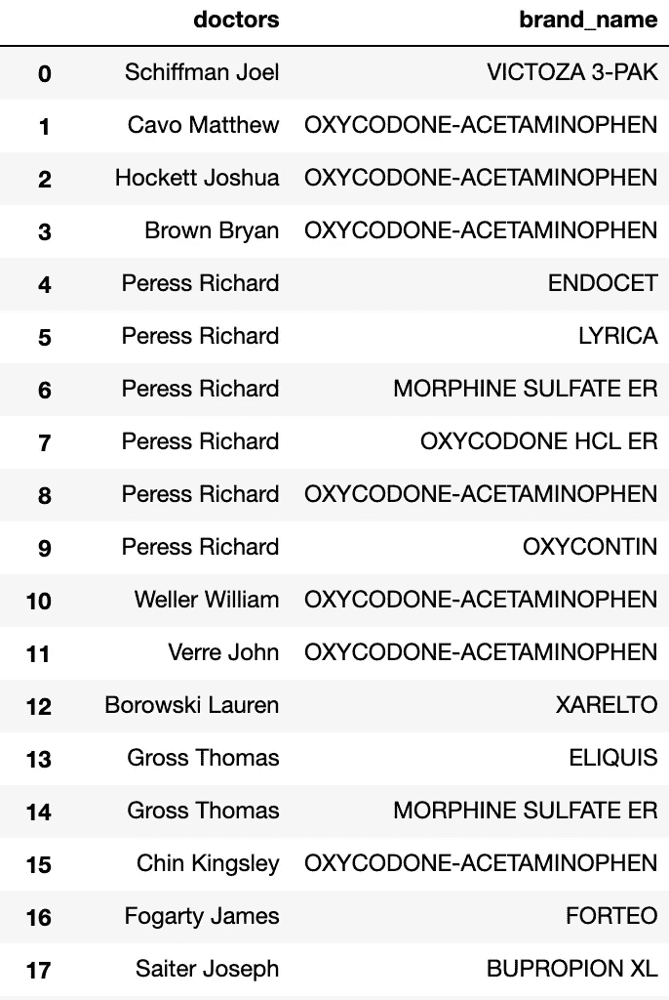

# 大型制药公司的计算分析

> 原文：<https://towardsdatascience.com/computational-analysis-of-big-pharma-investigating-the-effects-of-donations-to-docs-e9f43ef3a9bc?source=collection_archive---------27----------------------->

## [深入分析](https://medium.com/towards-data-science/in-depth-analysis/home)

## 调查“捐赠”给医生对药物处方的影响

Photo by [JOSHUA COLEMAN](https://unsplash.com/@joshstyle?utm_source=medium&utm_medium=referral) on [Unsplash](https://unsplash.com?utm_source=medium&utm_medium=referral)

> “我会记住，我治疗的不是发烧表，不是癌变，而是一个生病的人，他的病可能会影响这个人的家庭和经济稳定。如果我要充分照顾病人，我的责任就包括这些相关的问题。”
> 
> ——[现代希波克拉底誓言](https://owlspace-ccm.rice.edu/access/content/user/ecy1/Nazi%20Human%20Experimentation/Pages/Hippocratic%20Oath-modern.html)

每年，在期待已久的毕业庆典中，希波克拉底誓言的话语——医学专业人士几个世纪以来做出的古老承诺——回荡在各国医学院的大厅里。这些神圣而受人尊敬的机构将数千名聪明的毕业生送到美国各地，以减轻痛苦，改变生活，在某些情况下，有希望拯救他们。

但是，如果这些毕业生进入一个越来越受金钱驱动、越来越不受关怀驱动的体系，那该怎么办呢？如果这些聪明的年轻男女是大型制药公司运作的大规模赚钱计划的目标呢？如果大型制药公司更多地瞄准特定的医学专业，那会怎么样？为什么会这样？

在 20 世纪 60 年代，美国人对医疗行业的信任度达到了空前的高度。当时，超过四分之三的美国人对医学领袖非常有信心。今天，只有 34%的美国人这样做。随着数千家制药公司每年向全国各地的医生“捐赠”数十亿美元，美国人对医疗行业的信任度应该会更低吗？

# 研究问题

有时间的话，看看左边的视频。说真的，看着点。该视频揭示了数百万美国人不知道的看似腐败的系统。每年，**制药公司以“教育”为名，向医师**提供 [***数十亿***](https://openpaymentsdata.cms.gov/) **美元的“捐款”**

如果您到了这一步还没有观看视频，我们恳求您返回并点击播放。如果不是为了宣布医疗/制药领域普遍、持续的腐败，至少看看约翰·奥利弗带来的喜剧价值。眼前的问题是复杂的、多层次的和多方面的；这个视频会让你对它的理解产生奇迹。

## 现在让我们回到手头的问题上来。

从局外人的角度来看，这整个系统听起来似乎是无辜的——公司教医生关于他们的药物，这样医生就可以对他们给病人开的药物做出明智的决定。这有什么不好？

但是，当 FDA 对仿制药和品牌药的要求出现时，这个无辜的框架就变得模糊了:

[FDA requirements for generic vs. branded drugs](https://www.fda.gov/media/83670/download)

等一下。你是说**学名药*在法律上要求*在各方面与品牌药**本质上*相同*？当学名药平均比品牌药便宜 80-85%时，为什么会有人选择品牌药而不是学名药呢？

嗯，这种看似错误的行为有三种可能的情况:

1.  一家制药公司开发了一种专利药物，并拥有该药物的专利垄断权。这些专利的长度受到国会的限制，并且应该最终让位于相同的、便宜得多的仿制药。嗯，除非发生这样的事:

> “……拥有品牌药品的公司将通过拒绝[交出生产仿制药所需的样品和安全协议](http://www.fiercepharma.com/pharma/senators-take-aim-at-drugmakers-use-rems-to-block-competition)来阻止仿制药进入市场。这种策略人为地延长了制药公司的专利，违背了国会鼓励仿制药的意图。"-[openmarketsininstitute](https://openmarketsinstitute.org/explainer/high-drug-prices-and-monopoly/)

我们没有足够的时间、天数、周数(你可以想象)去冒险进入专利垄断和大型制药公司的国会游说努力的兔子洞。但是，如果你真的很好奇，可以看看这个链接。

2.一名患者*特别是*在药店要求购买一种品牌药，而不是一种相同的仿制药(可能是因为电视广告或他们的邻居 Karen*的推荐，Karen *服用立普妥并对其深信不疑)。

**3。医生*专门给*开一种品牌药，而不是仿制药。**

场景#3 是事情变得真正令人兴奋的地方，也是我们研究的重点。

我们看着场景#3，问自己 ***为什么。***

还记得开头引用的希波克拉底誓言吗？当医生发誓要了解疾病对患者“经济稳定性”的影响时，他们为什么会开品牌药而不是仿制药？

再加上奥利弗先生在上文指出的数十亿美元的“捐赠”系统，这就产生了一个引人注目、具有社会影响力和重大意义的研究问题:

## 研究问题:大型制药公司的捐赠会影响医生给病人开的特定药物吗？

通过我们的研究，我们开始了解大型制药公司直接支付给医生的费用可能会对你、我和凯伦最终服用的处方药以及我们支付的价格产生的影响。

# 研究过程

因此，我们耳听八方，倾听医疗腐败的最轻微的迹象，开始了一场勇敢的探索，以揭示广泛的社会弊端，并由此引发广泛的社会变革。

至少我们是这么想象的。

我们“撞上”的直接障碍与可用数据的绝对规模、数据集的格式以及处方填写过程中涉及的微小法律/程序复杂性直接相关。

但是现在没时间了…我们会在路上讨论的。

## 数据集

我们根据三个关键数据集构建了我们的研究:

1.  [公开支付](https://openpaymentsdata.cms.gov/browse) —接受 2013 年至 2017 年间对医生的捐赠
2.  [医疗保险提供者利用和支付数据](https://data.cms.gov/Medicare-Part-D/Medicare-Provider-Utilization-and-Payment-Data-201/3z4d-vmhm)—2013 年至 2017 年作为医疗保险一部分的所有处方
3.  [处方药、制造商及其价格](https://www.cms.gov/Research-Statistics-Data-and-Systems/Statistics-Trends-and-Reports/Information-on-Prescription-Drugs/Downloads/Medicare_PartD_Drug_Spending_Data.zip)

下载每个数据集后，我们很快意识到我们正在处理的数据的巨大规模。仅开放支付数据表就包含数千万行。医疗保险提供者利用率数据表包含超过 1 亿行。

数据是彻底的，这是肯定的。但对我们的目的来说是可管理的？不完全是。

Photo by [Alexander Sinn](https://unsplash.com/@swimstaralex?utm_source=medium&utm_medium=referral) on [Unsplash](https://unsplash.com?utm_source=medium&utm_medium=referral)

我们决定将我们的研究细化到日历年 **2016** 。这大大地把数据精简到了一个稍微容易管理的状态。开放支付数据被限制在大约 1090 万行，而医疗保险提供者利用数据(从这里开始称为“处方数据集”)被限制在大约 2430 万行。即使这些受限的数据集对于我们微不足道的 8GB 内存来说也太多了，无法在合理的时间内处理；**计算时间**和**内存使用量**在我们尝试使用数据集的每个过程中都被放大了，特别是在数据集之间移动时(例如，从开放支付数据集中提取一个接受捐赠的医生，并在处方数据集中搜索同一医生的出现次数)。为了帮助解决这些问题，我们使用了**Dask**data frames 来“延迟”加载数据(直到对该数据执行了计算，才将数据加载到内存*)。*

我们研究过程的第二步是**清理数据**。这一步花费了惊人的时间和精力，我想这证明了数据科学花费了多少时间来定制一个或多个数据集以满足您的特定研究需求。我们清理数据的方法包括:从所有三个数据集中删除不必要的(出于我们的目的)列，合并我们需要合并的某些列(例如，名字、姓氏)，处理 NaN 值，删除区分大小写，合计每个医生的支付总额，以及一系列其他整理任务。

# 主要发现

清理之后，我们开始从数据中对我们的研究问题做出有意义的结论。我们知道我们仍然在处理一个相当大的数据集，所以我们决定专注于数据的目标子集:**医疗专业**。捐赠给哪些医学专科最多，为什么？

为了进行调查，我们重点关注了 2013 年至 2016 年间向医生捐赠超过 1 亿美元的 20 家制药公司。

[Propublica Dollars for Docs](https://projects.propublica.org/docdollars/company)

然后，我们查询开放支付数据集，按医生专业对捐赠进行分组，然后找到每个医疗专业的平均捐赠价值。我们希望这一过程能准确揭示出最大的制药公司把大部分资金花在了哪个医学专业上。

这里有一个很好的图表来说明这些发现(使用平均值):

Note: Shows top-20 receiving specialties

当你侧着头观看剧情时，很明显**儿科** **重症医学**在平均捐赠价值方面击败了其他专业。我们发现这非常令人惊讶！我们期望矫形外科在平均值和总价值方面是最高的；骨科手术在捐赠的总净值方面排名第一(见下图)，而在捐赠的平均价值方面仅排名第五。

这是使用总捐赠价值的图:

Note: Shows top-20 receiving specialties

为什么会这样？为什么最大的制药公司会如此强烈地针对儿科急救护理专家？

我们最初对这些结果的论证集中在儿科急诊专业的性质上。这些医生专门护理处于紧急情况下的儿童。因为紧急事件通常是时间敏感的，这些医疗专业人员可能有*完全*酌处权决定儿童服用何种处方药。在这种情况下，我们的意思是，在儿科急救护理专家倾向于的特定情况下，父母可能会将完全的决定权交给可信任的专家，而不会争论是否要开品牌药或仿制药。当吉米因为手臂骨折而尖叫时，妈妈和爸爸可能不会为一种药物的品牌名称而争吵；他们只是希望尖叫停止，他们美丽的男婴再次成为 5 岁健康的形象。

如果是这种情况，并且制药公司理解这一点，那么大型制药公司让儿科急救护理专家以任何必要的成本开出所有品牌的药物是有意义的，包括进行大量捐赠。

但是，当你可以查询数据并做出有根据的结论时，为什么要做出没有根据的结论呢？

然后，我们通过直接检查儿科急救护理专家和整形外科医生开出的*特定*药物来结束这个循环。我们这样做是为了调查这些大量捐赠是否真的影响了医生开的特定药物。

上面，我们确定儿科急救护理专家从大型制药公司获得了大量现金(好吧，是的，这些“捐赠”被标为“演讲费”和“所有费用都由我支付的医学会议旅行”，但在这一点上，我们只需*滚动*)，现在让我们看看这些现金是否有所回报。

为了对此进行调查，我们:

1.  儿科急诊专家处方数据集索引
2.  找到每位儿科急救护理专家开出的所有 Medicare 部分处方的结果集

Step 2: grouping prescriptions by prescriber. Prescribers are members of specialty most targeted for donations (pediatric emergency care or, separately, orthopedic surgery)

3.遍历每个医生的处方集，如果处方是品牌药而不是仿制药，则标记处方

Step 3: Branded drugs prescribed by orthopedic surgeons

4.交叉引用“药物和制造商”数据集中的品牌药物，查看是否由被调查的前 20 家公司之一制造。

Step 4: Branded drugs prescribed by pediatric emergency care specialists that were manufactured by the companies investigated

5.如果医生开了一种品牌药物，我们随后使用医生的名字查询开放支付数据集，以查看特定医生是否接受了制药公司的捐赠。通过这样做，我们将能够在某种程度上检验药品捐赠对药物处方的可能影响。

Step 5: Orthopedic surgeons who prescribed branded drugs, those branded drugs were manufactured by the companies in question, and they were donated to by those companies. Includes value of donation.

6.对研究的第二个专业重复步骤 1-5:矫形外科。

## 好吧……那你发现了什么？

至少可以说，我们的结果令人惊讶。

在儿科急救护理专家和整形外科医生身上执行上述过程后，我们发现:

> 2016 年*品牌*儿科急诊专科*处方*数量:4
> 
> 开品牌药*和*的儿科专家接受药品制造商捐赠的人数(被调查的 20 家公司之一):0

> 2016 年*品牌*骨科手术*处方*数量:568
> 
> 开品牌药*和*的儿科专家接受药品制造商捐赠的人数(被调查的 20 家公司之一):4

嗯……真令人失望。

**也可能不是**，看你怎么看！如果这些发现成立，看来药品捐赠在影响医生处方决策方面并不像假设的那样有效。嘿，这对所有人来说都是好消息。

**我们的研究表明，在 2016 年，对于从 20 家支出最高的制药公司获得最高平均捐赠值和最高净捐赠值的专科(儿科急诊和骨科手术)，相关性最小。简单来说，捐赠似乎并没有明显影响处方中的特定药物。**

# **结论和警告**

但是，沉住气。

Photo by [Kai Pilger](https://unsplash.com/@kaip?utm_source=medium&utm_medium=referral) on [Unsplash](https://unsplash.com?utm_source=medium&utm_medium=referral)

这些发现伴随着一些我们想要解决的重要警告。在进行研究的许多时候，我们遇到了数据的问题和限制。

首先也是最重要的，处方数据集的性质。

该处方数据集仅限于联邦政府 2016 年的联邦医疗保险 D 部分支出。虽然这一系列数量庞大，但它只代表了 2016 年美国完成的总处方的一小部分。医疗保险是一个政府项目，因此，它的记录对公众是免费的。这就是我们使用它们的原因。这个研究项目并不是决定性的，因为它只是检查了整个药品市场的一小部分样本。

小规模的抽样来模拟大规模的行为可能对一些研究有用，但是医疗保险的某些特征进一步搅浑了我们的研究水域。因为医疗保险是一个政府项目，它带有限制和局限；这些限制在“D 部分”级别变得更加精炼和严格。[“D 部分”是指医疗保险计划的*特定*子集，仅涵盖六类](https://q1medicare.com/PartD-Which-Drugs-Will-Be-CoveredPartD.php)药物:抗抑郁药、抗精神病药、抗惊厥药、抗逆转录病毒药物(艾滋病治疗)、免疫抑制剂和抗癌药物。这立即给我们的儿科调查带来了问题，并可能解释为什么我们发现如此少量的品牌儿科药物处方。

此外，[医疗保险](https://www.medicare.gov/about-us/how-is-medicare-funded)的资金受到联邦政府的限制。因为政府的目标是将医疗保险支出保持在最低水平，同时仍然向公众提供必要的药物，他们可能会压倒性地将已完成的处方限制为非专利药物，而不是品牌药物。这也可以解释为什么我们在研究中很少发现品牌药物处方。

最后，[不是所有的医生都接受医保](https://www.verywellhealth.com/doctors-accept-medicare-insurance-3976280)。医生必须选择接受医疗保险，当平均而言，医疗保险只支付私人健康保险的 80%时，它似乎越来越不受欢迎。已经对利润最大化感兴趣的医生可能不会选择接受医疗保险，因此不会出现在我们的数据集中。这些医生可能是从制药公司获得最多捐赠的人。

另一方面，我们的研究仅限于调查前 20 家捐赠制药公司。我们做出这个决定是因为它使数据更容易管理和使用。然而，这些公司可能全部或大部分专注于医疗市场的特定领域(即，它们生产儿科医生和整形外科医生永远不会使用的药物)。因为我们遗漏了几十家其他较小的公司，我们可能错过了儿科/骨科药物的制造商。

所有这些观察都指向一个真理，这个真理在这个研究过程的每一步都在我们的脑海中回荡:**感知到的药品捐赠问题极其微妙和模糊**。在项目开始时，我们从来没有想象过我们必须考虑制药公司、医生、药剂师和患者可能做出的实际决定的次数——所有这些都是为了对我们面前的数据做出有意义和有效的声明。问题的规模、围绕公开披露某些支付/处方而非其他支付/处方的法律问题，以及使用多个数据集(每个数据集都以不同的方式对其数据进行编码，并且由不同的团队创建/管理)使该研究项目具有挑战性…但也很有趣。

**但是为什么调查这些真的很重要呢？**

如果你已经到了这一步，还没有找到自己对上述问题的答案，下面是我们的看法，简单明了:

> 生命可能危在旦夕。

如果医生给病人开错了药(因为偏向大制药公司)，疾病可能得不到充分的控制，症状可能蔓延，治疗可能无效。人们可能会死。

# 进一步研究的课题

我们的项目仅仅触及了使用 OpenPayments 和 Medicare 部分数据集的可能性的表面。这些数据集是彻底的，强大的，令人印象深刻的，研究的机会是无限的。

我们讨论了调查大型制药公司捐赠对研究出版物的影响。例如，如果 Dave 医生接受了一家生产药物 A 的制药公司的捐赠，那么他以后写/合著一篇吹捧药物 A 的积极作用的研究文章的可能性有多大？这个问题很重要，因为成千上万的医生和患者依靠医学期刊来了解市场上出现的新药的好处/坏处。基于这些文章，医生开出特定的药物。

为了回答这个问题，我们可以使用自然语言处理来按语气(积极/支持或消极/不支持)对研究文章进行编码，并搜索开放支付数据集以查找对文章作者的捐赠。然后，我们可以使用情绪分析分数以及对开放支付数据集的查询来使用线性回归。

此外，我们对使用机器学习来基于医生的多个特征(例如，美国所在的州、从业年限等)预测医生可能收到的捐赠的预计金额感兴趣。).我们特别想调查大型制药公司捐赠的具体形式是否会影响处方偏见。如果 good ol' Dave 医生每年从 FakePharma，Inc .获得 150 份免费午餐，他是否更有可能开 FakePharma，Inc .的药，而不是每个周末 FakePharma，Inc .带他去参加医学会议？

我们使用的所有数据集都是免费使用/下载的；如果你对可能的进一步研究课题有任何想法，不要害怕投入进去！

# 我已经走了这么远，现在怎么办？

## 很棒的问题！这里有一些步骤，你可以马上采取，以更好地保护自己和你爱的人免受潜在的偏见处方。

1.  我们恳请你在美国政府的开放支付网站或 [ProPublica 的 Dollars for Docs](https://projects.propublica.org/docdollars/) 网站上查找你的医生，并认真考虑你对他/她的信任。
2.  我们*强调*建议阅读进入**同行评审的**关于特定药物有效性的医学研究。不要仅仅依赖电视广告告诉你的或者前几天晚上凯伦推荐的炒鸡蛋。

做你自己的研究，并把研究带到你医生的办公室。首先，试着看看发表在 [CDC 预防慢性疾病杂志](https://www.cdc.gov/pcd/issues/archive.htm)或其他类似杂志上的发现。

# 对于那些永远读不够的人来说，这是额外的读物

1.[掉进兔子洞:高药价和专利垄断](https://openmarketsinstitute.org/explainer/high-drug-prices-and-monopoly/)

2.[大型制药公司花费数百万游说反对降低处方药价格](https://edition.cnn.com/2019/01/23/health/phrma-lobbying-costs-bn/index.html)

3.加拿大啊，你也有这些问题！

4.[大型制药公司是否加剧了阿片类药物危机？](https://theconversation.com/what-big-pharma-pays-your-doctor-99431)

5.[类似的调查研究！—制药行业为医疗保险受益人赞助的膳食和医生处方模式](https://www.ncbi.nlm.nih.gov/pubmed/27322350)

## **这里有一些主题音乐，你可以在拥护制药透明度和公平性的时候听听**

这个项目是由我、西西佛·津加和查理·朱尼尔·奎宁与❤共同完成的。如果你有兴趣复制我们的研究项目来调查你自己的燃眉之急的大型制药公司的问题，[这里有我们的 GitHub 和代码/文件](https://github.com/HorsemanJnr/dollars-for-doctors)！

*Karen 是本文中虚构的人物，仅用于解释/描述目的