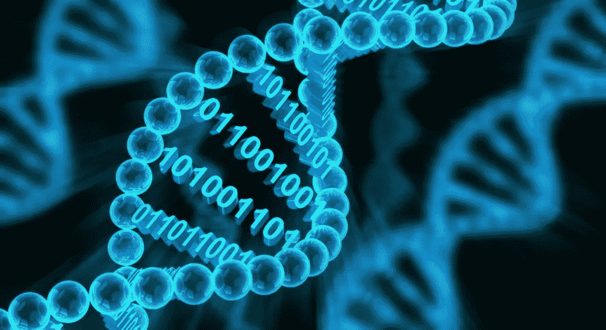
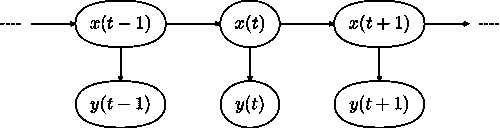
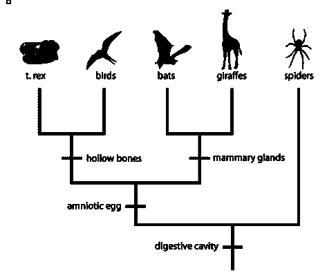
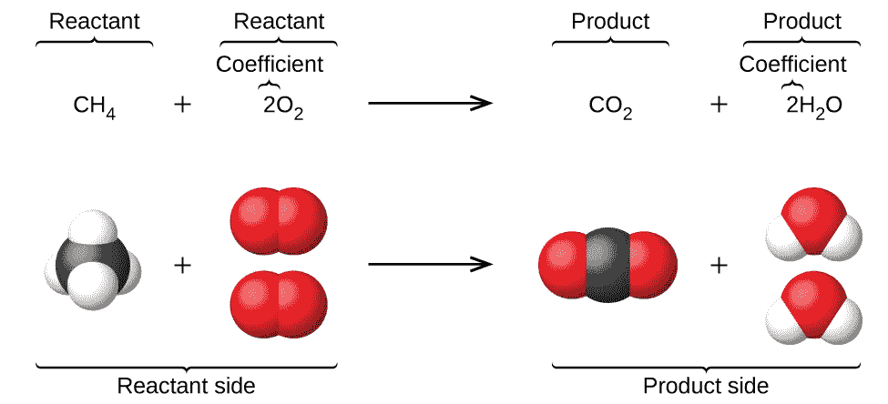
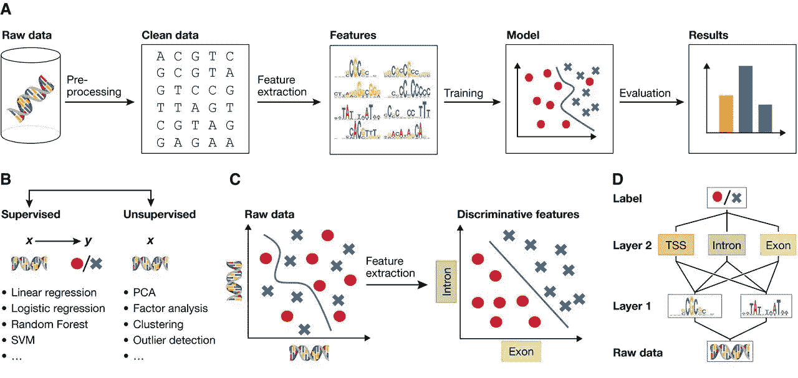

# 计算生物学

> 原文：<https://towardsdatascience.com/computational-biology-fca101e20412?source=collection_archive---------13----------------------->

(Image reproduced from: [https://blog.f1000.com/2017/02/01/f1000prime-f1000prime-faculty-launch-bioinformatics-biomedical-informatics-computational-biology/](https://blog.f1000.com/2017/02/01/f1000prime-f1000prime-faculty-launch-bioinformatics-biomedical-informatics-computational-biology/))

## 计算生物学是数学、统计学和计算机科学的结合应用，用于解决基于生物学的问题。生物学问题的例子有:遗传学、进化论、细胞生物学、生物化学。[1]

# 介绍

最近的技术进步使我们能够存储数量惊人的数据。最初，**【大数据】**被感知为待解决的问题。事实上，我们已经到了能够存储太多数据却不能充分利用的地步。这推动了对数据科学和人工智能进步的需求。

如今，最初被认为是一个问题的东西，现在已经成为一扇通向创新世界的大门。大数据使计算机视觉和深度学习等许多研究领域蓬勃发展。这使得机器能够执行复杂的决策任务，并从原始数据中提取人类肉眼看不到的信息。

生物学是一门广泛使用生物数据库来尝试解决许多不同挑战的学科，例如理解疾病的治疗和细胞功能。生物数据的数据集可以由氨基酸序列、核苷酸、大分子结构等创建。

此外，计算机科学中经常使用的许多机器人系统和算法都是受生物复合体的启发。例如，深度学习神经网络在原理上受到人类大脑结构的启发。

# 计算生物学算法

计算生物学中使用的算法的一些例子是:

*   全局匹配
*   局部序列匹配
*   隐马尔可夫模型
*   群体遗传学
*   进化树
*   基因调控网络
*   化学方程式

**全局匹配**(也称为 Needleman-Wunsch 问题)和**局部序列匹配**(也称为 Smith-Waterman 问题)利用我们对一种生物的蛋白质的知识来了解更多关于其他生物的蛋白质。

马尔可夫模型用于模拟序列。在这些类型的模型中，事件发生的概率仅仅依赖于其先前的状态(例如，这种类型的模型可以用于对 DNA 序列建模)。**隐马尔可夫模型**(图 1)使用概率有限状态机，根据我们所处状态的概率，我们发出一个字母，然后转移到下一个状态。下一个状态可能等于初始状态。

Figure 1: Hidden Markov Model [2]

**群体遗传学**试图模拟进化。为此，它通常使用[费希尔-赖特模型](https://stephens999.github.io/fiveMinuteStats/wright_fisher_model.html)。该模型试图模拟在选择、突变和交叉条件下基因位置发生的情况。

**进化树**(图 2)可以基于某种形式的进化距离来创建。进化树主要有两种类型:基于距离的树和基于序列的树。进化树被用来解释不同物种之间的距离。

Figure 2: Evolutionary Trees [3]

**基因调控网络**由于生物体内不同蛋白质的相互作用而形成。不同的蛋白质相互控制，根据它们相互作用的性质，决定了细胞的类型。

**化学方程式**(图 3)终于可以用来描述基因调控网络背后的机制。反应速率取决于化学方程式中元素的浓度。

Figure 3: Chemical Equations [4]

# 用于生物预测的机器学习

在计算生物学中使用机器学习现在变得越来越重要(图 4)。目前的应用是基因组学(研究有机体的 DNA 序列)、蛋白质组学(更好地了解不同蛋白质的结构和功能)和癌症检测。

Figure 4: Machine Learning workflow in Biological Data Analysis [5]

研究人员证明，使用卷积神经网络(CNN)和计算机视觉，通过图像分类进行癌症检测，可以获得可观的分类精度[6]。

几个数据集可以在网上公开获得，以开始生物数据探索，一个例子可以是 xenabrowser.net。这些数据集由加州大学圣克鲁斯分校的 UCSC·谢轩提供。

# 联系人

如果你想了解我最新的文章和项目[，请通过媒体](https://medium.com/@pierpaoloippolito28?source=post_page---------------------------)关注我，并订阅我的[邮件列表](http://eepurl.com/gwO-Dr?source=post_page---------------------------)。以下是我的一些联系人详细信息:

*   [领英](https://uk.linkedin.com/in/pier-paolo-ippolito-202917146?source=post_page---------------------------)
*   [个人博客](https://pierpaolo28.github.io/blog/?source=post_page---------------------------)
*   [个人网站](https://pierpaolo28.github.io/?source=post_page---------------------------)
*   [中等轮廓](https://towardsdatascience.com/@pierpaoloippolito28?source=post_page---------------------------)
*   [GitHub](https://github.com/pierpaolo28?source=post_page---------------------------)
*   [卡格尔](https://www.kaggle.com/pierpaolo28?source=post_page---------------------------)

# 文献学

[1]计算机科学学位中心。访问于:[https://www . computersciencedegreehub . com/FAQ/what-is-computational-biology/](https://www.computersciencedegreehub.com/faq/what-is-computational-biology/)，2019 年 5 月。

[2]隐马尔可夫模型。访问时间:[https://en.wikipedia.org/wiki/Hidden_Markov_model](https://en.wikipedia.org/wiki/Hidden_Markov_model)，2019 年 5 月。

[3]蝙蝠和猿:自然历史博物馆的互动桌面游戏。迈克尔·s·霍恩等人访问:https://www . research gate . net/publication/254004984 _ Of _ BATs _ and _ APEs _ An _ interactive _ desktop _ game _ for _ natural _ history _ museums/figures？lo=1，2019 年 5 月。

[4]化学文献。4.1:化学反应方程式。访问:[https://Chem . libre texts . org/Courses/bellar mine _ University/BU % 3A _ Chem _ 103 _(Christianson)/Phase _ 1% 3A _ Chemistry _ Essentials/4% 3A _ Simple _ Chemical _ Reactions/4.1% 3A _ Chemical _ Reaction _ Equations](https://chem.libretexts.org/Courses/Bellarmine_University/BU%3A_Chem_103_(Christianson)/Phase_1%3A_Chemistry_Essentials/4%3A_Simple_Chemical_Reactions/4.1%3A_Chemical_Reaction_Equations)，2019 年 5 月。

[5]拥抱。计算生物学的深度学习。Christof Angermueller、Tanel Pä rnamaa 等人。访问时间:[http://msb.embopress.org/content/12/7/878](http://msb.embopress.org/content/12/7/878)2019 年 5 月。

[6]胡子龙嘎，唐金山，等。基于图像的癌症检测和诊断的深度学习，一项调查。查阅于:[https://www . science direct . com/science/article/ABS/pii/s 0031320318301845](https://www.sciencedirect.com/science/article/abs/pii/S0031320318301845)2019 年 5 月。