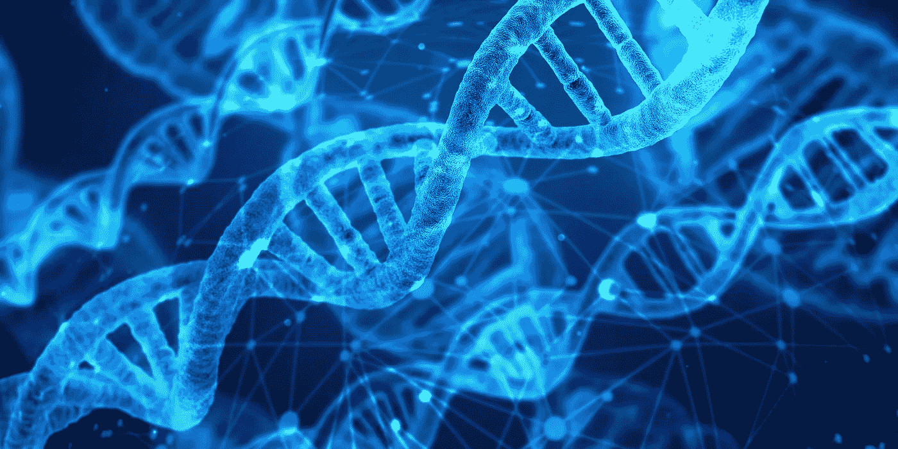
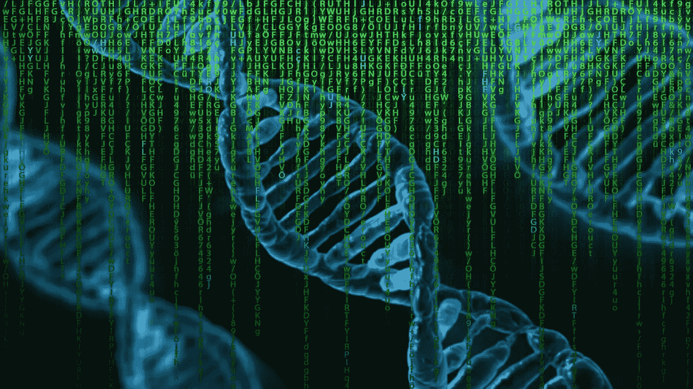
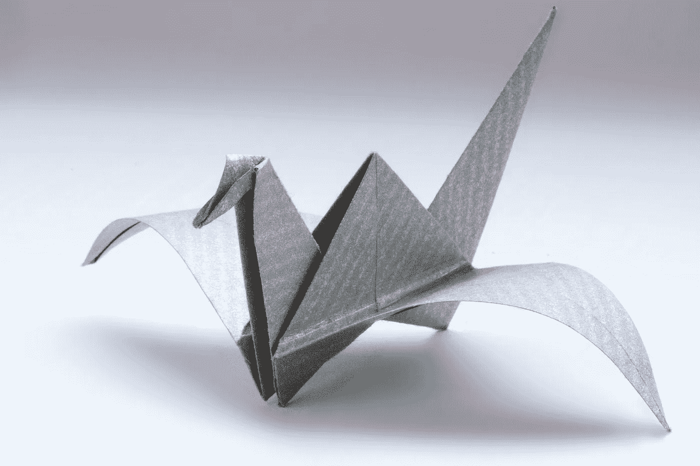

# 计算机设计的人类——试管中的人工智能革命

> 原文：<https://towardsdatascience.com/computer-designed-humans-the-ai-revolution-in-the-test-tube-fe8764d5f44b?source=collection_archive---------16----------------------->

忘掉自动驾驶汽车和声控扬声器吧:未来几年，人工智能最引人注目的效果将出现在一个非常不同的领域。

这些天来，总是有来自科学界的报告，它们的交叉联系和后果并不明显。最近的一个例子可以在最新一期的《自然》杂志上找到。它涉及一种称为白细胞介素-2 的蛋白质，理论上有望成为针对某些类型癌症的免疫疗法的非常有趣的新可能性。然而，白细胞介素-2 有一个主要缺点:虽然它是一种内源性物质，但大量使用时毒性很大。

> “想象一下，在未来，由于拥有特权基因，更有钱的人会活得更长久、更健康。”

# 更稳定，危害更小，看起来完全不同

在《自然》杂志的文章中，丹尼尔-阿德里亚诺·席尔瓦和 20 多名同事报告了他们如何开发出一种设计版本的白细胞介素-2，减少这些不利的特性或使它们完全消失。它可以用来治疗小鼠的肠癌和皮肤癌。一种基于人体自身物质的人造蛋白质，可能在几年内用于癌症治疗，在实验室中创造，现在它正在到来:用一种“计算方法”。

设计师蛋白质是在复杂的迭代过程中产生的，在计算机上和实验室中交替进行。最终，它几乎看起来不像原来的，但毒性更低，甚至比原来的更稳定。

实现蛋白质计算的软件叫做 Rosetta。它的发明者是这篇文章的作者之一。华盛顿大学的大卫·贝克是这门新学科的先驱之一，这门学科可以被称为计算生物技术:使用复杂软件分析、预测和设计蛋白质结构。或者，换句话说:在这里，生物体的组成部分在计算机上被分解、预测、解释和构建。

# 折叠一次活鹤

近年来，Rosetta 在 CASP 竞赛的背景下被反复使用，这已经是几周前讨论的话题。比赛的焦点是哪一个团队最有能力从给定的 DNA 序列中预测三维蛋白质结构。一个非常复杂的任务，书呆子漫画家兰道尔·门罗曾经解释如下:

> “你折过纸鹤吗？“现在想象一下，你必须弄清楚哪些褶皱是制作一只真正的活鹤所必需的”。

在最近的 CASP 比赛中，有一个来自场外的惊喜赢家。谷歌——或者更确切地说是字母表——的女儿 Deepmind 的十人团队迄今为止击败了这个学科的领导者。Deepmind 开发了一个名为 AlphaFold 的系统，该系统基于人工神经网络。这是在人工智能领域给我们带来快速进步的技术。

# 蛋白质文件夹的身份危机

正如遗传学家 Mohammed Al-Quraishi 在一篇值得注意的博客文章中所报道的那样，Deepmind 的胜利让国际蛋白质折叠界的许多明星陷入了危机。起初，许多同事担心 Deepmind 会因为一种别出心裁的新方法而失去专家。然后是救济:方法和工具是新的，但不是基本的方法。然后，他们开始诋毁成功，并将其归结为他们所使用的资源。

这让我想起了职业围棋选手对 Deepmind 的 AlphaGo 在比赛中首次战胜欧洲冠军的反应:嗯，毕竟没有那么伟大。都只是计算能力。反正真正的专业人士更好。后来发生的事情，现在已经尽人皆知。

# 人工智能现在可以做到这一点

Deepmind 团队并不是唯一一个将机器学习方法应用于此类任务的研究小组。谷歌子公司无疑比大学研究人员拥有更多的资金和计算能力。然而，这个结果的精髓在我看来是不同的:AI 现在可以做这样的事情。忘了拥有语音识别和自动驾驶汽车的扬声器吧:人工智能将很快带来生物技术领域可能最剧烈的变化。

DNA 是数据，蛋白质结构是数据。这里要解决的问题极其复杂，涉及多因果、复杂的关系、结构和模式。这些都是今天的人工智能，甚至是明天的人工智能可以有效处理的事情。学习系统不仅建立起来了，而且已经准备好了——如果你继续训练它们，并进一步强化它们，它们会继续改进。

# 一场我们还不敢梦想的科学革命

这种生物技术和机器学习的结合很可能会在未来几年引发一场我们连做梦都不敢想的科学革命。这场革命将要发生的学科并没有为此做好准备。哈佛大学的系统生物学家 Al-Quraishi 写道:“尽管在工业研究实验室中发挥着核心作用，但在软件和计算机科学方面具有专业知识的研究工程师几乎完全不在学术实验室中。”

因此，有可能一小群有才华的不合群者突然在几十年的研究传统中处于领先地位。不仅学术界对此感到惊讶，而且大型制药公司也感到惊讶——即使他们似乎睡着了，尽管他们有必要的资金将机器学习作为一种研究工具。

# 设计人的机器？

这种情况现在可能要改变了。辉瑞、默克、诺华等公司现在将为人工智能专家发布许多高薪职位的广告。然而，Deepmind 的人不会停止对这个久负盛名的东西的研究。

公司和大学将很快开始生产由学习机器开发或至少在学习机器的帮助下开发的设计师分子。接下来，机器将为基因治疗干预提出建议。那些生命能够被挽救或延长的病人会很高兴。

此外，在某个时候，可能是从地球上某个地方的秘密实验室，第一个设计师 DNA 将从机器中出来。