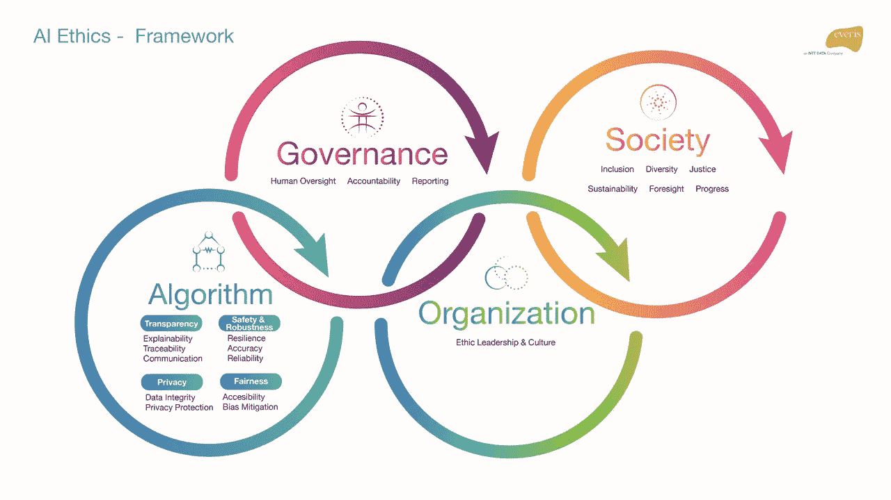
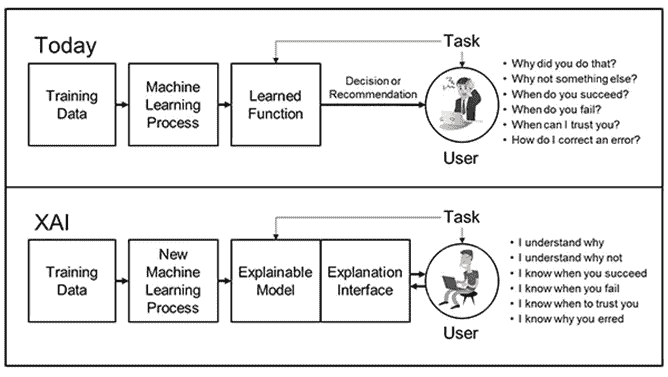

# 电脑说没有

> 原文：<https://towardsdatascience.com/computer-says-no-52a9c31cb8f2?source=collection_archive---------46----------------------->

如果你是《小英国》的粉丝，你可能会熟悉这篇文章的标题，因为在不同的草图中，一个人在台式电脑中输入一些数据，直到“电脑说不”。

我目前正在使用这些短视频中的一些作为一种有趣的方式来介绍我们今天在与人工智能系统合作时面临的主要挑战之一:**算法透明**。

everis AI ethics framework. All rights reserved.

**可解释的人工智能，或 XAI** ，是机器学习模型**理解、信任和管理**自动决策系统的必要条件。

Source: [https://www.darpa.mil/program/explainable-artificial-intelligence](https://www.darpa.mil/program/explainable-artificial-intelligence)

根据 DARPA 的说法，通过 XAI，“新的机器学习系统将有能力解释它们的基本原理，描述它们的优缺点，并传达对它们未来行为的理解。实现这一目标的策略是开发新的或改进的机器学习技术，这将产生更多可解释的模型。这些模型将与最先进的人机界面技术相结合，能够将模型转化为最终用户可以理解和有用的解释对话”。

**对于人工智能可能对人类产生重大影响的任何关键系统**，**人工智能应允许**用于:

*   **为任何决策重新创建结果**
*   **了解用于训练模型的逻辑和数据**
*   **确保自动化决策的可追溯性和可审计性**

如果我们的人工智能系统符合这些要求，我们将不仅确保可解释性，而且确保可追溯性，允许建立**反馈循环**，这有利于我们的人工智能系统，同时保护它们免受偏见等其他挑战，以及**将我们从可解释的人工智能转移到可追溯和透明的人工智能**。

最后，为了增加对人工智能系统的信任，我们需要**以一种清晰、准确和可行的方式与我们的用户和利益相关者沟通**。为了做到这一点， [**将设计原则和团队**视为我们人工智能产品生命周期的基础部分](https://uxstudioteam.com/ux-blog/ai-ux/)将是关键。

毫无疑问，信任是最有价值的商业商品，所以我们不能让一台计算机代表我们公司做出决定，而不理解其中的原因，也不能有效地与客户沟通。

*如果你喜欢阅读这篇文章，请* [*考虑成为会员*](https://dpereirapaz.medium.com/membership) *，在支持我和媒体上其他作者的同时，获得每个故事的完整访问权限。*