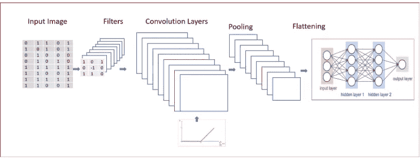
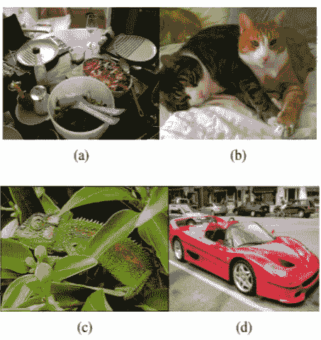

# 计算机视觉——从 CNN 到面具 R-CNN 和 YOLO 之旅——第一部分

> 原文：<https://towardsdatascience.com/computer-vision-a-journey-from-cnn-to-mask-r-cnn-and-yolo-1d141eba6e04?source=collection_archive---------3----------------------->

*在本文中，我们将探索和了解不同计算机视觉算法 CNN 的架构和工作方式，基于区域的 CNN(R-CNN)，快速 R-CNN，更快 R-CNN。在下一篇文章中，我们将探索面具 R-CNN 和 YOLO(你只看一次)*

***计算机视觉的目的是什么？***

计算机视觉是人工智能的一个分支。它用于使计算机能够像人类视觉一样理解、识别和生成对数字图像的智能理解。

***计算机视觉是干什么的？***

利用计算机视觉，我们可以识别

*   **图像中存在的特征**如边缘检测。

**Edge detection**

*   **对图像中存在的物体进行分类**。给图像分配标签，就像识别图像中的猫和狗或对数字进行分类

**Image classification of digits**

*   **图像分类和定位**。这包括对图像进行分类，以及识别物体在边界框中的位置。

*   **对象检测**识别图像中出现的所有不同对象及其位置。围绕图像中出现的所有对象绘制一个边界框。检测是识别图像中存在的内容。定位是指物体在图像中的位置

Source: [http://www.robots.ox.ac.uk/~tvg/publications/talks/fast-rcnn-slides.pdf](http://www.robots.ox.ac.uk/~tvg/publications/talks/fast-rcnn-slides.pdf)

*   **对象分割或语义分割**在像素级检测图像中存在的所有对象。输出具有不同类别或对象的区域

**Semantic Segmentation of two people riding a bike in front of a building**

*   **神经风格转移**我们通过学习一幅图像的风格并将其应用于另一幅图像来生成一幅新图像

**Neural Style Transfer**

# ***利用卷积神经网络(CNN)进行图像分类是如何工作的？***

当我们观看图像时，我们扫描图像。我们可以从左到右或从上到下查看图像，以了解图像的不同特征。我们的大脑结合我们扫描的不同局部特征来对图像进行分类。这正是 CNN 的工作方式。

CNN 将输入作为图像“x”，这是一个具有不同颜色通道(红色、绿色和蓝色-RGB)的二维像素阵列。

我们对输入图像应用不同的**滤波器或特征检测器**来输出**特征图。**与输入图像相比，过滤器或特征检测器在空间上很小。这些滤波器贯穿输入图像的整个深度。

通过对卷积层应用非线性函数 ReLU，并行执行多次卷积。

多特征检测器识别不同的东西，如边缘检测，不同的形状，弯曲或不同的颜色等。

我们将池应用于卷积层。我们可以应用最小池、最大池或平均池。与最小或平均池相比，最大池功能提供了更好的性能。

汇集有助于**平移不变性。**平移不变性意味着当我们少量改变输入时，汇集的输出不会改变。

图像的不变性意味着，即使当图像被旋转、调整不同大小或在不同照明下观看时，一个对象也将被识别为相同的对象。

在下一步中，我们将合并层展平，以将其输入到全连接(FC)神经网络。

我们在全连接层的最终输出层中使用 **softmax** 激活函数进行多类分类。

对于二元分类，我们在全连接层的最终输出层中使用 **sigmoid** 激活函数。

**CNN 的实力**

CNN 用于

*   图像分类
*   使用包围盒的目标检测

**CNN 的局限性**

*   使用边界框进行对象检测，但一次只能检测一个对象
*   由于干扰，当多个物体在视野中时，效果不好。

***那么我们如何识别一幅图像中存在的多个对象，并在所有不同的对象周围绘制边界框呢？***

我们现在探索基于区域的 CNN，这将有助于解决图像中存在多个对象的问题，并在所有不同的对象周围绘制边界框。

# 基于区域的 CNN- R-CNN

R-CNN 用于分类，以及利用图像中存在的多个对象的边界框进行对象检测

***R-CNN 是如何工作的？***

R-CNN 工作的前提是，在给定的区域中，只有单个感兴趣的对象将占主导地位。

R-CNN 使用选择性搜索算法进行目标检测，以生成区域建议。

***那么是什么在一幅图像中形成了一个区域呢？***

图像中的区域可以通过以下方式识别

*   变化的颜色
*   不同的尺度
*   不同的纹理
*   不同外壳

Identifying different objection based on regions

图(a)，勺子，碗都是不同比例的。图(b)，小猫是基于颜色而不是纹理来区分的。图(c ),变色龙可以通过纹理来区分，但不能通过颜色来区分。图(d)，车轮是汽车的一部分，但颜色或纹理不相似。它们是外壳的一部分。

***什么是选择性搜索，我们将如何使用它来识别图像中的多个对象？***

## 选择性搜索

*   使用自下而上的图像区域分组来生成从小到大的区域层次结构
*   目标是生成一小组高质量的对象位置
*   结合了细分和穷举搜索的最佳直觉。
*   图像分割利用图像的结构来生成对象位置
*   穷举搜索旨在捕捉所有可能的对象位置

## **选择性搜索与穷举搜索逐步工作**

步骤 1: **生成初始子分割**。我们生成尽可能多的区域，每个区域最多属于一个对象。

第二步:**递归地将相似的区域合并成更大的区域。**这里我们使用贪婪算法。

*   从该组区域中，选择两个最相似的区域。
*   将它们合并成一个更大的区域。
*   重复直到只剩下一个区域。

这就产生了一个依次增大的区域层次结构，正如我们所希望的那样

Selective search Algorithm to generate regions for object locations

步骤 3: **使用生成的区域产生候选对象位置**。

现在我们知道了选择性搜索是如何工作的，让我们进入 R-CNN 的细节

**R-CNN 将地区提案与 CNN 相结合。**

## 什么是区域提案？

区域建议是检测器可用的候选检测的集合。CNN 在整个图像上运行滑动窗口，但是 R-CNN 只选择几个窗口。R-CNN 对一幅图像使用 2000 个区域。

区域建议运行一种称为分段算法的算法，该算法使用选择性搜索。

***但是 R-CNN 中的物体检测是如何工作的呢？***

1.  **使用选择性搜索提取大约 2000 个区域提案，生成独立于类别的区域提案。扭曲每一个提议。**
2.  **扭曲区域建议被馈送到大型卷积神经** **网络。** CNN 作为特征提取器，从每个区域提取固定长度的特征向量。在通过 CNN 之后，R-CNN 为每个区域提议提取 4096 维特征向量
3.  **将 SVM(支持向量机)应用于从 CNN 提取的特征。SVM 有助于对该区域中物体的存在进行分类。回归变量用于预测包围盒的四个值**

**对图像中的所有得分区域应用贪婪非最大抑制**。

如果一个区域的交集(IoU)与大于学习阈值的较高得分选定区域重叠，则非最大抑制会拒绝该区域。

## ***什么是贪婪非 Max 压制，我们为什么要用它？***

我们的目标是用一个包围盒检测一个物体一次。但是，使用对象检测，我们可能会发现对相同对象的多次检测。**非最大抑制确保只检测一次物体**

要了解非最大抑制，我们需要了解 IoU。

## 并集上的交集— IoU

IoU 通过算法计算两个边界框的并集上的交集，即地面真实的边界框和预测框的边界框

当 IoU 为 1 时，这意味着预测的和真实的边界框完全重叠。

为了在图像中检测一次对象，**非最大抑制会考虑 IoU >为 0.5** 的所有边界框

***如果我有多个 IoU 大于 0.5 的包围盒怎么办？***

## 非最大抑制

*   非最大抑制将移除 IoU 小于或等于 0.5 的所有边界框
*   选取 IoU 值最高的边界框，并抑制其他边界框以识别同一对象

例如，如果我们有三个分别为 0.6、0.7 和 0.9 的矩形。为了让 IoU 识别下图中的车辆，非最大抑制将保留 IoU 为 0.9 的边界框，并将抑制剩余的 IoU 为 0.6 和 0.7 的边界框。

对于下图中的汽车，非最大抑制将保持 IoU 为 0.8，抑制或移除 IoU 边界框为 0.7

> R-CNN 面临的最大挑战是**培训缓慢且昂贵**

## R-CNN 的体系结构

***是什么让 R-CNN 的训练又慢又贵？***

*   我们基于选择性搜索为每幅图像提取 2000 个区域。
*   使用 CNN 提取每个图像区域的特征。对于 N 个图像，我们将有 N*2000 个 CNN 特征。
*   R-CNN 的对象检测使用三种模型:

> CNN 用于特征提取
> 
> 用于识别物体的线性 SVM 分类器
> 
> 收紧边界框的回归模型

***那么我们如何让算法更加高效快速呢？***

R-CNN 需要改进的地方很少

*   **使用一个 ConvNet 处理图像一次，而不是对图像的每个区域使用 2000 个 con vnet**。
*   **使用单一模型提取特征、分类和生成边界框，不像 R-CNN 使用三种不同的模型**

这一切都是在快速 R-CNN 中完成的。

# 快速 R-CNN

**快速 R-CNN 是一个快速框架，用于对象分类和具有深度网络的对象检测**

## 快速 R-CNN 的结构和工作原理

快速 R-CNN 网络将图像和一组对象提议作为输入。

与 R-CNN 不同，**快速 R-CNN 使用单个深度 ConvNet 一次提取整个图像的特征。**

我们还使用选择性搜索为图像创建一组 **ROI(感兴趣区域)**。**感兴趣区域(RoI)层从特征图中提取一个固定长度的特征向量，用于对象检测**。RoI 图层是只有一个金字塔等级的空间金字塔池图层的特例

**全连接层(FC)需要固定大小的输入。因此，我们使用 ROI Pooling 层将用于对象检测的特征图的补丁扭曲到固定大小**。

**ROI pooling** 层然后被送入 FC 进行**分类**以及**定位。** RoI 池层使用最大池。它将任何感兴趣的有效区域内的要素转换成一个小的要素地图。

**全连接层分支成两个同级输出层**

*   一个具有对 K 个对象类的 softmax 概率估计，加上一个包罗万象的“背景”类
*   另一层带有一个**回归器，为 K 个对象类**中的每一个输出精确边界框位置的四个实数值。

## R-CNN 和快速 R-CNN 的主要区别

*   **快速 R-CNN 使用单一深度 ConvNet 进行特征提取。**与 R-CNN 对图像的每个区域使用 2000 个 ConvNet 不同，单个深度 conv net 大大加快了图像处理的速度。
*   **快速 R-CNN 使用 softmax 进行对象分类，而不是 R-CNN** 中使用的 SVM。在异议分类方面，Softmax 略胜 SVM
*   **快速 R-CNN 使用多任务丢失实现深度神经网络的端到端训练，提高了检测精度。**

> 快速 R-CNN 使用选择性搜索作为发现感兴趣区域的建议方法，这是一个缓慢且耗时的过程。不适合大型真实数据集

# 更快的 R-CNN

更快的 R-CNN 不使用昂贵的选择性搜索而是使用区域建议网络。

这是一个单一、统一的目标检测网络

**更快的 R-CNN 由两个阶段组成**

*   **第一阶段是提议区域的深度全卷积网络，称为区域提议网络(RPN)。RPN 模块作为统一网络的关注点**
*   **第二阶段是快速 R-CNN 检测器，使用 RoIPool 从每个候选框中提取特征，并执行分类和包围盒回归**

Faster R-CNN

## 区域提案网络

区域提议网络将任意大小的图像作为输入，并输出一组矩形对象提议，每个提议都有一个客观分数。这是通过在卷积层生成的特征图上滑动一个小网络来实现的

RPN 与快速 R-CNN 对象检测网络共享计算。

从 RPN 生成的要素被提供给两个完全连接的同级图层-用于边界框的框回归图层和用于对象分类的框分类图层。

RPN 是高效的，每幅图像处理 10 ms 以生成 ROI。

Region Proposal Network

## 锚

锚点位于所讨论的滑动窗口的中心，并与比例和纵横比相关联。更快的 R-CNN 使用 3 个比例和 3 个纵横比，在每个滑动窗口产生 9 个锚。

锚点有助于平移不变性。

在每个滑动窗口位置，我们同时预测多个区域建议。每个位置的最大可能建议数表示为 k

Reg 层有 4k 个输出，对 k 个框的坐标进行编码，cls 层输出 2k 个分数，估计每个提议的反对或不反对的概率

## 快速 R-CNN 的结构和工作原理

快速 R-CNN 由 3 个不同的神经网络组成

1.  使用深度卷积层从输入图像生成特征地图的特征网络
2.  区域提议网络(RPN)用于识别不同的区域，其对于每个滑动窗口使用 9 个锚。这有助于平移不变性。RPN 生成许多被称为感兴趣区域(ROI)的边界框，这些边界框对于对象的存在具有高概率
3.  检测网络是 R-CNN，它以来自卷积层和 RPN 网络的输入作为特征映射。这将生成对象的边界框和类

更快的 R-CNN 以图像作为输入，通过特征网络生成特征图。

RPN 使用来自特征网络的特征地图作为输入来生成对象提议的矩形框和对象性分数。

来自 RPN 的预测区域提议随后使用 RoI 池层进行整形。扭曲成固定的向量大小。

然后，扭曲的固定大小向量被馈送到两个完全连接的兄弟层，一个回归层用于预测边界框的偏移值，一个分类层用于对象分类

## 使用更快的 R-CNN

*   三维物体检测
*   基于部件的检测
*   实例分割
*   图像字幕

## 摘要

我们从一个简单的 CNN 开始，它用于图像分类和图像中单个物体的物体检测。

R-CNN 用于图像分类以及图像中多个对象的定位。

R-CNN 又慢又贵，所以快速 R-CNN 被开发成一种更快更有效的算法。R-CNN 和 Fast R-CNN 都使用选择性搜索来搜索图像中的区域。

快速 R-CNN 将 RPN(区域建议网络)与快速 R-CNN 一起用于多图像分类、检测和分割。

在下一篇文章中，我们将探索 YOLO 和面具 R-CNN。

**参考文献:**

[http://vision . Stanford . edu/teaching/cs 231 b _ spring 1415/slides/ssearch _ schuyler . pdf](http://vision.stanford.edu/teaching/cs231b_spring1415/slides/ssearch_schuyler.pdf)

【https://arxiv.org/pdf/1406.4729.pdf 

[https://arxiv.org/pdf/1506.01497.pdf](https://arxiv.org/pdf/1506.01497.pdf)

【https://arxiv.org/pdf/1311.2524.pdf 号

[http://www . cs . Toronto . edu/~ ting Wu Wang/semantic _ segmentation . pdf](http://www.cs.toronto.edu/~tingwuwang/semantic_segmentation.pdf)

[http://www . cs . Toronto . edu/~ ting Wu Wang/semantic _ segmentation . pdf](http://www.cs.toronto.edu/~tingwuwang/semantic_segmentation.pdf)

[https://IVI . fnwi . UVA . nl/ISIS/publications/2013/uijlingsijcv 2013/uijlingsijcv 2013 . pdf](https://ivi.fnwi.uva.nl/isis/publications/2013/UijlingsIJCV2013/UijlingsIJCV2013.pdf)

[http://www . robots . ox . AC . uk/~ tvg/publications/talks/fast-rcnn-slides . pdf](http://www.robots.ox.ac.uk/~tvg/publications/talks/fast-rcnn-slides.pdf)