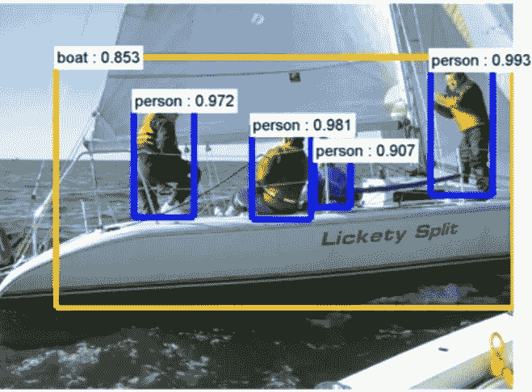
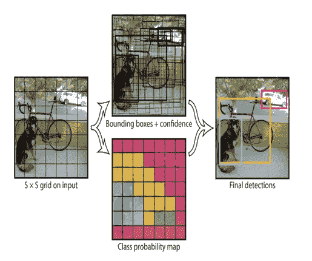
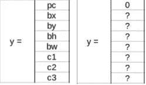
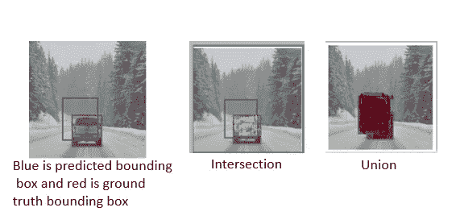
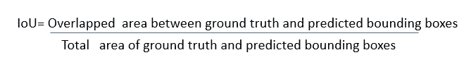
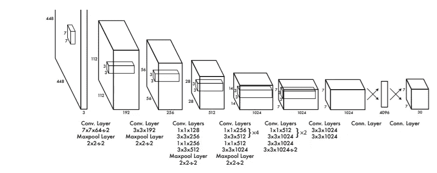
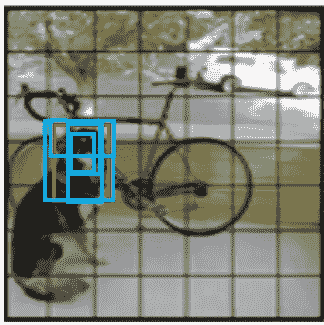

# 计算机视觉——从 CNN 到面具 R-CNN 和 YOLO 之旅——第二部分

> 原文：<https://towardsdatascience.com/computer-vision-a-journey-from-cnn-to-mask-r-cnn-and-yolo-part-2-b0b9e67762b1?source=collection_archive---------5----------------------->

这是探索和理解 YOLO 建筑和工作方式系列的第二篇文章(你只看一次)。

*点击* [*CNN 上详细了解计算机视觉算法，基于区域的 CNN(R-CNN)，快速 R-CNN，更快 R-CNN*](https://medium.com/datadriveninvestor/computer-vision-a-journey-from-cnn-to-mask-r-cnn-and-yolo-1d141eba6e04) *。这是第 1 部分。*

*在下一篇文章中，我们将浏览 YOLO v3 的代码*

**YOLO——你只需看一次**就是更好、更快、更准确的计算机视觉算法的答案。

> 你只需看一次(YOLO)图像，就能预测出哪些物体存在以及它们在哪里。

**单个卷积网络同时预测多个边界框和这些框的类别概率。**

YOLO 在全图像上训练，直接优化检测性能。这使得 YOLO 非常快速和准确

# YOLO 的特色

*   **YOLO，一种对象检测算法同时发现图像网格中的所有对象**
*   **对完整图像使用单个卷积网络**
*   与滑动窗口或基于区域的技术不同，YOLO 在训练和测试期间看到了整个图像，因此它隐式地编码了关于类及其外观的上下文信息。因此与快速的 R-CNN 相比，产生的背景错误不到一半。
*   **YOLO 使用整个图像的特征来预测每个包围盒。**它还同时预测一幅图像的所有类的所有边界框。**预测边界框和这些框的类别概率。**
*   **将检测视为回归问题**
*   **极其快速准确**

# YOLO 的工作

You Only Look Once-YOLO

*   YOLO 拍摄了一幅图像，并将其分割成一个 SxS 网格。每个网格单元仅预测一个对象
*   在每个网格上应用图像分类和定位
*   如果对象的中心落入网格单元，则该网格单元负责检测该对象
*   每个网格单元预测 B 个边界框，这些框具有置信度得分

1.  **置信度得分反映了模型对盒子包含对象的置信度，以及它认为盒子预测的准确性。如果对象不存在，则置信度得分将为零。**置信度预测表示预测框和任何地面真实框之间的 IOU。**Pr(Object)∫IOU 真值 pred——预测框和实际真值之间的交集(IOU)**
2.  **当网格单元中出现对象时的边界框**
3.  **C 类概率**

# 了解 YOLO 的输出

*   **pc 定义网格中物体的存在，是概率**。当一个物体存在时，它包含概率，当网格中没有物体存在时，它们的 pc 将为零
*   **bx，by，bh，bw 指定物体出现时的边界框**。 **bx，by 是相对于网格单元边界的盒子中心。bw、bh 是相对于整个图像的宽度和高度**
*   **c1、c2、c3 等。代表班级。**维 c 等于类的数量。类别概率取决于包含对象 P(类别|对象)的网格单元。如果网格单元中存在对象，则存在的类的值为 1，其他类的值为 0

***输出的维度会是什么？***

**将图像分成一个 S × S 的网格。**

**每个网格单元预测 B 个边界框、这些框的置信度和 C 类概率。**

**每个边界框由 5 个预测组成:bx、by、bw、bh 和置信度**

**输出维度将 S×S×(B∫(1+4)+C)张量**

例如，如果我们将图像划分为 7×7 的网格，每个网格单元预测 2 个边界框，并且我们有 20 个标记类，则输出将是 7×7 ×( 2 * 5+20)= 7×7×30 张量

***地面真值包围盒和预测包围盒之间的 IoU 是什么？***

# 并集上的交集— IoU

IoU 通过算法计算两个边界框的并集上的交集，即地面真实的边界框和预测框的边界框

**当 IoU 为 1 时，这将意味着预测的和真实边界框完全重叠。**

为了在图像中检测一次对象，**非最大抑制会考虑 IoU >为 0.5** 的所有边界框

***如果我有多个 IoU 大于 0.5 的包围盒怎么办？***

# 非最大抑制

*   **非最大抑制将移除 IoU 小于或等于 0.5 的所有边界框**
*   **选择 IoU 值最高的边界框，并抑制其他边界框，以识别同一物体**

例如，如果我们有三个分别为 0.6、0.7 和 0.9 的矩形。为了让 IoU 识别下图中的车辆，非最大抑制将保留 IoU 为 0.9 的边界框，并将抑制剩余的 IoU 为 0.6 和 0.7 的边界框。

对于下图中的汽车，非最大抑制将保持 IoU 为 0.8，抑制或移除 IoU 边界框为 0.7

# YOLO v1 网络设计

**YOLO 的网络架构受 GoogLeNet 图像分类模型的启发**

**YOLO 的检测网络有 24 个卷积层，后面是 2 个全连接层。**

YOLO 使用 1 × 1 缩减层，然后是 3 × 3 卷积层，而不是谷歌网络使用的初始网络

交替的 1 × 1 卷积层减少了来自前面层的特征空间。

**在 ImageNet 分类任务中，卷积层以一半的分辨率(224 × 224 输入图像)进行预训练，然后以两倍的分辨率进行检测**

YOLO 对最后一层使用线性激活函数，对所有其他层使用泄漏 ReLU。

**YOLO 使用卷积特征提取器顶部的全连接层直接预测边界框的坐标。YOLO 只预测每张图片有 98 个盒子。**

# YOLO 的优势

*   与基于分类器的方法不同，YOLO 在测试时速度极快，因为它只需要一次网络评估
*   同时执行特征提取、边界框预测、非最大值抑制和上下文推理。
*   YOLO 网络在线训练特征，并针对检测任务优化它们。统一架构带来更快、更准确的模型

# YOLO 的局限性

*   YOLO 对边界框预测施加了很强的空间约束，因为**每个网格单元只能预测两个框，并且只能有一个类，这限制了模型可以预测的附近对象的数量。**
*   **YOLO 与成群出现的小物体搏斗，比如一群鸟**
*   努力推广到新的或不寻常的长宽比或配置的对象

# YOLO 的其他变体

## 快速 YOLO

快速 YOLO 是 YOLO 的快速变体。它**使用 9 个卷积层，而不是 YOLO** 使用的 24 个卷积层，并且还使用发烧过滤器。

YOLO 和快速 YOLO 之间的网络规模不同，但 YOLO 和快速 YOLO 之间的所有培训和测试参数都相同。

我们网络的最终输出是预测的 7 × 7 × 30 张量。

## YOLOv2 或 YOLO9000

*   **yolov 2 中的输入尺寸从 224*224 增加到 448*448** 。图像输入大小的增加改善了 mAP(平均精度)
*   **YOLOv2 将整个图像划分成 13×13 的网格**。这有助于解决 YOLO v1 中较小物体探测的问题
*   YOLOv2 使用**批处理规范化**，这导致收敛的显著改善，并消除了对其他形式的正则化的需要。我们也可以在不过度拟合的情况下从模型中删除掉的部分。
*   **YOLOv2 在边界框的维度上运行 k-means 聚类，以获得模型的良好先验或锚**。YOLOv2 发现 k= 5 给出了召回率与模型复杂性之间的良好权衡。YOLOv2 使用 5 个锚盒
*   **YOLOv2 使用 Darknet 架构，具有 19 个卷积层、5 个最大池层和一个用于分类对象的 softmax 层**
*   YOLOv2 使用定位框来预测边界框。

***什么是锚盒或先验，它有什么帮助？***

# 锚盒或先验

锚定框用于检测多个对象、不同比例的对象以及重叠的对象。这提高了目标检测的速度和效率。

锚定框一次评估所有对象预测，消除了使用滑动窗口扫描图像的需要

锚点*框*是一组具有一定高度和宽度的预定义边界框。定义这些框是为了捕捉要检测的特定对象类的比例和纵横比。

YOLOv2 将整个图像划分为 13 X 13 个网格单元。 **YOLOv2 在边界框的维度上运行 k-means 聚类，以获得模型的良好先验或锚**。YOLOv2 发现 k= 5 给出更好的性能。

Red is Ground Truth. Blue boxes are 5 Anchor boxes

为了预测一张图片中的多个对象，YOLOv2 进行了数千次预测。最终的目标检测是通过去除属于背景类的锚框来完成的，剩余的锚框通过它们的置信度得分来过滤。我们发现 IoU 大于 0.5 的锚盒。使用前面解释的非最大抑制来选择具有最大置信度得分的锚框。

## YOLOv3

*   使用 9 个锚
*   使用逻辑回归来预测客观性分数，而不是 YOLO v2 中使用的 Softmax 函数
*   YOLO v3 使用 Darknet-53 网络作为具有 53 个卷积层的特征提取器

# YOLO v3 的代码将在下一篇文章中出现

## 参考资料:

[https://pjreddie.com/media/files/papers/yolo.pdf](https://pjreddie.com/media/files/papers/yolo.pdf)

[https://arxiv.org/pdf/1612.08242.pdf](https://arxiv.org/pdf/1612.08242.pdf)

[https://pjreddie.com/media/files/papers/YOLOv3.pdf](https://pjreddie.com/media/files/papers/YOLOv3.pdf)

[http://deeplearning.csail.mit.edu/instance_ross.pdf](http://deeplearning.csail.mit.edu/instance_ross.pdf)