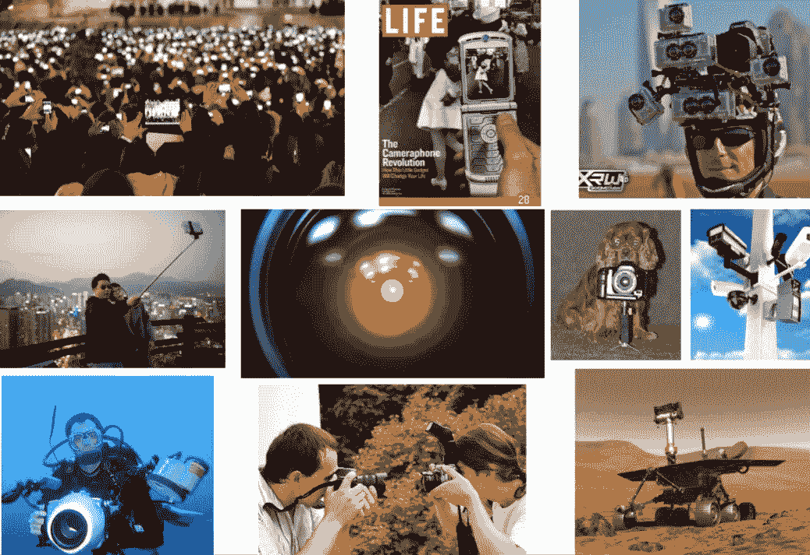
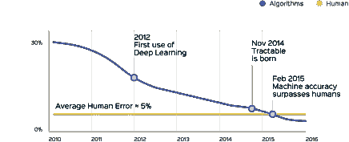
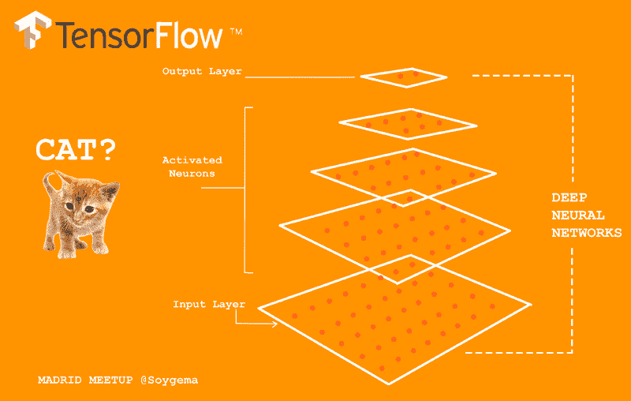
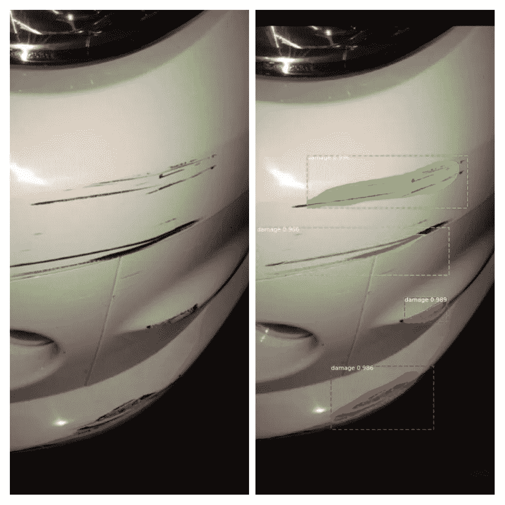
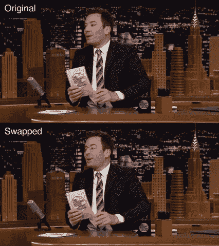
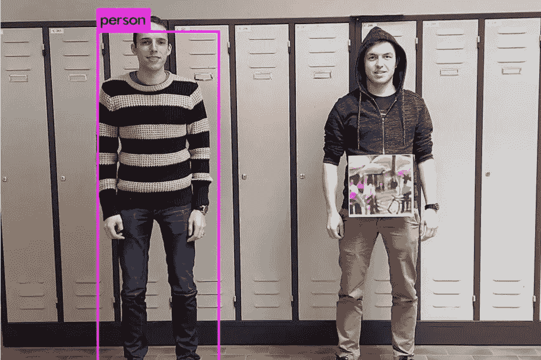

# 计算机视觉——导论

> 原文：<https://towardsdatascience.com/computer-vision-an-introduction-bbc81743a2f7?source=collection_archive---------4----------------------->

## 揭开像素背后的含义

*在* [*之前的博客*](https://medium.com/@ranjeetthakur_43344/visual-perception-from-human-vision-to-computer-vision-3152134292) *中，我讨论了视觉感知及其生物和计算两个方面。这个博客专门讨论计算视觉，也称为计算机视觉。*

# **什么是计算机视觉？**

计算机视觉已经存在了 50 多年，但最近，我们看到人们对机器如何“看”以及计算机视觉如何用于为消费者和企业制造产品的兴趣再次高涨。这类应用的几个例子是——Amazon Go、Google Lens、自动驾驶汽车、人脸识别。

所有这些背后的关键驱动因素是计算机视觉。最简单地说，计算机视觉是人工智能广泛领域下的一门学科，它教会机器看东西。它的目标是从像素中提取意义。

从生物科学的角度来看，它的目标是提出人类视觉系统的计算模型。从工程的角度来看，计算机视觉旨在建立自主系统，这些系统可以执行人类视觉系统可以执行的一些任务(甚至在许多情况下超越人类视觉系统)。

# **简史**

1966 年夏天，麻省理工学院人工智能小组的西蒙·派珀特和马文·明斯基启动了一个名为[夏季视觉项目](http://people.csail.mit.edu/brooks/idocs/AIM-100.pdf)的项目。该项目的目的是建立一个可以分析场景和识别场景中的对象的系统。因此，研究人员和科技巨头仍在试图解码的巨大而令人困惑的计算机视觉领域，最初被人工智能的先驱们认为对于一个本科生暑期项目来说足够简单。

在 70 年代，麻省理工学院的神经科学家大卫·马尔(David Marr)从人类感知的小脑、海马体和皮层的研究中汲取灵感，为现代计算机视觉建立了基础，因此被称为现代计算机视觉之父。他的大部分思想都集中在名为《愿景》的主要著作中。

# **深度视觉**

深度学习从 2012 年开始兴起。深度学习是机器学习的一个子集，其中人工神经网络，受人脑启发的算法，从大量数据中学习。为推荐系统提供动力，识别和标记照片中的朋友，将你的声音翻译成文本，将文本翻译成不同的语言，深度学习已经改变了计算机视觉，使其走向卓越的性能。

*Image classification error rate over time, drastic drop after the introduction of deep learning. source —* tractable.ai

这些基于深度学习的计算机视觉算法，如卷积神经网络，已经开始给出有希望的结果，具有卓越的精度，甚至在某些任务上超过人类水平的精度。

# **应用程序**

**智能手机:**二维码、计算摄影(安卓镜头虚化、iPhone 人像模式)、全景构建(谷歌照片球体)、人脸检测、表情检测(微笑)、Snapchat 滤镜(人脸追踪)、谷歌镜头、夜视(像素)

**Web:** 图片搜索、谷歌照片(人脸识别、物体识别、场景识别、视觉地理定位)、脸书(图片字幕)、谷歌地图航拍成像(图片拼接)、YouTube(内容分类)

**VR/AR:** 由外向内跟踪(HTC VIVE)、由内向外跟踪(同步定位和映射，HoloLens)、对象遮挡(密集深度估计)

**医学影像:** CAT / MRI 重建、辅助诊断、自动病理、连接组学、AI 引导手术

[*http://www.ai.mit.edu/projects/medical-vision/surgery/surgical_navigation.html*](http://www.ai.mit.edu/projects/medical-vision/surgery/surgical_navigation.html)

**媒体:**电影、电视的视觉效果(重建)、虚拟体育回放(重建)、基于语义的自动编辑(重建、识别)

**保险:**理赔自动化、损失分析、财产检查

source — [**Roadzen**](http://roadzen.io)

关于工业中计算机视觉应用的详尽列表，请参见由谷歌高级研究科学家大卫·劳维护的页面。

# **挑战**

即使在大量的工作发表后，计算机视觉仍未解决。它只在很少的约束条件下工作。这种困难的一个主要原因是人类视觉系统对于许多任务来说太好了，例如人脸识别。人类可以在光照、视角、表情等各种变化下识别人脸。这是计算机在这种情况下所遭受的。

**隐私和道德** —在使用监控时，保险业的尖端技术包括[通过监控驾驶行为来调整保费和保单，](https://www.nytimes.com/2019/04/10/opinion/insurance-ai.html)但另一方面，视觉监控系统对隐私和道德造成了巨大风险。举个例子，我们看中国，用[面部识别追踪少数民族。最近，旧金山成为美国第一个禁止政府使用面部识别的城市。](https://www.forbes.com/sites/zakdoffman/2019/05/03/china-new-data-breach-exposes-facial-recognition-and-ethnicity-tracking-in-beijing/#2e9e9eb434a7)

**缺乏可解释性** —基于现代神经网络的算法在某种程度上仍然是一个黑箱。因此，当一个模型将一幅图像归类为一辆汽车时，我们实际上并不知道是什么导致它这样做。可解释性是几个领域的关键要求，比如保险和自动驾驶，这些领域目前在这些算法中缺失。

[https://www . economist . com/science-and-technology/2018/02/15/for-artificial-intelligence-to-thrive-it-must-explain-self](https://www.economist.com/science-and-technology/2018/02/15/for-artificial-intelligence-to-thrive-it-must-explain-itself)

[*https://www . DARPA . mil/program/explable-artificial-intelligence*](https://www.darpa.mil/program/explainable-artificial-intelligence)

**Deep Fakes** —一方面，解决基于深度学习的视觉正在解决许多现实世界的问题，但另一方面，它也产生了一些问题。使用深度学习技术，现在任何拥有强大 GPU 和训练数据的人都可以用 [DeepFakes](https://edition.cnn.com/interactive/2019/01/business/pentagons-race-against-deepfakes/) 创建可信的假图像或视频。

这个问题非常危险，以至于五角大楼通过国防高级研究计划局(DARPA)正在与该国几个最大的研究机构合作，以解决 DeepFakes 问题。

**对抗性攻击** — [对抗性示例](https://arxiv.org/abs/1312.6199)是攻击者有意设计的机器学习模型的输入，以使模型出错；它们就像机器的视错觉。

*Computer vision model* [*fails to recognize*](https://www.theverge.com/2019/4/23/18512472/fool-ai-surveillance-adversarial-example-yolov2-person-detection) *a person when a patch of paper is attached to him*

# **计算机视觉的未来**

根据一份[报告](https://www.marketsandmarkets.com/Market-Reports/ai-in-computer-vision-market-141658064.html)，2017 年计算机视觉市场价值为 23.7 亿美元，预计到 2023 年将达到 253.2 亿美元，CAGR 为 47.54%。

世界正在经历一场深刻的数字化转型，尤其是没有放缓迹象的印度。仅 Jio 每月平均数据消耗就达 10.8 GB。根据这份[报告](https://web-assets.domo.com/blog/wp-content/uploads/2017/07/17_domo_data-never-sleeps-5-01.png)，每分钟——

*   用户观看了 414.66 万个 YouTube 视频
*   Instagram 用户发布了 46740 张照片
*   Snapchat 用户分享了 527，760 张照片

这些都给计算机视觉提供了大量的机会去寻找模式并理解它。

即使有了这些迷人的发展，人工智能和计算机视觉领域仍然需要解决目前与之相关的问题，如偏见、风险意识和缺乏可解释性。为了解决这些问题，像平安这样的公司已经开始采取小步骤，[利用符号人工智能](http://www.pingan.cn/en/viewpoint/insightDetail.shtml?id=14502503)(人工智能的一种早期形式)到现代人工智能算法中，以给出其决策的可解释性，但仍有一段路要走。