# 计算机视觉—手写数学答题卡的自动评分

> 原文：<https://towardsdatascience.com/computer-vision-auto-grading-handwritten-mathematical-answersheets-8974744f72dd?source=collection_archive---------12----------------------->

## 使用 python 自动校正和评分数学工作表的计算机视觉模型。


Photo by [Jeswin Thomas](https://unsplash.com/@jeswinthomas?utm_source=medium&utm_medium=referral) on [Unsplash](https://unsplash.com?utm_source=medium&utm_medium=referral)

阅读是教育的一个重要部分。手动评估每份答卷，提供公平、公正和有效的分数在大多数情况下是困难的。这篇文章是关于我和我的导师[比乔恩·古哈](https://medium.com/u/9adb8b8d7e98?source=post_page-----8974744f72dd--------------------------------)的实习项目，建立一个计算机视觉模型，它将自动评估答案纸，从而确保分数完全基于学生的表现。

# 概观

下面是我们将要检查和评分的样本工作表。

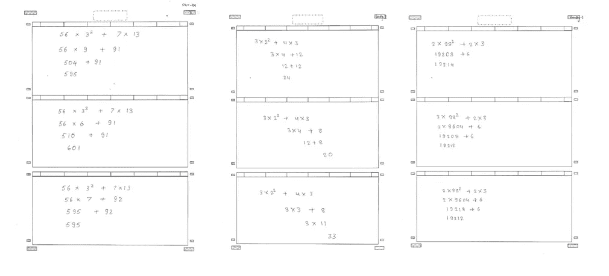

Sample Worksheets

每张工作表都是由不同的人写的。线宽、同页字体、笔尖宽度、字符间距等都会有变化。

> 这个想法是纠正工作表中的每一行，并用方框标记这些行。其中绿框表示线正确，红框表示线不正确。

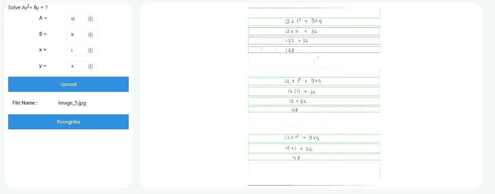

Sample Output

(注意:我没有在这里添加所有代码，如果你想检查你可以访问我的 [**GitHub**](https://github.com/divyaprabha123/Autograding-handwritten-mathematical-worksheets/) 在那里我有一个 ipynb 笔记本的教程)

# 工作流程

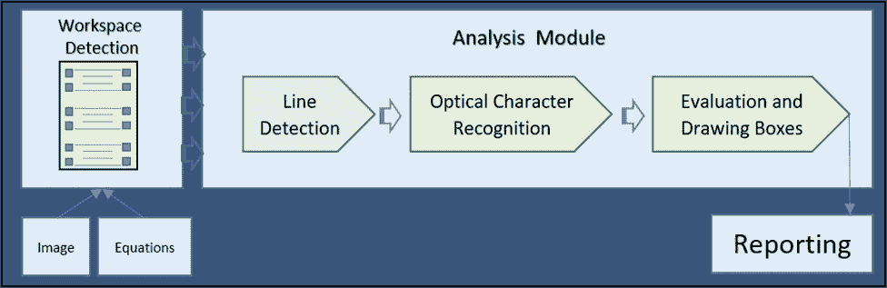

Workflow diagram

工作流程中有两个模块**工作空间检测**模块**和**分析模块。工作空间检测模块负责检测给定纸张中的多个工作空间。

分析模块负责在任何给定的单个工作空间中检测和定位行中的字符，并对它们进行数学分析，然后根据它们的正确性绘制红、绿框。

# 工作空间检测

工作空间检测模块假设在给定的扫描工作表中存在有效的矩形框。下图显示了工作表设计。工作表中三个最大的矩形框是工作空间。

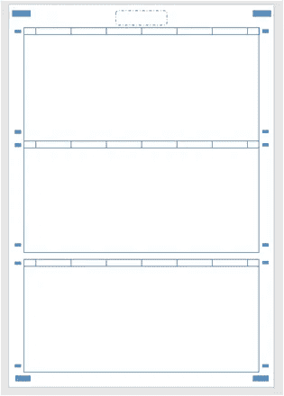

Worsheet design

工作空间检测模块使用 [openCV](https://opencv.org/) 完成。我们将首先找到矩形框，然后根据它们在工作表中的位置对它们进行排序。由于工作表中有许多矩形，我们必须从其他矩形中选择有效的工作空间。让我们看看每个步骤是如何完成的

## 步骤 1:寻找矩形框

矩形由两条水平线和垂直线组成。所以第一步是找出所有的水平线和垂直线，忽略数字、符号或任何写在工作表上的东西。

下面的代码将首先创建一个名为 *"vertical_lines_img"* 的二进制图像，它包含工作表中出现的所有垂直线，然后创建另一个名为" horizontal_lines_img" 的二进制图像*，它包含工作表中出现的所有水平线。*

接下来，我们要将图像*“垂直 _ 线条 _img”与“水平 _ 线条 _ img”*相加，得到最终的图像。

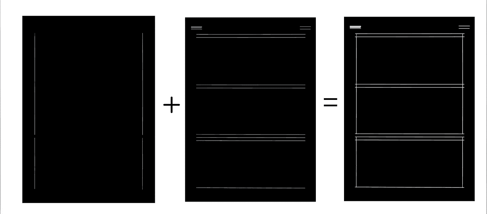

Adding vertical and horizontal line

> **轮廓**定义为沿着图像边界连接具有相同强度的所有点的线。

**OpenCV** 具有 findContour()函数，帮助从图像中提取**轮廓**。每个单独的轮廓是对象边界点的(x，y)坐标的 Numpy 数组。我们可以用它来找到最终图像中的所有对象(最终图像中只有对象是矩形)。

因为最终图像只是原始图像的二进制版本，所以最终图像中矩形的坐标等于原始图像中矩形的坐标。

现在我们知道了坐标，让我们使用 openCV 的*[*draw contours()*](https://docs.opencv.org/3.4/d4/d73/tutorial_py_contours_begin.html)函数在原始图像上绘制它们。*

*Code to find and draw the contours*

*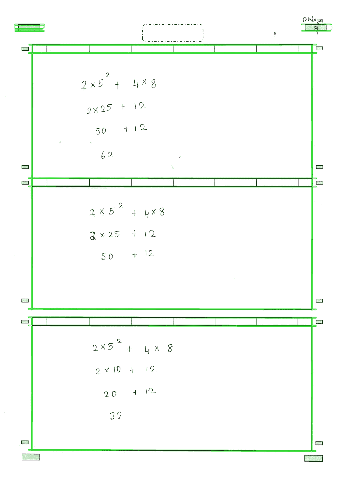*

## *步骤 2:对轮廓进行排序*

*现在我们已经找到了所有的矩形，是时候根据它们的坐标从上到下对它们进行排序了。下面的代码会帮我们做到这一点。*

*Function to sort contours [**Code Reference**](https://www.pyimagesearch.com/2015/04/20/sorting-contours-using-python-and-opencv/)*

*Sorted contours*

**sort_contours* 函数将返回按照我们给出的方法排序的轮廓和边界框(左上和右下坐标)。在这种情况下，方法是从上到下。*

## *步骤 3:基于区域的选择*

*有许多矩形，但我们只需要三个最大的。如何选择三个最大的矩形？….一个答案是找出矩形的面积，然后选择面积最大的前 3 个矩形。*

*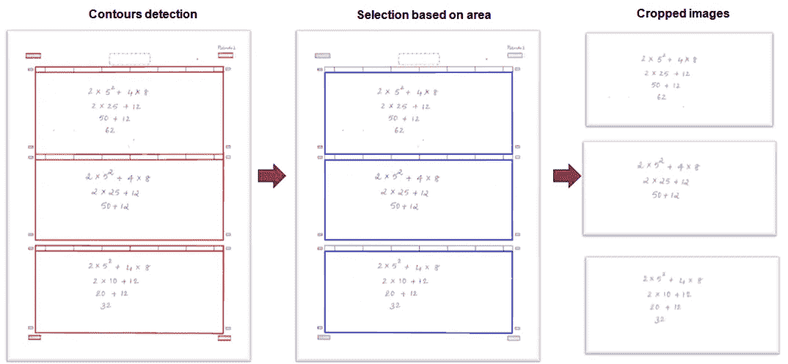*

*Overall solution*

*这些选定的矩形是工作空间，然后从工作表中提取出来，并发送到分析模块。*

# *分析模块*

*如上所述的分析模块将首先检测行，预测每行中的字符，最后用预测的字符形成方程，然后通过标记框来评估它们。*

## *线检测*

*检测这些线是棘手的部分，每个人都有自己解决方程的方法，有些人一步一步地解决，有些人只用一行就能解决，有些人可能写了好几页的步骤，有些人写了远离方程的指数，使模块混淆，将这些指数作为一个单独的行。*

*我们的线检测模块假设线之间有足够的间隙，并且在指数字符和线之间有一些交集。首先，检测到的工作空间被转换成二进制图像，然后压缩成一个单一的阵列，以采取向前的导数。哪里有线，哪里的导数就有变化。*

*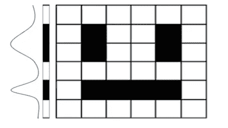*

*Change in derivatives of a binary image*

*上面的代码只是线条提取工作原理的一瞥。要查看完整的代码，请点击[](https://github.com/divyaprabha123/Autograding-handwritten-mathematical-worksheets/blob/d074738c2e1db6b4619e9930f576439b309d1f37/utils_functions.py#L426-L570)****。*****

***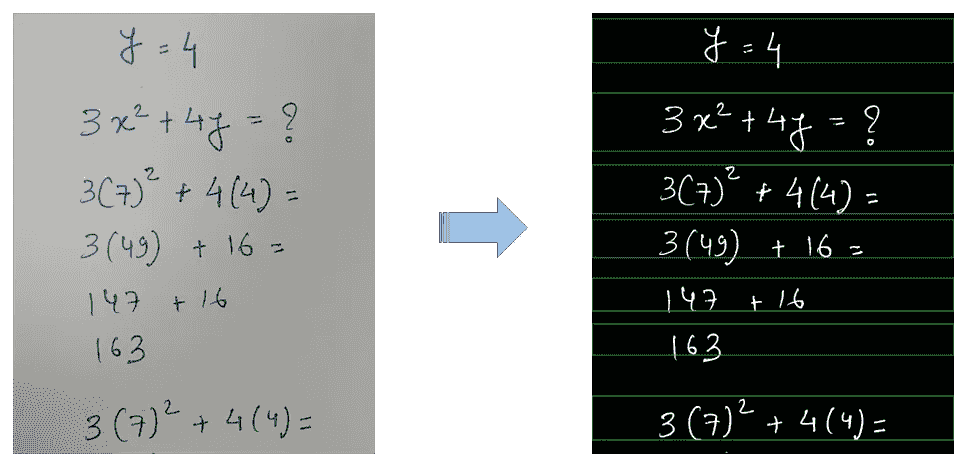***

## ***字符分割和指数检测***

***检测完所有线条后，我们必须将提取的线条图像发送到[***text _ segment***](https://github.com/divyaprabha123/Autograding-handwritten-mathematical-worksheets/blob/d074738c2e1db6b4619e9930f576439b309d1f37/utils_functions.py#L636-L725)*函数，该函数将使用 openCV 的 find contours 来分割字符，并使用上述函数 *sort_contours* 对字符进行排序，其中方法现在设置为从左到右。****

****对我们来说，判断给定的数是否是指数很容易，但对模型来说就没那么容易了。假设指数至少在直线的一半以上，我们可以在图像的中心画一条基线，基线以上的任何字符都被认为是指数。****

****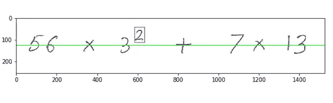****

****Exponential detection****

## ****光学字符识别****

****我们可以使用 [MNIST](http://yann.lecun.com/exdb/mnist/) 数据集用于数字(28*28 像素)和 [Kaggle 的手写数学符号](https://www.kaggle.com/xainano/handwrittenmathsymbols)数据集用于符号(45*45 像素)来训练模型。****

****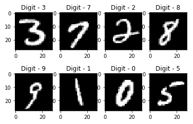****

****MNIST IMAGES****

****MNIST 实际上是如何形成的？****

1.  ****从 500 个不同的作者那里收集的 128 * 128 像素的手写数字。****
2.  ****高斯滤波器被应用于图像以柔化边缘****
3.  ****然后，通过保持长宽比，将数字放置在正方形图像的中央。****
4.  ****然后，使用双三次插值将图像下采样至 28 × 28 像素****

****在训练之前，符号的图像以与 MNIST 数字相同的方式进行预处理。预处理的原因是我们选择的两个数据集具有不同的特征，如尺寸、厚度和线宽，这使得深度学习模型很难找到模式。预处理帮助我们减少数字和符号之间的差异。****

****在[深度柱状卷积神经网络(DCCNN)](https://pdfs.semanticscholar.org/d80b/4375171d97a8c8b7daa8a1b9170429126f5d.pdf) 上训练了近 60，000 幅数字和预处理符号的图像，这是一种单一的深度和广度神经网络架构，在各种图像分类挑战(如 MNIST、CIFAR-10 和 CIFAR-100 数据集)上提供接近最先进的性能，如集成模型。这个模型达到了 96 %的准确率。****

****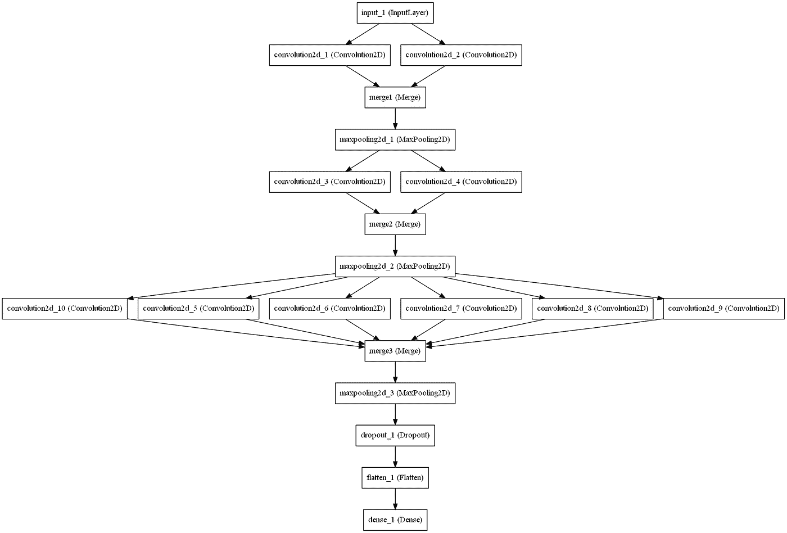****

****Deep Columnar Convolutional Architecture (DCCNN)****

****点击 [*查看训练代码 DCCNN_training.ipynb*](https://github.com/divyaprabha123/Autograding-handwritten-mathematical-worksheets/blob/d074738c2e1db6b4619e9930f576439b309d1f37/DCCNN%20-%20training.ipynb)****

# ****评估和绘图框****

****评估是最后也是最重要的部分。为了求解任何方程，我们可以使用 python 的 *eval* 方法。****

****eva 方法解析传递给它的表达式，并在程序中运行 python 表达式(代码)****

****这是一个关于 *eval* 如何工作的例子****

```
****>>Enter the function y(in terms of x):‘x*(x+1)*(x+2)’>>Enter the value of x:3>>print(y)60****
```

****[*评估*](https://github.com/divyaprabha123/Autograding-handwritten-mathematical-worksheets/blob/d074738c2e1db6b4619e9930f576439b309d1f37/utils_functions.py#L573-L634) 流程涉及的步骤有:****

1.  ****解决给定的数学问题并保存答案****
2.  ****求解每一个手写行，并将其导出值与存储的答案进行比较。****
3.  ****如果线条正确，画一个绿色的边界框，如果线条错误，画一个红色的边界框。****

****我们举个例子，说问题是解方程 A*x + B*y****

****其中，A=56，B=7，x=3，y=13，这个等式的答案是 595 (56*3 +7*13 = 595)。****

****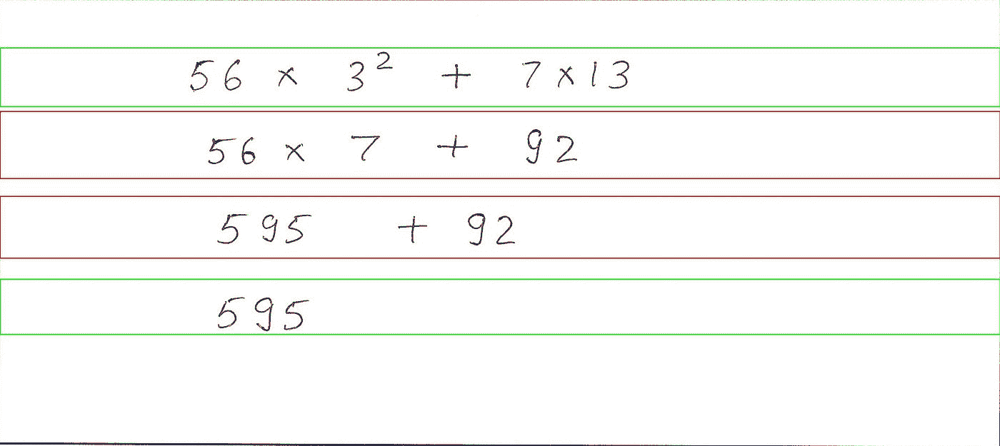****

****Sample workspace****

****绿色方框表示这条线是正确的，而红色方框表示这条线是错误的。****

****第一行和最后一行是正确的，通过求解这些行，我们得到 595，这与实际答案相符。****

****第二行(56*7 + 92)错了。3 是 9，但它被写成 7，在求解时我们得到 584，这不等于 595****

****第三行(595 + 92)也是错误的，在求解这一行时，我们得到 684，它也不等于 595。****

# ****结论****

****总而言之，扫描的工作表被发送到工作空间检测模块，它将返回给定工作表中的所有矩形工作空间，然后检测到的工作空间被传递到线提取模块以提取所有的线。提取的线然后被发送到字符分割模块，它将分割字符，深度学习模型 DCCNN 将预测数字/符号。最后，评估模块将评估线，并绘制红/绿包围盒。****

****自动化评分过程不仅有助于教师，也为学生创造了舒适的学习体验。通过识别更复杂的数学方程，如微分积分方程、识别字符未分离的草书笔迹、检测剽窃和识别化学方程，该解决方案可以变得更酷。****

****感谢阅读到最后！！...如果你喜欢这篇文章，请鼓掌让我知道，如果你能通过与你的朋友分享来帮助它传播，我将非常感激:)。✌️****