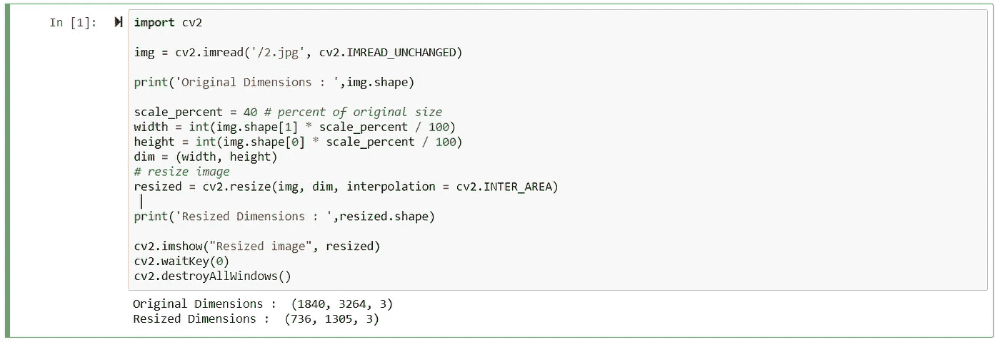

# 计算机视觉——利用哈尔级联分类器检测物体

> 原文：<https://towardsdatascience.com/computer-vision-detecting-objects-using-haar-cascade-classifier-4585472829a9?source=collection_archive---------0----------------------->

在开始进入细节之前，我们先来了解一下什么是计算机视觉以及它的一些应用。

# 什么是计算机视觉？

计算机视觉是一个研究领域，包括计算机如何看到和理解数字图像和视频。

计算机视觉包括看到或感知视觉刺激，理解所看到的内容，并提取可用于其他机器学习活动的复杂信息。

# 计算机视觉的应用

计算机视觉有许多实际应用:

*   自动驾驶汽车 —这是计算机视觉最重要的应用之一，自动驾驶汽车需要收集周围的信息，以决定如何行动。
*   **面部识别—** 这也是计算机视觉的一个非常重要的应用，电子设备使用面部识别技术来验证用户的身份。
*   **图像搜索和物体识别** —现在我们可以使用图像搜索在图像中搜索物体。一个很好的例子是谷歌镜头，我们可以通过点击图像的照片来搜索图像中的特定对象，计算机视觉算法将搜索图像目录，并从图像中提取信息。
*   **机器人** —大多数机器人机器，通常在制造业中，需要看到它们的周围环境来执行手头的任务。在制造业中，机器可以通过“观察”来检查装配公差。

既然我们知道了计算机视觉的含义和它的一些应用，让我们深入研究它的实现。为了实现计算机视觉的各种例子，我们将使用 OpenCV 库。

**OpenCV** (开源计算机视觉库:[http://opencv.org](http://opencv.org/))是一个开源的 BSD 许可库，包括数百种计算机视觉算法。

**Haar 级联分类器:**我们将使用 Haar 级联分类器来实现我们的用例。Haar 级联分类器是一种有效的目标检测方法，由 Paul Viola 和 Michael Jones 于 2001 年在他们的论文“使用简单特征的增强级联的快速目标检测”中提出。

那么，让我们试着理解这些哈尔级联分类器是什么。这基本上是一种基于机器学习的方法，其中从大量正面和负面图像中训练级联函数。基于该训练，然后使用它来检测其他图像中的对象。

所以这是如何工作的，他们是巨大的个体。具有许多特性集的 xml 文件，每个 xml 对应于一个非常特定的用例类型。

例如，如果你去 haarcascade 的 [github](https://github.com/opencv/opencv/tree/master/data/haarcascades) 页面，你会看到有一个特定的 xml 文件，其中包含检测[全身](https://github.com/opencv/opencv/blob/master/data/haarcascades/haarcascade_fullbody.xml)、[下体](https://github.com/opencv/opencv/blob/master/data/haarcascades/haarcascade_lowerbody.xml)、[眼睛](https://github.com/opencv/opencv/blob/master/data/haarcascades/haarcascade_eye.xml)、[正面](https://github.com/opencv/opencv/blob/master/data/haarcascades/haarcascade_frontalface_alt.xml)等等的特征集。

为了理解 haar 级联分类器如何工作，以及它将如何用于计算机视觉，让我们实现一些用例。

# **1。面部检测**

在这个用例中，我们将尝试使用**Haar cascade _ front alface _ default . XML**来检测个人的面部

我们在这里使用的图像尺寸相当大，所以为了更好的输出，我们缩小了图像尺寸。

我们使用下面的代码来调整图像的大小:



## 第一步

现在我们已经调整了图像的大小，让我们继续导入 **cv2** 和 **numpy** 并使用 OpenCV 的 **CascadeClassifier** 函数指向我们存储 XML 文件的位置，在我们的例子中是**Haar cascade _ frontal face _ default . XML**。我已经将 xml 文件下载到我的本地，并使用了我的机器的路径，但是如果你愿意，你可以直接将它指向 github 的位置。

```
import cv2
import numpy as npface_classifier = cv2.CascadeClassifier('/haarcascade_frontalface_default.xml')
```

## 第二步

现在第二步是加载图像并将其转换成灰度。在展示代码之前，我想告诉你我们在这里将图像转换为灰度的原因。

通常我们看到的图像是 RGB 通道(红、绿、蓝)的形式。因此，当 OpenCV 读取 RGB 图像时，它通常将图像存储在 BGR(蓝、绿、红)通道中。为了图像识别的目的，我们需要将 BGR 通道转换成灰色通道。这是因为灰色通道易于处理，并且计算量较小，因为它只包含 1 个黑白通道。

```
gray = cv2.cvtColor(resized, cv2.COLOR_BGR2GRAY)
```

这里，函数 cvtColor 的参数将是图像变量名(**调整大小**)和 **COLOR_BGR2GRAY。**

## 第三步

现在，在将图像从 RGB 转换为灰度后，我们现在将尝试定位我们面部的确切特征。让我们看看如何用代码实现它。

```
faces = face_classifier.detectMultiScale(gray, 1.0485258, 6)
```

在这段代码中，我们要做的是，使用 **face_classifier** ，它是一个加载了**Haar cascode _ frontal face _ default**的对象。 **xml，**我们使用了一个内置的函数，叫做 **detectMultiScale。**

该功能将帮助我们找到新图像的特征/位置。其方式是，它将使用来自 **face_classifier** 对象的所有特征来检测新图像的特征。

我们将传递给该函数的参数是:

1.  灰度变量—在我们的例子中是灰色
2.  **比例因子** —指定图像尺寸在每个图像比例下缩小多少的参数
    。基本上，比例因子用于创建您的比例金字塔。更多的解释是，您的模型在训练期间定义了一个固定的大小，这在 XML 中是可见的。这意味着如果存在的话，在图像中检测到脸部的这个尺寸。但是，通过重新调整输入图像的比例，您可以将较大的人脸调整为较小的人脸，从而使算法可以检测到它。1.05 是一个很好的可能值，这意味着您使用一个小步骤来调整大小，即减少 5%的大小，您增加了找到与检测模型匹配的大小的机会。这也意味着该算法工作较慢，因为它更彻底。为了更快地检测，您可以将它增加到 1.4，但有可能会完全错过一些面孔。在我们的例子中，我使用 1.0485258 作为**比例因子**，因为这对我正在使用的图像来说是完美的。
3.  **最小邻居** —指定每个候选矩形应该有多少邻居来保留它的参数。该参数将影响检测到的人脸的质量。值越高，检测次数越少，但质量越高。3~6 是一个很好的值。在我们的例子中，我选择了 6 作为我的邻居，这对于我使用的图片来说是完美的。

## 第四步

从上面的步骤中，函数 **detectMultiScale** 返回 4 个值——检测到的面部特征的 x 坐标、y 坐标、宽度(w)和高度(h)。基于这 4 个值，我们将在脸部周围画一个矩形。

```
if faces is ():
    print("No faces found")
for (x,y,w,h) in faces:
    cv2.rectangle(resized, (x,y), (x+w,y+h), (127,0,255), 2)
    cv2.imshow('Face Detection', resized)
    cv2.waitKey(0)

cv2.destroyAllWindows()
```

将所有 4 个步骤整合在一起，下面是代码:

```
import cv2
import numpy as npface_classifier = cv2.CascadeClassifier('/haarcascade_frontalface_default.xml')gray = cv2.cvtColor(resized, cv2.COLOR_BGR2GRAY)''' Our classifier returns the ROI of the detected face as a tuple, 
It stores the top left coordinate and the bottom right coordiantes'''faces = face_classifier.detectMultiScale(gray, 1.0485258, 6)'''When no faces detected, face_classifier returns and empty tuple'''
if faces is ():
    print("No faces found")'''We iterate through our faces array and draw a rectangle over each face in faces'''
for (x,y,w,h) in faces:
    cv2.rectangle(resized, (x,y), (x+w,y+h), (127,0,255), 2)
    cv2.imshow('Face Detection', resized)
    cv2.waitKey(0)

cv2.destroyAllWindows()
```

我已经创建了上述程序的输出作为一个视频，并将其嵌入下面。如果你看到，程序不能正确地检测到一些面孔。原因是为了使 haarcascade 分类器正常工作，人脸应该是适当可见的。在输出中没有被检测到的那个有点不清楚。

尽管如此，我将在未来的帖子中尝试改进这一点，我们将使用不同类型的涉及深度学习的算法来减轻这一点。

Face detection using haar cascade classifier

# 2.人脸和眼睛检测

现在我们已经对人脸检测的工作原理有了一些了解，让我们看看如何检测人脸和眼睛

在这个实现中，与**人脸检测**代码相比，我们做了一些改动。

## 第一步

为了检测眼睛，我们还导入了 **haarcascade_eye.xml** 文件。

```
eye_classifier = cv2.CascadeClassifier('/haarcascade_eye.xml')
```

## 第二步

一旦我们使用 **detectMultiScale** 函数获得人脸检测特征的 x 坐标、y 坐标、宽度(w)和高度(h ),我们将创建 2 个 numpy 数组— **roi_gray** 和 **roi_color。****ROI _ gray**是使用变量“gray”创建的 numpy 数组。我们创建它的原因是在提取眼睛的特征(例如，ey，ew，eh)时，将这个灰色通道版本传递给 **detectMultiScale** 函数。

```
for (x,y,w,h) in faces:
    cv2.rectangle(img,(x,y),(x+w,y+h),(127,0,255),2)
    cv2.imshow('img',img)
    cv2.waitKey(0)
    roi_gray = gray[y:y+h, x:x+w]
    roi_color = img[y:y+h, x:x+w]
    eyes = eye_classifier.detectMultiScale(roi_gray)
```

## 第三步

一旦我们提取了眼睛的特征(例如，ey，ew，eh ),我们将遍历它们并通过传递 numpy 数组 **roi_color 创建一个矩形。**传递 **roi_color** 而不传递 **roi_gray** 的原因是 **roi_color** 是实际 RGB 比例图像的数组，而 **roi_gray** 是图像的灰度，我们在代码中使用它来加快处理速度，同时提取图像的尺寸/坐标，然后使用这些尺寸将它传递到原始数组中，在我们的示例中是 **roi_color** 。

```
for (ex,ey,ew,eh) in eyes:
        cv2.rectangle(roi_color,(ex,ey),(ex+ew,ey+eh),(255,255,0),2)
```

将所有步骤整合在一起:

```
import numpy as np
import cv2

face_classifier = cv2.CascadeClassifier('/haarcascade_frontalface_default.xml')
eye_classifier = cv2.CascadeClassifier('/haarcascade_eye.xml')img = cv2.imread('/group.jpg')
gray = cv2.cvtColor(img, cv2.COLOR_BGR2GRAY)faces = face_classifier.detectMultiScale(gray, 1.05, 3)# When no faces detected, face_classifier returns and empty tuple
if faces is ():
    print("No Face Found")for (x,y,w,h) in faces:
    cv2.rectangle(img,(x,y),(x+w,y+h),(127,0,255),2)
    cv2.imshow('img',img)
    cv2.waitKey(0)
    roi_gray = gray[y:y+h, x:x+w]
    roi_color = img[y:y+h, x:x+w]
    eyes = eye_classifier.detectMultiScale(roi_gray)
    for (ex,ey,ew,eh) in eyes:
        cv2.rectangle(roi_color,(ex,ey),(ex+ew,ey+eh),(255,255,0),2)
        cv2.imshow('img',img)
        cv2.waitKey(0)

cv2.destroyAllWindows()
```

我已经创建了上述程序的输出作为一个视频，并将其嵌入下面。如果你看到程序不能正确检测戴眼镜的人的眼睛。也许我们需要一个更复杂的算法。

Face and Eye detection using haar cascade classifier

## 3.流式视频中的车辆检测

让我们再实现一个 haar 级联分类器的用例。在这个用例中，我们将从流视频中检测车辆。我实现了这些用例来展示它是如何工作的。对于这个分类器，还有很多其他的 XML，你可以用来实现其他一些计算机视觉的例子。这是 xmls 的 github 链接。

这里的实现与我们为人脸检测所做的一样，所以我不会详细解释整个过程。然而，代码中有一些变化。

## 第一步

为了检测车辆的特征，我们需要导入 **haarcascade_car.xml.**

使用 cv2 的**视频捕捉**并将值存储在 **cap** 中

从一个`VideoCapture`中读取(`cap.read()`)返回一个元组`(ret, frame)`。对于第一项，您检查读取是否成功，如果成功，则继续使用返回的`frame.`

```
cap = cv2.VideoCapture('/vehicle.mp4')# Loop once video is successfully loaded
while cap.isOpened():

    time.sleep(.05)
    # Read first frame
    ret, frame = cap.read()
```

## 第二步

现在我们有了`(ret, frame)`的元组，我们将把 BGR 通道图像转换成灰色通道。出于同样的原因，我们将图像转换为灰度，并使用分类器函数 **detectMultiScale** 来提取 x 坐标、y 坐标、宽度(w)和高度(h)，灰度用于更好的性能吞吐量。

```
gray = cv2.cvtColor(frame, cv2.COLOR_BGR2GRAY)

    # Pass frame to our car classifier
    cars = car_classifier.detectMultiScale(gray, 1.1, 2)
```

## 第三步

基于提取的汽车特征/尺寸，我们将遍历它们，并在图像的每一帧周围绘制一个矩形。

```
for (x,y,w,h) in cars:
        cv2.rectangle(frame, (x, y), (x+w, y+h), (0, 255, 255), 2)
```

下面是这方面的综合代码:

```
import time
import numpy as np
import cv2# Create our body classifier
car_classifier = cv2.CascadeClassifier('\haarcascade_car.xml')# Initiate video capture for video file
cap = cv2.VideoCapture('/vehicle.mp4')# Loop once video is successfully loaded
while cap.isOpened():

    time.sleep(.05)
    # Read first frame
    ret, frame = cap.read()
    gray = cv2.cvtColor(frame, cv2.COLOR_BGR2GRAY)

    # Pass frame to our car classifier
    cars = car_classifier.detectMultiScale(gray, 1.1, 2)

    # Extract bounding boxes for any bodies identified
    for (x,y,w,h) in cars:
        cv2.rectangle(frame, (x, y), (x+w, y+h), (0, 255, 255), 2)
        cv2.imshow('Cars', frame)if cv2.waitKey(1) == 13: #13 is the Enter Key
        breakcap.release()
cv2.destroyAllWindows()
```

现在我们有了完整的代码，让我们检查它的输出。

Car detection using haar cascade classifier

## 4.流式视频中的行人检测

实现与车辆检测完全相同。这里唯一的不同是，我们将使用 **haarcascade_fullbody.xml** 来识别行人身体的特征。

下面是它的代码:

```
import numpy as np
import cv2# Create our body classifier
body_classifier = cv2.CascadeClassifier('\haarcascade_fullbody.xml')# Initiate video capture for video file
cap = cv2.VideoCapture('/moskva.mov')# Loop once video is successfully loaded
while cap.isOpened():

    # Read first frame
    ret, frame = cap.read()gray = cv2.cvtColor(frame, cv2.COLOR_BGR2GRAY)
    # Pass frame to our body classifier
    bodies = body_classifier.detectMultiScale(gray, 1.1, 3)

    # Extract bounding boxes for any bodies identified
    for (x,y,w,h) in bodies:
        cv2.rectangle(frame, (x, y), (x+w, y+h), (0, 255, 255), 2)
        cv2.imshow('Pedestrians', frame)if cv2.waitKey(1) == 13: #13 is the Enter Key
        breakcap.release()
cv2.destroyAllWindows()
```

让我们看看下面视频中的输出是什么样的:

Pedestrians detection using haar cascade classifier.

## 离别的思绪

尽管 haarcascade 分类器非常有用，但这种方法也有一些缺点。

1.  其中最具挑战性的部分是精确指定**检测多尺度**函数的**比例因子**和**最小邻居**的参数值。我们经常会遇到需要逐个图像地调整这两个参数的情况，对于图像检测用例来说，这是一个很大的障碍。
2.  **比例因子**主要用于控制图像金字塔，进而用于在图像的不同比例下检测物体。如果**比例因子**太大，那么图像检测可能会不准确，我们将会错过处于金字塔层之间*比例的对象。*
3.  然而，如果我们降低**比例因子**的值，那么你将在相同的图像比例上得到许多层金字塔，这使得检测更慢并增加假阳性。

请继续关注即将发布的帖子，在那里我们将看到使用一些复杂的深度学习算法以更有效的方式检测图像的其他酷方法。

还有，如果你想了解 devops，可以参考这个网站。

参考资料:

1.  [https://docs . opencv . org/3.4/db/d28/tutorial _ cascade _ classifier . html](https://docs.opencv.org/3.4/db/d28/tutorial_cascade_classifier.html)
2.  [https://www . pyimagesearch . com/2016/06/20/detecting-cats-in-images-with-opencv/](https://www.pyimagesearch.com/2016/06/20/detecting-cats-in-images-with-opencv/)
3.  https://github.com/krishnaik06/Computer-Vision-Tutorial