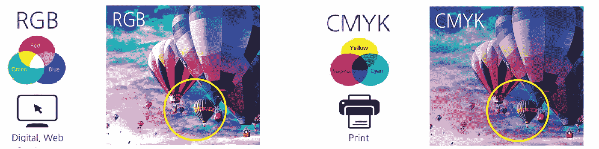

# 初学者的计算机视觉:第 1 部分

> 原文：<https://towardsdatascience.com/computer-vision-for-beginners-part-1-7cca775f58ef?source=collection_archive---------1----------------------->

## OpenCV 和 Python 中的图像处理简介


计算机视觉是人工智能领域最热门的话题之一。它在自动驾驶汽车、机器人以及各种照片校正应用程序方面取得了巨大进步。目标检测每天都在稳步前进。GANs 也是研究人员目前关注的一个问题。视觉正在向我们展示技术的未来，我们甚至无法想象它的可能性的尽头会是什么。

那么，你想迈出计算机视觉的第一步，并参与到这一最新的运动中来吗？欢迎你来对地方了。从这篇文章中，我们将有一系列的图像处理和物体检测的基础教程。这是 OpenCV 初学者教程的第一部分，完整系列如下:

1.  ***理解颜色模型并在图像上绘制图形***
2.  [带滤波的图像处理基础知识](/computer-vision-for-beginners-part-2-29b3f9151874)
3.  [从特征检测到人脸检测](/computer-vision-for-beginners-part-3-79de62dbeef7)
4.  [轮廓检测和享受一点乐趣](/computer-vision-for-beginners-part-4-64a8d9856208)

本系列的第一个故事将是关于安装 OpenCV，解释颜色模型和在图像上绘制图形。本教程的完整代码也可以在 [**Github**](https://nbviewer.jupyter.org/github/jjone36/vision_4_beginners/blob/master/01.image_processing/01_introduction.ipynb) 上找到。现在让我们开始吧。

# OpenCV 简介

[**图像处理**](https://en.wikipedia.org/wiki/Digital_image_processing) 是对图像进行一些操作，以获得想要的操作。想想当我们开始新的数据分析时，我们会做些什么。我们做一些数据预处理和特征工程。图像处理也是一样。我们通过图像处理来处理图片，从中提取有用的信息。我们可以减少噪音，控制亮度和色彩对比度。要了解详细的图像处理基础知识，请访问本视频[](https://www.youtube.com/watch?v=QMLbTEQJCaI)****。****

**OpenCV 代表 [***开源计算机视觉***](https://opencv.org/) 库，由英特尔于 1999 年发明。它最初是用 C/C++编写的，所以你可能会看到更多的 C 语言教程，而不是 Python。但是现在它也在 Python 中被广泛用于计算机视觉。首先，让我们为使用 OpenCV 建立一个合适的环境。安装可以按如下方式进行，但您也可以在此处 **找到详细描述 [**。**](https://pypi.org/project/opencv-python/)****

```
pip install opencv-python==3.4.2
pip install opencv-contrib-python==3.3.1
```

**完成安装后，尝试导入软件包，看看它是否工作正常。如果你得到的回报没有任何错误，那么你现在就可以开始了！**

```
import cv2
cv2.__version__
```

**我们要用 OpenCV 做的第一步是导入一个图像，可以这样做。**

```
import numpy as np
import matplotlib.pyplot as plt
%matplotlib inline# Import the image
img = cv2.imread('burano.jpg')
plt.imshow(img)
```

****

**你去过布拉诺吗？它是意大利最美丽的岛屿之一。如果你还没有去过那里，你一定要在下一个假期去看看这个地方。但是如果你已经知道这个岛，你可能会注意到这张照片有些不同。和我们平时看到的布拉诺的图片有点不一样。应该比这更让人欣喜吧！**

**这是因为 OpenCV 中颜色模式的默认设置是按照 BGR 的顺序来的，这与 Matplotlib 不同。因此，要查看 RGB 模式下的图像，我们需要将其从 BGR 转换为 RGB，如下所示。**

```
# Convert the image into RGB
img_rgb = cv2.cvtColor(img, cv2.COLOR_BGR2RGB)
plt.imshow(img_rgb)
```

****

**现在，这是布拉诺！意大利如此可爱的岛屿！**

# **不仅仅是 RGB**

**让我们再多谈一点颜色模式。 [***色彩模型***](https://www.designersinsights.com/designer-resources/understanding-color-models/)*是一个使用原色创建全范围色彩的系统。这里有两种不同的颜色模型: ***加色模型*** 和 ***减色模型*** 。加色模型使用光在计算机屏幕上表现颜色，而减色模型使用墨水在纸上打印这些数字图像。对于前者，原色是红色、绿色和蓝色(RGB ),对于后者，原色是青色、品红色、黄色和黑色(CMYK)。我们在图像上看到的所有其他颜色都是由这些原色组合或混合而成的。因此，当图片以 RGB 和 CMYK 表示时，它们的描述会有所不同。***

******

***([Source](https://www.kinkos.co.kr/bbs/board.php?bo_table=k_magazine&wr_id=9&page=2))***

***你会很习惯这两种模型。然而，在颜色模型的世界中，有两种以上的模型。其中， ***灰度，HSV*** 和 ***HLS*** 是你在计算机视觉中会经常看到的。***

***灰度很简单。它通过黑白的强度来表示图像和形态，这意味着它只有一个通道。要查看灰度图像，我们需要将彩色模式转换为灰色，就像我们之前对 BGR 图像所做的那样。***

```
*# Convert the image into gray scale
img_gray = cv2.cvtColor(img, cv2.COLOR_BGR2GRAY)
plt.imshow(img_gray, cmap = 'gray')*
```

******

***实际上，RGB 图像是由三个通道堆叠而成的:R、G 和 b。因此，如果我们选取每个通道并逐一描绘它们，我们就可以理解颜色通道是如何构成的。***

```
*# Plot the three channels of the image
fig, axs = plt.subplots(nrows = 1, ncols = 3, figsize = (20, 20))for i in range(0, 3):
    ax = axs[i]
    ax.imshow(img_rgb[:, :, i], cmap = 'gray')
plt.show()*
```

******

***看看上面的图片。这三个图像向您展示了每个通道是如何组成的。在 R 通道图片中，红色饱和度高的部分看起来是白色的。这是为什么呢？这是因为红色部分的值接近 255。在灰度模式下，该值越高，颜色越白。您也可以用 G 或 B 通道来检查这一点，并比较某些部分之间的差异。***

******

***HSV 和 HLS 有一点不同。正如你在上面看到的，它们有一个三维的表示，它更类似于人类的感知方式。 ***HSV*** 代表色相、饱和度、明度。 ***HSL*** 代表色相、饱和度、明度。HSV 的中心轴是颜色值，而 HSL 的中心轴是光量。沿着中心轴的角度，有色调，实际的颜色。而离中轴线的距离属于饱和。可以按如下方式转换颜色模式。***

```
*# Transform the image into HSV and HLS models
img_hsv = cv2.cvtColor(img, cv2.COLOR_BGR2HSV)
img_hls = cv2.cvtColor(img, cv2.COLOR_BGR2HLS)# Plot the converted images
fig, (ax1, ax2) = plt.subplots(nrows = 1, ncols = 2, figsize = (20, 20))
ax1.imshow(img_hsv)
ax2.imshow(img_hls)
plt.show()*
```

******

***但是为什么我们要变换颜色呢？这些是干什么用的？可以给出答案的一个例子是车道检测。请看下图。查看如何在不同的颜色模式下检测车道。在计算机视觉任务中，我们在蒙版的同时进行多种颜色模式的转换。如果你想了解更多关于如何在车道检测任务中应用图像处理的信息，请随时查看由 [nachiket tanksale](https://medium.com/u/26a6ee15a5c5?source=post_page-----7cca775f58ef--------------------------------) 撰写的 [**这篇文章**](/finding-lane-lines-simple-pipeline-for-lane-detection-d02b62e7572b) 。***

******

***[RGB vs Grayscale (darkened) vs HSV vs HSL](/finding-lane-lines-simple-pipeline-for-lane-detection-d02b62e7572b)***

***现在我相信你明白了。图像处理是“数据预处理”它减少噪音，提取有用的模式，使分类和检测任务更容易。因此，所有这些技术，包括我们将在后面讨论的技术，都是为了帮助模型更容易地检测模式。***

# ***在图像上绘图***

***让我们在图像上添加一些数字。现在，我们要去巴黎。你听说过[爱情墙](https://en.wikipedia.org/wiki/Wall_of_Love)吗？这是一面用各种国际语言写满“我爱你”的墙。我们要做的是找到我们语言中的单词，并用一个矩形标记它们。因为我来自韩国，我会在韩语中查找“我爱你”。首先，我将复制原始图像，然后用`cv2.rectangle()`画一个矩形，我们需要给出左上角和右下角的坐标值。***

```
*# Copy the image
img_copy = img.copy()# Draw a rectangle 
cv2.rectangle(img_copy, pt1 = (800, 470), pt2 = (980, 530), 
              color = (255, 0, 0), thickness = 5)
plt.imshow(img_copy)*
```

******

***太好了！我觉得我抓对位置了。让我们再试一次。我可以从图像中看到一个韩文单词，所以这次我会画一个圆圈。用`cv2.circle()`，我们需要指定它的圆心的点和它的半径的长度。***

```
*# Draw a circle 
cv2.circle(img_copy, center = (950, 50), radius = 50, 
           color = (0, 0, 255), thickness = 5)
plt.imshow(img_copy)*
```

******

***我们也可以在图像上放置文本数据。这次我们为什么不写这面墙的名字呢？使用`cv2.putText()`，我们可以指定文本的位置、字体和大小。***

```
*# Add text 
cv2.putText(img_copy, text = "the Wall of Love", 
            org = (250, 250),
            fontFace = cv2.FONT_HERSHEY_DUPLEX, 
            fontScale = 2, 
            color = (0, 255, 0), 
            thickness = 2, 
            lineType = cv2.LINE_AA)
plt.imshow(img_copy)*
```

******

***这真是一面“可爱”的墙，不是吗？自己试试，用你的语言找到“我爱你”！😍***

# ***不仅仅是图像***

***现在我们去了意大利和法国。接下来你想去哪里？我们为什么不放一张地图并标出这些地方呢？我们将创建一个窗口并绘制图形，不是通过指定点，而是通过直接点击窗口。我们先试一圈。我们首先创建一个函数，用鼠标位置和点击的数据画一个圆。***

```
*# Step 1\. Define callback function
**def** draw_circle(event, x, y, flags, param): **if** event == cv2.EVENT_LBUTTONDOWN:
            cv2.circle(img, center = (x, y), radius = 5, 
                       color = (87, 184, 237), thickness = -1) **elif** event == cv2.EVENT_RBUTTONDOWN:        
            cv2.circle(img, center = (x, y), radius = 10,  
                       color = (87, 184, 237), thickness = 1)*
```

***使用`cv2.EVENT_LBUTTONDOWN`或`cv2.EVENT_RBUTTONDOWN`，当我们按下鼠标按钮时，我们可以带来该位置的数据。鼠标的位置将是`(x, y)`，我们将画一个圆心在该点的圆。***

```
*# Step 2\. Call the window
img = cv2.imread('map.png')cv2.namedWindow(winname = 'my_drawing')
cv2.setMouseCallback('my_drawing', draw_circle)*
```

***我们将设置一张地图作为窗口的背景，并将窗口命名为 *my_drawing* 。窗口的名称可以是任何东西，但是它应该是相同的，因为它的作用就像窗口的 id。使用`cv2.setMouseCallback()`，我们在窗口和我们在步骤 1 中创建的函数`draw_circle`之间建立一个连接。***

```
*# Step 3\. Execution
**while** True:
    cv2.imshow('my_drawing',img)
    **if** cv2.waitKey(10) & 0xFF == 27:
       ** break**cv2.destroyAllWindows()*
```

***现在我们使用 while 循环执行窗口。不要忘记设置断点，除非你正在进行无限循环。if 子句的条件是当我们按键盘上的 ESC 键时关闭窗口。将此保存为文件，并将其导入您的终端。如果你要使用 jupyter 实验室，把代码放在一个单元格中并执行。现在，告诉我！你想去哪？***

******

***让我们试试长方形。由于矩形需要两个点用于`cv2.rectangle()`中的 **pt1** 和 **pt2** ，我们需要一个额外的步骤来设置第一个点击点为 **pt1** 和最后一个点为 **pt2** 。我们将使用`cv2.EVENT_MOUSEMOVE`和`cv2.EVENT_LBUTTONUP`来检测鼠标的移动。***

***我们首先将`drawing = False`定义为默认值。当按下左键时，`drawing`变为真，我们将第一个位置指定为 **pt1** 。如果绘图打开，它会将当前点作为 **pt2** 并在我们移动鼠标时继续绘制矩形。这就像重叠的数字。当左键向上时，`drawing`变为假，以鼠标的最后位置作为其 **pt2** 的终点。***

```
*# Initialization
drawing = False
ix = -1
iy = -1# create a drawing function
**def** draw_rectangle(event, x, y, flags, params):

    **global** ix, iy, drawing **if** event == cv2.EVENT_LBUTTONDOWN:
        drawing = True
        ix, iy = x, y

    **elif** event == cv2.EVENT_MOUSEMOVE:
        if drawing == True:
            cv2.rectangle(img, pt1=(ix, iy), pt2=(x, y), 
                          color = (87, 184, 237), thickness = -1)

    **elif** event == cv2.EVENT_LBUTTONUP:
        drawing = False
        cv2.rectangle(img, pt1=(ix, iy), pt2=(x, y), 
                     color = (87, 184, 237), thickness = -1)*
```

***将步骤 1 中的`draw_circle`功能替换为`draw_rectangle`。请不要忘记在回调函数中做一个改变，`cv2.setMouseCallback()`也一样。所以整个代码脚本如下。保存这个脚本文件，并在终端或 jupyter 笔记本上运行它。***

# ***下一步是什么？***

***你喜欢第一次使用 OpenCV 吗？您还可以尝试其他功能，如绘制直线或多边形。可以随意查看它的文档，可以在这里 找到 [**。下一次，我们将讨论更高级的技术，如附加两个不同的图像，图像轮廓和对象检测。**](https://docs.opencv.org/2.4/modules/core/doc/drawing_functions.html)***

***⭐️，你可能也会觉得这些系列很有趣，⭐️***

*   *****卷积神经网络的基本概念:*****

***[](/the-most-intuitive-and-easiest-guide-for-convolutional-neural-network-3607be47480) [## CNN 最直观、最简单的指南

### 揭开卷积神经网络的神秘面纱

towardsdatascience.com](/the-most-intuitive-and-easiest-guide-for-convolutional-neural-network-3607be47480) 

*   **卷积神经网络的高级网络:**

[](/deep-dive-into-the-computer-vision-world-f35cd7349e16) [## 深入了解计算机视觉世界:第 1 部分

### 从 VGG 开始，ResNet 和盗梦空间网络

towardsdatascience.com](/deep-dive-into-the-computer-vision-world-f35cd7349e16) 

有你想改正的错误吗？请与我们分享您的见解。我总是乐于交谈，所以请在下面留下评论，分享你的想法。我还在 LinkedIn[上分享有趣和有用的资源，所以请随时关注或联系我。下次我会带着另一个有趣的故事回来的！](https://www.linkedin.com/in/jiwon-jeong/)***