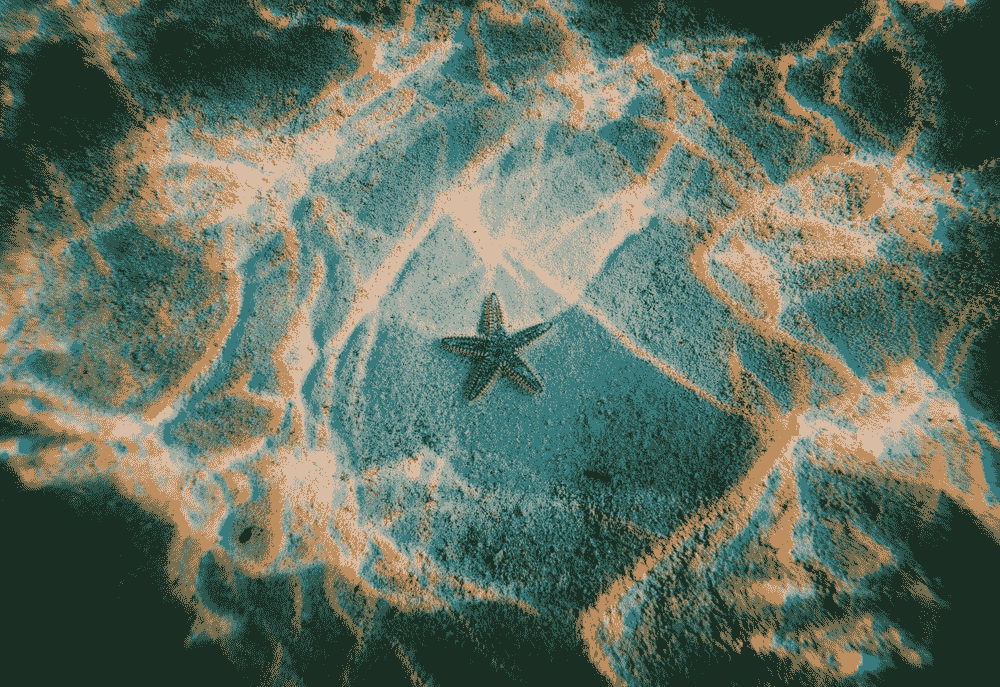
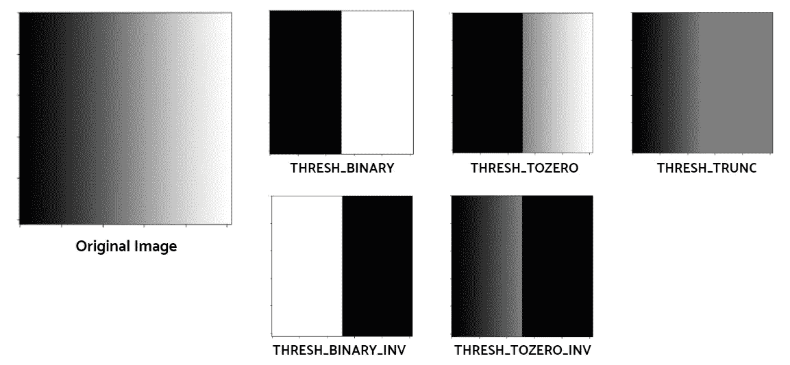
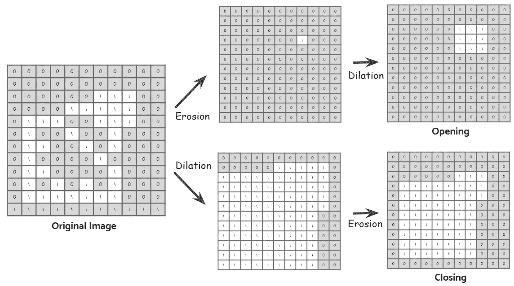

# 初学者的计算机视觉:第 2 部分

> 原文：<https://towardsdatascience.com/computer-vision-for-beginners-part-2-29b3f9151874?source=collection_archive---------3----------------------->

## Python 中带滤波的图像处理基础



准备是指在实际开始一项任务之前为它做好准备的过程。这可能是写故事、工作面试或数据建模的准备步骤。做好充分的准备，其重要性怎么强调都不为过。如果我们没有进行足够的预处理，那么无论我们有多好的数据，都很难期望得到一个令人满意的结果。

这是 OpenCV 初学者教程的第二部分，完整系列如下:

1.  [理解颜色模型并在图像上绘制图形](/computer-vision-for-beginners-part-1-7cca775f58ef)
2.  ***带滤波的图像处理基础***
3.  [从特征检测到人脸检测](/computer-vision-for-beginners-part-3-79de62dbeef7)
4.  [轮廓检测和享受一点乐趣](/computer-vision-for-beginners-part-4-64a8d9856208)

今天我们将讨论如何处理图像。这将是一个预处理阶段。在检测边缘和轮廓时，噪声对检测的准确性有很大影响。因此，去除噪声和控制像素值的强度可以帮助模型专注于一般细节并获得更高的精度。模糊、阈值处理和形态变换是我们用于此目的的技术。

这篇文章假设你已经熟悉卷积的概念。但如果不是这样，我想推荐你先查一下 [**这个帖子**](/the-most-intuitive-and-easiest-guide-for-convolutional-neural-network-3607be47480) 。本教程的完整代码也可以在 [**Github**](https://github.com/jjone36/vision_4_beginners/blob/master/part2_image_processing.ipynb) 上找到。现在让我们一个一个的来看看如何用 OpenCV 应用图像过滤。

# 模糊

模糊的目标是执行降噪。但是我们在这里要格外小心。如果我们对高分辨率的图像应用边缘检测算法，我们会得到太多我们不感兴趣的检测结果。


相反，如果我们过度模糊图像，我们会丢失数据。因此，我们需要找到一个足够的模糊量，我们将申请没有失去理想的边缘。

有几种技术用于实现模糊效果，但我们将讨论 OpenCV 中使用的四种主要技术: ***平均模糊、高斯模糊、中值模糊*** *和* ***双边滤波*** 。所有这四种技术都有一个共同的基本原理，即使用滤波器(内核)对图像应用卷积运算。在四种模糊方法之间，应用过滤器的值是不同的。

**平均模糊**取给定内核区域下所有像素值的平均值，替换中心值。例如，假设我们有一个大小为 5X5 的内核。我们计算卷积结果的平均值，并将结果放在给定区域的中心。


那么如果我们增加内核的大小会是什么样的呢？随着过滤器的尺寸变大，像素值将更加规范化。因此，我们可以预期图像会变得更加模糊。让我们用如下代码检查一下结果。(为了比较，我将继续将原始图像附加到结果中)

```
# Import the image and convert to RGB 
img = cv2.imread('text.jpg')
img = cv2.cvtColor(img, cv2.COLOR_BGR2RGB)# Plot the image with different kernel sizes
kernels = [5, 11, 17]fig, axs = plt.subplots(nrows = 1, ncols = 3, figsize = (20, 20)) **for** ind, s **in** enumerate(kernels):
    img_blurred = **cv2.blur(img, ksize = (s, s))**
    ax = axs[ind]
    ax.imshow(img_blurred)
    ax.axis('off')
plt.show()
```


**中等模糊**与平均模糊相同，只是它使用中值而不是平均值。因此，当我们必须处理图像中的突发噪声时，如“[椒盐噪声](https://en.wikipedia.org/wiki/Salt-and-pepper_noise)”，使用中等模糊比平均模糊更好。


[The shape of a Gaussian filter (on the left) and a Bilateral filter (on the right)](http://eric-yuan.me/bilateral-filtering/)

**高斯模糊**无非是使用其值具有高斯分布的内核。这些值是由高斯函数生成的，因此它需要一个 sigma 值作为其参数。正如你在上面的图像中看到的，内核的值在中心附近变高，在角落附近变小。最好将这种方法应用于具有正态分布的[噪声，例如](https://en.wikipedia.org/wiki/Gaussian_noise)[白噪声](https://en.wikipedia.org/wiki/White_noise)。

**双边滤波**是高斯模糊的高级版本。模糊不仅会产生溶解噪声，还会平滑边缘。双边滤波可以在去除噪声的同时保持边缘清晰。它使用高斯分布值，但同时考虑了距离和像素值的差异。因此需要`sigmaSpace`和`sigmaColor`作为参数。

```
# Blur the image 
img_0 = **cv2.blur**(img, ksize = (7, 7))
img_1 = **cv2.GaussianBlur**(img, ksize = (7, 7), sigmaX = 0)   
img_2 = **cv2.medianBlur**(img, 7)
img_3 = **cv2.bilateralFilter**(img, 7, sigmaSpace = 75, sigmaColor =75)# Plot the images
images = [img_0, img_1, img_2, img_3]
fig, axs = plt.subplots(nrows = 1, ncols = 4, figsize = (20, 20))**for** ind, p **in** enumerate(images):
    ax = axs[ind]
    ax.imshow(p)
    ax.axis('off')
plt.show()
```


# 阈值处理

阈值处理将图像转换成二值图像。我们需要设置阈值和最大值，然后我们相应地转换像素值。有五种不同类型的阈值处理: ***二值化、二值化的逆、阈值为零、*** *和* ***阈值截断*** 。

```
img = cv2.imread('gradation.png')# Thresholding 
_, thresh_0 = cv2.threshold(img, 127, 255, **cv2.THRESH_BINARY**)
_, thresh_1 = cv2.threshold(img, 127, 255, **cv2.THRESH_BINARY_INV**)
_, thresh_2 = cv2.threshold(img, 127, 255, **cv2.THRESH_TOZERO**)
_, thresh_3 = cv2.threshold(img, 127, 255, **cv2.THRESH_TOZERO_INV**)
_, thresh_4 = cv2.threshold(img, 127, 255, **cv2.THRESH_TRUNC**)# Plot the images
images = [img, thresh_0, thresh_1, thresh_2, thresh_3, thresh_4]fig, axs = plt.subplots(nrows = 2, ncols = 3, figsize = (13, 13))
**for** ind, p **in** enumerate(images):
    ax = axs[ind//3, ind%3]
    ax.imshow(p)
plt.show()
```



你可以看到每种类型的阈值是如何用数学方法表示的，并且 **I(x，y)** 是该点的强度，或者(x，y)处的像素值。但是我更喜欢直观的理解概念。看一下右边的图片。这些图片有助于你理解不同类型之间的区别。

但是你不认为只取一个阈值并将其应用于图像的所有部分太苛刻了吗？如果我们有一张在不同区域有不同亮度的照片会怎么样？在这种情况下，将一个值应用于整个图像将是一个糟糕的选择。更好的方法是对图像的每个部分使用不同的阈值。还有一种叫做 ***自适应阈值*** 的技术，就是为这个问题服务的。通过计算图像邻域内的阈值，我们可以从光照变化的图像中获得更好的结果。

```
# Convert the image to grayscale
img = cv2.imread('text.jpg')
img = cv2.cvtColor(img, cv2.COLOR_BGR2GRAY)# Adaptive Thresholding
_, thresh_binary = cv2.threshold(img, thresh = 127, maxval = 255, type = cv2.THRESH_BINARY)
adap_mean_2 = cv2.adaptiveThreshold(img, 255, 
                                    **cv2.ADAPTIVE_THRESH_MEAN_C**, 
                                    **cv2.THRESH_BINARY**, 7, 2)
adap_mean_2_inv = cv2.adaptiveThreshold(img, 255, 
                                        **cv2.ADAPTIVE_THRESH_MEAN_C**, 
                                        **cv2.THRESH_BINARY_INV**, 7, 2)
adap_mean_8 = cv2.adaptiveThreshold(img, 255, 
                                    **cv2.ADAPTIVE_THRESH_MEAN_C**, 
                                    cv2.THRESH_BINARY, 7, **8**)
adap_gaussian_8 = cv2.adaptiveThreshold(img, 255, 
                                    **cv2.ADAPTIVE_THRESH_GAUSSIAN_C**, 
                                    cv2.THRESH_BINARY, 7, **8**)
```

我们需要将彩色模式转换为灰度模式，以应用自适应阈值处理。自适应阈值的参数有`maxValue`(上面我设置了 255)、`adaptiveMethod`、`thresholdType`、`blockSize`、`C`。而这里的自适应方法有两种:`ADAPTIVE_THRESH_MEAN_C`、`ADAPTIVE_THRESH_GAUSSIAN_C`。让我们看看图像是如何不同地产生的。

```
# Plot the images
images = [img, thresh_binary, adap_mean_2, adap_mean_2_inv, 
          adap_mean_8, adap_gaussian_8]
fig, axs = plt.subplots(nrows = 2, ncols = 3, figsize = (15, 15))**for** ind, p **in** enumerate(images):
    ax = axs[ind%2, ind//2]
    ax.imshow(p, cmap = 'gray')
    ax.axis('off')
plt.show()
```


我们有原始图像，左边一行是二值化的图像。将此与上面一行的第二个和第三个图像进行比较，这是由`ADAPTIVE_THRESH_MEAN_C`生成的。它显示了比二进制阈值更详细的结果。我们还可以看到，当 C 值较大时，它变得更加明显。`C`表示我们将从平均值或加权平均值中减去多少。有了右边这两幅图，我们还可以比较 C 值相同的`ADAPTIVE_THRESH_MEAN_C`和`ADAPTIVE_THRESH_GAUSSIAN_C`的效果。

# 梯度

我相信我们已经熟悉了梯度的概念。在数学中，[梯度](https://en.wikipedia.org/wiki/Gradient)在几何上表示一个多变量函数的图形的斜率。因为它是一个向量值函数，所以它以方向和幅度作为其分量。这里我们也可以把同样的概念应用到图像的像素值上。[图像梯度](https://en.wikipedia.org/wiki/Image_gradient)表示强度或颜色模式的方向变化，我们可以使用这个概念来定位边缘。

```
# Apply gradient filtering
sobel_x = **cv2.Sobel**(img, cv2.CV_64F, **dx = 1, dy = 0**, ksize = 5)
sobel_y = **cv2.Sobel**(img, cv2.CV_64F, **dx = 0, dy = 1**, ksize = 5)
blended = **cv2.addWeighted**(src1=sobel_x, alpha=0.5, src2=sobel_y,
                          beta=0.5, gamma=0)
laplacian = **cv2.Laplacian**(img, cv2.CV_64F)
```

[**索贝尔运算**](https://en.wikipedia.org/wiki/Sobel_operator) 同时使用高斯平滑和微分。我们通过`cv2.Sobel()`应用它，有两个不同的方向可用:垂直(`sobel_x`)和水平(`sobel_y`)。`dx`和`dy`表示衍生产品。当`dx = 1`时，操作者计算像素值沿水平方向的导数以进行过滤。

通过对`sobel_x`和`sobel_y`两个滤波器求和，我们也可以在两个方向上应用。使用函数`cv2.addWeighted()`，我们可以计算滤波器的加权和。正如你在上面的代码单元中看到的，我给了两个过滤器相同的权重。

**拉普拉斯运算**使用 x 和 y 的二阶导数，数学表达式如下所示。


一张图胜过千言万语。让我们看看图像是什么样的。

```
# Plot the images
images = [sobel_x, sobel_y, blended, laplacian]
plt.figure(figsize = (20, 20))
for i in range(4):
    plt.subplot(1, 4, i+1)
    plt.imshow(images[i], cmap = 'gray')
    plt.axis('off')
plt.show()
```


很明显，第一和第二图像具有方向性图案。通过第一张图片，我们可以清楚地看到垂直方向的边缘。在第二张图中，我们可以看到水平边缘。和第四图像，示出了两个方向上的边缘。

# 形态转换

也可以通过过滤来操纵图像的形状，这被称为*。先说侵蚀和膨胀。*

***腐蚀**是缩小图形的技术，通常以灰度处理。过滤器的形状可以是矩形、椭圆形和十字形。通过应用过滤器，我们移除给定区域下的任何 0 值。*

**

*让我们看看这些如何在代码中实现。*

```
*img = cv2.imread('simpson.jpg')# Create erosion kernels 
kernel_0 = np.ones((9, 9), np.uint8)
kernel_1 = cv2.getStructuringElement(**cv2.MORPH_ELLIPSE**, (9, 9))
kernel_2 = cv2.getStructuringElement(**cv2.MORPH_CROSS**, (9, 9))kernels = [kernel_0, kernel_1, kernel_2]# Plot the images
plt.figure(figsize = (20, 20))
for i in range(3):
    img_copy = img.copy()
    img_copy = cv2.erode(img_copy, kernels[i], iterations = 3)
    plt.subplot(1, 3, i+1)
    plt.imshow(img_copy)
    plt.axis('off')
plt.show()*
```

**

*看看辛普森一家是如何通过使用不同类型的内核而缩小的。(对辛普森失去双手感到抱歉！)我们可以看到，具有椭圆过滤器的图像以“圆形”方式被侵蚀，而具有方形形状的基本过滤器的图像以“线性”方式被侵蚀。最后一个十字滤镜显示它以“对角线”方式收缩。*

***膨胀**与侵蚀相反。它使物体膨胀，其操作也将与侵蚀相反。让我们用如下代码检查一下结果。*

```
*# Apply dilation
kernel = np.ones((9, 9), np.uint8)
img_dilate = cv2.dilate(img, kernel, iterations = 3)plt.figure(figsize = (20, 10))
plt.subplot(1, 2, 1); plt.imshow(img, cmap="gray")
plt.subplot(1, 2, 2); plt.imshow(img_dilate, cmap="gray")
plt.show()*
```

**

***开启**和**关闭**操作是腐蚀和膨胀的混合版本。打开先进行腐蚀，然后对腐蚀的结果进行膨胀，而关闭先进行膨胀，然后进行腐蚀。*

**

*如上图所示，闭合有助于检测图形的整体轮廓，而打开则适合检测子模式。我们可以用下面显示的函数`cv2.morphologyEx()`来实现这些操作符。参数`op`表示我们将使用哪种类型的操作符。*

```
*# Apply the operations
kernel = np.ones((9, 9), np.uint8)img_open = cv2.morphologyEx(img, op= **cv2.MORPH_OPEN**, kernel)
img_close = cv2.morphologyEx(img, op= **cv2.MORPH_CLOSE**, kernel)
img_grad = cv2.morphologyEx(img, op= **cv2.MORPH_GRADIENT**, kernel)
img_tophat = cv2.morphologyEx(img, op= **cv2.MORPH_TOPHAT**, kernel)
img_blackhat = cv2.morphologyEx(img, op= **cv2.MORPH_BLACKHAT**, kernel)# Plot the images
images = [img, img_open, img_close, img_grad, 
          img_tophat, img_blackhat]fig, axs = plt.subplots(nrows = 2, ncols = 3, figsize = (15, 15))
**for** ind, p **in** enumerate(images):
    ax = axs[ind//3, ind%3]
    ax.imshow(p, cmap = 'gray')
    ax.axis('off')
plt.show()*
```

**

*请注意，在打开滤镜和关闭滤镜的图像中，Simpson 的手被描绘得不同。梯度过滤器(`MORPH_CGRADIENT`)是从膨胀到侵蚀减去的区域。礼帽滤镜(`MORPH_TOPHAT`)是从打开到原始图像减去的区域，而黑色热滤镜(`MORPH_BLACKHAT`)是从关闭减去的区域。我推荐你访问这里的[](https://homepages.inf.ed.ac.uk/rbf/HIPR2/morops.htm)****以获得关于形态运算符的进一步解释。*****

# *****下一步是什么？*****

*****你喜欢各种各样的图像处理技术吗？除了我们已经讨论过的东西，OpenCV 中还有其他可用的东西。因此，请不要犹豫，赶快访问并查看 [**OpenCV 文档**](https://docs.opencv.org/2.4/modules/imgproc/doc/miscellaneous_transformations.html?highlight=adaptivethreshold#https://datascienceschool.net/view-notebook/c4121d311aa34e6faa84f62ef06e43b0/) 。下一次将是关于检测技术，如轮廓检测和面部检测。*****

*****有你想改正的错误吗？请与我们分享您的见解。我总是乐于交谈，所以请在下面留下评论，分享你的想法。我还在 [**LinkedIn**](https://www.linkedin.com/in/jiwon-jeong/) 上分享有趣和有用的资源，欢迎随时关注或联系我。我将带着故事的下一个系列回来。敬请期待！*****