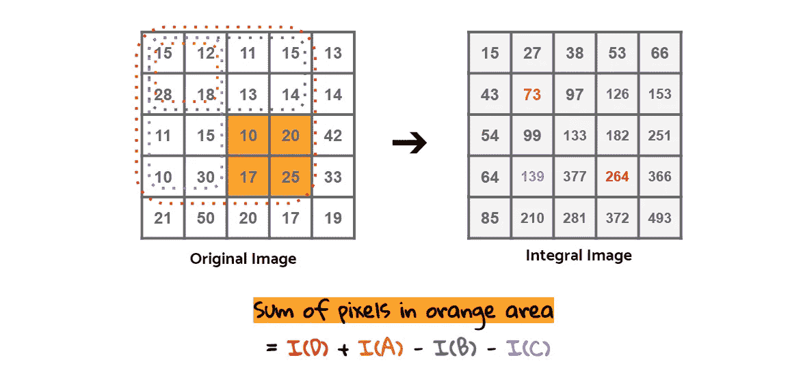

# 初学者的计算机视觉:第 3 部分

> 原文：<https://towardsdatascience.com/computer-vision-for-beginners-part-3-79de62dbeef7?source=collection_archive---------8----------------------->

## 从特征检测到人脸检测


检测任务是计算机视觉的主要任务之一，我们有许多方法可以利用这项技术。识别出现时可能是关键的错误，但人眼无法识别。探测不安全和危险的动作或时刻以拯救生命。为自动驾驶汽车感知空间信息。使用物体检测的例子数不胜数，让这些任务自动化将给我们带来安全和效率。

这是 OpenCV 初学者教程的第三部分，完整系列如下:

1.  [理解颜色模型并在图像上绘制图形](/computer-vision-for-beginners-part-1-7cca775f58ef)
2.  [带滤波的图像处理基础知识](/computer-vision-for-beginners-part-2-29b3f9151874)
3.  ***从特征检测到人脸检测***
4.  [轮廓检测和享受一点乐趣](/computer-vision-for-beginners-part-4-64a8d9856208)

我们已经讨论了几种颜色模式以及如何在图像上绘制图形，例如矩形和圆形。然后在第 2 部分，我们谈到了图像处理的概念，如模糊，梯度，腐蚀，膨胀等。今天，我们将应用这些概念来检测图像的特征，并在最后进行人脸检测。

本文假设您已经遵循了前面的步骤，或者您已经知道这些概念。但如果不是这样，请查看本系列前面的部分。本教程的完整代码可在 [**Github**](https://github.com/jjone36/vision_4_beginners/blob/master/part3_object_detection.ipynb) 上获得。现在让我们开始吧！

# 边缘检测

[**边缘检测**](https://en.wikipedia.org/wiki/Edge_detection) 是指识别图像中亮度变化剧烈或不连续的点。我们可以用那些点画线段，这些线段叫做 ***边*** 。实际上，我们上次已经学习了一种边缘检测技术。你还记得吗？用索贝尔和拉普拉斯运算进行梯度滤波。通过计算给定方向上像素值的导数，梯度滤波可以描绘图像的边缘。

[**Canny 检测**](https://en.wikipedia.org/wiki/Canny_edge_detector) 是另一种边缘检测技术。这是最流行的边缘检测算法之一，分四步进行: ***降噪，寻找梯度及其方向，非最大抑制*** 和 ***滞后阈值*** 。

该算法从高斯模糊开始，我想我们已经知道去除图像中噪声的原因。然后用 Sobel 核寻找图像的亮度梯度。利用导出的梯度和方向，检查每个像素的某个点是否是其周围点的局部最大值。如果不是，这一点被抑制为零(完全不存在，黑色)。这叫做 ***非最大抑制*** 。


如果该点被认为是局部最大值，则进入下一阶段。最后一个阶段是最后一个决定阶段，决定前面步骤中的边是否真的是边。这被称为 ***滞后阈值*** ，这里我们需要两个阈值。

给定两个不同的阈值，我们得到三个范围的值。因此，如果一个点的强度梯度高于上限阈值，它将被认为是“确定边缘”如果一个点的梯度低于下限阈值，该点将被丢弃。在梯度处于两个阈值中间的情况下，我们看到它与其他“确定边缘”点的连通性。如果没有联系，它也会被丢弃。

```
img = cv2.imread('images/giraffe.jpg')
img = cv2.cvtColor(img, cv2.COLOR_BGR2RGB)# Canny detection without blurring
edges = **cv2.Canny(**image=img, threshold1=127, threshold2=127**)**plt.figure(figsize = (20, 20))
plt.subplot(1, 2, 1); plt.imshow(img)
plt.axis('off')
plt.subplot(1, 2, 2); plt.imshow(edges)
plt.axis('off')
```


我只是在没有模糊的情况下使用了两个阈值的中间值，结果并不理想。现在让我们这次尝试不同的阈值。

```
# Set the lower and upper threshold
med_val = np.median(img)lower = int(max(0, .7*med_val))
upper = int(min(255, 1.3*med_val))
```

为了了解模糊如何改变结果，我将应用两种不同大小的内核，(5x5)和(9x9)。我将尝试通过增加 100 来更改上限阈值。因此，我们有 4 种类型的处理图像，如下所示:

```
# Blurring with ksize = 5 
img_k5 = cv2.blur(img, ksize = (5, 5))# Canny detection with different thresholds
edges_k5 = cv2.Canny(img_k5, threshold1 = lower, threshold2 = upper)
edges_k5_2 = cv2.Canny(img_k5, lower, upper+100)# Blurring with ksize = 9 
img_k9 = cv2.blur(img, ksize = (9, 9))# Canny detection with different thresholds
edges_k9 = cv2.Canny(img_k9, lower, upper)
edges_k9_2 = cv2.Canny(img_k9, lower, upper+100)# Plot the images
images = [edges_k5, edges_k5_2, edges_k9, edges_k9_2]
plt.figure(figsize = (20, 15))
for i in range(4):
    plt.subplot(2, 2, i+1)
    plt.imshow(images[i])
    plt.axis('off')
plt.show()
```


正如你在上面看到的，模糊有助于去除噪声，我们用(9x9)大小的内核得到了更好的结果。此外，阈值上限越高，我们得到的结果越好。

# 角点检测

角点检测是另一种广泛应用于目标检测、运动检测、视频跟踪等领域的检测算法。什么是图像处理中的角点？怎样才能用像素定义一个角呢？我们把角看作是边相交的地方。那我们怎么找到他们？首先找到所有的边，然后定位它们相互交叉的点？其实我们还有另外一种让事情更有效率的方法，那就是 ***哈里斯*** 和 ***石&托马西*** 。

这些算法工作如下。我们检测各个方向上强度值有相当大变化的点。然后我们构造一个矩阵从中提取特征值。这些特征值是为了得分来决定它是否是一个角。数学表达式如下所示。


现在让我们看看如何用代码实现这些。我们首先需要将图像转换成灰度。 [**哈里斯角点检测**](https://docs.opencv.org/3.0-beta/doc/py_tutorials/py_feature2d/py_features_harris/py_features_harris.html) 可以用 OpenCV 中的函数`cv2.cornerHarris()`进行。

```
img = cv2.imread('images/desk.jpg')
img = cv2.cvtColor(img, cv2.COLOR_BGR2RGB)
img_gray = cv2.cvtColor(img, cv2.COLOR_RGB2GRAY)# Apply Harris corner detection
dst = **cv2.cornerHarris(**img_gray, blockSize = 2, ksize = 3, k = .04**)**
```

参数`blockSize`是被认为是邻域的窗口的大小，而`k`是哈里斯检测器自由参数，如上面的等式所示。结果是分数 R，我们将使用它来检测角点。

```
# Spot the detected corners
img_2 = img.copy()
img_2[dst>0.01*dst.max()]=[255,0,0]# Plot the image
plt.figure(figsize = (20, 20))
plt.subplot(1, 2, 1); plt.imshow(img)
plt.axis('off')
plt.subplot(1, 2, 2); plt.imshow(img_2)
plt.axis('off')
```


这次我们试试 **Shi-Tomasi 角点检测**。我们可以用函数`cv2.goodFeaturesToTrack()`来使用它。我们按照最大可能性(`maxCorners`)设置最大数量的角点。我们还指定了最小距离(`minDistance`)和最小质量等级(`qualityLevel`)，它们被认为是角点。在我们得到检测到的角点后，我们将用圆圈标记这些点，如下所示。

```
# Apply Shi-Tomasi corner detection
corners = **cv2.goodFeaturesToTrack(**img_gray, maxCorners = 50, 
                                  qualityLevel = 0.01, 
                                  minDistance = 10**)**
corners = np.int0(corners)# Spot the detected corners
img_2 = img.copy()
for i in corners:
    x,y = i.ravel()
    cv2.circle(img_2, center = (x, y), 
               radius = 5, color = 255, thickness = -1)# Plot the image
plt.figure(figsize = (20, 20))
plt.subplot(1, 2, 1); plt.imshow(img)
plt.axis('off')
plt.subplot(1, 2, 2); plt.imshow(img_2)
plt.axis('off')
```


# 人脸检测

我们要看的最后一个特征是一张脸。 [**人脸检测**](https://en.wikipedia.org/wiki/Face_detection) 是一种识别数字图像中人脸的存在和位置的技术。我要你把人脸检测和人脸识别 区分开来，人脸识别是指通过人脸来检测一个人的身份。所以人脸检测并不能告诉我们检测到的人脸属于谁。

人脸检测基本上是一个分类任务，因此它被训练来分类是否有目标对象。而 ***基于 Haar 特征的级联分类器*** 是 OpenCV 中可用的人脸检测模型之一。这是一个预训练模型，这意味着它已经完成了数千张图像的训练。理解该算法的 4 个要点是 ***哈尔特征提取、积分图像、Adaboost*** 和 ***级联分类器*** 。


[***类哈尔特征***](https://en.wikipedia.org/wiki/Haar-like_feature) 是用于物体检测的图像滤波器或图像核，示例如上。它们的名字源于它们与最初由 Alfréd Haar 提出的 Haar 小波的直觉相似性。在检测过程中，我们通过图像上的窗口，用过滤器进行卷积运算，以查看图像中是否有我们要寻找的特征。这里是 [**视频**](https://vimeo.com/12774628) ，它可视化了检测是如何工作的。


那么我们如何决定在一个给定的区域中是否有一个想要的特性呢？我们来看看上图。我们有一个内核，它的上半部分是深色的，下半部分是浅色的。然后，我们得到每个区域的像素值的平均值，并减去两者之间的差距。如果结果高于一个阈值，比如说 0.5，那么我们得出结论，这就是我们正在检测的特征。我们对每个内核重复这个过程，同时在图像上滑动窗口。

虽然这不是一个复杂的计算，但当我们在整个图像中考虑它时，总计算量变得巨大。如果你看过上面提到的视频，你会对所涉及的计算量有直觉。而这正是一个 [***积分图***](https://en.wikipedia.org/wiki/Summed-area_table) 发挥作用的地方。积分图像是一种图像表示方式，是为了使特征评价更快、更有效而衍生出来的。

如下图所示，左边是一幅图像的像素，右边是一幅完整的图像。从左上角开始，它计算给定矩形区域下像素的累积和。在积分图像上，虚线框内的像素之和写在右边框的右下点。



有了这个预先计算的表，我们可以通过子矩形(红色、橙色、蓝色和紫色的方框)的值简单地得到某个区域的总和值。

所以我们用积分图像解决了计算量。但是我们还没完。想象一下，当检测窗口处于没有物体或人脸的空白背景时。如果在这样的部分执行相同的过程，仍然是浪费时间。还有一个让这个探测器更快的因素。实现 ***一个*** [***级联分类器***](https://en.wikipedia.org/wiki/Cascading_classifiers)*与 Adaboost！*

**

*级联分类器构建逐步的阶段，并给出类哈尔特征之间的顺序。功能的基本形式在早期阶段实现，而更复杂的功能仅适用于那些有希望的区域。并且在每个阶段，Adaboost 模型将通过集合弱学习者来训练。如果一个子部分或子窗口在前一阶段被归类为“非人脸区域”，它将被拒绝进入下一步。这样做，我们只能考虑幸存的，并实现更高的速度。*

# *我们的英雄在哪里？*

*为了让这个教程更有趣，我想实现这个级联分类器来检测我们的漫威英雄的脸。(机器学习应该很好玩，你说呢？😃😃)让我们有请漫威上尉作为我们的第一位客人。*

**

*我们将只使用这张图片的一部分。所以让我们先得到她脸部周围的感兴趣区域，然后将图像转换成灰度。只使用一个通道的原因是因为我们只对特征的光强度变化感兴趣。*

```
*cap_mavl = cv2.imread('images/captin_marvel.jpg')# Find the region of interest
roi = cap_mavl[50:350, 200:550]
roi = cv2.cvtColor(roi, cv2.COLOR_BGR2GRAY)
plt.imshow(roi, cmap = 'gray')*
```

**

*Haar 级联分类器文件基本上是 OpenCV 附带的。你可以在你电脑上的 OpenCV 文件夹中找到它们。或者你可以简单的在这里 下载文件 [**。**](https://github.com/jjone36/vision_4_beginners/tree/master/haarcascades)*

```
*# Load Cascade filter 
face_cascade = cv2.CascadeClassifier('haarcascades/**haarcascade_frontalface_default.xml**')*
```

*接下来，我们将创建一个函数来检测一张脸，并在其周围绘制一个矩形。为了检测面部，我们可以使用上面加载的分类器`face_cascade`的方法`.detectMulitiScale()`。它返回识别区域的四个点，所以我们将在那个位置画一个矩形。`scaleFactor`是每个图像尺度下图像尺寸减小多少的参数，而`minNeighbors`是每个候选矩形应该训练多少个邻居的参数。现在让我们把这个函数应用到图像上，看看结果。*

```
*# Create the face detecting function 
**def** detect_face(img)**:**

    img_2 = img.copy()
    face_rects = **face_cascade.detectMultiScale(**img_copy, 
                                               scaleFactor = 1.1,
                                               minNeighbors = 3**)

    for** (x, y, w, h) **in** face_rects:
        cv2.rectangle(img_2, (x, y), (x+w, y+h), (255, 255, 255), 3)

    **return** img_2# Detect the face
roi_detected = detect_face(roi)
plt.imshow(roi_detected, cmap = 'gray')
plt.axis('off')*
```

**

*太好了！我觉得这个还是比较满意的。这次为什么不干脆叫其他英雄？我们也可以对有多张脸的图像实现这个分类器。*

```
*# Load the image file and convert the color mode
avengers = cv2.imread('images/avengers.jpg')
avengers = cv2.cvtColor(avengers, cv2.COLOR_BGR2GRAY)# Detect the face and plot the result
detected_avengers = detect_face(avengers)
display(detected_avengers, cmap = 'gray')*
```

**

*是的，有时捕捉“非人脸”对象或错过“真实人脸”会导致失败。有趣的是，它成功地发现了蜘蛛侠，却把美国队长和黑寡妇的手误认为眼睛。我们通常会得到更好的结果，一张脸看着前方，清楚地显示出额头和眼睛。*

# *想试试你的吗？*

*你想试试你的网络摄像头吗？我们可以应用同样的过程。将下面的代码脚本保存为一个文件，并将其导入到您的终端上。如果你要使用 Jupyter 笔记本，把代码放在一个单元格中并执行。你可以按 ESC 键关闭窗口。*

*它成功检测到你的脸了吗？希望它不会选择你的鼻孔做眼睛。😅*

# *下一步是什么？*

*你喜欢这个故事吗？除了正面人脸分类器，还有眼睛、上半身、下半身等各种模型。你也可以试试检测俄罗斯车牌的模型。所以我建议你也玩玩它。你想测试你对图像处理的理解吗？试试这个 [***25 题图像处理***](https://www.analyticsvidhya.com/blog/2017/10/image-skilltest/) 。这里有一些很棒的文章，为你应该检查的问题提供了详细的解释。*

*[](/my-take-on-25-questions-to-test-a-data-scientist-on-image-processing-with-interactive-code-part-1-a6196f535008) [## 我用 25 个问题来测试一个数据科学家关于交互式代码的图像处理-第 1 部分

### 所以我找到了这个神奇的博客作者 Faizan Shaikh，他的博客上有一些神奇的东西！所以请检查他…

towardsdatascience.com](/my-take-on-25-questions-to-test-a-data-scientist-on-image-processing-with-interactive-code-part-1-a6196f535008) [](/my-take-on-25-questions-to-test-a-data-scientist-on-image-processing-with-interactive-code-part-2-77eacfd96cf9) [## 我用 25 个问题来测试一个数据科学家对交互式代码的图像处理-第 2 部分

### 所以我找到了这个神奇的博客作者 Faizan Shaikh，他的博客上有一些神奇的东西！所以请检查他…

towardsdatascience.com](/my-take-on-25-questions-to-test-a-data-scientist-on-image-processing-with-interactive-code-part-2-77eacfd96cf9) 

有你想改正的错误吗？请与我们分享您的见解。我总是乐于交谈，所以请在下面留下评论，分享你的想法。我还在 [**LinkedIn**](https://www.linkedin.com/in/jiwon-jeong/) 上分享有趣且有用的资源，欢迎随时关注并联系我。我将带来另一个有趣的计算机视觉故事。敬请关注！*