# 初学者的计算机视觉:第 4 部分

> 原文：<https://towardsdatascience.com/computer-vision-for-beginners-part-4-64a8d9856208?source=collection_archive---------7----------------------->

## 轮廓检测和一点点乐趣


有很多方法可以让你有效地学习进步。对我来说，把学习和一点点乐趣结合起来是最好的策略。在这一系列教程中，许多图像被用来演示图像处理概念。你可能会感兴趣地注意到，人们喜欢我以一种有趣的方式将这个概念应用到图像中的部分。我建议你把娱乐和学习结合起来。

这是 OpenCV 初学者教程的最后一部分，完整系列如下:

1.  [理解颜色模型并在图像上绘制图形](/computer-vision-for-beginners-part-1-7cca775f58ef)
2.  [使用过滤和渐变进行图像处理的基础知识](/computer-vision-for-beginners-part-2-29b3f9151874)
3.  [从特征检测到人脸检测](/computer-vision-for-beginners-part-3-79de62dbeef7)
4.  *轮廓检测又有了一点乐趣*

*从第一个系列中，我们看到了如何在图像上绘制图形。我们还讨论了如何使用各种选项应用模糊和阈值处理。在第三部分，我们讨论了几种检测算法，包括边缘检测。还有另一种检测技术叫做轮廓检测，它在物体检测中是必不可少的。在那之后，我们会用一点玩蒙版的乐趣来结束这个系列。*

*本文假设您已经遵循了前面的步骤，或者您已经知道这些概念。但如果不是这样，请查看本系列前面的部分。本教程的完整代码一如既往地在[**Github**](https://github.com/jjone36/vision_4_beginners/blob/master/part4_contour_mapping.ipynb)**上提供。***

# ***轮廓检测***

***你可能已经熟悉了“轮廓”这个词。在以前的帖子中，我已经多次使用这个术语。 [**轮廓线**](https://en.wikipedia.org/wiki/Contour_line) 表示代表相同值或相同强度的边界的曲线。等高线图是我们能想到的最简单的例子。***

***但是你可能会问。边缘和轮廓有什么区别？这两个术语经常互换使用，所以可能会有点混淆。简单地说，边缘的概念是在局部范围内，而轮廓的概念是在图形的整体边界上。边是其值与其相邻点相比发生显著变化的点。另一方面，轮廓是从边缘获得的封闭曲线，描绘了图形的边界。这里 可以找到进一步的解释 [**。**](https://stackoverflow.com/questions/17103735/difference-between-edge-detection-and-image-contours)***

```
***# Load the image
img = cv2.imread('images/pine_apple.jpg')
img = cv2.cvtColor(img, cv2.COLOR_BGR2RGB)
plt.imshow(img)***
```

***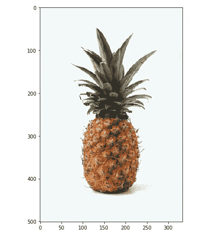***

***所以我们要做的是检测这个菠萝的轮廓。在应用检测算法之前，我们需要将图像转换成灰度并应用如下的阈值处理。所有这些步骤都是我们在上一系列文章中讨论过的。***

```
***# Blurring for removing the noise 
img_blur = cv2.bilateralFilter(img, d = 7, 
                               sigmaSpace = 75, sigmaColor =75)# Convert to grayscale 
img_gray = cv2.cvtColor(img_blur, cv2.COLOR_RGB2GRAY)# Apply the thresholding
a = img_gray.max()  
_, thresh = cv2.threshold(img_gray, a/2+60, a,cv2.THRESH_BINARY_INV)
plt.imshow(thresh, cmap = 'gray')***
```

***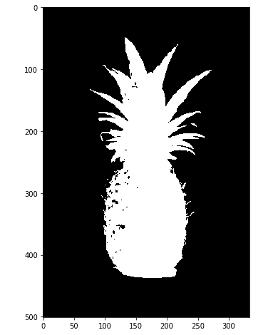***

***轮廓检测可以通过 OpenCV 中的函数`cv2.findContours()`来实现，这里有两个重要的参数。`mode`是寻找轮廓的方法，`method`是检测的近似方法。我要求你从 [**文档**](https://docs.opencv.org/2.4/modules/imgproc/doc/structural_analysis_and_shape_descriptors.html#findcontours) 中找到其他信息。***

```
***# Find the contour of the figure 
image, contours, hierarchy = cv2.findContours(image = thresh, 
                                   **mode = cv2.RETR_TREE, 
                                   method = cv2.CHAIN_APPROX_SIMPLE**)***
```

***模式`cv2.RETR_TREE`找到所有有希望的轮廓线，并重建嵌套轮廓的完整层次。方法`cv2.CHAIN_APPROX_SIMPLE`只返回绘制等高线所需的端点。正如你在上面看到的，这个函数给出了图像，检测到的轮廓和它们的层次作为输出。***

***返回的等高线是由等高线组成的点的列表。为了画出图形的外部线条，我们将按面积对轮廓进行排序。选中轮廓线后，`cv2.drawContours()`将描绘出边界线和如下所示的点。***

```
***# Sort the contours 
contours = sorted(contours, key = cv2.contourArea, reverse = True)# Draw the contour 
img_copy = img.copy()
final = **cv2.drawContours(**img_copy, contours, contourIdx = -1, 
                         color = (255, 0, 0), thickness = 2**)**
plt.imshow(img_copy)***
```

***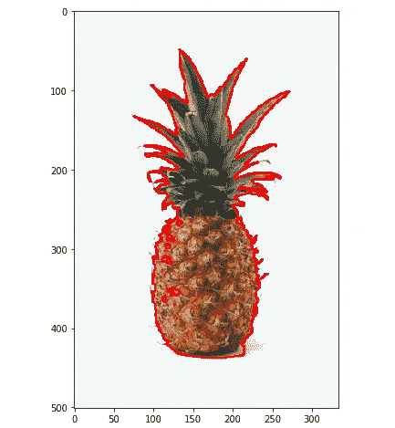***

***很简单吧？虽然底部也加了阴影，但是结局还是蛮满意的。***

# ***关于轮廓的更多信息***

***我们可以对轮廓做更多的事情。借助于图像矩的概念，我们可以找到图像的质心或计算边界场的面积。一瞬间在这里意味着什么？单词*‘moment’*在通常用法中是一小段时间。但在物理学术语中，一个 [**矩**](https://en.wikipedia.org/wiki/Moment_(physics)) 是距离和另一个物理量的乘积，意味着一个物理量是如何分布或定位的。所以在计算机视觉中， [**图像矩**](https://en.wikipedia.org/wiki/Image_moment) 就是图像像素强度是如何根据位置分布的。它是图像像素强度的加权平均值，我们可以从图像矩中获得质心或空间信息。***

***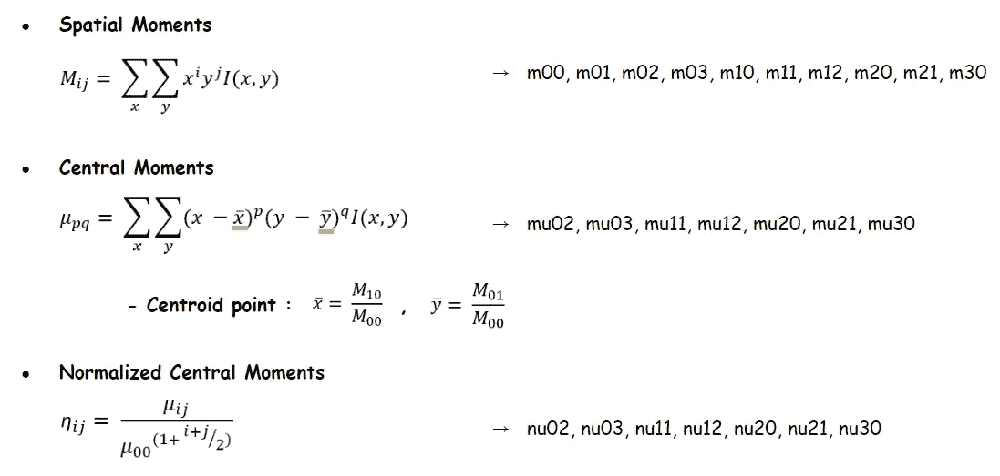***

***有三种类型的矩-空间矩、中心矩和中心归一化矩。我们可以用 OpenCV 中的函数`cv2.moments()`得到图像的矩，它返回 24 个不同的矩。如果您打印如下所示的输出`M`，它将以字典格式返回 24 个时刻。***

```
***# The first order of the contours
c_0 = contours[0]# image moment
M = cv2.moments(c_0)
print(M.keys())***
```

***我想在这里把重点放在图像时刻的实现上。如果你有兴趣，可以在本文末尾找到额外的阅读资源。***

***为了得到轮廓的面积，我们可以实现函数`cv2.contourArea()`。为什么我们不在这里尝试几种轮廓？如果您输入第一个、第二个和第三个轮廓，您将得到如下所示的递减值。这表明轮廓检测算法形成了检测到的边界的层次。***

```
***# The area of contours 
print("1st Contour Area : ", cv2.contourArea(contours[0])) # 37544.5
print("2nd Contour Area : ", cv2.contourArea(contours[1])) # 75.0
print("3rd Contour Area : ", cv2.contourArea(contours[2])) # 54.0***
```

***轮廓的弧长可以通过函数`cv2.arcLength()`得到。参数`closed`指示曲线是否应该闭合。***

```
***# The arc length of contours 
print(cv2.arcLength(contours[0], closed = True))      # 2473.3190
print(cv2.arcLength(contours[0], closed = False))   # 2472.3190***
```

***现在让我们试着画出菠萝的质心和极值点。我们可以用下面的公式得到质心点。***

```
***# The centroid point
cx = int(M['m10'] / M['m00'])
cy = int(M['m01'] / M['m00'])***
```

***极值是左边和右边、顶部和底部的端点。并且我们可以把 x 和 y 坐标分别排列如下。***

```
***# The extreme points
l_m = tuple(**c_0[c_0[:, :, 0]**.argmin()][0])
r_m = tuple(**c_0[c_0[:, :, 0]**.argmax()][0])
t_m = tuple(**c_0[c_0[:, :, 1]**.argmin()][0])
b_m = tuple(**c_0[c_0[:, :, 1]**.argmax()][0])pst = [l_m, r_m, t_m, b_m]
xcor = [p[0] for p in pst]
ycor = [p[1] for p in pst]***
```

***现在让我们在图像上绘制所有这些点。***

```
***# Plot the points
plt.figure(figsize = (10, 16))
plt.subplot(1, 2, 1)
plt.imshow(image, cmap = 'gray')
plt.scatter([cx], [cy], c = 'b', s = 50)plt.subplot(1, 2, 2)
plt.imshow(image, cmap = 'gray')
plt.scatter(xcor, ycor, c = 'b', s = 50)***
```

***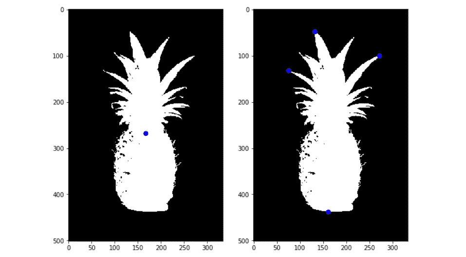***

# ***其他轮廓形状***

***除了紧致轮廓，我们还可以画出一个图形的凸轮廓或矩形轮廓线。让我们先尝试一个直的矩形。有了外部轮廓线，我们将围绕对象绘制矩形。函数`cv2.boundingRect()`返回边界框的 4 个点，如下所示。***

```
***# The first order of the contours
c_0 = contours[0]# Get the 4 points of the bounding rectangle
x, y, w, h = cv2.boundingRect(c_0)# Draw a straight rectangle with the points
img_copy = img.copy()
img_box = cv2.rectangle(img_copy, (x, y), (x+w, y+h), color = (255, 0, 0), thickness = 2)***
```

***注意，这个直矩形不是其他可能边界中的最小值。我们可以用函数`cv2.minAreaRect()`提取面积最小的矩形，该函数找到一个包含输入 2D 点集的旋转矩形。之后，我们得到这个矩形的四个角，并把它们放在`contour`参数中，如下所示。***

```
***# Get the 4 points of the bounding rectangle with the minimum area
rect = cv2.minAreaRect(c_0)
box = cv2.boxPoints(rect)
box = box.astype('int')# Draw a contour with the points 
img_copy = img.copy()
img_box_2 = cv2.drawContours(img_copy, **contours = [box]**, 
                             contourIdx = -1, 
                             color = (255, 0, 0), thickness = 2)***
```

***现在让我们检查结果并比较两个不同的轮廓框。***

```
***plt.figure(figsize = (10, 16))
plt.subplot(1, 2, 1); plt.imshow(img_box)
plt.subplot(1, 2, 2); plt.imshow(img_box_2)***
```

***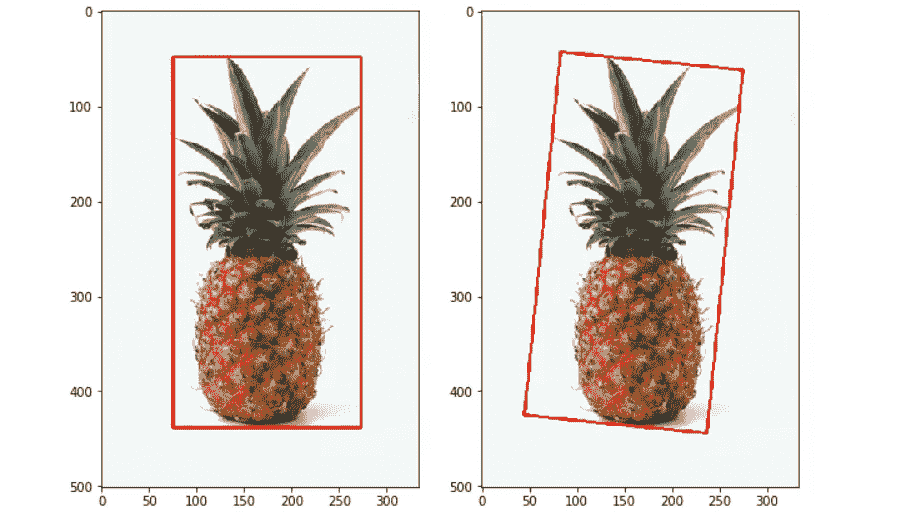***

***我们也可以使用`cv2.convexHull()`功能绘制一个凸形轮廓。这需要一组点，并从给定的集合中返回凸包。在`cv2.drawContours()`中输入这个返回的点为`contours`，我们可以得到如下的凸轮廓。***

```
***# Detect the convex contour
hull = cv2.convexHull(c_0)img_copy = img.copy()
img_hull = cv2.drawContours(img_copy, **contours = [hull]**, 
                            contourIdx = 0, 
                            color = (255, 0, 0), thickness = 2)
plt.imshow(img_hull)***
```

***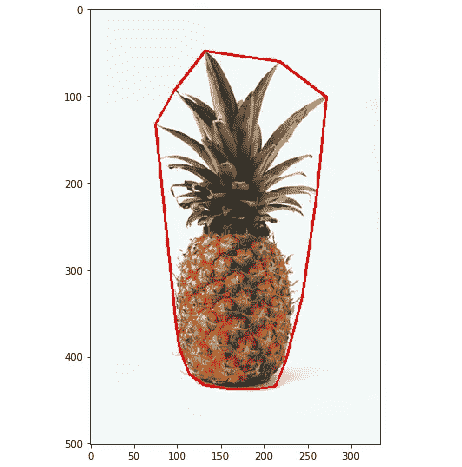***

***在轮廓检测中有太多的事情要涉及。我鼓励你查看文档[](https://docs.opencv.org/3.4.6/d3/d05/tutorial_py_table_of_contents_contours.html)**并自己探索更多选项。*****

# *****掩蔽带来的一点乐趣*****

*****作为这个系列的最后一个练习，我想做一些有趣的图像遮罩。我们可以通过图像加法或位运算等算术运算将两幅不同的图像相加。所以我们最后的任务是把我们的菠萝先生系在一个男人的左肩上。*****

```
*****# Import the large image
backpacker = cv2.imread('images/backpacker.jpg')
backpacker = cv2.cvtColor(backpacker, cv2.COLOR_BGR2RGB)
plt.imshow(backpacker)*****
```

*****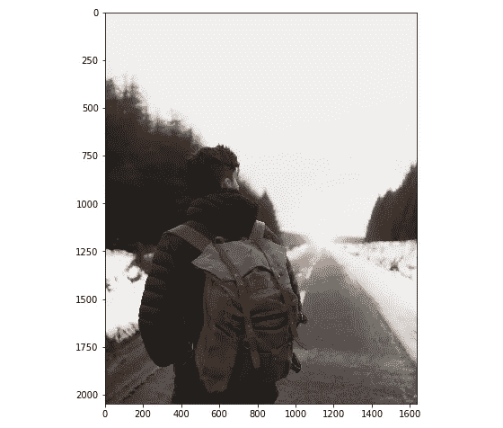*****

*****我们将从大图和小图中剪切出感兴趣的区域(肩部),如下所示。注意，这里两个图像的大小(图像的高度和宽度)应该是相同的。*****

```
*****# Crop the small image and the roi
roi = backpacker[750:1150, 300:500]
img_2 = img[40:440, 80:280]plt.figure(figsize = (6, 6))
plt.subplot(1, 3, 1); plt.imshow(roi)
plt.subplot(1, 3, 3); plt.imshow(img_2)*****
```

*****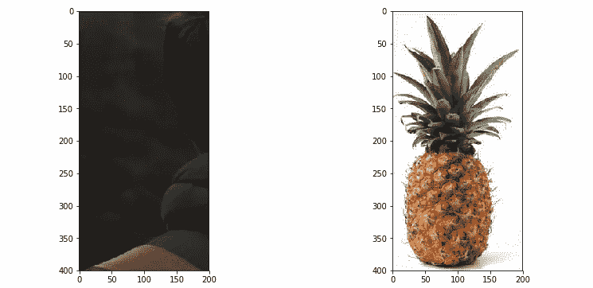*****

*****下一步是为每张图片制作蒙版。我们要用掩码实现位运算，掩码应该是一个二进制图像。通过对小图像`img_2`进行阈值处理，我们创建了蒙版。然后用`cv2.bitwise_not()`，我们制作另一个和第一个完全相反的面具。*****

```
*****# Creating the mask for the roi and small image
img_gray = cv2.cvtColor(img_2, cv2.COLOR_RGB2GRAY)
_, mask = cv2.threshold(img_gray, 254/2+100, 255, cv2.THRESH_BINARY)
mask_inv = cv2.bitwise_not(mask)plt.figure(figsize = (6, 6))
plt.subplot(1, 3, 1); plt.imshow(mask, cmap = 'gray')
plt.subplot(1, 3, 3); plt.imshow(mask_inv, cmap = 'gray')*****
```

*****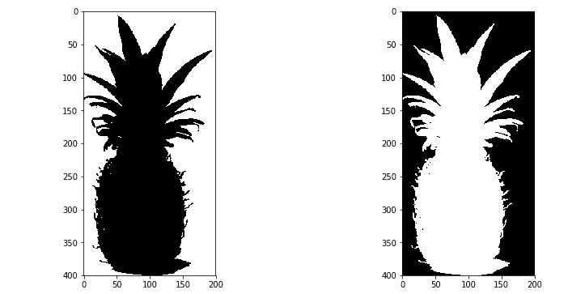*****

*****如果我们实现函数`cv2.bitwise_and()`和遮罩，它们将只通过图像的白色区域。因此，如果我们将第一个蒙版应用于`roi`图像，我们可以从它设置背景图像。同样的，如果我们将第二个应用到`img_2`图像，我们可以用水果制作前景图像。*****

```
*****# Masking 
img_bg = cv2.bitwise_and(roi, roi, mask = mask)
img_fg = cv2.bitwise_and(img_2, img_2, mask = mask_inv)
dst = cv2.add(img_fg, img_bg)plt.figure(figsize = (10, 6))
plt.subplot(1, 3, 1); plt.imshow(img_bg)
plt.subplot(1, 3, 2); plt.imshow(img_fg)
plt.subplot(1, 3, 3); plt.imshow(dst)*****
```

*****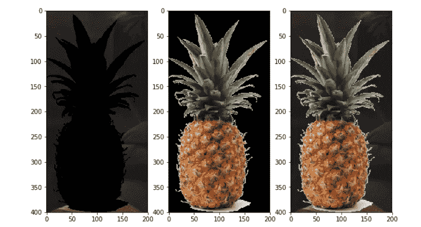*****

*****考虑到底部的阴影，结果有点混乱，但让我们保持它。如果你想了解位运算是如何工作的，详细的解释可以在 [**这里**](https://stackoverflow.com/questions/44333605/what-does-bitwise-and-operator-exactly-do-in-opencv) 找到。现在，我们准备将这个组合图像附加到原始图像上。因此，我们可以简单地这样做，将`dst`图像放在`roi`位置，如下所示。*****

```
*****# Final output
backpacker[750:1150, 300:500] = dst
display(backpacker)*****
```

*****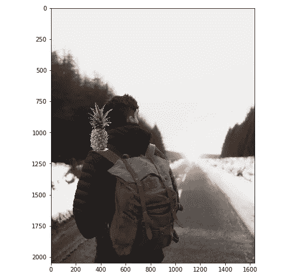*****

*****😄👋祝你和背包客过得愉快！*****

# *****摘要*****

*****从第 1 部分到第 4 部分，我们已经学习了很多关于图像处理和计算机视觉的基础知识。到目前为止，你喜欢这些教程吗？我希望在阅读本系列文章的同时，您对这些技巧有了信心。*****

*****如果您完全是图像处理的初学者，最初不熟悉 OpenCV 函数的术语和用法是正常的。最好的练习方法是自己实现所有这些。选择你喜欢的任何类型的图片，并从中获得乐趣。改变颜色模式，旋转和调整图像大小，遮罩并粘贴到不同的图像上。或者你也可以应用边缘、拐角和轮廓的检测技术。虽然通过组合几个预处理和尝试不同的参数来获得乐趣，但您可以在没有意识到的情况下更快地习惯 OpenCV 库。*****

# *****资源*****

*   *****[维基百科上的图片瞬间](https://en.wikipedia.org/wiki/Image_moment)*****
*   *****[uda city 上的影像时刻课程](https://www.youtube.com/watch?v=AAbUfZD_09s&t=71s)*****
*   *****[使用 Hu 矩的形状匹配(C++/Python)](https://www.learnopencv.com/shape-matching-using-hu-moments-c-python/)*****
*   *****[使用 OpenCV (C++/Python)找到斑点的中心(质心)](https://www.learnopencv.com/find-center-of-blob-centroid-using-opencv-cpp-python/)*****

*****有你想改正的错误吗？请与我们分享您的见解。我总是乐于交谈，所以请在下面留下评论，分享你的想法。我还在 [**LinkedIn**](https://www.linkedin.com/in/jiwon-jeong/) 上分享有趣和有用的资源，欢迎随时关注并联系我。下次我会带来另一个有趣的故事。一如既往，敬请关注！😎*****