# 蒸汽波艺术的计算机视觉

> 原文：<https://towardsdatascience.com/computer-vision-for-vaporwave-art-32a330c827ee?source=collection_archive---------20----------------------->

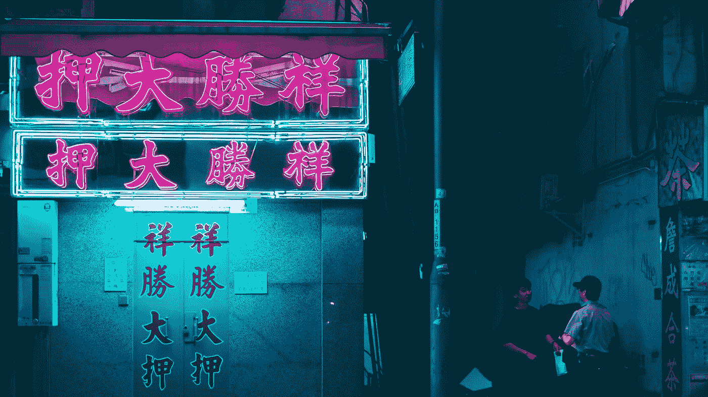

Photo by [Sean Foley](https://unsplash.com/@_stfeyes?utm_source=medium&utm_medium=referral) on [Unsplash](https://unsplash.com?utm_source=medium&utm_medium=referral)

## 利用现代技术进行艺术追求

当然，通读出版物和实现实用算法是令人兴奋的。我喜欢寻找聪明的方法来分割图像，检测人们是不是 T2 混蛋，甚至帮助机器人通过 T4 农场。然而，有几个星期我不想用计算机视觉做任何有意义的事情。在大脑感觉特别顺畅的日子里，让代码从手指中流出并出于良性目的使用磁场是令人放松的。

本周就是其中的一周。除了参与科技，我还喜欢时尚和艺术。我最近发现了一种被称为 [Vaporwave](https://en.wikipedia.org/wiki/Vaporwave) 的边缘艺术形式。形式采用流行的互联网时代艺术形式的元素，如 glitch art 和 chillwave。Vaporwave 与其他形式不同，它强调怀旧主题，经常使用来自美国和日本文化的 20 世纪 80 年代风格的波普艺术。90 年代和 21 世纪初的图形用户界面(GUI)也是常见的噱头。当个人电脑还处于萌芽状态，科技行业还相当不景气时，这些物品会让人产生不正当的简单感觉。

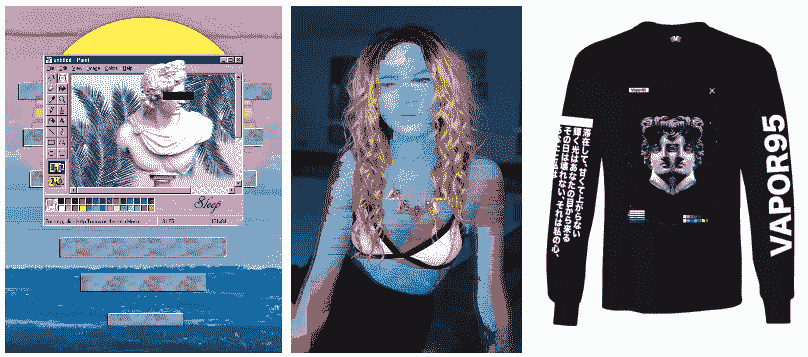

Vaporwave has many forms and is seen in digital media and fashion!

在千年之交的成长过程中，我觉得这些作品向我的成长致敬。作为一名活跃的图像处理程序员，我决定参与艺术形式。我开发了一个简短的 Python 脚本，可以蒸发任何给定的照片。

## 毛刺艺术方法

在图像处理和计算机视觉中，通常使用数字操作来清除噪声和分离感兴趣的项目。这个项目做的完全相反。目标是添加噪声和破坏图像，但以一种有品位的方式。

我想加入的 Vaporwave 艺术的一个特征是毛刺艺术。这是指数字误差被故意用来制作艺术图案。这种艺术形式应用在人脸上时有一种特别强烈的感觉。

OpenCV 等有用的库使得面部识别变得相当简单。OpenCV 拥有可以用来检测不同面部姿态和特征的模型。我特别想开发出可以操控整张脸或者只操控眼睛的功能。使用哈尔级联和一些参数调整，人脸和眼睛出现在大多数图像中。

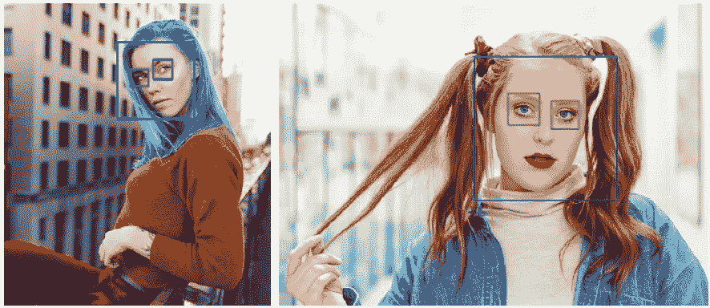

Facial detection results. Images by [demegree](https://www.instagram.com/demegree/)

知道了面部的位置，我想执行两个主要的面部瑕疵，面部拖动和静态瑕疵。面部拖动是选择面部上的一个区域并在图像上拖动该区域中的一行像素的效果。这种效果让人想起在拖动或移动时滞后的旧电脑上的 GUI。静态毛刺是一种更常见的影响。当电视连接不良时，通常会出现这种情况。屏幕上的像素会出现横向抖动。

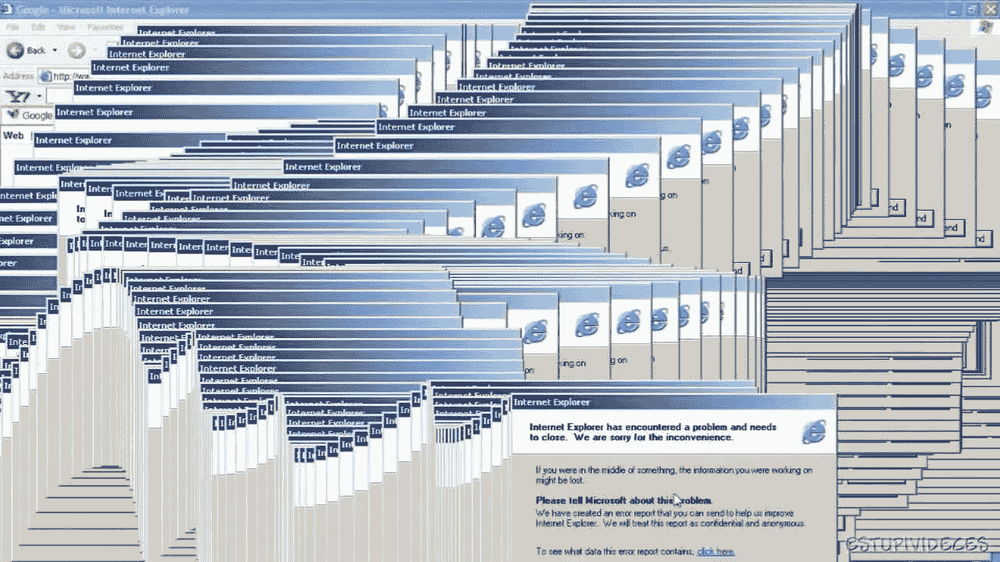

Ah, good old days.

这两个元素都很容易实现。通过随机选择拖动面部的方向来执行面部毛刺。面上的随机 x 轴或 y 轴位置被选作将要拖动的线。然后沿着一组行或列复制该行中的像素

对于静态毛刺，面部被分成随机数量的条。每一条都向左或向右移动一段随机距离。

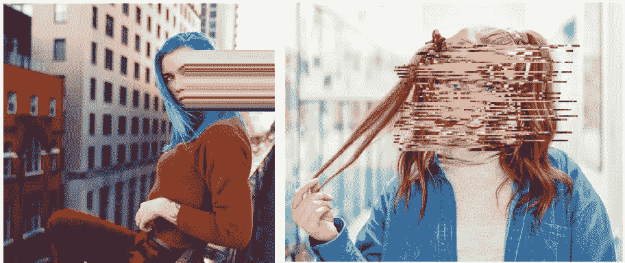

Face Dragging (Left) and Glitch Static (Right)

“眼睛是心灵的窗户”是一个常见的艺术老生常谈，Vaporwave 经常强调这一特征。眼睛经常被黑条遮住，这是指广播电台过去如何审查个人。本文中较早展示的一个片段包括了这一点。偶尔，为了模仿希腊罗马雕像，图像中的瞳孔被完全移除。

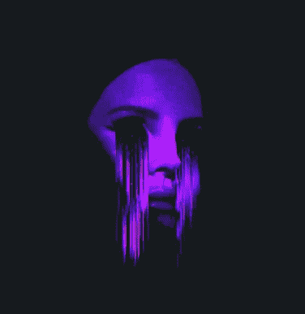

Eye Glitch Drag, [Source](https://www.reddit.com/r/VaporwaveArt/comments/b2ukr8/m_e_l_t_i_n_g_g_g_g_g/)

我见过的一个更罕见、更迷人的效果是仅仅眼睛的小故障。这类似于面部拖动效果，但是，只有眼睛的部分被拖动，以创建哭泣和阴沉的外观。我发现这种风格要么绝对吸引观众，要么让他们毛骨悚然。

审查条要求适度使用几何学。找到双眼的中心后，我找到了连接两点的向量。然后我用垂直的单位向量乘以一些标量来找到相对于双眼中心的审查条的角。

眼球阻力效应类似于面部阻力。我没有把整个眼睛拉成一列或一行，而是把眼睛描述成一条条的，然后把它们一个一个地拉成随机的长度。

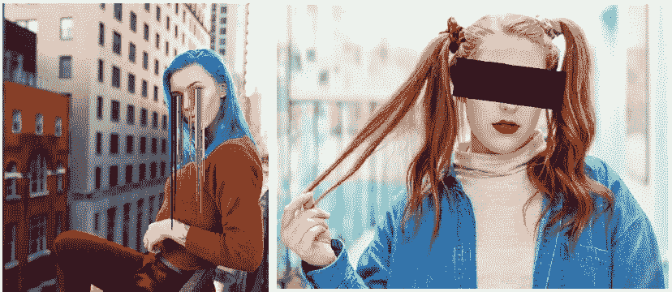

Eye Drag (Left) and Censor bar (Right)

## 蒸汽波艺术——最后一笔

正如我之前提到的，蒸汽波艺术不仅仅是可怕地扭曲了一幅图像。没有那些 80 年代和 90 年代的参考，我的作品感觉不太完整。所以我拿了一堆图像和时代精神的符号，用几个随机发生器把它们组合起来，扔在那里。

最重要的是，我添加了一个高对比度的滤镜，并用高斯噪声对图像进行了爆破，使图像呈现出一种老式阴极射线管电视和计算机的美感。

## 图库和结果

我对这个项目的结果非常满意。当我开始写剧本的时候，我并没有过高的期望。然而，由于程序的完全随机性，偶尔会产生一些有味道的结果。

此外，作为一个技术领域的人，我并不期望用我的技能来创造艺术。这个程序很好地展示了新兴的计算机视觉领域的艺术应用。对于那些需要实际应用的人来说，这样的程序类似于社交媒体应用 Snapchat 的面部过滤器。

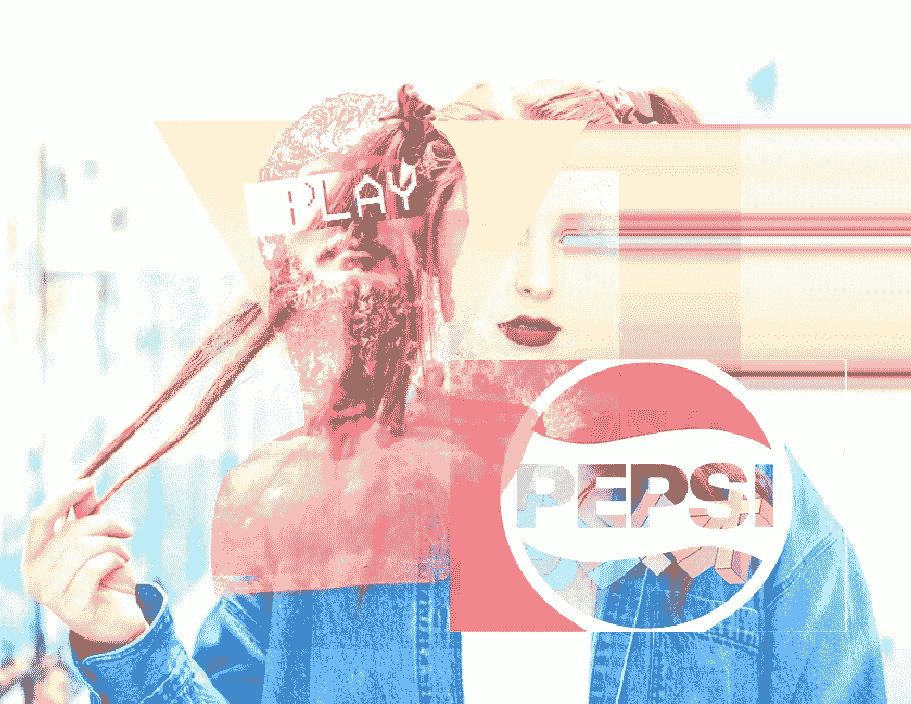

尽管这个项目很有趣，但我不认为自己会在上面投入太多时间。也就是说，该程序确实有一些不完整的功能，我欢迎有兴趣的人来开发。我想在审查栏上添加随机的“尖锐”文本，这是 Vaporwave 艺术中的另一个陈词滥调。

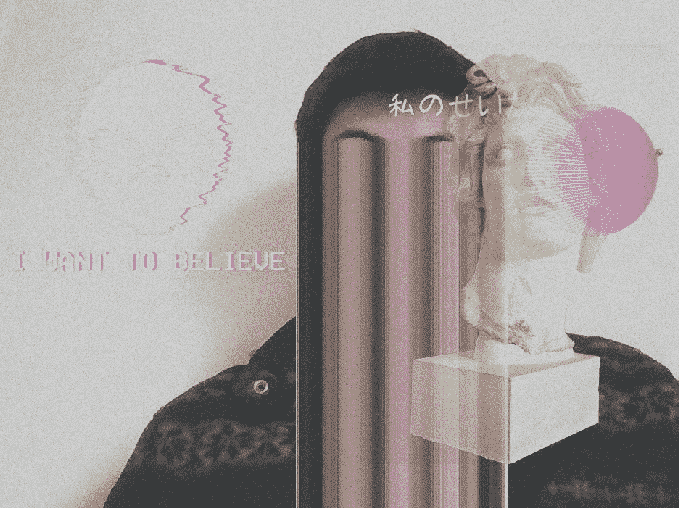

Yours Truly

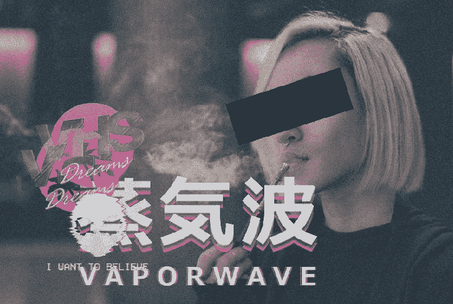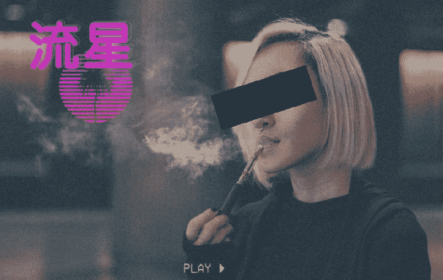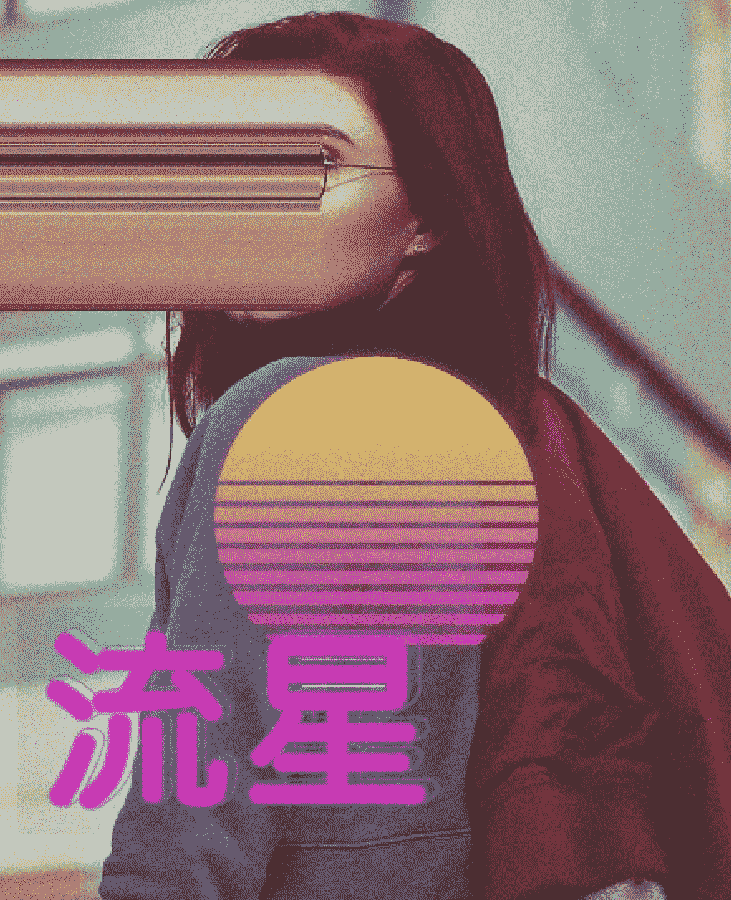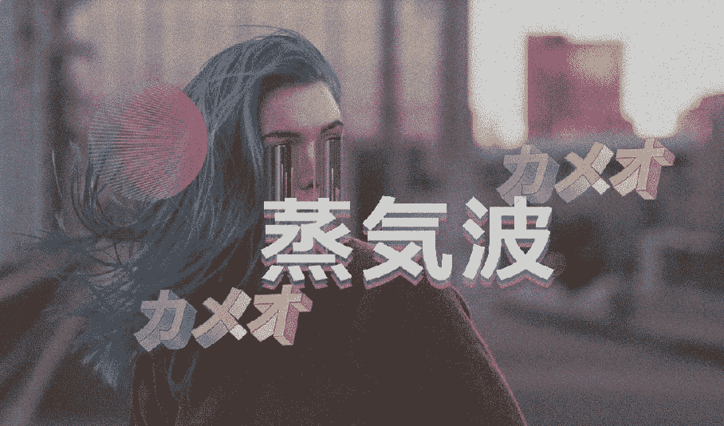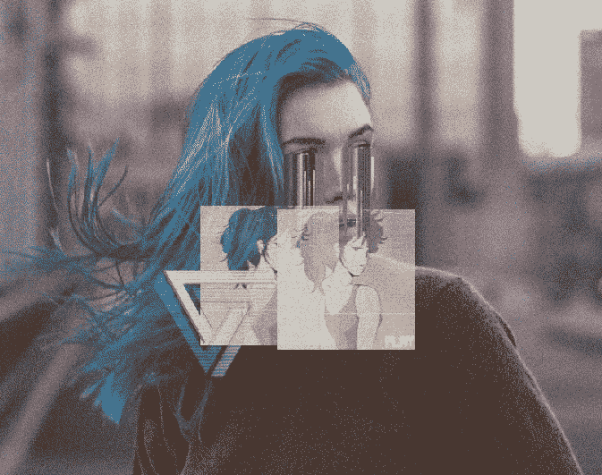

以上图片由[de gree](https://www.instagram.com/demegree/)原创拍摄(除了我的那张)。

## 二等奖；荣誉奖；H 奖

尽管其中一些图片很棒，但重要的是要承认这个脚本具有难以置信的随机性。我在选集里挑了一些我最喜欢的。偶尔，一些生成的作品绝对疯狂。

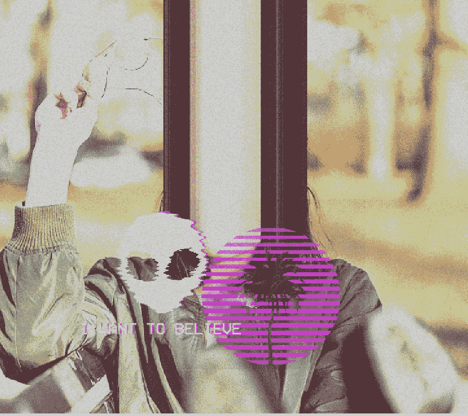

Houston, we have lift off

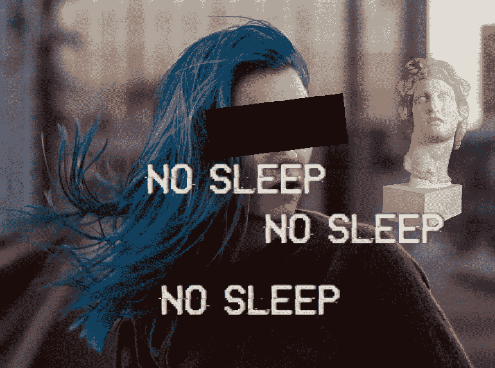

We get it…

## 密码

 [## TimChinenov/VaporWaveArt

### 下面的代码生成了一个图像。创建一个帐户，为 TimChinenov/VaporWaveArt 的发展做出贡献…

github.com](https://github.com/TimChinenov/VaporWaveArt) 

*如果你使用这个脚本，我很想看看你会生成什么样的图像！能分享就分享吧。如果加入更多的元素，那就更好了！*