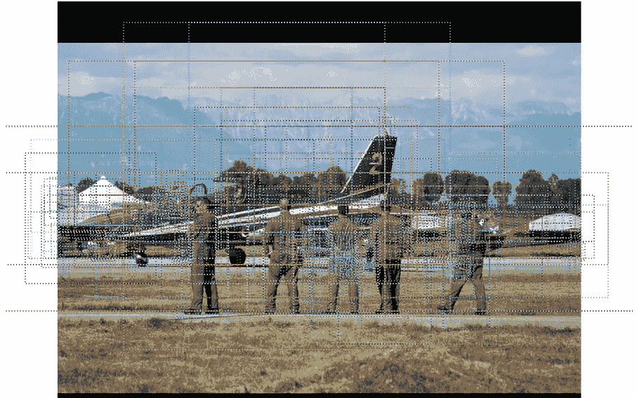

# 计算机视觉:掩模 R-CNN 的实例分割

> 原文：<https://towardsdatascience.com/computer-vision-instance-segmentation-with-mask-r-cnn-7983502fcad1?source=collection_archive---------2----------------------->

这是计算机视觉旅程 ***系列*的第四部分。在本文中，我们将探索掩模 R-CNN，以了解实例分割如何与掩模 R-CNN 一起工作，然后使用 Keras**** 预测具有掩模 R-CNN 的图像的分割

[***第一部分——CNN，R-CNN，快速 R-CNN，更快 R-CNN***](https://medium.com/datadriveninvestor/computer-vision-a-journey-from-cnn-to-mask-r-cnn-and-yolo-1d141eba6e04?source=post_page---------------------------)

[***第二部分——了解 YOLO、约洛夫 2、YOLO v3***](https://medium.com/@arshren/computer-vision-a-journey-from-cnn-to-mask-r-cnn-and-yolo-part-2-b0b9e67762b1?source=post_page---------------------------)

[***第三部分——用 YOLOv3 使用 Keras 进行物体检测***](https://medium.com/datadriveninvestor/object-detection-using-yolov3-using-keras-80bf35e61ce1)

***什么是实例切分，与语义切分有什么不同？***

> **语义分割在像素级检测图像中存在的所有对象。输出具有不同类别或对象的区域**
> 
> 语义分割以语义上有意义的方式对像素进行分组。属于人、道路、建筑物、栅栏、自行车、汽车或树木的像素被单独分组。


Semantic Segmentation

> **实例分割是识别图像中每个已知对象的每个对象实例**。

实例分割为图像的每个像素分配一个标签。它用于计算物体数量等任务


Instance segmentation

实例分段需要

*   图像中所有对象的对象检测。这里的目标是对单个对象进行分类，并使用边界框对每个对象实例进行定位
*   分割每个实例。这里的目标是在不区分对象实例的情况下，将每个像素分类到一组固定的类别中

# 屏蔽 R-CNN

> 屏蔽 R-CNN 扩展更快 R-CNN。

***屏蔽 R-CNN 和更快的 R-CNN 有什么不同？***

> 掩模 R-CNN 具有用于以像素到像素的方式预测每个感兴趣区域(RoI)上的分割掩模的附加分支
> 
> 更快的 R-CNN 不是为网络输入和输出之间的像素到像素对齐而设计的。

更快的 R-CNN 有两个输出

*   对于每个候选对象，类别标签和包围盒偏移；

屏蔽 R-CNN 有三个输出

*   对于每个候选对象，类别标签和包围盒偏移；
*   第三个输出是对象遮罩

***口罩 R-CNN 和更快的 R-CNN 有什么相似之处？***

> -掩码 R-CNN 和更快的 R-CNN 都有一个用于分类和包围盒回归的分支。
> 
> -两者都使用 ResNet 101 架构从图像中提取特征。
> 
> -两者都使用区域提议网络(RPN)来生成兴趣区域(RoI)

***Mask R-CNN 是如何工作的？***

掩模 R-CNN 模型分为两部分

*   **区域提议网络(RPN)提出候选对象包围盒。**
*   **二进制掩码分类器，为每个类别生成掩码**


Mask R-CNN Source: [Mask R-CNN Paper](https://arxiv.org/pdf/1703.06870.pdf\)

*   图像通过 CNN 运行以生成特征地图。
*   区域提议网络(RPN)使用一个 CNN 来生成多个感兴趣区域(RoI ),使用一个轻量级的二进制分类器。它在图像上使用了 9 个定位框。分类器返回对象/非对象分数。非最大抑制应用于具有高客观性分数的锚点
*   RoI 对准网络输出多个边界框而不是单个确定的边界框，并将它们扭曲成固定的尺寸。
*   然后将扭曲的要素输入到完全连接的图层中，使用 softmax 进行分类，并使用回归模型进一步优化边界框预测
*   扭曲的特征也被送入掩模分类器，该分类器由两个 CNN 组成，为每个 RoI 输出一个二进制掩模。掩码分类器允许网络为每个类别生成掩码，而不会在类别之间产生竞争


# 锚箱

Mask R-CNN 使用锚定框来检测图像中的多个对象、不同比例的对象以及重叠的对象。这提高了目标检测的速度和效率。

锚点*框*是一组具有一定高度和宽度的预定义边界框。定义这些框是为了捕捉要检测的特定对象类的比例和纵横比。



Image with multiple anchor boxes Source: [matterport](https://github.com/matterport/Mask_RCNN)

为了预测图像中的多个对象或对象的多个实例，Mask R-CNN 进行了数千次预测。最终的目标检测是通过去除属于背景类的锚框来完成的，剩余的锚框通过它们的置信度得分来过滤。我们发现 IoU 大于 0.5 的锚盒。使用下面解释的非最大抑制来选择具有最大置信度得分的锚框

# 并集上的交集— IoU

IoU 通过算法计算两个边界框的并集上的交集，即地面真实的边界框和预测框的边界框


**当 IoU 为 1 时，这将意味着预测的和真实边界框完全重叠。**

为了在图像中检测一次对象，**非最大抑制会考虑 IoU >为 0.5** 的所有边界框

***如果我有多个 IoU 大于 0.5 的边界框怎么办？***

# 非最大抑制

*   非最大抑制将移除 IoU 小于或等于 0.5 的所有边界框
*   选取 IoU 值最高的边界框，并抑制其他边界框以识别同一对象


Bounding refinement after applying Non Max Suppression

# 使用 Keras 屏蔽 R-CNN 代码

为此我们使用**[**matter port Mask R-CNN**](https://github.com/matterport/Mask_RCNN)**。**本例中使用的 Mask R-CNN 模型是在 COCO 数据集上预训练的。**

****步骤 1:克隆屏蔽 R-CNN 库****

```
git clone [https://github.com/matterport/Mask_RCNN.git](https://github.com/matterport/Mask_RCNN.git)cd Mask_RCNN$ python setup.py install
```

****第二步:从**[**matter port**](https://github.com/matterport/Mask_RCNN/releases/download/v2.0/mask_rcnn_coco.h5)下载 COCO 模型的预训练权重。将文件放在名为“mask_rcnn_coco.h5”的 Mask_RCNN 文件夹中**

****第三步:导入所需的库****

```
# import the necessary packages
from mrcnn.config import Config
from mrcnn import model as modellib
from mrcnn import visualize
import mrcnn
import numpy as np
import colorsys
import argparse
import imutils
import random
import cv2
import osfrom matplotlib import pyplot
from matplotlib.patches import Rectangle%matplotlib inline
```

****第四步:**我们创建一个***myMaskRCNNConfig***类，它继承了***Mask R-CNN Config***类。**

**因为我正在使用 CPU，所以设置 GPU_COUNT=1**

**COCO 数据集有 80 个标签，所以我们将 NUM_CLASSES 设置为 80 + 1(用于背景)**

```
class myMaskRCNNConfig(Config):
 # give the configuration a recognizable name
 **NAME = “MaskRCNN_inference”**

 # set the number of GPUs to use along with the number of images
 # per GPU
 **GPU_COUNT = 1**
 **IMAGES_PER_GPU = 1**

 # number of classes (we would normally add +1 for the background
 # but the background class is *already* included in the class
 # names)
 **NUM_CLASSES = 1+80**
```

****步骤 5:创建一个 *myMaskRCNNConfig* 类**的实例**

```
config = myMaskRCNNConfig()
```

****步骤 6:使用我们创建的配置实例**初始化*“推理”*的屏蔽 R-CNN 模型**

```
print(“loading  weights for Mask R-CNN model…”)
**model = modellib.MaskRCNN(mode=”inference”, config=config, model_dir=’./’)**
```

****第七步:为屏蔽 R-CNN 加载权重。这些是 COCO 数据集**的预训练权重**

```
**model.load_weights(‘mask_rcnn_coco.h5’, by_name=True)**
```

****步骤 8:定义 coco 模型的 80 个类和 1 个用于背景(BG)****

```
**class_names** = [**‘BG’**, ‘person’, ‘bicycle’, ‘car’, ‘motorcycle’, ‘airplane’,
 ‘bus’, ‘train’, ‘truck’, ‘boat’, ‘traffic light’,
 ‘fire hydrant’, ‘stop sign’, ‘parking meter’, ‘bench’, ‘bird’,
 ‘cat’, ‘dog’, ‘horse’, ‘sheep’, ‘cow’, ‘elephant’, ‘bear’,
 ‘zebra’, ‘giraffe’, ‘backpack’, ‘umbrella’, ‘handbag’, ‘tie’,
 ‘suitcase’, ‘frisbee’, ‘skis’, ‘snowboard’, ‘sports ball’,
 ‘kite’, ‘baseball bat’, ‘baseball glove’, ‘skateboard’,
 ‘surfboard’, ‘tennis racket’, ‘bottle’, ‘wine glass’, ‘cup’,
 ‘fork’, ‘knife’, ‘spoon’, ‘bowl’, ‘banana’, ‘apple’,
 ‘sandwich’, ‘orange’, ‘broccoli’, ‘carrot’, ‘hot dog’, ‘pizza’,
 ‘donut’, ‘cake’, ‘chair’, ‘couch’, ‘potted plant’, ‘bed’,
 ‘dining table’, ‘toilet’, ‘tv’, ‘laptop’, ‘mouse’, ‘remote’,
 ‘keyboard’, ‘cell phone’, ‘microwave’, ‘oven’, ‘toaster’,
 ‘sink’, ‘refrigerator’, ‘book’, ‘clock’, ‘vase’, ‘scissors’,
 ‘teddy bear’, ‘hair drier’, ‘toothbrush’]
```

****步骤 9:为图像中检测到的对象绘制方框的功能****

```
# draw an image with detected objects

**def draw_image_with_boxes(filename, boxes_list):**
     # load the image
     data = pyplot.imread(filename)
     # plot the image
     pyplot.imshow(data)
     # get the context for drawing boxes
     ax = pyplot.gca()
     # plot each box
     for box in boxes_list:
          # get coordinates
          y1, x1, y2, x2 = box
          # calculate width and height of the box
          width, height = x2 - x1, y2 - y1
          # create the shape
          rect = Rectangle((x1, y1), width, height, fill=False, color='red', lw=5)
          # draw the box
          ax.add_patch(rect)
     # show the plot
     pyplot.show()
```

****步骤 10:我们最终做出预测，并在检测到的物体周围画出包围盒****

**加载图像，然后将其转换为 numpy 数组**

```
from keras.preprocessing.image import load_img
from keras.preprocessing.image import img_to_arrayimg = load_img(‘donuts.jpg’)pyplot.imshow(img)img = img_to_array(img)
```

****

**Original image of Donuts**

**我们现在做出预测**

```
# make prediction
results = model.detect([img], verbose=0)
```

****结果是我们传递给 *detect()* 函数的图像的字典。****

**字典中有边界框、遮罩、类别和分数的关键字。每个键指向图像中检测到的多个可能对象的列表。**

**这本字典的关键字是**

*   *****ROI***’:被检测物体的感兴趣区域(ROI)。**
*   *****遮罩***’:被检测对象的遮罩。**
*   *****Class _ ids***’:被检测对象的类整数。**
*   *****分数***’:每个预测类别的置信概率。**

****步骤 11:通过在感兴趣区域(ROI)周围绘制边界框来可视化结果****

```
# visualize the results
draw_image_with_boxes('donuts.jpg', results[0]['rois'])
```

****

**画面具**

```
# get dictionary for first prediction
**from mrcnn.visualize import display_instances
r = results[0]**# show photo with bounding boxes, masks, class labels and scores
**display_instances(img, r[‘rois’], r[‘masks’], r[‘class_ids’], class_names, r[‘scores’])**
```

****

**Bounding boxes, masks, class and their scores using Mask R-CNN**

**要查找对象和类的数量**

```
classes= r['class_ids']
print("Total Objects found", len(classes))
for i in range(len(classes)):
    print(class_names[classes[i]])
```

****

**No. of objects and their classes**

**[使用 github 提供的掩码 R-CNN 进行预测的代码](https://github.com/arshren/Mask_RCNN/blob/master/m_rcnn.ipynb)**

## **参考资料:**

**[面具 R-CNN 纸](https://arxiv.org/pdf/1703.06870.pdf)**

**[https://engineering . matter port . com/splash-of-color-instance-segmentation-with-mask-r-CNN-and-tensor flow-7c 761 e 238 b 46](https://engineering.matterport.com/splash-of-color-instance-segmentation-with-mask-r-cnn-and-tensorflow-7c761e238b46)**

**[https://medium . com/@ Jonathan _ hui/image-segmentation-with-mask-r-CNN-ebe6d 793272](https://medium.com/@jonathan_hui/image-segmentation-with-mask-r-cnn-ebe6d793272)**

**[http://www . cs . Toronto . edu/~ urta sun/courses/CSC 2541/08 _ instance . pdf](http://www.cs.toronto.edu/~urtasun/courses/CSC2541/08_instance.pdf)**

**[](https://machinelearningmastery.com/how-to-perform-object-detection-in-photographs-with-mask-r-cnn-in-keras/) [## 如何在 Keras 中使用 Mask R-CNN 进行照片中的对象检测

### 目标检测是计算机视觉中的一项任务，涉及识别一个或多个目标的存在、位置和类型

machinelearningmastery.com](https://machinelearningmastery.com/how-to-perform-object-detection-in-photographs-with-mask-r-cnn-in-keras/)**