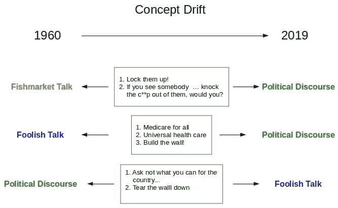
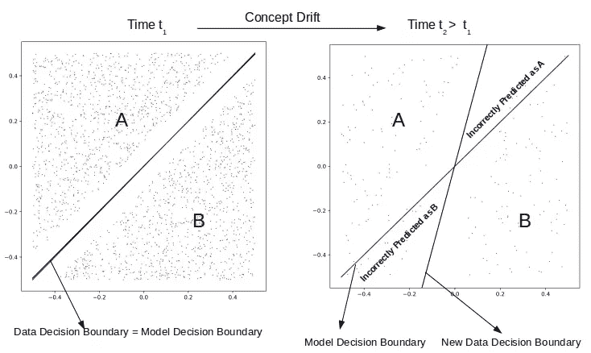
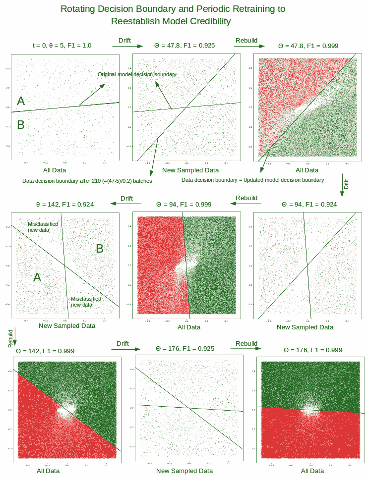
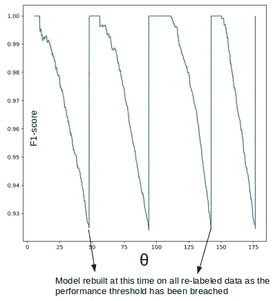

# 机器学习中的概念漂移和模型衰退

> 原文：<https://towardsdatascience.com/concept-drift-and-model-decay-in-machine-learning-a98a809ea8d4?source=collection_archive---------7----------------------->

*概念漂移是基本相同数据的标签随时间的漂移。它导致新数据的决策边界与根据早期数据/标签建立的模型的决策边界不同。对随机采样的新数据进行评分可以检测出偏差，使我们能够根据需要触发昂贵的重新标记/重新训练任务…*

没有什么是永恒的。甚至没有一个精心构建的模型是建立在大量标记良好的数据之上的。它的预测能力会随着时间而衰减。概括地说，模型会以两种方式衰退。由于数据漂移或由于概念漂移。在数据漂移的情况下，数据会随着时间的推移而演变，从而可能引入以前未见过的各种数据和所需的新类别。但是对以前标记的数据没有影响。在概念漂移的情况下，我们对数据的解释随着时间而变化，即使数据的总体分布没有变化。这导致终端用户*将*模型预测解释为对于*相同/相似*数据已经随时间恶化。此处的修复需要重新标记受影响的旧数据并重新训练模型。数据和概念也可能同时漂移，使问题变得更加复杂…

> *就像让湖人队在世界职业棒球大赛中对阵爱国者队，当概念/比赛和数据/球员都改变时，看台上会有很多人挠头……*

这篇文章是关于后期制作场景中概念漂移的检测，在这种场景中，根据旧数据训练的模型用于对新输入的数据进行分类。对旧数据进行持续的重新标记和重新训练是极其昂贵的，因此我们希望检测概念漂移，并根据需要采取行动。为了便于说明和可视化，我们坚持二维(即两个特征)和两个类来划分特征空间。但是检测的方法是通用的。一旦检测到漂移，就需要更新模型。细节将取决于应用，但一般来说:

*   如果我们诊断出一个概念漂移，那么受影响的*旧数据*也需要重新标记并重新训练模型。
*   如果我们诊断出数据漂移，则需要标记足够多的新数据以引入新的类，并重新训练模型
*   当我们发现数据和概念都发生了漂移时，上述两种情况都出现了

这个帖子的重点是概念漂移。数据漂移是本系列下一篇文章的主题。我们查看一些代码片段进行说明，但是可以从 [github](https://github.com/ashokc/Concept-Drift-and-Model-Decay) 下载复制报告结果的完整代码。

*更新(2020 年 8 月 21 日)*:在 neptune.ai 上看到了一篇关于这个话题的好文章，作者是 Shibsankar Das。[处理概念漂移的最佳实践](https://neptune.ai/blog/concept-drift-best-practices)。

# 1.概念漂移

当我们对数据的解释随着时间而变化时，即使数据可能没有变化，也会出现概念漂移。我们过去一致认为属于 A 类的东西，我们现在声称它应该属于 B 类，因为我们对 A 和 B 的性质的理解已经改变了。这是纯粹的概念漂移。显然需要进一步的解释和背景。例如，一段文本在 1960 年可以被合法地标记为属于一个类别，但在 2019 年属于另一个类别。因此，1960 年建立的模型对 2019 年*相同数据*的预测将会有很大误差。下面的图 1 是一个极端的例子，也许是用来说明游戏规则改变时的问题。

Figure 1\. Data has not changed. But our interpretation and assigned class thereof have.

# 2.改变决策界限

概念漂移可以被看作是决策边界随时间的变化。考虑图 2 中模拟的两类情况。

Figure 2\. Concept drift can be detected by the divergence of model & data decision boundaries and the concomitant loss of predictive ability

*   在时间 t1，线 y = x 清楚地将类分开，并且有一些好的分隔来引导。我们在该数据上训练 SVM 分类器，并且获得的模型决策边界与模拟数据的决策边界完全一致。暂时一切都很好，我们的预测是正确的
*   新数据在稍后的时间 t2 到来，我们手动标记它(测试预测是否仍然正确的唯一方法！).*所有的标注都是根据我们在标注时对数据的理解*。这是关键点。随着我们对数据的解释的发展，我们最终将一些数据放在 A 中(同时在时间 t1 将类似的数据放在 B 中)，并将一些其他数据放在 B 中(同时在时间 t1 将类似的数据放在 A 中)。
*   因此，新数据有一个明显的决策边界，该边界与基于类似数据的*旧*解释建立的模型决策边界不一致。因此，基于模型的预测对于标记的区域来说是错误的。

> *因此，数据决策边界的不断变化是概念漂移的症结所在。那么，检测它的唯一方法当然是努力在常规基础上标记至少一些新数据，并寻找模型预测能力的退化。当我们感到退化不再可容忍时，我们将需要根据当前对数据的理解，用重新标记的数据重建模型。*

# 3.模拟概念漂移

我们继续处理如图 2 所示的类似问题，但是是定量的，以便触发“重建！”当模型性能下降到阈值时发出信号。这是问题陈述。

1.  数据决策边界是线性的(为了简单起见，这不是必需的),开始时与水平线成 5 度角。
2.  我们在这个标记良好的数据上训练一个 SVM 分类器。
3.  新一批数据到达时，每一批都遵循逆时针旋转 0.2 度的判定边界。
4.  我们在批中随机抽取 10%的新数据，并根据手头的模型评估 f1 分数。如果 f1 分数低于可接受的值，我们将触发重新标记任务，并继续上面的步骤 2

## 3.1 生成数据

A 类和 B 类都将从 1000 个数据点开始。每新增一批，每班加 125 分。每批的数据判定界限( *w* )不同。

## 3.2 构建 SVM 分类器

我们在标记数据上建立 SVM 模型，并使用该模型获得测试/采样数据的 f1 分数。

## 3.3 检测衰变

标记 25 个随机选择的数据点(该批的 10%)，并与手头最新模型的预测进行比较。当样本的 f1 分数低于阈值(此处为 0.925)时，我们会触发重新标记/重新训练任务。

## 3.4 重新贴标签

随着数据决策边界的旋转，并且越来越偏离模型的决策边界，模型预测会持续变差。当采样数据的 f1 分数下降到大约 0.925 时，我们根据当前数据决策边界重新标记*所有*数据*。*现在，在我们具有 2 个特征和线性数据/模型决策边界的简单几何图形中，很容易找出错误分类的新数据。但一般来说不会，所以我们重新标记所有数据。

## 3.5 重新训练以完成循环

该模型需要使用更新的标签重新训练，以便恢复其预测能力。

# 4.结果

下面的图 3 证实了我们的预期。经过几个批次的漂移后，新采样的数据与起始/最终(当 f1 分数下降到 0.925 时)数据判定边界一起绘制。这些图显示了会被先前构建的模型错误分类的新数据量。根据最终数据决策边界重新标记，并在该点重建模型，恢复完美的 f1 分数。所有数据在重建后绘制，以显示更新后的模型的决策边界完美地分离了两个类。

Figure 3\. As the new data obeys a continuously rotating decision boundary, the model predictions for randomly sampled new data get steadily worse. The misclassified zones are visible when just the new data alone is plotted. When a threshold for quality is breached, we trigger a task to re-label all the data as per the decision boundary of the new data and rebuild the model. The dense plots after rebuild show all the data to be perfectly separated by the model/data decision boundary.

下面的图 4 显示了模型随着概念的漂移而衰退，随后是在重新标记和重建任务后的恢复。旋转的总角度是概念漂移的代表。

Figure 4\. The f1-score of the model suffers as the model’s decision boundary gets farther and farther away from the decision boundary of the new data. It recovers upon rebuilding

# 5.结论

考虑到需要手动重新标记旧数据，修复概念漂移驱动的模型衰减可能会很昂贵。可以通过全局测量来检测漂移，例如采样的新数据的 f1 分数恶化。我们可以在这里对所有数据进行完全的重新标记，因为我们的标记不是手动的，而是由公式驱动的。然而，在真实情况下，这是不可能的。即使是粗略识别需要重新标记的旧数据，也有助于减少手动工作。需要进一步研究的东西。

我们将在下一篇文章中继续讨论数据漂移和相关问题。

*原载于 2019 年 4 月 25 日*[*【http://xplordat.com】*](http://xplordat.com/2019/04/25/concept-drift-and-model-decay-in-machine-learning/)*。*