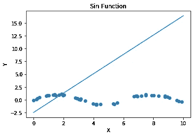
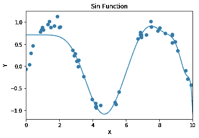
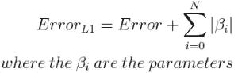
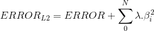
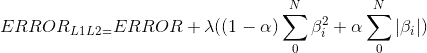
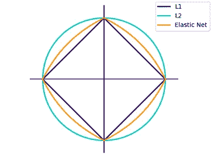

# 正则化概念

> 原文：<https://towardsdatascience.com/concept-of-regularization-28f593cf9f8c?source=collection_archive---------20----------------------->

## 这就是为什么正则化是机器学习中重要的一步！


让我们考虑我们正在开发一个机器学习模型。该模型通常使用“训练数据集”进行训练，并使用“测试数据集”进行测试。如果数据集未经预处理，模型的准确性通常会下降。事实上，在训练模型之前，大部分时间都花在预处理数据上。

模型精确度低的可能原因是什么？

有两种主要的可能性:

1.  欠拟合
2.  过度拟合

# 欠拟合

欠拟合是一种模型没有学习到数据集的广义模式的现象。这可能是由于数据集不充分，或者对该特定数据集使用了不适当的机器学习算法。



Underfitting

让我们考虑一个例子。该图包含表示正弦曲线的数据点。这些数据点被输入线性回归算法。这条线是模型的预测输出。很明显，模型的精确度并不是很高！为什么这样因为线性模型是在非线性数据集上训练的。因此，用一条线性线来拟合非线性数据*会过度简化*模型。

# 过度拟合

过度拟合是一种模型从数据集学习过多的现象。过度拟合模型在对其进行训练的数据中表现得非常好，但是在对一组新数据执行时，其准确性往往会降低。

让我们考虑同样的例子。在这种情况下，让我们使用多项式回归模型。通过使用多项式特征变换，可以找到数组中每个元素的幂，直到指定的幂。存储在多维数组中的这些值可用于输入多项式回归模型。随着多项式特征转换器中指定幂的增加，模型似乎学习到了比所需更多的内容，并且似乎是对训练数据集非常“特定”的输出。

> 过拟合模型被称为具有高方差



overfitting

***当基函数的系数较大且相互抵消时，会出现过拟合现象！***

# 正规化防止过度拟合！

正则化技术用于通过在给定的训练集上适当地拟合函数来减少误差，以避免过度拟合。这些函数实质上减少了每个特征的系数(β),从而减少了值被抵消的机会。回归方程的一个例子如下:


Linear Regression

# 正规化的类型

1.  **L1**
2.  **L2**
3.  **弹力网**

## **L1(套索正规化):**

L1 正则化背后的思想是将数据集减少到仅影响“目标变量”的最重要的特征。L1 正则化增加了等于系数绝对值之和的惩罚。



通过添加上述惩罚，**一些特征的系数变为 0** ，剩余的特征将是最有用的特征。这种正则化方法可以看作是一种特征选择方法。

## L2(岭正则化):

L2 正则化附加了一个等于系数平方值之和的惩罚。



等式中的λ是控制惩罚强度的超参数。

当λ→0 时，结果类似于线性回归

当λ→∞，所有特征都减少到 0。

当施加惩罚时，系数不会剧烈变化到 0，而是缓慢降低到 0。因此，与 L1 不同，L2 不能用于特征选择。

在这两种情况下，

***惩罚越大，系数越小。***

## 弹性网:

弹性网正则化是 L1 正则化和 L2 正则化的结合。

适用的罚款(P)如下:



在这种情况下，λ是一个共享参数，用于设置 L1 和 L2 之间的比率。因此，结果将是 L1 和 L2 正则化的混合。正则化的几何表示如下所示:



# 正规化的实施

## 导入所需的库:

```
import pandas as pd
import numpy as np
import matplotlib.pyplot as plt
%matplotlib inline
import warnings
warnings.filterwarnings('ignore')
from sklearn.preprocessing import PolynomialFeatures
from sklearn.linear_model import Lasso,Ridge
from sklearn.pipeline import make_pipeline
```

## 加载数据集(本例中，使用了 [Ames Housing 数据集](https://www.kaggle.com/c/house-prices-advanced-regression-techniques/overview):

```
data = pd.read_csv('house_prices.csv')
data.head()
```

## 将数据分为“列车数据”和“测试数据”:

```
from sklearn.model_selection import train_test_splitX = data.iloc[:,:-1]
y = data.SalePriceX_train,X_test,y_train,y_test = train_test_split(X,y,random_state = 9,train_size = 0.5)
```

## 1.要执行线性回归:

```
from sklearn.linear_model import LinearRegression,Lasso,Ridge
from sklearn.metrics import mean_squared_errorregressor = LinearRegression() #Linear model
regressor.fit(X_train,y_train)
y_pred = regressor.predict(X_test)
mean_squared_error(y_test,y_pred)
```

## 2.要执行套索回归:

```
lasso_model = Lasso(alpha = 140,max_iter = 100000, random_state=9)
lasso_model.fit(X_train,y_train) #Lasso model
y_pred = lasso_model.predict(X_test)
mean_squared_error(y_test,y_pred)
```

## 3.要执行岭回归，请执行以下操作:

```
ridge_model = Ridge(alpha = 0.00002,max_iter = 100000,random_state = 9)
ridge_model.fit(X_train,y_train) #Ridge model
y_pred = ridge_model.predict(X_test)
mean_squared_error(y_test,y_pred)
```

在每种情况下，都要从模型验证的测试数据中找到预测的“目标变量”和实际的“目标变量”之间的*均方误差*。

谢谢你阅读这篇文章。

请通过 [LinkedIn](http://www.linkedin.com/in/abhishekchandar) 与我联系，或者您可以[将](http://abhishekchandar23@gmail.com)发到我 LinkedIn 个人资料上的邮箱。