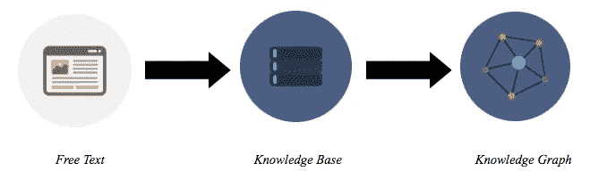
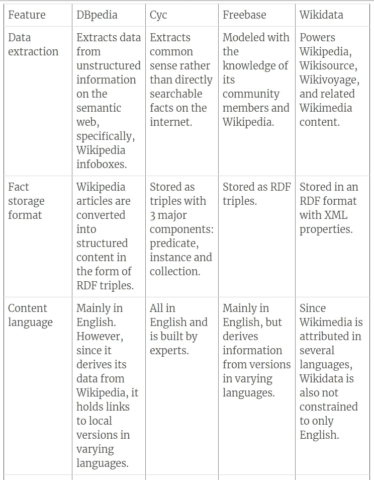
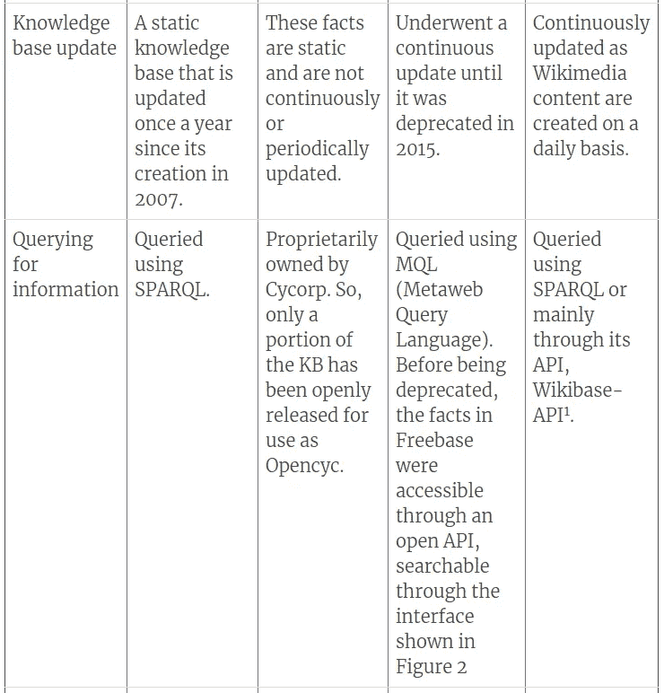
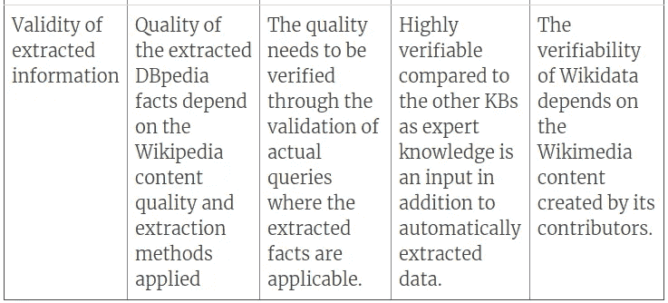
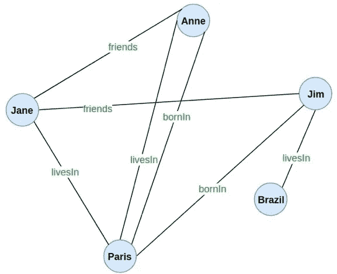
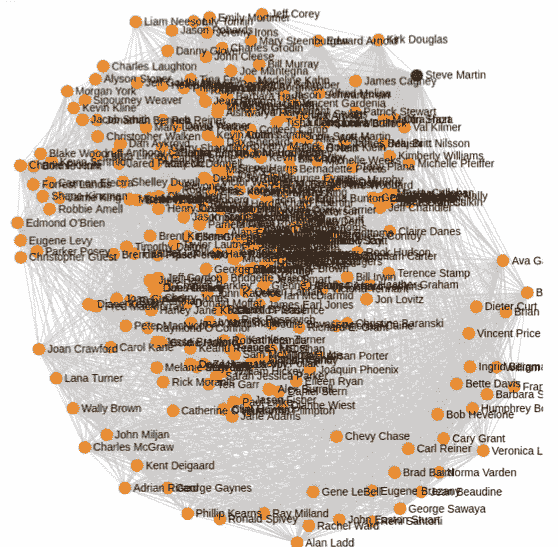

# 概念化知识图构建管道

> 原文：<https://towardsdatascience.com/conceptualizing-the-knowledge-graph-construction-pipeline-33edb25ab831?source=collection_archive---------10----------------------->

互联网的出现使得大量内容创建者能够获取信息。由于这个原因，现在网上有大量的数据。为了提供有用的见解，我们需要一种有效的方式来表示所有这些数据。一种有效的知识表示方法是通过知识图。简而言之，知识图是一个庞大的互联数据网络。知识图是从知识库构建的。知识库从网页上的自由文本、数据库以及音频和视频内容中收集信息。知识图构建过程的基本流程如图 1 所示。

Figure 1\. The knowledge graph construction pipeline

现在，让我们详细了解一下该管道中发生的流程。

在管道的第一阶段，我们从自由文本中识别事实。最初，我们搜索互联网，通过从自由文本中识别实体和实体涉及的关系来过滤有用的信息。这个识别过程使用自然语言处理技术进行，例如命名实体解析、词汇化和词干化。因此，在第一步中从自由文本中提取的数据可能类似于以下语句的形式。

"*卢浮宫位于巴黎*"

进行到管道的第二阶段，语句在知识库中以三元组的形式被概括；这些三元组将使用本体提取过程在不同的本体下分类，该本体提取过程也可以利用自然语言处理技术的能力。三元组由主语、谓语和宾语组成。主语和宾语是由谓语定义的关系中涉及的实体。因此，对于从自由文本中确定的前一个陈述，我们将其分解为以下知识库三元组形式。

*   主题:*卢浮宫*
*   谓语:*位于*
*   对象:*巴黎*

所以在一个知识库内，我们将以 *islocated(卢浮宫，巴黎)*的形式拥有上述关系。这是知识库中的一个三元组。实际上，知识库包括数百万个这样的三元组，我们也称之为**事实**。这些事实在知识库中被归入本体。本体是特定事实领域的识别类别。因此，本体解释了在那个类别中存在什么样的实体。例如，如果本体是'*机场*，那么，属于这个类别的一些实体可能包括'*爱迪生机场*'、*戴高乐机场*'、*曼德利乌机场*'等等。

知识库可以是特定领域的，也可以是通用的。医学知识库和学术研究论文知识库是一些特定领域的知识库。然而，通用知识库并不将它们的知识局限于特定的领域。他们对一般的世界事实和多个领域有更广泛的覆盖。

在我们前进到管道的最后一个阶段，即知识图之前，请参考下表，了解从原始论文中理解的各种知识库的一些特征。该表列出了过去几十年中最重要的知识库。

*表 1。知识库及其特征*

https://en.wikipedia.org/w/api.php ^1 维基百科 API :

Figure 2\. The Freebase Topic Page, where a user adds a sibling property (Source: Bollacker et al. [3])

关于知识库，让我们进一步阐明 NELL 知识库，因为我们将考虑 NELL 处理其事实的方式，作为我们稍后将讨论的管道的知识图构建阶段的样本。

# 内尔

永无止境的语言学习者(NELL)是卡内基梅隆大学在 2010 年发起的一个项目[5]。它被建模来弥补学习系统和实际人类学习之间的差异。因此，它是基于对事实的不断学习塑造专业知识的概念。自 2010 年以来，内尔一直在不断了解事实。该知识库主要执行两项任务。

1.  信息提取:搜索语义网以发现新的事实，积累这些事实并不断扩展其知识库。
2.  增强学习过程:根据以前提取信息的经验，NELL 试图通过返回到前一天学习事实的页面，并搜索更新的事实来提高其学习能力。

内尔的事实是基于本体论的分类:实体或关系。基于实体的本体分类包括可能出现在该域中的实例的子域，而基于关系的本体分类包括基于连接实体实例的关系的事实的子域。NELL 中的事实是三元组(主语-宾语-谓语)的形式。举个例子，

事实示例:"*自由女神像位于纽约州*"

作为三元组，上述事实可以表示为 *locatedIn (statueOfLiberty，newYork)* 其中，

*   主题:*状态自由*
*   谓词:*位于*中
*   对象:*纽约*

使用文本上下文模式、正字法分类器、URL 指定的 ML 模式、学习嵌入、图像分类器和本体扩展器来提取 NELL 的事实。目前 NELL 受到限制，因为它不能修改其定义的学习过程。如果学习的过程可以基于先前的学习经验被动态地增强，NELL 可以改进其事实的质量和累积其事实的性能。

现在，让我们进入流水线的最后阶段，看看知识库中的三元组是如何转换成知识图的。

# 知识图表

知识图是一个由相互连接的实体组成的大型网络。基于来自知识库的三元组创建连接。知识图的主要目的是识别实体之间缺失的链接。为了进一步阐明这一点，让我们考虑一下从知识库中收集的以下示例关系。

*   *好友(安妮、简)*
*   *朋友(简，吉姆)*
*   *LivesIn(安妮，帕里斯)*
*   *LivesIn(巴西吉姆)*
*   *LivesIn(巴西简)*
*   *博宁(安妮，巴黎)*
*   *博宁(吉姆，巴黎)*

如果我们试图建立一个只基于上述关系的基础知识图表，我们将能够看到下面的图表。

Figure 3\. A knowledge graph constructed only using the observed facts

另一方面，有一些未知的关系没有明确地从知识库中检索出来，例如，

*   安妮和吉姆是朋友吗？
*   简的出生地是哪里？

这意味着这种关系可以被认为是缺失的环节。

Figure 4\. The missing links in the knowledge graph

这些缺失的环节是使用统计关系学习(SRL)框架推断出来的。这些 SRL 框架计算推断/预测链接的相关置信度。以前的工作试图以不同的方式发现新的/缺失的信息，并计算推断这些信息的置信度。这些将在以下段落中简要讨论。

在管道的第一阶段，我们从自由文本中提取事实，我们也经常以错误的事实结束。为了从这些事实中识别出稳定的知识图，Cohen 等人提出了一种对提取的事实进行联合评估的方法论[6]。这种方法的问题是，它只考虑了提取的事实中可能出现的一组微不足道的错误。

作为流水线的第二阶段，我们从提取的事实中找到三元组，这些三元组将构成知识库。继续进行，在最后阶段，我们需要通过从知识库三元组中推断缺失的链接来发现新的事实。为此，继 Cohen 之后，Jiang 等人借助 Markov 逻辑网络来发现提取的事实之间的关系[7]。他们以一阶逻辑规则的形式定义了本体约束。这些约束将管理可以推断的可能关系。然而，在马尔可夫逻辑网络中，我们称之为“谓词”的逻辑关系的变量只能是布尔值。这对于推断事实的可信度是不利的。

这导致了概率软逻辑()的定义，它使用江等人和马尔可夫逻辑网络的概念，并定义了一个复杂的统计关系框架，该框架联合推理所有事实，以基于先前的事实发现新的/缺失的信息[8]。除此之外，PSL 从概率上计算了一个置信度值，这是一个在[0，1]范围内的软真值，以表明 PSL 项目根据所提供的信息认为事实有多真实。

一旦发现了新的/缺失的信息，并且计算了它们的置信度，我们就可以用高度可信的事实来构建知识图。这将为我们提供一个图表，其中除了提取的原始事实之外，还提供了无法明确驱动的新信息。这就是我们如何用知识库中的事实和基于现有观察新发现的事实构建知识图表。

最后，当我们在更高的层面上总结知识图管道的这些级联步骤时，以下是在构建知识图时发生的过程[9]。

**阶段 1** :从自由文本中提取事实

*   从自由文本、非结构化数据源和半结构化数据源中提取数据。
*   处理这些原始数据是为了提取信息。这涉及到实体、关系和属性的提取，它们是进一步定义实体和关系的属性。
*   如果数据已经结构化，与步骤 1 不同，该数据将直接与来自第三方知识库的信息融合。
*   在此之后，各种自然语言处理技术将应用于融合的知识和处理的数据之上。这包括共同引用解析、命名实体解析、实体消歧等等。

**阶段 2** :从提取的事实中公式化三元组

*   以上步骤结束了知识库信息的预处理。然后，执行本体提取过程，以对提取的实体和它们各自的本体下的关系进行分类。
*   进行本体形式化后，事实将被提炼并作为三元组存储在知识库中。

**阶段 3** :用新的链接和置信度构建知识图

*   为了从知识库构建知识图，将对这些三元组应用统计关系学习(SRL)。
*   SRL 过程为每个事实而不是整个领域计算置信度，以确定这些事实在多大程度上是正确的。
*   在构建知识图时，将使用置信度来识别缺失的链接，并将形成新推断的关系链接。

由于推理中的置信度被合并到知识图中，一旦知识图被构建，关于事实在多大程度上被认为是真实的决定也可以基于置信度。因此，Cayley [10]生成的电影演员领域的样本知识图如下所示。

Figure 4\. A sample knowledge graph of a movie actors domain

随后，这种知识图可以用于信息检索系统、聊天机器人、网络应用、知识管理系统等。，以有效地提供对用户查询的响应。

# 结论

到目前为止，我们已经提供了整个知识图管道如何工作的抽象解释。使用这些阶段中指定的技术将保证发现丢失的链接。然而，在知识图谱社区中仍然存在一个公开的未知数，即根据人类的观点识别错误的事实或三元组。目前，我们有基于领域和事实集计算现有和发现的关系的置信度的方法。然而，这并没有提供一种可靠的方法来判断事实是否会被实际的人类评估者评估为有效的事实。因此，在我们的下一篇文章中，我们将进一步详细阐述我们如何使用概率软逻辑等统计关系框架来推断缺失的环节，以及如何将足够的监督水平关联到模型中，以将事实与知识图中的众包真相相匹配。

# 参考

[1] Auer，s .，Bizer，c .，Kobilarov，g .，Lehmann，j .，Cyganiak，r .，& Ives，Z. (2007 年)。Dbpedia:开放数据网络的核心。在语义网中(第 722-735 页)。斯普林格，柏林，海德堡。

[2] Lenat，D. B .，& Guha，R. V. (1991 年)。Cyc 表示语言 CycL 的演变。美国计算机学会 SIGART 通报，2(3)，84-87。

[3]博拉克，k .，埃文斯，c .，帕里托什，p .，斯特奇，t .，泰勒，J. (2008 年 6 月)。Freebase:一个用于构建人类知识的合作创建的图形数据库。2008 年 ACM SIGMOD 数据管理国际会议论文集(第 1247-1250 页)。AcM。

[4]vrandei，d .，& krtzsch，M. (2014 年)。维基数据:一个免费的协作知识库。美国计算机学会的通讯，57(10)，78-85。

[5] Betteridge，j .，Carlson，a .，Hong，S. A .，Hruschka Jr .，E. R .，Law，E. L .，Mitchell，T. M .，& Wang，S. H. (2009 年)。迈向永无止境的语言学习。AAAI 春季研讨会:从阅读中学习和学会阅读(第 1-2 页)。

[6]科恩，W. W .，考茨，h .，&麦卡勒斯特，D. (2000 年 8 月)。强化软信息源。《第六届 ACM SIGKDD 知识发现和数据挖掘国际会议论文集》(第 255–259 页)。ACM。

[7]江，s，劳得，d .，，窦，D. (2012 年 12 月).使用马尔可夫逻辑学习提炼自动提取的知识库。在数据挖掘(ICDM)，2012 年 IEEE 第 12 届国际会议上(第 912-917 页)。IEEE。

[8]布罗克勒、米哈尔科娃和格图尔(2012 年)。概率相似逻辑。arXiv 预印本 arXiv:1203.3469。

[9] 刘峤, 李杨, 段宏, 刘瑶, & 秦志光. (2016). 知识图谱构建技术综述. 计算机研究与发展, 53(3), 582–600.

[10]开源图形数据库:[https://cayley.io/](https://cayley.io/)

图片来源:【https://www.iconfinder.com/ 