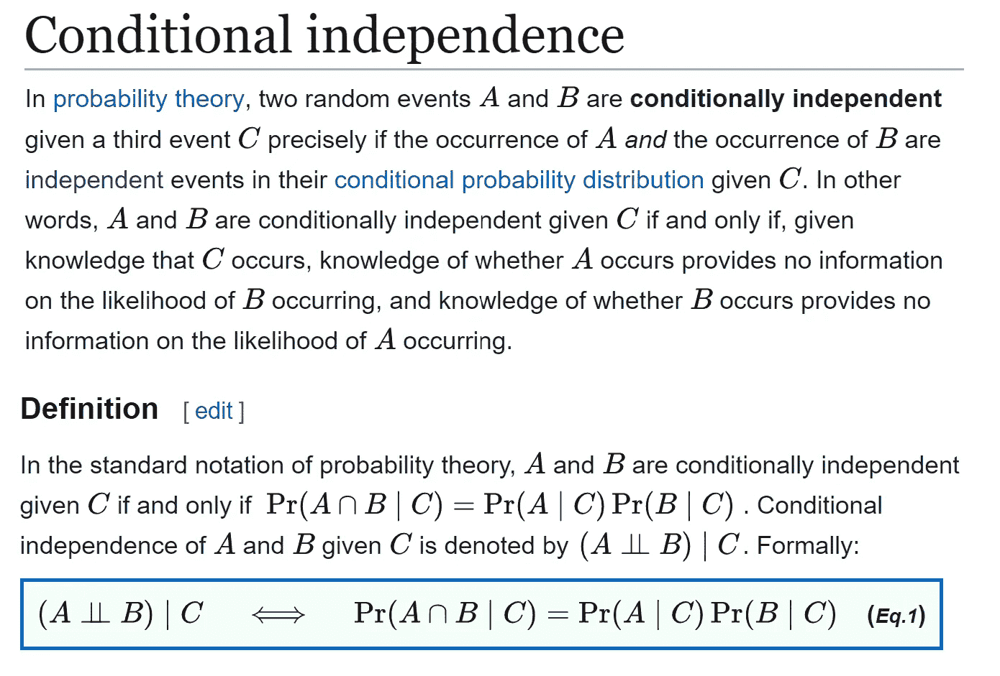
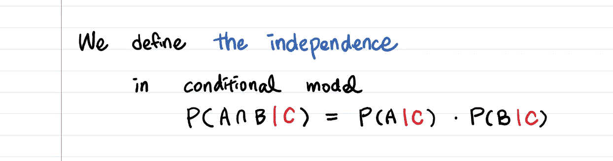
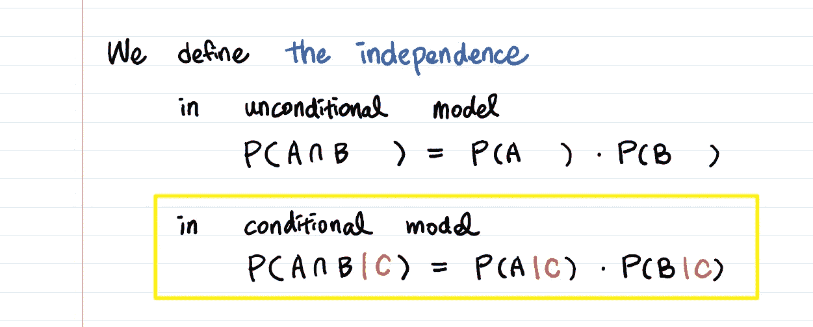
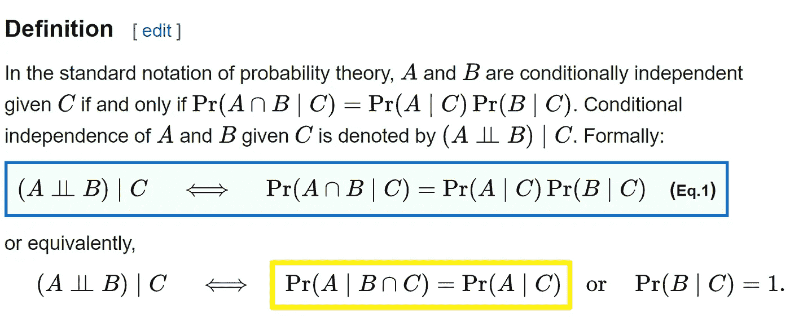
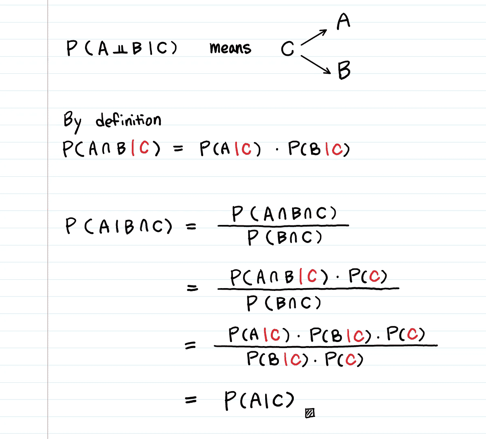
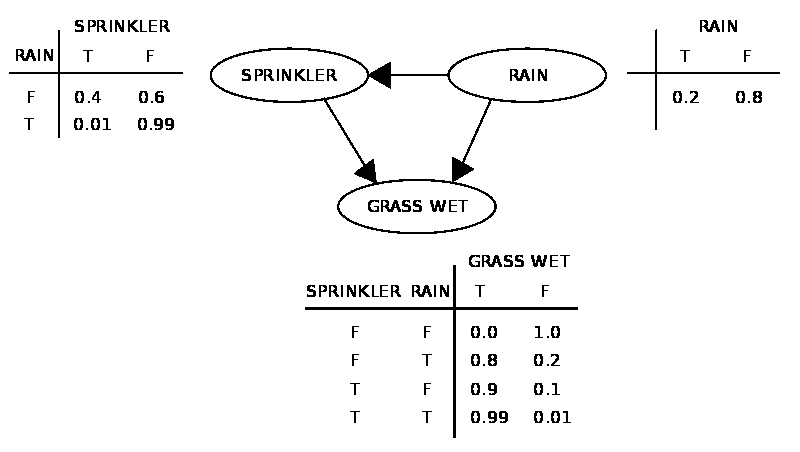
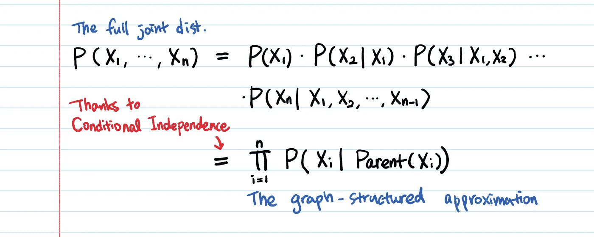

# 条件独立性——贝叶斯网络的支柱

> 原文：<https://towardsdatascience.com/conditional-independence-the-backbone-of-bayesian-networks-85710f1b35b?source=collection_archive---------3----------------------->

## 条件独立性直觉、推导和例子

有时候维基百科里的解释并不是最容易理解的。



From [https://en.wikipedia.org/wiki/Conditional_independence](https://en.wikipedia.org/wiki/Conditional_independence)

# 1.条件独立性的直觉

假设 **A** 是**孩子的身高**而 **B** 是**孩子认识的单词数**。似乎当 **A** 为高时， **B** 也为高。

有**一条信息会让 A 和 B 完全独立。**那会是什么？

> 孩子的年龄。

孩子知道的身高和单词数**不是独立的**，但如果你提供孩子的年龄，它们是**有条件独立的**。

# 2.数学形式



```
**A**: The height of a child
**B**: The # of words that the child knows
**C**: The child's age
```

记住这句话的更好方法是:



条件独立性基本上就是独立性的概念 **P(A ∩ B) = P(A) * P(B)** 应用于条件模型。

> 但是我见过**的定义不仅有 P(A ∩ B|C)还有 P(A|B ∩ C)！**



> **为什么当(Aㅛ B)|C 时，P(A|B ∩ C) = P(A|C)？**

证据来了。



条件独立的要旨:**知道 C 使 A 和 B 独立。**

```
P(A,B|**C**) = P(A|**C**) * P(B|**C**)
```

# 3.应用程序🔥

为什么有条件的独立很重要？

因为它是我们使用的许多统计模型的基础。(例如，潜在类别模型、因素分析、图形模型等。)

## A.[贝叶斯网络](https://en.wikipedia.org/wiki/Bayesian_network)(又名图形模型)中的条件独立性

贝叶斯网络使用图表示**联合分布。具体来说，它是一个 [**有向无环图**](https://en.wikipedia.org/wiki/Directed_acyclic_graph) ，其中**每条边**是一个**条件依赖**，而**每一个节点**是一个独特的**随机变量**。它还有很多其他的名字:*信念网络、决策网络、因果网络、贝叶斯(ian)模型或概率有向无环图模型等。***

看起来是这样的:



From [Wikipedia](https://en.wikipedia.org/wiki/Bayesian_network): A simple Bayesian Network with [conditional probability tables](https://en.wikipedia.org/wiki/Conditional_probability_table)

为了让贝叶斯网络**为概率分布建模，它依赖于一个重要的假设:给定其父变量，每个变量都有条件地独立于其非后代变量。**

例如，我们可以将 **P(草湿|洒水器，雨)**简化为 **P(草湿|洒水器)**，因为**草湿**有条件地独立于其非后代**雨**，给定**洒水器**。

利用这个性质，我们可以将整个联合分布简化为下面的公式:



## 这个近似(**条件独立假设)**有什么了不起的？

> 变量之间的条件独立可以大大减少参数的数量。

这减少了大量的计算，因为我们现在只考虑它的父节点，而忽略其他所有的东西。

我们来看看数字。

假设您有 **n** 个二进制变量(= **n** 个节点)。

**无约束联合分布**需要 **O(2^n)** **概率**。

对于一个**贝叶斯网络**、**任意节点最多有 k 个父节点，我们只需要 O(n * 2^k)个概率。**(对于一定数量的类别，这可以在线性时间内进行。)

```
**n = 30 binary variables, k = 4 maximum parents for nodes**• **Unconstrained Joint Distribution**: needs 2^30 (about **1 million**) probabilities -> Intractable!• **Bayesian Network**: needs only **480** probabilities 
```

> 我们可以使用条件独立性**得到**联合分布的有效分解表示。****

## B.贝叶斯推理中的条件独立性

比方说，我想估计一下我的博客的参与度。设 **p** 为读者会为我的文章拍手的比例。我们将从人群中随机选择 n 名读者。对于 **i = 1，…，n，**让 **Xi = 1** 如果读者鼓掌，或者 **Xi = 0** 如果她/他不鼓掌。

在一种[频率主义者](https://en.wikipedia.org/wiki/Frequency_probability)的方法中，我们不把概率分布分配给 **p** 。
**p** 简单来说就是**‘sum(Xi)/n’**。
我们将把 **X1，…，Xn** 视为独立的随机变量。

另一方面，**在贝叶斯推断中，我们假设 p 遵循一个分布，而不仅仅是一个常数。**在这个模型中，随机变量 **X1，…，Xn** 是**不独立**，但给定 p 的分布，它们是**条件独立的。**

## C.相关性≠因果关系

“相关性不是因果关系”意味着仅仅因为两件事相关并不一定意味着一个导致另一个。

这里有一个令人捧腹的出租车事故的例子:

一项研究表明，事故数量与出租车司机穿外套之间有着显著的正相关关系。他们发现外套可能会妨碍司机的行动，造成事故。一项新的法律准备禁止出租车司机开车时穿外套。

直到另一项研究指出，下雨时人们会穿外套…😂

```
P(accidents, coats | rain) = P(accidents | rain) * P(coats | rain)
```

两件事之间的关联可能是由影响它们的第三个因素造成的。这第三个因素叫做[](http://en.wikipedia.org/wiki/Confounding)**。混杂因素是雨，它是事故和穿外套之间联系的原因。**

```
P(accidents | coats, rain) = P(accidents | coats)
```

**请注意，这并不意味着事故与降雨无关。它的意思是:给定穿着外套的司机，知道下雨并不能给出更多关于事故的信息。**

# **4.条件独立与边际独立**

**边际独立和普通独立是一样的，**

**有时，两个随机变量可能不是边际独立的。然而，在我们观察到一些第三变量之后，它们可以变得独立。**

# **5.更多例子！**

*   **超速罚款金额 **ㅛ** 车型 **|** **速度****
*   **肺癌 **ㅛ** 黄牙 **|** 吸烟**
*   ****孩子的基因 **ㅛ** 祖父母的基因 **|** **父母的基因******
*   ****汽车的启动马达工作吗？ㅛ:车上的收音机能用吗？ **|** **电池******
*   ****未来 **ㅛ** 过去 **|** 现在(这是**马氏假设**！)****

****他们都是和 **A ㅛ B | C** 一样的形式。
**A** 和 **B** 如果不考虑 **C** 的话，看起来是相关的。然而，一旦我们将 **C** 包含在图片中，那么 **A** 和 **B** 之间的明显关系就消失了。如你所见，任何因果关系都是潜在的条件独立的。我们永远不会确切知道 **A** & **B** 之间的关系，直到我们测试每一个可能的 **C** (混杂变量)！****