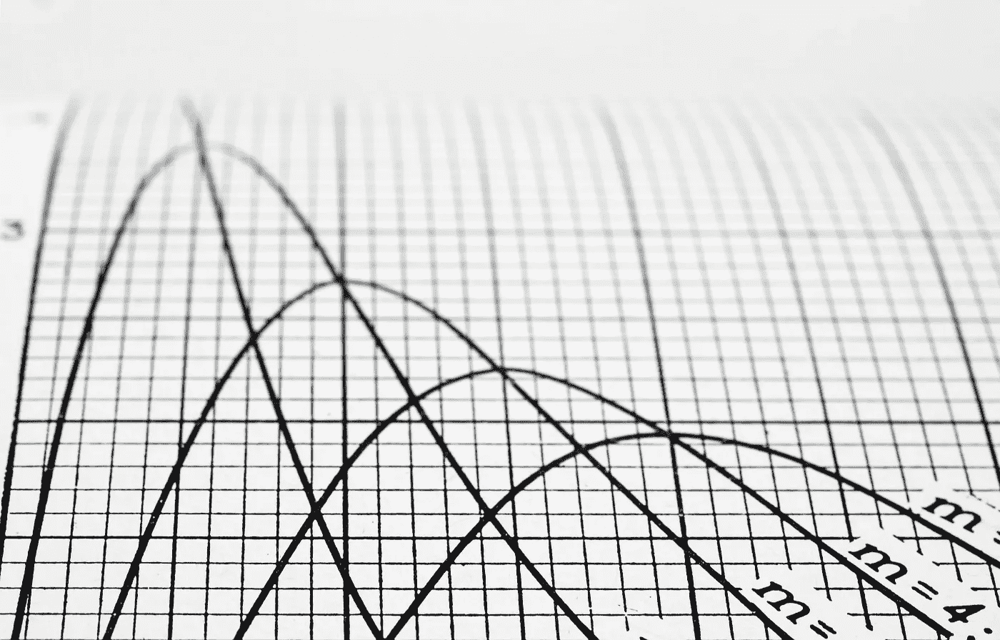
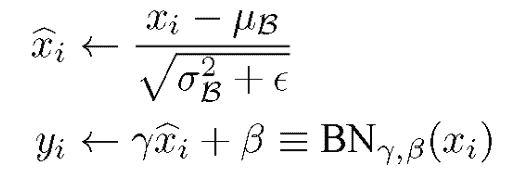
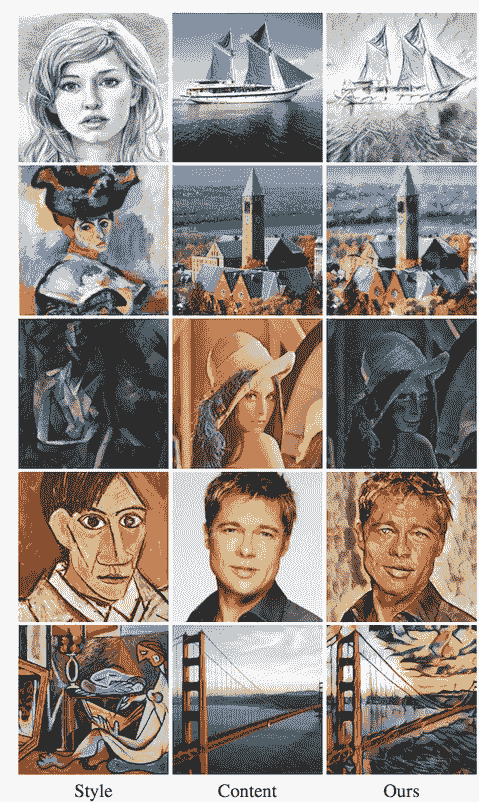
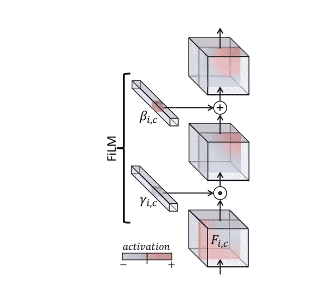
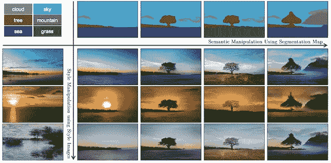
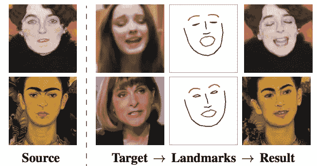
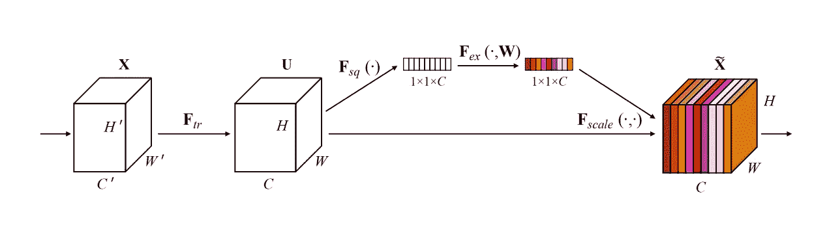
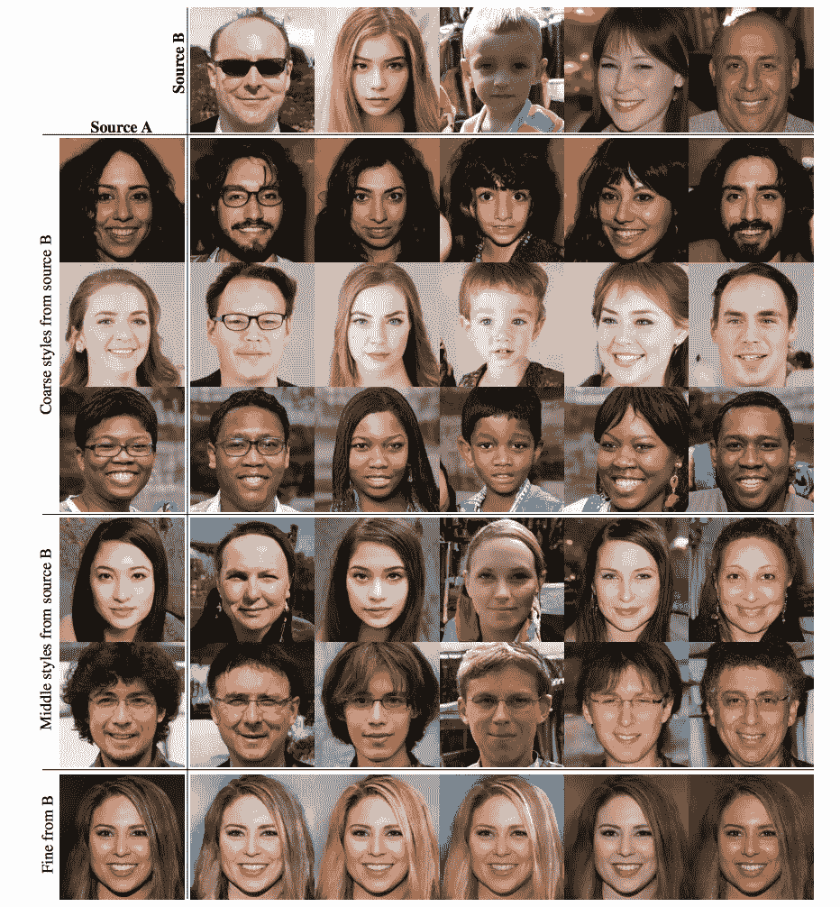
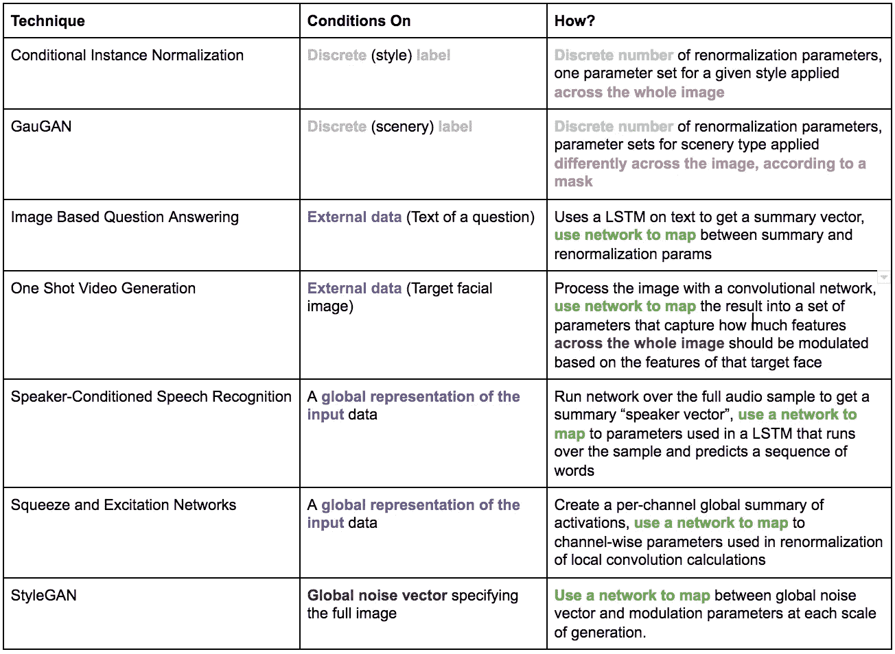

# 有条件的爱:调节神经网络的重正化技术的兴起

> 原文：<https://towardsdatascience.com/conditional-love-the-rise-of-renormalization-techniques-for-neural-network-conditioning-14350cb10a34?source=collection_archive---------6----------------------->

批处理规范化，以及围绕它成长起来的相关规范化策略的动物园，在最近的深度学习研究中扮演了一系列有趣的角色:作为一个神童优化技巧，作为关于 [理论严密性](https://arxiv.org/abs/1805.11604)的[讨论的焦点，以及更重要的，但更多的是作为一种旁观者，作为一种灵活和广泛成功的途径，将条件信息注入模型。](https://www.youtube.com/watch?v=x7psGHgatGM)

条件重正化开始时足够谦虚，作为训练更灵活的风格转移模型的聪明技巧，但多年来，这个最初简单的技巧在复杂性和概念范围方面都有所增长。我不断看到这种策略的新变体出现，不仅仅是在文学的边缘，而是在其最核心和最新颖的进步中:从 2017 年 ImageNet 竞赛的获胜者到 2018 年最令人印象深刻的生成图像模型。我看得越多，就越想讲述这个简单想法的故事，我看着它从一个一次性的技巧发展成为一个广泛适用的以低复杂度的方式集成新信息的方法。

虽然我会一路做一些(相对简单的)数学力学的解释，但我的主要目标是探索条件规范化的不同用途，指出这一思想的发展或扩展点，并大体讲述一个连贯的故事，说明它及其智力后代如何在现代深度学习中发挥越来越重要的作用

# 什么是调理？

从最基本的统计学意义上来说，条件反射包括将某个变量或一组变量固定为固定值，并观察由于将你考虑的世界限制在符合这些条件的范围内而产生的移位分布。如果你考虑温度和月份的联合分布，你对“现在是什么温度”的信念分布，从全年来看，将与以月份=一月为条件的温度分布有意义的不同。联合分布中的其他特征因调节其他变量而改变的程度取决于两组特征在统计上的相关程度。继续我们之前的例子，我们不会特别期望我们在所有温度上的分布与当一周中的一天是星期天时的温度分布不同，因为天气不会以一定会使星期天比其他任何一天更热或更冷的方式变化。**如果给定一个特性*的条件分布与无条件分布的*不同，那么知道该特性的值就给了你关于其余(假定未知)特性值的信息。**

你可以通过一个预测框架来考虑这个问题:如果你只是通过从一年的分布中取样来选择一个温度，你的误差在预期中会相当高。如果你知道你在预测一月份的某一天，你可能会大大减少你的误差。事实上，这种简单的概念工具正是用来表示神经网络中的预测问题的:学习 y 的分布(或点估计)预测，以已知变量 X 的值为条件。在预测任务中，希望 X 变量携带大量关于 y 值的信息，以便根据它们建立模型可以减少相对于随机无条件猜测的错误。

因此，由于所有监督模型都以已知输入特征为输出分布的条件，所以所有模型在某种意义上都是有条件的，但我们倾向于将该术语保留给模型的特定子集，在这些模型中，我们使用条件作为控制杠杆，使我们的模型执行所需的行为。这里有一些我们称之为条件反射的重复使用案例，我将在后面详细讨论:

*   根据所提的具体问题，回答关于图像的问题
*   从基于特定视觉类别(猫、狗、房子等)的生成图像模型中提取样本
*   生成模拟某些特定输入图像的视觉风格的图像

所有这些任务的一个共同特征是，在这些情况下，我们希望对模型在部署时执行的计算进行更高程度的控制。我们希望能够提出(半)任意的问题，并得到我们碰巧回答的任何问题的答案，而不是在测试时硬编码的一些图像摘要。我们不只是从所有图像的空间中取样，我们想要告诉模型我们想要取样一只猫，或者我们想要取样一幅莫奈风格的画。

实际上，这种控制是通过设计一种途径来实现的，将某种信息的压缩形式(比如说，一个问题)添加到我们的网络中，并将其与模型的“主要”输入(比如说，一幅图像)合并。然后，我们可以训练模型学习答案的输出分布，条件是图像和问题的固定值，这有望比我们看不到图像或不知道问题是什么更精确。如果我想出于某种实际目的使用图像生成模型(GANs 必须对*某种*实用的东西有好处)，那么如果我能给模型一个请求并让它给我一个合理的响应，这个模型会更有用。换句话说，即使图像生成器可以完美地捕捉图像的全局分布，通常我们实际上并不*想要*从全局分布中采样，我们想要采样一些特定的东西。

我还倾向于将条件反射视为多任务学习的简化形式:我们希望能够执行在某些情况下可能被认为是不同的任务(回答问题 A，回答问题 B)，但为此我们使用带有一些条件参数的联合模型，而不是完全独立的模型，因为我们认为任务足够相似，可以从共享参数和提取的特征中受益。

我认为条件作用的世界必须提供一些有趣的概念见解，但在举例之前解释它们有点困难，所以我想带你参观一些不同的条件作用方法，并在此过程中强调差异、技术的发展和问题表述的微妙之处。

# 模型调节动物园之旅

## 条件甘斯

就问题表述和机制而言，条件化的最简单形式之一是条件生成对抗网络(GAN)。

在无条件 GAN 中，从某个分布(通常是多元高斯)中采样向量 Z，并训练网络将该向量映射到与真实训练集中的图像无法区分的像素图像中。GAN 的目标是学习将每个可能的样本向量映射到似乎合理的图像输出的参数。在无条件 GAN 中，您可能会学习生成猫和狗的图像，但是为了知道哪个向量对应于其中的一个，您需要选取样本并通过 GAN 向前运行这些样本，这将是一项计算成本很高的任务。

在训练期间，条件 GAN 指定作为其输入的一部分，它试图从哪个类生成，并从本质上激励您的模型学习许多每个类的分布，而不是一个单一的分布一次捕获所有图像类别。您不只是输入采样的 z 向量，而是将 z 与对应于数据分布中特定类别的一键表示连接起来。然后，每当你输入与猫相对应的热门标签时，你就训练网络生成看起来像是从猫的真实分布中提取的图像；当你给狗贴上标签，你就可以根据狗的分布来训练它，等等。

这种连接过程在概念上非常简单:这意味着网络的第一层有更多的参数，传递到更高层的向量表示应该以某种方式捕捉标签的事实，但由于向量对于附加信息来说并不更大，所以它不需要额外的参数。

这种方法的缺点是，当 Z 输入网络时，条件信息只输入一次。这样做的结果是，每一层都需要学习传递后续层需要的信息。举个简单的例子，假设你是 GAN 的第二层。您在类别“cat”下看到一个输入，并意识到您应该将可用的特征(如“脚”、“腿”、“头”等)对齐，以对应于猫的身体。但是你也需要确保传递图像是猫的事实，因为这有助于下一层知道脚应该是猫的脚，头应该是猫的头，等等。这不是模型固有的偏好要做的事情，因此它需要模型能力来学习一种机制，以确保类信息被向前传递。这一弱点引发了这样一个问题:是否有可能在网络中的稍后点重新引入条件信息，而不添加太多额外的参数。

## 样式转移的实例规范化(2017)

许多有趣的调节工作来自于风格转换的世界，在那里我们希望根据另一个图像的风格统计来调节一个图像的生成。实现这一点的原始方法是直接优化单个图像的像素，使它们与参考图像的激活统计相匹配。但这是非常低效的，因为我们需要对每张图片进行优化，所以我们开始训练网络，它可以接受参考图片，并将其转换为特定风格的风格转换版本，只需向前传递网络。但即使这样，我们也需要为每一种风格训练一个独立的网络。[本文](https://arxiv.org/abs/1703.06868)，关于风格转换的自适应实例规范化，是对该问题的回应，并建立了一个条件网络，可以训练该网络根据传入的任何风格标签将图像转换为多种不同的风格。

他们通过一种称为自适应实例规范化的技术实现了这一点，因为它建立在现有的批量规范化机制的基础上，并做了一点小小的调整，让它可以针对不同的样式调整不同的激活。批处理规范化有两个部分:

*   *归一化*(我们分别根据批均值和方差进行移位和缩放)，以及
*   *重正化*，其中网络根据学习到的参数重新调整和重新移动标准化的特征值。

典型地，网络将学习每个特征通道的一个伽马和贝塔(如下面的等式所示),并在每个空间位置对该通道使用相同的伽马、贝塔对。

条件归一化通过学习每个(channel，style_id)组合的参数对，而不是学习每个通道的单个参数对，来修改这种基本方法。所以，如果我们试图模仿《星夜》,我们用一组参数重新调整每个特征，如果我们试图模仿《蒙娜丽莎》,我们会用另一组参数。

A figure from the Adaptive Style Transfer paper showing the differences that can be achieved by using the renormalization parameters corresponding to each style

值得花一点时间对此进行更深入的研究，并对它能够如此有效地工作这一事实留下深刻印象。这些重正化参数一次仅影响一个特征的激活值；没有参数来控制特征之间的交互效果，作为我们正在模仿的风格的函数。它们在任何方面都不是空间或上下文智能的:这是一个纯粹的线性变换，我们将以同样的方式重新调整给定风格的给定功能的激活，而不管该位置的潜在激活的值。

然而，尽管有这些限制，实例规范化被证明是足够强大的，足以在这种情况下产生令人印象深刻的结果，这种简单思想核心的变体已经被应用于各种设置中；这篇文章的其余部分将集中在绘制它的路径。

但首先，快速说明一下术语和知识谱系:[MILA 2017 年的一篇论文](https://arxiv.org/pdf/1709.07871.pdf)提出了特征线性调制(FiLM)作为条件机制的总称，这些机制通过根据一些学习或计算的移动和比例因子，独立于其他特征移动和缩放每个特征来操作。

A figure from the FiLM paper, showing how channel-wise scale and shift modulation works in a convolutional network

我个人更喜欢这个术语，因为我认为它更清晰地抓住了核心观点，并且不太强调(我认为是正确的)与批处理规范化的联系。然而，后来的论文继续使用“条件规范化”框架，并建立在这个原始的适应性实例规范论文。因此，在这篇文章的其余部分，我可能会在“重正化”和“调制”之间交替使用，因为这两个词表示相同的意思:根据某组参数移动和缩放每个层中的每个特征。一个有趣的问题，也是这个方法变得有趣而普遍的一个问题是:**这些参数从何而来？**

## 高根:蒙版场景调节

上述技术的一个有趣的变体是 GauGAN 使用的，绘画生成器在这里找到了。该模型将场景类别的掩码作为输入，将图像的不同部分附加到不同的场景类型。然后，它会为每种场景类型学习一组不同的重正化参数，因此对于每种(场景类型、图层、要素)组合，都有一个唯一的平移和缩放值。

A diagram showing how GauGAN works: the user passes in 1) a map corresponding to where in the image they want different kinds of landscape features, and 2) a style image, and the network applies, for example, the conditional parameters corresponding to “tree” in places where that mask is present.

对于图像的每个部分，模型应用与该位置的遮罩中指定的场景类型相对应的重正化参数。因此，就好像我们在使用一个类条件模型，就像前面提到的那些，除了我们在图像的不同位置生成不同的类。这是一个简单的风格转换案例:学习几个离散类别中每个类别的一个参数集，并在整个图像中一次应用一个参数集，GauGAN 根据用户试图在图像的给定区域生成的内容应用其特定于风景的参数。

## 基于图像的问答

以上两种技术都以离散的分类信息为条件:一个固定的有限的风格集合中的一个风格，一个固定的类别集合中的一个风景类别。在这些情况下，可以只学习与每个类别相对应的唯一参数集，并提取出适用于您尝试进行条件处理的类别的参数集。

但是在某些情况下，您可能希望以一个连续的向量为条件，而不是一个热变量或分类变量，该向量可以在不同的表示形式之间平滑变化，比如一个图像、一个 Word2Vec 向量或一个单词序列:比简单的一个 K 分类值更复杂的东西。在这种情况下，我们不能简单地学习不同的每类参数，因为在连续空间中有无穷多个点；相反，我们需要一个映射函数，它可以接受我们想要调节的任何复杂数据对象，并以调节函数可以使用的方式向前传递信息。(其中“映射函数”通常指“以某种方式处理输入并输出向量的神经网络”)

基于这种直觉，在我这里提到的例子中，问题是接受一个图像和一个关于该图像内容的问题，并给出所提问题的答案。这里，图像被视为主要输入，问题被视为条件输入。作者使用了相同的条件重正化技巧的扩展，但不是为每种风格设置一组缩放和移位参数，**他们训练一个网络来输出给定句子的这些参数值。**更具体地说，给定某个问题，LSTM 学习映射，使得在处理图像的卷积网络中由该问题引起的尺度和偏移以使其输出 softmax 更可能输出该特定问题的答案的方式调节该网络。现在，在给定一些输入的情况下，我们在产生权重的网络中捕获信息，而不是在重新参数化权重本身中捕获关于条件的信息。

## 面部表情的一次性视频

除了处理复杂数据的能力之外，使用网络将一般输入映射到条件权重的另一个好处是，您可以对您在培训期间从未见过的*输入进行条件化，因为网络将(希望)学习到一个可概括的映射。[最近的一篇论文](https://arxiv.org/abs/1905.08233)利用这一点来训练一个网络，该网络可以生成做出想要的任意表情的人脸帧，即使它只看到人脸的一个例子。在这个问题中，*

这个模型需要结合两条信息来生成它的人工图像:
1)我们希望我们的对象制作的表情的面部**标志数据**

2)对象的至少一张**参考照片，在图像顶部绘制地标数据**

A diagram showing the data sources for one-shot expression transfer. The expression face is turned into landmarks, and a network is run on those landmarks, using conditional feature modulation parameters generated from the source image, to generate the result.

作者选择了一种生成结构，该结构将所需的地标作为输入，并逐渐进行逆卷积，以将它放大为做出表情的整张脸的图像。为了使这不仅仅是一张普通的脸，而是我们的*目标*的脸做出那种表情，他们在整个生成网络中执行条件重正化，由 CNN 生成的重正化参数将目标脸作为输入。当我们在测试时看到一个新面孔时，我们通过 CNN 传递它，并希望它产生的参数能够很好地调整特征值，以指导该面孔的产生。从条件反射的角度来看，我们可以将这视为一种元学习，网络正在学习如何根据它看到的输入生成自己计算的参数。

## 说话人条件语音识别

从一组重正化参数的初始核开始，条件归一化方法已经将标准批量范数的概念的边界首先扩展到多个参数集，然后扩展到动态生成的参数。除了产生参数的机制之外，调节方法最近也变得更奇怪和更有创造性；这方面的一个例子是**自我调节**的技术。在很高的层次上，自我调节是一种根据全局信息的汇总版本来调节局部计算的方法。

在第一个问题中，我们将研究自我调节的应用，目标是执行语音识别，接收音频波形并预测正在说出的单词序列。当[这篇论文](https://arxiv.org/abs/1707.06065)被写的时候，递归神经网络，或者 RNNs，是像这样的序列对序列问题的标准机制。(一岁左右；目前的技术水平似乎使用了变压器，尽管我个人没有去那个兔子洞检查过。当 rnn 在序列上前进时，它们迭代地累积状态，并使用该状态通知它们在序列中该点的计算。这允许网络结合过去的环境，但是实际上 rnn 倾向于关注最近的过去，并且难以跟踪旧的信息。

在这种大部分是本地计算的情况下，我们可以看到紧凑的全局信息是多么有用。举个例子，如果你只听到一小段文本，不知道说话者的口音，你可能很难理解他们使用的声音是如何映射到单词上的，而如果你缩小来听更多，你可以利用你对单词在英语口音中发音的了解，从波形中正确地解析它们。这或多或少正是本文所做的:它通过聚合整个波形的表示来计算汇总向量(此时它已丢失特定于单词的信息，但仍保留特定于说话人的信息)，并将该向量用作网络的输入，该网络生成 RNN 运算中使用的条件重正化参数。

这已经到了我们关于简单统计意义上的条件作用的直觉开始崩溃的地步:我们不是基于一个类别，甚至任何一条外部数据，而是基于包含输入数据点本身的信息，尽管是在不同的尺度上聚合的。这就提出了一个重要而有趣的观点，这个观点将在最近的几个例子中反复出现:即使理论上没有信息也是可以访问的，特征调制也是一个很好的方法，可以在整个计算过程中重复地提供该信息的有效压缩版本。

## 压缩和激励网络

这种使用概括的全局信息来调节局部特征计算的策略也被发现在现代机器学习时代的典型问题:大规模图像分类中是有效的。2017 年，ImageNet 挑战赛由[的“挤压和激励”架构](https://arxiv.org/abs/1709.01507)获得冠军。S & E 的定义特征是它使用特征调制的方式来传达关于通道激活的广泛、全局行为的信息，否则在给定的卷积层的有限感受域内是不可见的。

这种机制听起来很熟悉，因为我们到目前为止已经看到了这样的例子:网络通过在图像的所有空间区域上平均给定通道的激活来计算每个通道的全局摘要。然后，将该向量传递到网络中，以生成乘法因子向量(每个通道一个)，该向量控制每个空间位置的给定要素的缩放。这与学习比例和移位因子的重正化方法略有不同，但在本质细节上是相似的，因为两者都通过特征式调制来执行调节。

An diagram for Squeeze and Excitation networks, showing 1) transforming the spatial features, 2) aggregating them by feature/channel, and 3) using them to shift the values of those channels over the whole image

卷积网络的一个中心问题是:我们如何平衡我们对宽感受域的渴望和我们必须支付的高参数成本，以通过使用更大的卷积核来拓宽该域。这种方法通过为全局信息流创建一条基于条件的路径来回避这些问题，否则这些信息流将成为纯粹的局部计算。

## StyleGAN

到目前为止，我们已经看到了以类、外部数据对象或相同输入数据实例的全局表示为条件的模型。虽然这些方法互不相同，但它们都有一个共同的特性，即我们用来制约网络其余部分的信息是一些具体的、现有的、可指定的东西:标签、图像等等。如果你问我们对于一个给定的实例，我们会提前知道，并且可以用语言描述。我们给我们的模型某种提示——类“马”,这种风格“梵高”,一个特定的图像来回答问题——并优化它，使其能够以对应于该提示的方式运行

甘一家采用了这种条件反射范式，并将其颠倒过来。GANs 不是获取一个类或风格向量并学习如何将其映射到特定的期望输出，而是通过获取一个随机噪声向量(它与特定输出没有先验联系)并将其映射到来自数据分布的样本。gan 定义了基于像素的图像和代表这些图像的“代码”向量之间的对应关系。简单地说，当你传入一个向量时，它对应于一个单一的，特定的图像，因为 GAN 只是一堆确定性的变换。

因此，一旦 GAN 被训练，每个向量对应于一个特定的图像，如果我们通过传入该向量来“调节”GAN，它将生成该图像。虽然这种映射在数学上确实存在，但它对于条件作用的典型用例并不特别有用:因为我们无法提前知道哪些向量将对应于哪些类型的图像，而且，即使有了训练好的模型，我们也无法知道我们需要传入什么向量来产生我们想要的输出。找出答案的唯一方法是向前运行模型并进行采样。如果我们幸运的话，附近的向量可能会产生附近的图像，但这在数学上不是必需的。

这是 GANs 的一个核心奇怪之处:因为模型最终建立了向量和输出之间的映射，**我们可以说噪声向量携带了指定产生什么图像的信息，即使它一开始并不包含任何有意对该信息的编码。**

StyleGAN 利用了这一想法——一个给定的噪声向量携带了指定其产生的特定图像的信息——并使用它来创建一种强大有效的自我调节形式。每次 StyleGAN 运行时，它都会对一个 z 向量进行采样，然后将该向量馈送到一个网络中，该网络会为图像生成层次结构中的每个层和通道生成按特征的调制权重。这可以被看作是**在不同时期重新引入和加强全球形象规范**的一种方式。

StyleGAN samples showing the images you can generate by combining conditioning parameters corresponding to multiple different images

顺便提一下，这个网络被称为 StyleGAN 的原因是，它从我们谈到的第一篇论文中获得了条件重正化的灵感，那篇关于适应性风格转移的论文。使用 StyleGAN 模型，您还可以通过使用对应于网络低层一个图像的归一化参数和对应于较高层另一个图像的归一化参数，进行有趣的转换。这就产生了将一张脸的高级风格特征传递给另一张脸的效果。

如果我们相信作者认为这是在起作用的机制，那么不断传递关于共享全局表示的信息会使生成层更容易以一致的方式运行，并在正在创建的图像的空间位置上进行协调，因为网络不必担心向前传递规范信息。与以前的工作世界相比，这一点尤其正确，在以前的工作世界中，全局规范仅在模型的输入层被馈入一次，并且每个本地代在执行其计算时只能访问本地信息。

# 我们能从中学到什么？

如果你能走到这一步，我既感动又感激。我意识到这篇文章在风格上不同于我以前写的其他文章:与其说是对任何一种技术的详细解释，不如说是一张展示技术之间概念联系的地图。此外，我意识到它是巨大的。那么，考虑到这些方法的机制相对简单，为什么值得我写或者你读呢？

在对象层次上，我认为基于特性的条件规范化是有趣的，因为它的工作效果如此之好令我印象深刻和惊讶。它一次只能修改单个要素的值，它(通常)在所有空间点以相同的方式修改每个要素，并且不管该要素的初始值或该点任何其他要素的初始值如何，它都以相同的量修改每个要素。与你能想象到的处理信息的所有灵活方式相比，这是一个相当迟钝的工具。由于特征调制，网络有可能具有如此一致的不同输出，这一事实更新了我对深层网络的直觉，我怀疑这种方式对更新我的直觉是有用的。

在一个更元的层面上，我发现条件规范化最有趣的方面是，它不是从深刻的理论根源开始的，而是作为或多或少的工程启发而出现的，是自适应实例规范化论文中用于风格转移的“一个奇怪的批量规范技巧”，最终在其应用中变得越来越复杂和多样。机器学习具有双重存在，既是理论假设的领域，也是实际的工程学科，当我看着这种以实践为动机的技术随着时间的推移而发展时，感觉就像看着这两方之间的对话。这在条件规范化的创新通常不是一篇论文的核心贡献，而只是架构或实现的一个次要特征的方式中最为突出。

最后，严格地说，我发现了自我规范化的想法，或者说是基于概括的全局环境来调节局部行为的技术，这是我的心理工具包中一个有价值和令人信服的想法。我认为这实际上在概念上有点类似于旧的翻译编码器/解码器模型，因为在那个领域中，很明显，例如，在不知道所翻译内容的完整上下文的情况下，你不能对翻译的句子进行局部去切分。像 StyleGAN 和挤压与激励网络这样的方法只是采用了这个想法，并将其应用到更广泛的领域。

作为对所有这些积极性的警告，在写这篇文章的过程中，我因为缺乏好的综述论文来比较不同的条件作用机制的效果以及它们的局限性而感到沮丧。在我提到的论文中，作者的主要目标是证明他们使用的条件重正化是可行的，但不清楚是否有其他更好的方法。条件规范化能在条件甘的多类调节机制中表现良好吗？我们真的需要两个重整化参数来做有效的调节吗，或者我们可以只需要一个吗？尽管我们有许多这种方法起作用的例子，但像这样的基本问题仍然没有答案。因此，尽管条件重正化已经远离了它的批次规范起源，但条件重正化的支持者也许可以从它的智力祖先那里学到一课:在缺乏对为什么和什么时候某样东西起作用的严格检验的情况下，我们的理解不如它所希望的那样坚实。

一如既往，我还是有疑问！

*   这些方法与重正化的联系有多紧密？如果您只是添加了一个具有相同结构的特征调制层，而没有之前的批处理规范操作，它们会工作得一样好吗？我怀疑批处理规范是如此普遍地有用，以至于移除它没有意义，但是**考虑到这整个条件作用学派的名字来源于它的规范化起源，知道这种联系是必要的还是偶然的**是有价值的
*   延伸上述问题，是否有功能调制不适用的应用？例如，用这种方法来处理完全类条件的 GANs 会不会太简单了？(我发现的大多数有条件的 GAN 示例仍然采用 concatenate-class-ID-to-input-vector 方法)

# 参考

*   特征线性调制:【https://arxiv.org/abs/1709.07871 
*   具有自适应实例规范化的条件样式转移:【https://arxiv.org/pdf/1703.06868.pdf 
*   一种基于风格的生成对抗网络生成器架构:[https://arxiv.org/abs/1812.04948](https://arxiv.org/abs/1812.04948)
*   现实神经说话头模型的少镜头对抗学习:[https://arxiv.org/abs/1905.08233](https://arxiv.org/abs/1905.08233)
*   利用空间自适应归一化的合成图像合成(GauGAN):[https://arxiv.org/abs/1903.07291](https://arxiv.org/abs/1903.07291)
*   语音识别中自适应神经声学建模的动态层归一化:[https://arxiv.org/abs/1707.06065](https://arxiv.org/abs/1707.06065)
*   压缩和激励网络:【https://arxiv.org/abs/1709.01507 