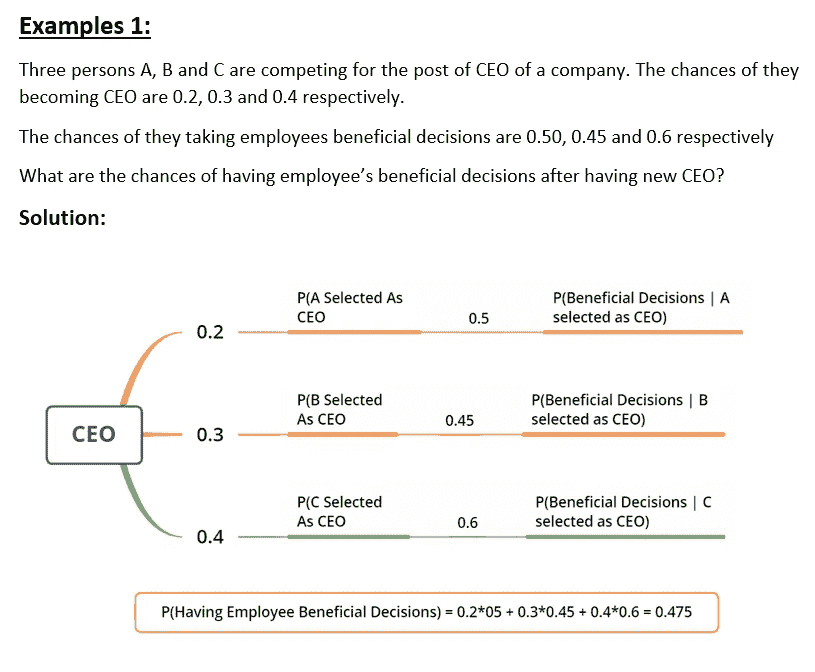
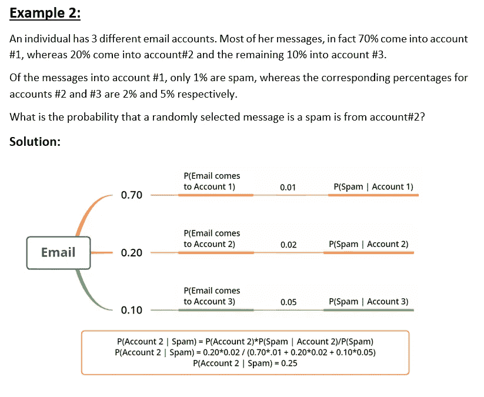

# 数据科学中的条件概率及实例

> 原文：<https://towardsdatascience.com/conditional-probability-with-examples-for-data-science-717922800847?source=collection_archive---------8----------------------->

顾名思义，条件概率就是某一事件在某种给定条件下发生的概率。基于这个条件，我们的样本空间减少到条件元素。

例如，假设一个人已经申请了房屋贷款，求他投保的概率。这里的样本空间仅限于那些已经取得住房贷款的人。

为了理解条件概率，建议理解概率基础知识，如互斥和独立事件、联合、联合和边际概率以及概率与统计等。如果你想修改这些概念，你可以参考这里的[数据科学的概率基础](https://ashutoshtripathi.com/2019/08/12/probability-basics-for-data-science/)。

# 维基定义:

*在概率论中，条件概率是在给定一个事件已经发生的情况下，另一个事件发生的概率的度量。如果感兴趣的事件是 A，已知或假设事件 B 已经发生，“给定 B 的条件概率”，或“条件 B 下 A 的概率”，通常写成 P(A | B)，有时也写成 PB(A)或 P(A/B)*——[维基百科](https://en.wikipedia.org/wiki/Conditional_probability)

**现在的问题可能是为什么要使用条件概率，它在数据科学中有什么意义？**

让我们举一个现实生活中的例子。在某一天卖出一台电视的概率可能只有 30%。但如果我们考虑到给定的日子是排灯节，那么就有更多的机会卖出一台电视。在排灯节当天卖出一台电视的条件概率可能是 70%。我们可以将这些概率表示为 P(随机一天的电视销售量)= 30%。p(鉴于今天是排灯节，电视销售额)= 70%。

因此，条件概率有助于数据科学家从给定的数据集获得更好的结果，对于机器学习工程师来说，它有助于建立更准确的预测模型。

让我们更深入地探讨一下:

下表包含了不同年龄组的拖欠和未拖欠贷款的人。

将上表转换成概率

因此，如果我们能够将问题中给出的数据转换成表格形式，那么样本空间将减少到一整列或一整行，样本空间的其余部分将变得无关紧要。

**假设一个人已届中年，他/她不会拖欠贷款的概率是多少？** **P(无|中年)= 0.586/0.690 = 0.85【参考表— 2，概率形式数据】** **P(无|中年)= 27368/32219 = 0.85【参考表—1，正常编号数据】**

如果你注意到，很明显在分子中是联合概率，是一个人没有拖欠贷款的概率，而且这个人是中年人。

而在分母中，是边际概率，也就是一个人中年的概率。

因此，我们也可以将条件概率定义为联合概率与边际概率之比。

**P(A|B) = P(A 和 B)/P(B)**

让我们通过改变下面的顺序来稍微不同地问这个问题。

**假设一个人没有拖欠贷款，那么他/她是中年人的概率是多少？**

现在看，样本空间已经改变到彩色行，即没有拖欠贷款的人。

**P(中年|否)= 0.586/0.816 = 0.72(订单事项)**

现在你又注意到了什么，概率是通过改变事件的顺序而改变的。

**因此在条件概率中顺序很重要。**

# 使用概率树的条件概率可视化

# 解释:

我试图解释树本身中的每个分支逻辑。现在让我们深入解释概率树在计算条件概率中的重要性的问题。

# p(年轻没有)？

*   使用标准条件概率公式:
*   **P(Young | No)= P(Young and No)/P(No)**这意味着:
*   P(年轻且无)= P(年轻|无)* P(无)
*   通过概率树，我们知道 P(Young | No) = 0.275，P(No) = 0.816 的概率。
*   现在看右边，所有的概率值都是已知的，因此把它们放到上面的等式中，我们就会得到期望的概率。
*   p(年轻和没有)= 0.275 * 0.816 = 0.2244 = ~0.225

# p(没有且年轻)？(顺序已更改)

*   P(无且年轻)= P(年轻且无)= 0.225[同上]
*   在联合概率中，顺序并不重要

# p(年轻)？

查看与 Young(以 Young 结尾)相关的所有分支，并对分支内的概率值进行乘积求和，这意味着

p(Young)= 0.816 * 0.275+0.184 * 0.419 = 0.301496 = ~ 0.302

# p(没有)？

P(No) = 0.816(直接来自树)

# p(年轻|没有)？

p(年轻|无)= p(年轻|不是贷款违约者)= 0.275[见树]

# p(不|年轻)？[订单已更改]

*   P(No | Young) = P(Young 和 No)/P(Young)[我们已经在上面的计算中计算了右侧概率]
*   p(否|年轻)= 0.225/0.302 = 0.745

# 现在我们来探究一下标准的条件概率公式。

根据条件概率，我们知道

*   P(A|B) = P(A 和 B)/P(B)
*   P(A 和 B)= P(B)* P(A | B)———[ 1]

类似地

*   P(B|A) = P(B 和 A)/P(A) = P(A 和 B)/P(A)[I in 联合概率顺序无关紧要]
*   P(A 和 B)= P(A)* P(B | A)--[2]

根据等式[1]和[2]，

*   P(B) * P(A|B) = P(A) * P(B|A)
*   **P(A | B)= P(A)* P(B | A)/P(B)**【又称**贝叶斯定理**

现在如果我们想找到 P(不| Young)。那么我们可以直接使用上面推导出的公式。因为 P(Young | No)以及 P(Young)值将从概率树中获得，并且输入上述公式将给出结果。在下一篇文章中，我们会学到更多关于贝叶斯定理的知识。

# 说明

我试图用上面显示的概率树来解释给定的问题。然而，如果有任何不清楚的地方，我会写下给出的内容和询问的内容。以及如何计算被询问的内容。

P(A 成为 CEO) = 0.2，P(B 成为 CEO) = 0.3，P(C 成为 CEO) = 0.4。

从问题中，我们需要正确推导出，以后的概率都是条件概率。这是这里的诀窍。因为一旦他们成为首席执行官，他们只会做出有益的决定。因此，我们应该阅读这些概率如下

*   p(采取有益的决策| A 被选为 CEO) = 0.5
*   p(采取有益的决策| B 被选为 CEO) = 0.45
*   p(采取有益的决策| C 被选为 CEO) = 0.6

所以现在 P(有有利决策)不过是总概率。因此将计算关联的每个分支概率值的乘积之和。(有利决策的分支，见树)。因此:

**P(有受益决策)= 0.2 * 0.05+0.3 * 0.45+0.4 * 0.6 = 0.475**

# 说明

*   p(帐户 1 中的电子邮件)= 0.70
*   p(帐户 2 中的电子邮件)= 0.20
*   p(帐户 3 中的电子邮件)= 0.10
*   P(电子邮件是垃圾邮件|发送到帐户 1) = P(垃圾邮件|帐户 1) = 0.01
*   P(电子邮件是垃圾邮件|发送到帐户 2) = P(垃圾邮件|帐户 2) = 0.02
*   P(邮件是垃圾邮件|发送到帐户 3) = P(垃圾邮件|帐户 3) = 0.05

**利用贝叶斯定理，**

P(帐户 2 |电子邮件是垃圾邮件)= P(帐户 2) * P(垃圾邮件|帐户 2)/P(垃圾邮件)

分子值是已知的，分母 P(垃圾邮件)是已知的 ans 总概率，通过取每个分支概率值的乘积之和来计算[以垃圾邮件结尾的分支见树]。

p(垃圾邮件)= 0.70 * 0.01+0.20 * 0.02+0.10 * 0.05

p(账户 2)= 0.20[给出问题]

p(Spam | Account 2)= 0.02[给出问题]

把所有东西放在一起，P(账号 2 |邮件是垃圾邮件)= 0.20 * 0.02/(0.70 * 0.01+0.20 * 0.02+. 10 * 0.05)

**答案:P(账号 2 |邮件是垃圾邮件)= 0.25**

这就是数据科学的条件概率。在接下来的帖子中，我将详细地写贝叶斯定理和概率分布，这将完成数据科学的概率系列。

我希望你喜欢这篇文章。对于任何评论，请使用下面的评论部分给我回信，或者你也可以使用[https://ashutoshtripathi.com/contact/](https://ashutoshtripathi.com/contact/)给我写信。我会尽量回答你所有关于 DS，ML，AI 的疑问。

下一篇文章:[贝叶斯定理在数据科学和机器学习中的重要性](https://ashutoshtripathi.com/2019/08/20/bayes-theorem-with-example-for-data-science-professionals/)

*原载于 2019 年 8 月 15 日*[*【http://ashutoshtripathi.com*](https://ashutoshtripathi.com/2019/08/15/conditional-probability-with-examples-for-data-science/)*。*