# 条件随机场解释

> 原文：<https://towardsdatascience.com/conditional-random-fields-explained-e5b8256da776?source=collection_archive---------1----------------------->

条件随机场是一类最适合预测任务的[判别模型](https://en.wikipedia.org/wiki/Discriminative_model)，其中上下文信息或邻居状态影响当前预测。仅举几个例子，CRF 在命名实体识别、词性标注、基因预测、降噪和对象检测问题中找到它们的应用。

在本文中，我将首先介绍与马尔可夫随机场相关的基本数学和术语，马尔可夫随机场是 CRF 所基于的一种抽象。然后，我将详细介绍和解释一个简单的条件随机场模型，它将说明为什么它们非常适合于序列预测问题。之后，我将在 CRF 模型的背景下回顾似然最大化问题和相关的推导。最后，我将通过在手写识别任务中进行训练和推理来演示 CRF 模型。

# 马尔可夫随机场

[马尔可夫随机场](https://en.wikipedia.org/wiki/Markov_random_field)或马尔可夫网络是一类在随机变量之间有无向图的图形模型。这个图的结构决定了随机变量之间的[相关性或独立性](https://www.coursera.org/lecture/probabilistic-graphical-models/independencies-in-markov-networks-6HFmc)。

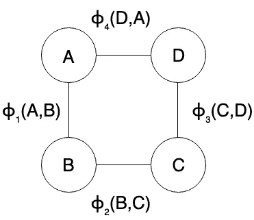

MRF with four random variables

1.  马尔可夫网络由图 G = (V，E)表示，图中的顶点或节点表示随机变量，而边共同表示这些变量之间的依赖关系。
2.  该图可以分解成 *J* 个不同的集团或因子，每个集团或因子由因子函数ϕⱼ控制，其范围是随机变量 Dⱼ.的子集ϕⱼ(dⱼ)应该严格肯定 dⱼ.的所有可能的价值观
3.  对于要表示为一个因素或集团的随机变量子集，所有这些变量在图中应该相互连接。此外，所有集团的范围的联合应该等于图中存在的所有节点。
4.  变量的非标准化联合概率是所有因子函数的乘积，即，对于上面显示的 V= (A，B，C，D)的 MRF，联合概率可以写成:-

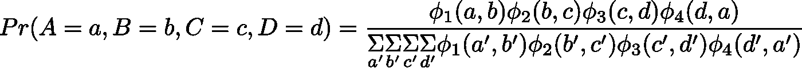

Joint probability as normalized product of factors

分母是随机变量可能取的所有可能值的乘积之和。它是一个常数，也称为配分函数，通常用 z 表示。

## 吉布斯符号

我们还可以通过对对数空间中的因子函数进行操作，将关节表示为[吉布斯分布](https://en.wikipedia.org/wiki/Boltzmann_distribution)。使用β(dⱼ)= log(ϕ(dⱼ)，我们可以用 Gibbs 符号来表示关节，如下所示。请注意，X 是图中所有随机变量的集合。β函数也称为因子势。

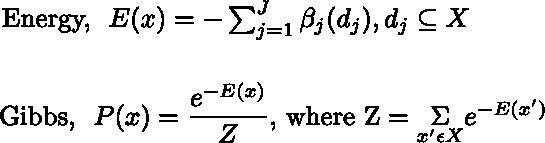

Joint probability as Gibbs Distribution

在本文后面，我们将使用 Gibbs 符号来推导似然最大化问题。

# 条件随机场模型

暂且让我们假设一个马尔可夫随机场，把它分别分成两组随机变量 Y 和 X。

[条件随机场](https://en.wikipedia.org/wiki/Conditional_random_field#Description)是马尔可夫随机场的一个特例，其中图满足以下性质:“当我们对 x 上的图进行全局条件化时，即当 x 中的随机变量的值固定或给定时，集合 y 中的所有随机变量都遵循马尔可夫性质 p(Yᵤ/X,Yᵥ，u≠v) = p(Yᵤ/X,Yₓ，Yᵤ~Yₓ)，其中 Yᵤ~Yₓ表示 Yᵤ和 Yₓ在图中是邻居。”一个变量的相邻节点或变量也被称为该变量的[马尔可夫链](https://en.wikipedia.org/wiki/Markov_blanket)。

满足上述特性的一个这样的图是下面共享的链结构图:-

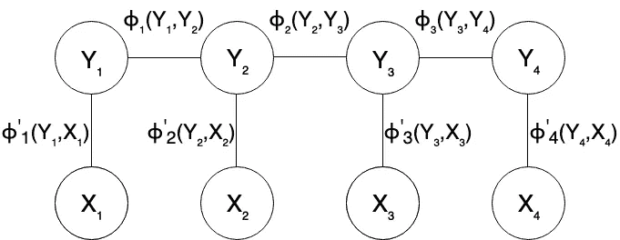

Conditional Random Field structure

由于 CRF 是一个[判别模型](https://en.wikipedia.org/wiki/Discriminative_model)，即它模拟条件概率 P(Y/X ),即 X 总是给定或观察到的。因此，该图最终简化为一个简单的链。

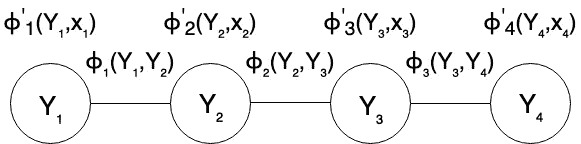

CRF model, conditioned on X

当我们以 x 为条件，并试图为每个 Xᵢ找到相应的 Yᵢ时，x 和 y 也分别称为证据和标签变量。

我们可以验证上面显示的“因子减少”的通用报告格式模型遵循如下所示的变量 Y₂的马尔可夫性质。如图所示，在给定所有其他变量的情况下，Y₂的条件概率最终仅取决于其相邻节点。

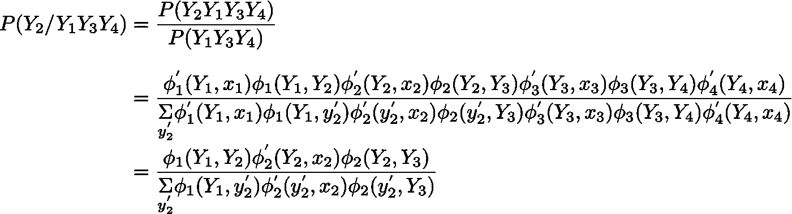

Variable Y₂ satisfying the Markov property, conditional depends only on neighboring variables

# CRF 理论与似然优化

让我们首先定义参数，然后使用 Gibbs 符号建立联合(和条件)概率的方程。

1.  标号定义域:假设集合 y 中的随机变量有一个定义域:{m ϵ ℕ | 1≤m ≤M}即前 m 个自然数。
2.  证据结构和领域:假设集合 x 中的随机变量是大小为 f 的实值向量，即∀ Xᵢ ϵ X，Xᵢ ϵ Rˢ.
3.  设 CRF 链的长度为 L 即 L 个标签和 L 个证据变量。
4.  设βᵢ(Yᵢ，Yⱼ) = Wcc '如果 Yᵢ = c，Yⱼ = c '而 j = i+1，0 否则。
5.  让β'ᵢ(Yᵢ，Xᵢ) = W'c。Xᵢ，如果 Yᵢ = c，否则为 0，其中。代表点积，即ϵ Rˢ.
6.  注意，参数的总数是 M×M+M×S，即每个标签转换有一个参数(M×M 个可能的标签转换),每个标签有 S 个参数(M 个可能的标签),这些参数将被乘以该标签处的观察变量(大小为 S 的向量)。
7.  设 D = {(xn，yn)}对于 n=1 到 N，是由 N 个例子组成的训练数据。

记住上述内容，能量和可能性可以表示如下

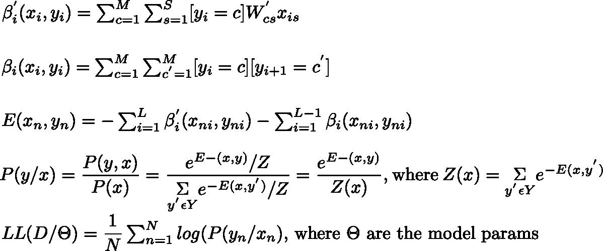

Likelihood expression for CRF model

因此，训练问题简化为最大化所有模型参数 Wcc’和 W’cs 的对数似然性。

关于 W'cs 的对数似然性梯度已推导如下:-

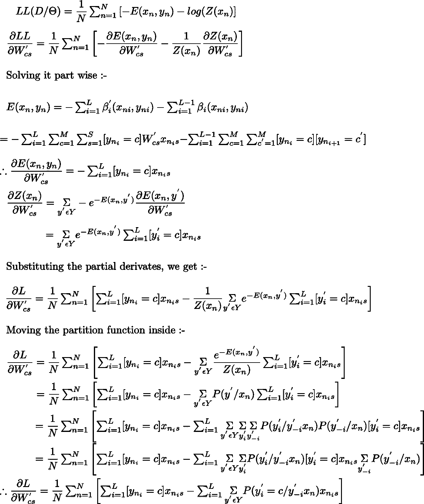

Derivative of likelihood wrt label-observation weights

注意，上面等式中的第二项表示 y'ᵢ的[边际概率](https://en.wikipedia.org/wiki/Marginal_distribution)等于 c 的和(在 y’可以取的所有可能值上),由 xnis 加权。这里的 y'-i 表示除了位置 I 的以外的每个位置**的标签/y 变量的集合**

我在下面直接分享的 dL/dWcc '也有类似的推导

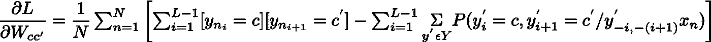

Derivative of likelihood wrt label-label weights

既然我们有了导数的表达式和对数似然，我们实际上就有了从头开始编写 CRF 模型所需的所有内容。我们可以使用上面提到的等式对可能性进行编码，使用[置信传播](https://jessicastringham.net/2019/01/09/sum-product-message-passing/)来计算边际并计算出导数，然后使用[现成的](https://docs.scipy.org/doc/scipy-0.13.0/reference/generated/scipy.optimize.minimize.html)优化算法(如 L-BFGS)来优化可能性。

然而，为了简单明了，我们不会重新发明轮子，而是使用现有的 [CRFSuite](https://python-crfsuite.readthedocs.io/en/latest/) 库进行演示。

# 演示—手写识别

到目前为止，应该相当清楚为什么以及如何 CRF 的结构使它们成为捕获顺序关系的任务的理想选择，如词性标注句子、命名实体识别等。对于这个演示，我将使用 CRF 进行手写检测任务。

为了准备这个演示的数据集，我使用了斯坦福 OCR 数据集和古腾堡项目档案的组合。

## 数据集准备

斯坦福 OCR 数据集总共包含 6877 个手写单词，分为 9 个不同的文件夹。每个单词的第一个字符缺失，以使数据集中的所有字符都是小写的。对于每个单词中的每个手写字符，数据集包含长度为 128 的扁平二进制数组，该数组可以转换为大小为 16x8 的图像。数据集中的一些单词可视化分享如下

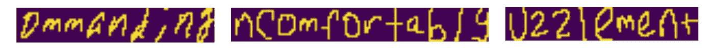

Word images obtained after stacking 16x8 character images side by side

经过分析，我发现整个数据集中唯一单词的数量只有 24 个。

我们的希望是，CRF 模型将学习标记 observations(xᵢ，在我们的情况下，它们是共同出现的字符像素向量。尽管就字符像素向量而言，数据集中有 6，877 个唯一的例子，但是全部背后有 24 个唯一的单词太少，不足以从概率上捕捉一般英语文献中的字符共现，并准备好良好的手写/单词识别器。

为了解决这个问题，我决定自己创建一个数据集，使用所有的字符向量表示。我为地图/字典中的每个字符捕获了数据集中可用的所有不同字符像素向量变量。完成后，我导入了名著[莫比迪克](https://en.wikipedia.org/wiki/Moby-Dick)中出现的所有单词，过滤掉了所有长度小于 3 或包含字母表以外的任何内容的标记，并将过滤后的标记转换为小写。通过这种方式总共提取了 18，859 个单词，然后按照单词长度分层，将这些单词按 80-20 的比例分别分成训练集和测试集。

为了组成 CRF 模型的实际训练和测试集，我使用了我在开始时创建的字符到像素阵列的矢量图。为了为任何单词创建 image/x，我依次检查了它的字符，并使用统一采样从字典中为该字符选择了一个像素数组向量变量。下面分享了由此创建的数据集的几个样本

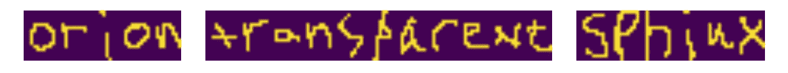

Sample words from Moby Dick

还为任何想玩的人分享数据准备脚本:-

Dataset preparation script

准备好训练和测试数据集后，就该训练模型并在任务中对其进行评估了。

# 模型训练和评估

CRF training and model evaluation script

使用上面的脚本，我在由 15088 个单词组成的训练集上训练了一个 CRF 模型，并在测试集上实现了近 85%的准确率。

对于一个简单的实验来说还不错..让我知道你的想法！