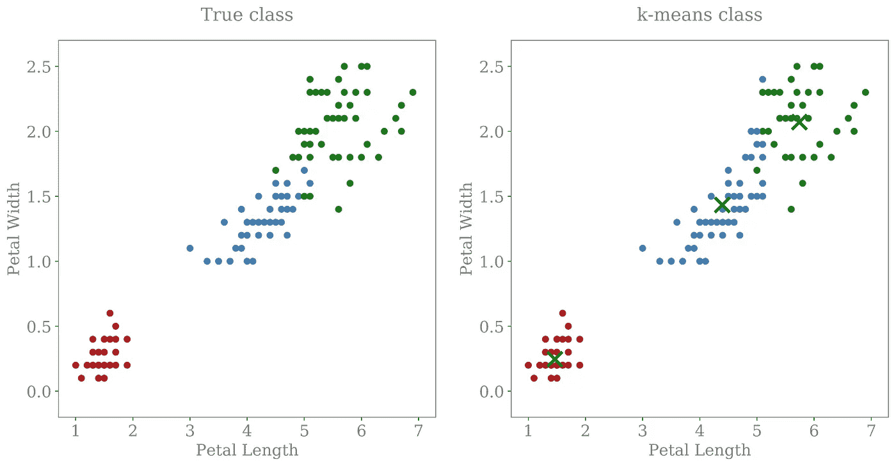
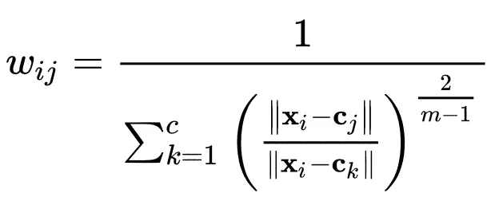
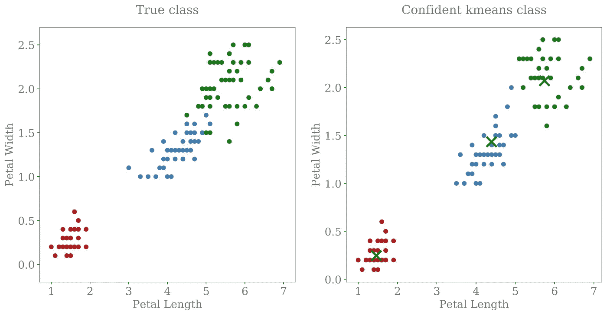

# k 均值的置信度

> 原文：<https://towardsdatascience.com/confidence-in-k-means-d7d3a13ca856?source=collection_archive---------18----------------------->

所以你用 k-means 做了一些聚类；您已经缩放了数据，应用了 PCA，使用肘和剪影方法检查了聚类，并且您非常确信您的模型为您提供了您所能获得的绝对最佳的聚类。但是你能对单个数据点的分类有多信任呢？这就是我要在这里讨论的。

大多数用于评估聚类算法的指标都是对模型的全局成功的度量。但是，如果您不希望对每个数据点进行分类，而是希望识别明确适合特定聚类的特定数据点，该怎么办呢？例如，你可能不想把一个病人归为某一特定疾病的低风险人群，仅仅因为这是最坏的一类；你需要确信它们绝对是低风险的。同样，你可能不希望为没有表现出你的用户细分所定义的强烈行为特征的客户提供个性化的数字体验。

有一个非常简单的方法可以计算出你的算法对每个分类的置信度。然后，您可以过滤掉模型不确定的预测，并根据剩余的、有把握的结果做出决策。

# 软 k 均值算法概述

软 k-均值算法与硬 k-均值算法类似，它基于数据点和聚类中心之间的欧几里德距离。与将每个数据点仅分配给一个聚类的普通 k-means 不同，软 k-means 计算一个权重，该权重描述每个数据点属于每个聚类的可能性。较高的值表示强的或有把握的分类，较低的值表示弱的或不太可能的分类。

尽管确实存在可以执行软 k 均值的预写算法，但是它们没有得到很好的支持。还有很多原因可以解释为什么你不想改变你的实际模型。幸运的是，您可以使用硬 k 均值聚类中心追溯计算软 k 均值权重。

# 虹膜数据集上的 k-均值

让我们在具有 3 个聚类的 iris 数据集上训练一个非常直接的 k-means 算法。绘制花瓣长度与花瓣宽度的关系图，我们可以看到该算法工作得很好，但是在绿色和蓝色聚类相遇的地方有一些不正确的分类(右图)。在这种情况下，我们可以很容易地使用视觉检查发现这一点，因为我们知道每个虹膜是什么物种的基本事实(左图)。理想情况下，我们希望知道，在没有真实类别的先验知识的情况下，该区域中的点很难分类，因此不太可信。

# 软 k 均值权重

设**x**ᵢ为数据点。数据点属于聚类 *j* 的可能性可以使用下面给出的权重等式来计算:

The wij are used in the soft k-means algorithm to assign a probability of a point belonging to a cluster

这里的 **c** ⱼ是第 *j* 星团中心的坐标。 *m* 的值是控制算法模糊性的参数，典型的默认值为 2。对于每个数据点，权重的总和是 1，这就是为什么它们作为可能性或概率工作得很好。这里有一个很好的 python 函数来为您计算权重:

# 权重过滤

一旦我们计算了每个聚类的软 k 均值权重，我们就可以确定与硬 k 均值算法分配的聚类相关联的权重。然后我们可以过滤掉那些低值，只留下我们有把握的数据点。下面我为我的 iris 数据集聚类做了这个，用一个过滤器去除权重低于 0.9 的点。

过滤器已经移除了蓝色和绿色聚类之间的不确定区域中的许多数据点。已经确定，16%的数据点太难分类，无法过滤掉。

# 结论

只需几行代码，我们就可以计算出每个数据点的置信度得分，表明我们的 k-means 算法在分类中的置信度，而无需事先了解真实类别。

# 密码

soft_cluster_weights 函数和附带的笔记本在[这个 GitHub repo](https://github.com/mattcrooksphd/Medium-SoftClusteringWeights) 中提供。