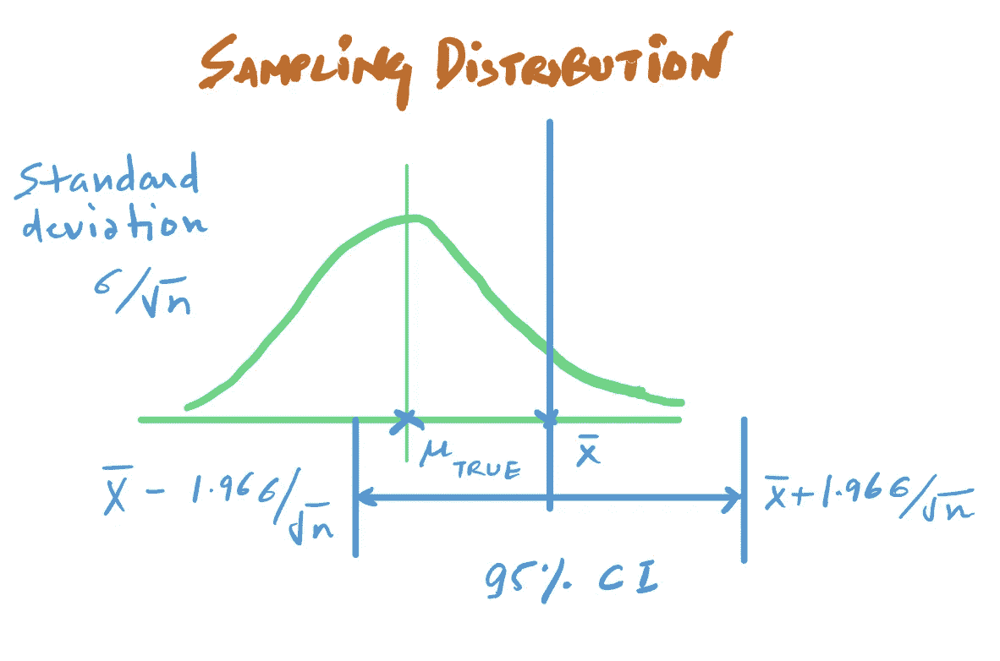
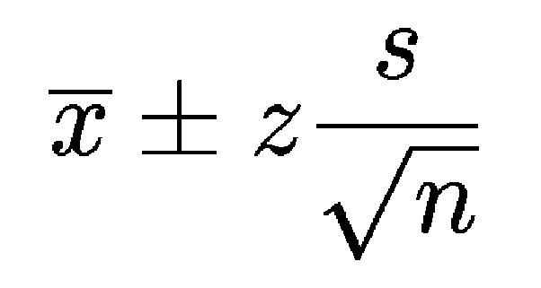
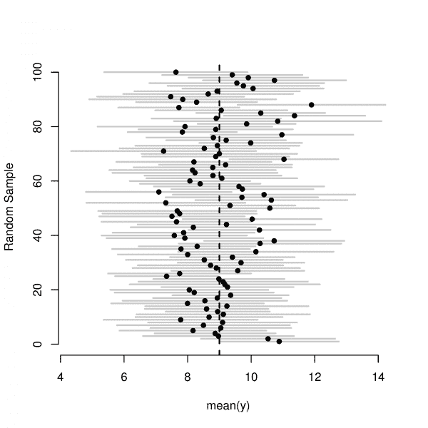
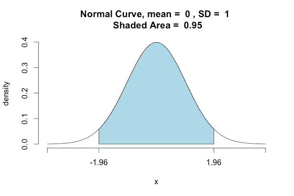

# 为数据科学家简单解释置信区间

> 原文：<https://towardsdatascience.com/confidence-intervals-explained-simply-for-data-scientists-8354a6e2266b?source=collection_archive---------4----------------------->


[PIxabay](https://pixabay.com/photos/fish-fishermen-fishing-net-fishing-3062034/): Cast a net

## 没有沉重的术语

最近，有人问我如何用简单的术语向外行解释置信区间。我发现很难做到这一点。

即使对了解置信区间的人来说，解释置信区间也是一件令人头疼的事情，更不用说对不懂统计学的人来说了。

我去维基百科找了些东西，下面是它的定义:

> 在[统计](https://en.wikipedia.org/wiki/Frequentist_statistics)中，**置信区间** ( **CI** )是从观测数据的统计中计算出来的一种[估计](https://en.wikipedia.org/wiki/Interval_estimate)。这为未知的[参数](https://en.wikipedia.org/wiki/Parameter)提出了一系列似是而非的值。该区间具有相关的**置信水平**，即真实参数在建议的范围内。这可以更清楚地表述为:置信水平代表未知参数位于给定区间的[概率](https://en.wikipedia.org/wiki/Probability)。调查者可以选择置信度。一般来说，未知参数的置信区间基于对相应的[估计器](https://en.wikipedia.org/wiki/Estimator)的[分布](https://en.wikipedia.org/wiki/Probability_distribution)进行采样。[【1】](https://en.wikipedia.org/wiki/Confidence_interval#cite_note-:0-1)

我的第一个想法是，他们可能是这样写的，所以没有人能理解它。这里的问题在于统计学家喜欢使用大量的术语和语言。

***这篇文章是关于用一种简单易懂的方式解释置信区间，而不是故作姿态*** 。

# 现实生活中的问题


[Source](https://pixabay.com/photos/police-crime-scene-murder-forensics-3284258/)

让我们从创建一个真实的场景开始。

***假设你想找出美国某个州所有人的平均身高。***

你可以去那个特定州的每个人那里询问他们的身高，或者你可以做更聪明的事情，在这个州抽取 1000 人作为样本。

然后，您可以使用他们身高的平均值(**估计平均值**)来估计该州身高的平均值(**真实平均值**)

这一切都很好，但作为真正的数据科学家，你并不满意。估计的平均值只是一个单一的数字，您希望有一个真实平均值所在的范围。

***我们为什么要一个范围？因为在现实生活中，我们关心的是估计值的置信度。***

通常情况下，即使我让你猜测美国某个州的人的身高，你也更倾向于说类似于*“我相信它在 6 英尺到 6 英尺 2 英寸之间”，而不是像“它的 6 英尺 2.2345 英寸”这样的点估计。*

我们人类在进行评估时也喜欢附加一定程度的信心。你有没有说过——“我有 90%的自信”。

在这个特定的例子中，我对陈述- *“我相信它在 5 英尺到 7 英尺之间”比“我相信它在 6 英尺到 6 英尺 2 英寸之间”更有信心，因为第一个范围是第二个范围的超集。*

那么我们如何得到这个范围并量化一个置信度值呢？

# 战略

为了理解我们将如何计算置信区间，我们需要理解中心极限定理。

***中心极限定理:*****中心极限定理(CLT)** 简单地说，如果你有一个具有均值μ和标准差σ的总体，并从总体中随机抽取样本，那么**样本**均值的**分布**将近似正态分布 ***以均值为总体均值*** *和估计的* ***标准差 s/√***

所以知道了这一切，你就变得好奇了。我们在美国已经有了 1000 人的样本。我们能应用 CLT 吗？

我们知道，抽样分布的均值等于总体均值(我们不知道但想估计)，抽样分布的样本偏差由 **σ/√n** 给出(即样本的标准差除以样本中的观察次数)



**Casting a net** around the sample mean to capture the true population mean

*现在，您想在 X 轴上找到包含真实总体平均值的区间。*

***那我们怎么办？我们从已知的价值中撒网。***

***为了得到这样的范围/区间，我们从 Xbar 开始走 1.96 个标准差，样本在两个方向上的均值。而这个范围就是 95%的置信区间。***

现在，当我说我估计真实均值为 Xbar(样本均值)，置信区间为[Xbar-1.96SD，Xbar+1.96SD]时，我是说:

> 这是一个使用特定程序构建的音程。如果在大量样本上重复这一过程，包含真实总体参数的计算置信区间(每个样本不同)的分数将趋向于 95%

当你取 99%的置信区间时，你实际上增加了这个比例，从而用三个标准差撒出了一个更宽的网。



The simple formula

*   这里 Xbar 是样本平均值(你取的 1000 个高度样本的平均值)。
*   z 是偏离样本均值的标准差的个数(1.96 代表 95%，2.576 代表 99%)——***你想要的置信度*** 。
*   s 是样本中的标准偏差。
*   n 是样本的大小。



Most of the nets we cast in different experiments do contain the true population mean

上图中的每条线都是这样一个实验，点代表样本平均值，线代表范围。图中的虚线是真实的人口平均值*。*

***看这些区间怎么有些不包含真实总体均值，几乎全部(95%)都包含真实总体均值*** *。*

# 临界 Z 值

我们说过，Z 是偏离样本均值的标准差的个数(1.96 代表 95%，2.576 代表 99%)——***你想要的置信度*** 。

你可以选择任意的自信程度。比方说，你想要 90%的信心。你可以通过使用法线曲线内部的阴影区域需要为 0.90 的想法来得到它。



[Source](https://stackoverflow.com/questions/20864847/probability-to-z-score-and-vice-versa-in-python): The Normal curve showing a 95% CI.

```
import scipy.stats as st
p = 0.9 + (1-0.9)/2
Z = st.norm.ppf(p, loc=0, scale=1)
print(Z)
----------------------------------------------------------
1.6448536269514722
```

# 继续学习

如果你想了解更多关于假设检验、置信区间以及数字和分类数据的统计推断方法，Mine etinkaya-Rundel 在 coursera 上教授了 [**推断统计学**](https://coursera.pxf.io/DVZ13d) 课程，没有比这更简单的了。她是一个伟大的导师，很好地解释了统计推断的基础。

谢谢你的阅读。将来我也会写更多初学者友好的帖子。关注我的 [**媒体**](https://medium.com/@rahul_agarwal?source=post_page---------------------------) 或者订阅我的 [**博客**](http://eepurl.com/dbQnuX?source=post_page---------------------------) 了解他们。一如既往，我欢迎反馈和建设性的批评，可以通过 Twitter[**@ mlwhiz**](https://twitter.com/MLWhiz?source=post_page---------------------------)联系

此外，一个小小的免责声明——这篇文章中可能会有一些相关资源的附属链接，因为分享知识从来都不是一个坏主意。