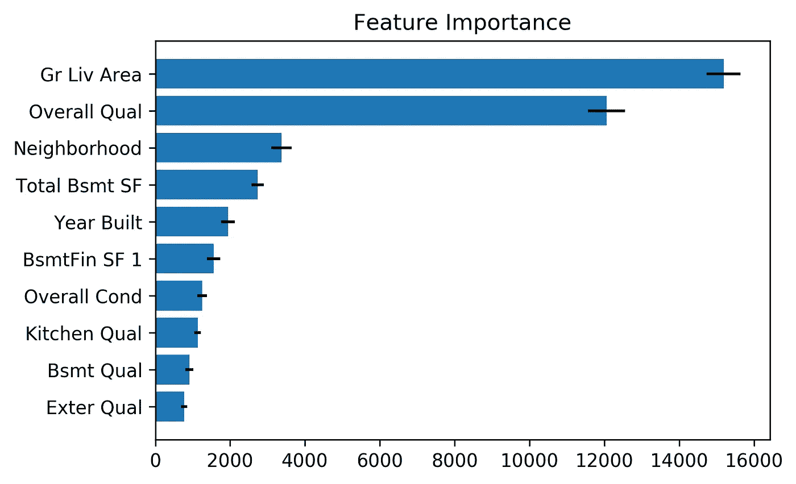

# 排列重要性的置信区间

> 原文：<https://towardsdatascience.com/confidence-intervals-for-permutation-importance-2d025bc740c5?source=collection_archive---------21----------------------->

## 一种旧的特征重要性度量方法的新理论视角

Feature importance helps us find the features that matter.

# 介绍

在本帖中，我们解释了流行的*排列特征重要性*技术的新理论视角如何让我们用置信区间量化其不确定性，并避免其使用中的潜在陷阱。

首先，让我们首先激发使用这种技术的“为什么”。假设您刚刚被一家大型国际零售商的数据科学团队聘用。在你到来之前，这个团队建立了一个复杂的模型来预测你在全球几十个地方的每周销售额。该模型考虑了多种因素:地理数据(如当地人口密度和人口统计数据)、季节性数据、天气预报数据、单个商店的信息(如总面积)，甚至是你公司的推文最近获得的赞数。让我们也假设这种模式非常有效，可以让业务团队提前几周洞察未来的销售模式。只有一个问题。你能猜出它是什么吗？

没有人知道*为什么*销售预测模型如此有效。

为什么这是一个问题？很多原因。依赖该模型预测的商界人士不知道，如果 Twitter 在一周内经历了一次宕机，Twitter 赞数下降，他们的预测会有多可靠。在数据科学团队中，您几乎不知道哪些因素对模型最有用，因此在识别新信号以支持模型性能时，您会盲目行事。我们不要忘记其他利益相关者。如果基于这个模型的预测做出的决定会给公司带来糟糕的结果，董事会将希望了解更多关于这个模型的信息，而不是“它只是工作而已”，特别是随着[人工智能继续变得越来越受监管](https://blog.fiddler.ai/2019/09/regulations-to-trust-ai-are-here-and-its-a-good-thing/)。

那么我们能做什么呢？一个很好的第一步是获得一些特征重要性的度量。这意味着给你的模型使用的每个因素分配一个重要的数字分数。这些数值分数代表了这些特征对于模型做出高质量预测的能力有多重要。

许多建模技术都带有内置的特征重要性度量。也许您可以使用 xgboost 模型默认提供的基于信息增益的重要性度量？没那么快！正如你的队友将会指出的，不能保证这些特征重要性将描述你的复杂系综，此外，基于增益的重要性度量是有偏差的[1]。

那么我们能做些什么呢？我们可以使用“随机消融”(又名“置换”)特征重要性度量。Christoph Molnar 在他的*可解释的 ML 书* [2]中提供了这种技术的清晰而简明的描述:

> *这个概念非常简单:我们通过计算置换特征后模型预测误差的增加来衡量特征的重要性。如果打乱某个特征的值会增加模型误差，则该特征是“重要的”，因为在这种情况下，模型依赖于该特征进行预测。如果对某个特征的值进行调整后模型误差保持不变，则该特征“不重要”，因为在这种情况下，模型会忽略该特征进行预测。*

# 背景

这种技术从何而来？随机消融特征的重要性当然不是新的。事实上，它的起源至少可以追溯到 2001 年，当时这种技术的一个变种被作为变量的“噪声”引入，以更好地理解随机森林模型如何使用它们[3]。然而，最近，这种技术在使用和变化方面又有所复苏。例如，这种技术的实现将包含在流行的 Scikit-learn 库的即将到来的 0.22 版本中[4]。作为一个更加理论化的例子，考虑最近引入的“模型类别依赖”框架，该框架将随机消融特征重要性的一个变体称为“模型依赖”，并将其用作核心构建模块[5]。

# 新的理论视角

当在 [Fiddler Labs](https://fiddler.ai/) 使用这种技术时，我们试图从理论上明确置换一列特征意味着什么，在你的模型中运行，看看模型的误差增加了多少。这让我们使用了理论透镜*随机消融*，因此我们为通常被称为*排列*的特征重要性取了一个新名字。

在 arXiv 上发布的[最新预印本中，我们开发了该技术的清晰理论公式，因为它与经典的统计学习问题陈述相关。我们发现，在置换特征(或者，更正式地说，通过随机化消除它们)后测量误差的概念实际上非常符合监督学习中风险最小化的数学[6]。如果你熟悉这套理论，我们希望这种联系对你的直觉和我们的直觉一样有帮助。](https://arxiv.org/abs/1910.00174)

此外，我们的重新表述提供了两种围绕随机化消融特征重要性分数构建置信区间的方法，这是一种从业者可以用来避免随机化消融特征重要性应用中潜在陷阱的技术。据我们所知，这种技术的当前公式和实现不包括这些置信度度量。

# 特征重要性的置信区间

考虑如果我们使用不同的随机消融(例如，通过使用不同的随机种子)重新运行随机消融特征重要性，或者如果我们在一个非常大的数据集的两个不同的随机子集上运行它(例如，为了避免使用超过我们机器的存储器容量的完整数据集)，会发生什么。我们的功能重要性可能会改变！理想情况下，我们希望使用大型数据集并对许多消融进行平均，以减轻算法中固有的随机性，但在实践中，我们可能没有足够的数据或计算能力来这样做。

随机化消融特征重要性分数有两个不确定性来源:我们使用的数据点和我们使用的随机消融值(即排列)。通过多次运行该算法并检查每次运行的差异，我们可以构建一个*置信区间* (CI ),用于测量所用消融术产生的不确定性。类似地，通过逐点查看消融造成的损失增加(而不仅仅是在我们的数据集上平均损失)，我们可以构建一个 CI 来衡量有限数据集产生的不确定性。

# 例如:预测房价

为了演示随机消融特征重要性值在 CIs 中的使用，让我们将该技术应用于真实模型。为此，我使用 Ames 住房数据集[7]建立了一个复杂的模型来估计房屋的销售价格。这个例子的完整代码可以在 [Jupyter 笔记本这里](https://gist.github.com/lukemerrick/e31d9a8ec1b42767ad09155eb2f9b231)获得。

为了显示置信区间的重要性，我们仅使用 100 个点运行了随机消融特征重要性，仅重复 K=3 次。这为我们提供了以下 10 大得分特征，黑色误差线表示 95%的置信区间:

Randomized ablation feature importance for 100 points after 3 repetitions.

正如我们从误差线中看到的，在这 100 个点中，不确定哪个特性实际上是第三重要的。重新运行 K=30 次迭代的随机化消融特征重要性，我们得到了更严格的误差界限，并且我们自信地发现，在对我们的模型的重要性方面，一所房子的邻居实际上超过了它的总地下室平方英尺:

Randomized ablation feature importance for the same 100 points after 30 repetitions.

然而，事实证明，这些特征重要性分数的不确定性的更大来源实际上源于所使用的数据集的小尺寸，而不是消融重复的小数量。这一事实是通过使用我们论文中介绍的其他 CI 方法发现的，该方法捕捉了消融和数据集大小所导致的不确定性。在数据集的另外 100 个点上运行这种 CI 技术(仅重复一次)，我们观察到以下宽 CI:

Randomized ablation feature importance for 100 points with point-by-point CIs.

通过将点的数量从 100 增加到 500，我们的信心显著提高，并且我们变得相当有信心邻域是我们模型整体上第三重要的特征(不仅仅是在我们有限的数据集中)。

Randomized ablation feature importance for 500 points with point-by-point CIs.

# 结论

特征重要性技术是获得关于机器学习模型的有价值的洞察力的强大而简单的方法。随机化消融特征重要性技术，通常称为“置换”重要性，为计算特征重要性提供了直接且广泛适用的技术。我们还在这里展示了如何通过一种新的方法来理论化和公式化随机消融特征重要性的“真实”值，我们能够围绕我们的特征重要性测量构建置信区间。这些置信区间是在实践中避免陷阱的有用工具，尤其是当数据集不大时。

如果你喜欢这篇文章，你可以在 [Fiddler 的博客](https://blog.fiddler.ai/)上找到更多类似的文章，如果你想更深入地了解随机消融功能的重要性，请务必查看[的全文](https://arxiv.org/abs/1910.00174)。别担心，只有四页长！

# 参考

[1]帕尔等人。艾尔。当心默认随机森林重要性(2018)。【https://explained.ai/rf-importance/ 

[2]克里斯托弗·莫尔纳尔。可解释的机器学习(2019)。[https://christophm . github . io/interpretable-ml-book/feature-importance . html](https://christophm.github.io/interpretable-ml-book/feature-importance.html)

[3]布雷曼，利奥。随机森林(2001 年)。[https://www . stat . Berkeley . edu/% 7 ebreiman/randomforest 2001 . pdf](https://www.stat.berkeley.edu/%7Ebreiman/randomforest2001.pdf)

[4]sci kit-学习贡献者。排列特征重要性(2019)。[https://sci kit-learn . org/dev/modules/permutation _ importance . html](https://scikit-learn.org/dev/modules/permutation_importance.html)

[5]费希尔等人。艾尔。模型类依赖(2019)。[https://arxiv.org/abs/1801.01489](https://arxiv.org/abs/1801.01489)

[6]卢克·梅里克。随机消融特征重要性(2019)。https://arxiv.org/abs/1910.00174

[7]德·科克，院长。艾姆斯，爱荷华州:波士顿住房数据的替代方案，作为期末回归项目(2011)。【http://jse.amstat.org/v19n3/decock.pdf 