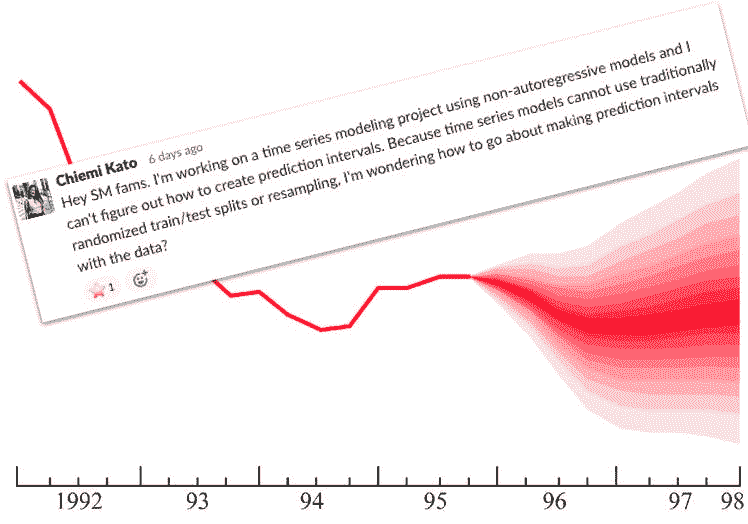
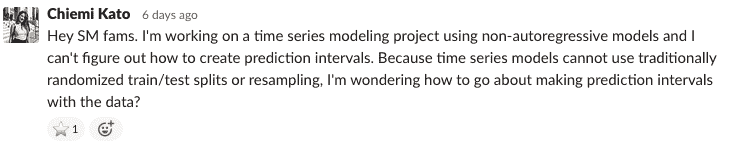
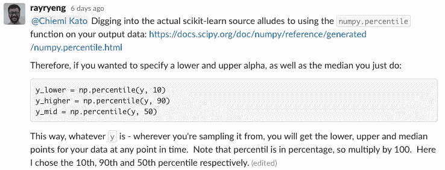

# 时间序列数据的置信区间:SharpestMinds Slack 聊天

> 原文：<https://towardsdatascience.com/confidence-intervals-for-time-series-data-sharpestminds-slack-chats-4b05e211943a?source=collection_archive---------20----------------------->

应大众的要求，我们决定公开专业数据科学家和他们的学员之间关于 SharpestMinds 内部松弛的一些对话。我们希望这将让更多的人从 SharpestMinds 的专业知识中受益，即使他们不能直接进入社区。

当大多数人开始学习数据科学时，他们处理的数据是与时间无关的。他们预测泰坦尼克号上乘客的生存概率，识别 MNIST 数据集中的手写字符，或者执行。其他类似的任务。

要解决这些问题，通常首先要将每个样本随机分配给两个不同的数据集:一个用于训练模型，另一个用于验证模型的性能。这个验证步骤很重要，因为它允许你做出这样的声明，“我希望这个预测准确到真实值的 10%以内，20 次中有 19 次。”

但是，这对时间序列数据不起作用:如果您试图预测季节性影响、股票市场波动或客户流失行为，您会很快意识到，将数据随机分配给训练集和验证集会破坏原始数据集的时间顺序中包含的信息。

那么，如何为时间序列预测提供置信区间(又名:预测区间)？

或者，正如一位[敏锐的学员](http://sharpestminds.com)最近在我们的内部 Slack 社区中问到的:

[Chiemi](https://www.linkedin.com/in/chiemikato/) 之前已经发现了[这种方法](/how-to-generate-prediction-intervals-with-scikit-learn-and-python-ab3899f992ed)，但是它只对梯度推进回归器有效。她想要一个更通用的解决方案。

第一个伟大的建议来自 SharpestMinds 的导师 [Ray Phan](https://app.sharpestminds.com/mentor-bio/uEfeoKc9sqjQuRcf8) ，他是一个真正的数据科学 Slack 超级英雄:

这是他提供的链接的[可点击版本。老实说，我不知道这个功能，它看起来非常方便。](https://docs.scipy.org/doc/numpy/reference/generated/numpy.percentile.html)

接下来是夏普明德校友(现在是数据科学家🚀)[凯赢](https://www.linkedin.com/in/khai-resilient-mindset/):

她链接的 Jason Brownlee 的帖子在这里(强烈推荐！).

最后，学员[克里斯蒂安·法甘](https://www.linkedin.com/in/faganc/)还提出了一个基于贝叶斯区间的非常有趣的策略——它更先进，如果你喜欢冒险和数学，值得一试:

(再次，[这里是可点击的形式](https://en.wikipedia.org/wiki/Credible_interval))。

就是这样！今天只是一个简短的问题，但我认为这里建议的所有不同的观点和工具，如果你正在考虑你自己的时间序列问题，会有所帮助。

直到下次🙂

## 想要更多吗？

*我们每隔几周发布一份时事通讯，其中包含关于如何在数据科学领域就业的对话和提示。【你可以在* [*这个链接*](https://sharpestminds.substack.com/)*】*查看一个例子

*可以在推特上关注 Jeremie(*[*)@ Jeremie charris*](https://twitter.com/jeremiecharris)*)或者 sharpes minds(*[*)@ sharpes mindsai*](https://twitter.com/SharpestMindsAI)*)。*

*原载于 2019 年 11 月 21 日*[*https://blog.sharpestminds.com*](https://blog.sharpestminds.com/confidence-intervals-for-time-series-data-sharpestminds-slack-chats/)*。*